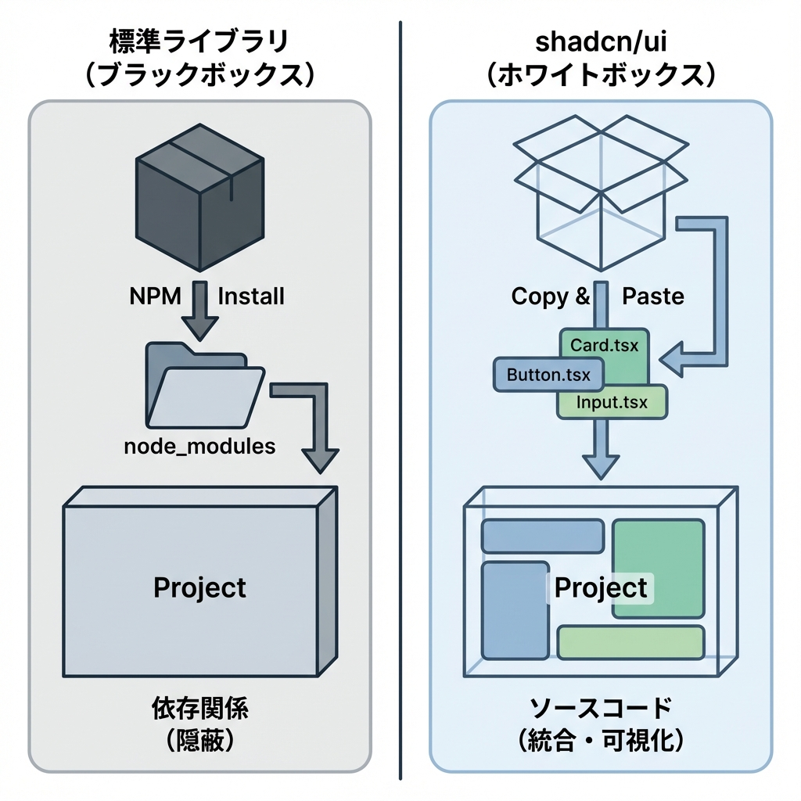
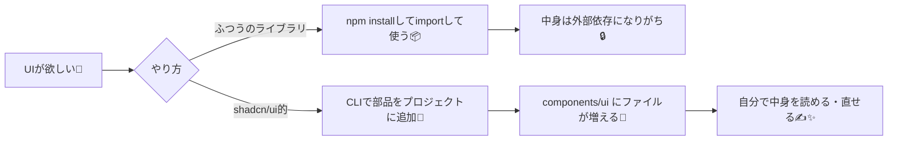

# 第54章：shadcn/ui 的な「コピペで増やすUI」概念🧩

この章は、「UIパーツをライブラリとして“使う”んじゃなくて、**自分のプロジェクトに“取り込んで育てる”**」っていう考え方をつかむ回だよ〜🌸😊
代表例が **shadcn/ui** で、公式も「コンポーネントをコピペして使えるよ」っていう思想になってるのがポイント！ ([shadcn.io][1])

---

### 1) ふつうのUIライブラリと、shadcn/ui 的UIの違い🤔💡

* **ふつうのUIライブラリ**：`npm install` して、使う側は “中身をあまり触らない” ことが多い📦
* **shadcn/ui 的UI**：CLIでコンポーネントを **プロジェクト内に生成（=コピペ導入）** して、**コードを自分で持つ**✍️✨
  だから「ここちょっと丸み変えたい〜😗」とか「余白だけ増やしたい🫶」がやりやすい！

公式の Next.js 手順でも、`init` → `add button` みたいに **欲しい部品を追加していく**流れになってるよ。 ([ui.shadcn.com][2])

---

### 2) イメージ図：UIの増え方が“ファイルで増える”📁✨





---

### 3) 何がうれしいの？（メリット/注意点）😆⚖️

**メリット🌟**

* **見た目の土台が一気に揃う**（ボタン/カード/ダイアログなど）🪄
* **コードの所有権が自分にある**から、デザイン調整が怖くない💅
* Next.js だと、操作が必要なコンポーネントは `"use client"` が付くなど、相性が良い設計になってるよ🧊🎮 ([shadcn.io][3])

**注意点⚠️**

* “取り込んだ後”はあなたのコードだから、**アップデートは自分で反映**するスタイル（ラクだけど、放置しすぎ注意）🧹
* Tailwind を前提にした部品が多いよ（テーマや見た目はCSS変数で調整することが多い）🎨 ([ui.shadcn.com][4])

---

### 4) 触ってみよう（Windows / PowerShellでOK）🖥️✨

#### (A) まず “shadcn の準備” をする🧰

すでにNext.jsプロジェクトがある前提で、ルートでこれ👇
（公式・コミュニティどちらでも `init` が入口になってるよ） ([ui.shadcn.com][2])

```powershell
npx shadcn@latest init
```

うまくいくと、だいたいこんな雰囲気の構造ができます👇（代表例） ([shadcn.io][3])

* `components/ui/` … UIパーツ置き場📁
* `components.json` … CLI設定🧩
* `lib/utils.ts` … class結合ヘルパー（よく使う）🔧
* `app/globals.css` … テーマ用のCSS変数など🌈

#### (B) 欲しいUIを“追加”する🧩➕

まずはボタンを追加してみよ〜！ ([ui.shadcn.com][2])

```powershell
npx shadcn@latest add button
```

すると `components/ui/button.tsx` が増えて、こうやって使えるよ👇 ([ui.shadcn.com][2])

```tsx
// app/page.tsx
import { Button } from "@/components/ui/button";

export default function Home() {
  return (
    <main style={{ padding: 24 }}>
      <Button>Click me</Button>
    </main>
  );
}
```

---

### 5) “コピペUI”のコツ：まずは2つだけ覚えよ🎯💖

1. **増やす＝ `add` コマンドでファイルが増える**（UIが資産化する）📦✨ ([ui.shadcn.com][2])
2. **気に入らない見た目は、生成されたファイルを直接いじれる**（ここが最強）✍️💅 ([ui.shadcn.com][4])

---

### ミニ課題（5〜10分）⏳🌸

* `button` を追加できたら、次はこれも追加してみてね👇

  * `card`（置くだけでそれっぽくなる）📇
  * `dialog`（押したら出るやつ！）🪟
    ※ 操作が必要なやつは `"use client"` が付く流れになってるよ〜 ([shadcn.io][3])

```powershell
npx shadcn@latest add card
npx shadcn@latest add dialog
```

できたら、トップページに「カードの中にボタン」を置いて、見た目が一気にそれっぽくなるのを体験しよ〜😆✨

---

### まとめ🎀

shadcn/ui 的なUIは、**“UI部品を外から借りる”じゃなくて、 “自分のプロジェクトに取り込んで育てる”**スタイル🧩🌱
だから、実装が進むほど「UI資産」が増えて、だんだん開発がラクになるよ〜😊💖

[1]: https://www.shadcn.io/ui?utm_source=chatgpt.com "Shadcn UI React Components"
[2]: https://ui.shadcn.com/docs/installation/next "Next.js - shadcn/ui"
[3]: https://www.shadcn.io/ui/installation/nextjs "Install shadcn/ui Next.js"
[4]: https://ui.shadcn.com/?utm_source=chatgpt.com "The Foundation for your Design System - shadcn/ui"
