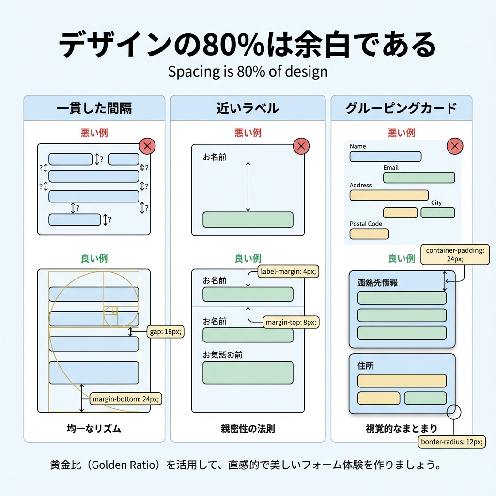
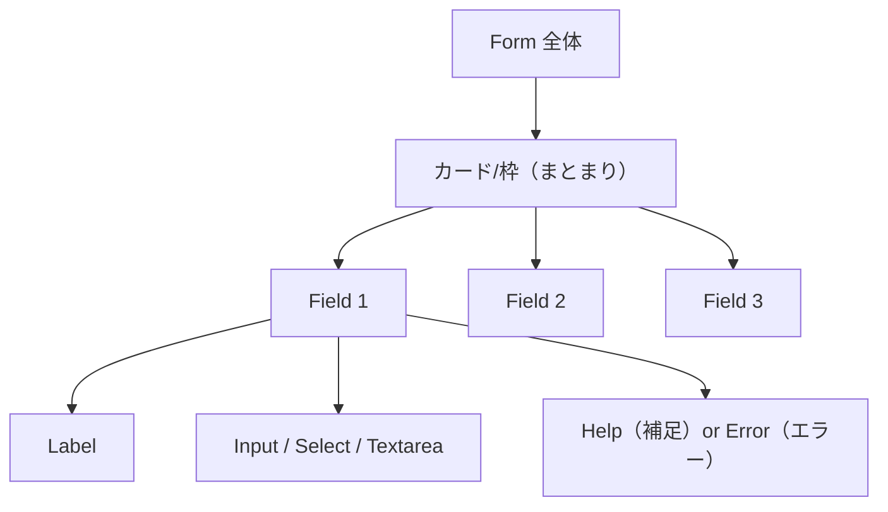

# 第55章：フォームの見た目を整えるコツ（余白が8割）🧼

フォームって「入力できればOK」じゃなくて、**“気持ちよく入力できる”**がめちゃ大事だよ〜☺️💓
そしてその体験のほとんどは…… **余白（スペース）**で決まる！🫧🫶

---

## この章でできるようになること ✅😊

* フォームが一気に“それっぽく”見える余白ルールがわかる📏✨
* ラベル・入力欄・説明文・エラー表示の並べ方が身につく🧩
* **フォーカス（選択中）**の見た目を整えて使いやすくできる👀💡

---

## まず結論：フォームは「余白8割」🫧🫧🫧

見た目を良くしたい時、最初に触るのは色じゃなくてこれ👇

* **間隔（gap / margin / padding）** 📐
* **揃え（幅・行間・整列）** 📏
* **まとまり（グルーピング）** 🧺

色や装飾は最後でOK〜！🎀

---

## 図解：フォームの“きれいな構造” 🧠🧩





ポイントは **「Field（1項目）」を最小単位にする**ことだよ〜😊🧱
Fieldごとに余白を統一すると、勝手に美しくなる✨

---

## 余白の“おすすめルール”📏✨（迷ったらこれ）

フォームはだいたいこのルールで崩れにくいよ👇🥰

* 入力欄どうしの間：**16px〜24px**（`gap: 16px` くらい）🫶
* ラベルと入力欄の間：**6px〜8px**（ちょい近め）🧷
* 入力欄の高さ：**44px前後**（指でも押しやすい）📱✨
* 説明文（help）やエラーは：**文字ちいさめ**＋**間隔ちょい**🫧

---

## 実装してみよう！🎉（見た目が整うフォーム）

ここでは **CSS Modules**でフォームを“ちゃんと見える”ようにするよ〜😊💅

### 1) `app/contact/page.tsx`（ページ）

```tsx
import styles from "./ContactForm.module.css";

export default function ContactPage() {
  return (
    <main className={styles.page}>
      <section className={styles.card}>
        <h1 className={styles.title}>お問い合わせ 📮✨</h1>
        <p className={styles.lead}>
          できるだけ気楽に書いてね〜☺️🫶
        </p>

        <form className={styles.form}>
          {/* お名前 */}
          <div className={styles.field}>
            <label className={styles.label} htmlFor="name">
              お名前 <span className={styles.req}>*</span>
            </label>
            <input
              className={styles.input}
              id="name"
              name="name"
              type="text"
              autoComplete="name"
              placeholder="例）山田 花子"
              required
            />
            <p className={styles.help}>フルネームでOKだよ〜😊</p>
          </div>

          {/* メール */}
          <div className={styles.field}>
            <label className={styles.label} htmlFor="email">
              メールアドレス <span className={styles.req}>*</span>
            </label>
            <input
              className={styles.input}
              id="email"
              name="email"
              type="email"
              autoComplete="email"
              placeholder="example@gmail.com"
              required
            />
            <p className={styles.help}>返信が必要なときだけ使うよ📩</p>
          </div>

          {/* 内容 */}
          <div className={styles.field}>
            <label className={styles.label} htmlFor="message">
              内容 <span className={styles.req}>*</span>
            </label>
            <textarea
              className={styles.textarea}
              id="message"
              name="message"
              placeholder="例）サイトの作り方を相談したいです！"
              required
              rows={6}
            />
            <p className={styles.help}>短くてもOK〜！箇条書きでもOK〜！📝✨</p>
          </div>

          <button className={styles.button} type="submit">
            送信する 🚀
          </button>
        </form>
      </section>
    </main>
  );
}
```

---

### 2) `app/contact/ContactForm.module.css`（余白で勝つ✨）

```css
.page {
  padding: 32px 16px;
  display: grid;
  place-items: start center;
}

.card {
  width: min(720px, 100%);
  padding: 24px;
  border: 1px solid #e6e6e6;
  border-radius: 16px;
  background: #fff;
}

.title {
  font-size: 24px;
  margin: 0;
  line-height: 1.25;
}

.lead {
  margin: 8px 0 0;
  color: #555;
  line-height: 1.6;
}

.form {
  margin-top: 20px;
  display: grid;
  gap: 18px; /* ← フィールド間の“主役の余白” */
}

.field {
  display: grid;
  gap: 8px; /* ← ラベル→入力の間は近めがきれい */
}

.label {
  font-size: 14px;
  color: #222;
}

.req {
  color: #d33;
}

.help {
  margin: 0;
  font-size: 12px;
  color: #666;
  line-height: 1.5;
}

.input,
.textarea {
  width: 100%;
  border: 1px solid #d7d7d7;
  border-radius: 12px;
  padding: 12px 12px;
  font-size: 16px;
  line-height: 1.4;
  background: #fff;
}

/* 入力中の気持ちよさはここで決まる！✨ */
.input:focus-visible,
.textarea:focus-visible {
  outline: none;
  border-color: #6a7cff;
  box-shadow: 0 0 0 4px rgba(106, 124, 255, 0.2);
}

/* エラーのとき（例：aria-invalid="true" になったら） */
.input[aria-invalid="true"],
.textarea[aria-invalid="true"] {
  border-color: #d33;
  box-shadow: 0 0 0 4px rgba(221, 51, 51, 0.18);
}

.button {
  margin-top: 8px;
  border: none;
  border-radius: 14px;
  padding: 12px 16px;
  font-size: 16px;
  cursor: pointer;
  background: #111;
  color: #fff;
}

.button:hover {
  opacity: 0.92;
}

.button:focus-visible {
  outline: none;
  box-shadow: 0 0 0 4px rgba(0, 0, 0, 0.18);
}
```

---

## “それっぽさ”を爆上げする小ワザ集 🪄✨

### ① 幅はそろえる（ガタつきを消す）📏

* 入力欄は基本 `width: 100%` で統一が安心😊

### ② ラベルは上に置く（迷わない）⬆️

* 横並びは難易度上がりやすいよ〜💦
  まずは **縦並びが正解**🙆‍♀️✨

### ③ フォーカスを目立たせる（使いやすさ直結）👀

* `:focus-visible` でリングを出すと、急にプロっぽい💍✨

### ④ “説明文”は小さく、でも近く🫧

* help は `font-size: 12px` 前後がキレイ
* 入力欄と近いほど「読む流れ」が自然になるよ〜📚😊

---

## ミニ練習（5分）⏱️✨

次の3つだけやってみて〜！すぐ上手くなるよ😆🫶

1. `.form` の `gap` を `14px / 22px` に変えて、見やすさを比較する🔁
2. `textarea` の `rows` を 4 と 8 で変えて、読みやすさを比べる📝
3. `.card` の `padding` を 20→28 にして「呼吸できるUI」体験🫧

---

## 最終チェックリスト ✅💯

* [ ] フィールド間の余白が一定（`gap`で統一）📏
* [ ] ラベル→入力→説明の距離が自然 🧠
* [ ] フォーカス時に「今どこ？」がすぐ分かる 👀✨
* [ ] ボタンが押しやすいサイズ（高さ・余白）👍
* [ ] 全体が“1つのまとまり”に見える（カードなど）🧺

---

必要なら、このフォームに **「エラー文を出す見た目」**だけ追加したバージョン（ダミーで赤表示を出すやつ）も作れるよ〜😚🧯✨
