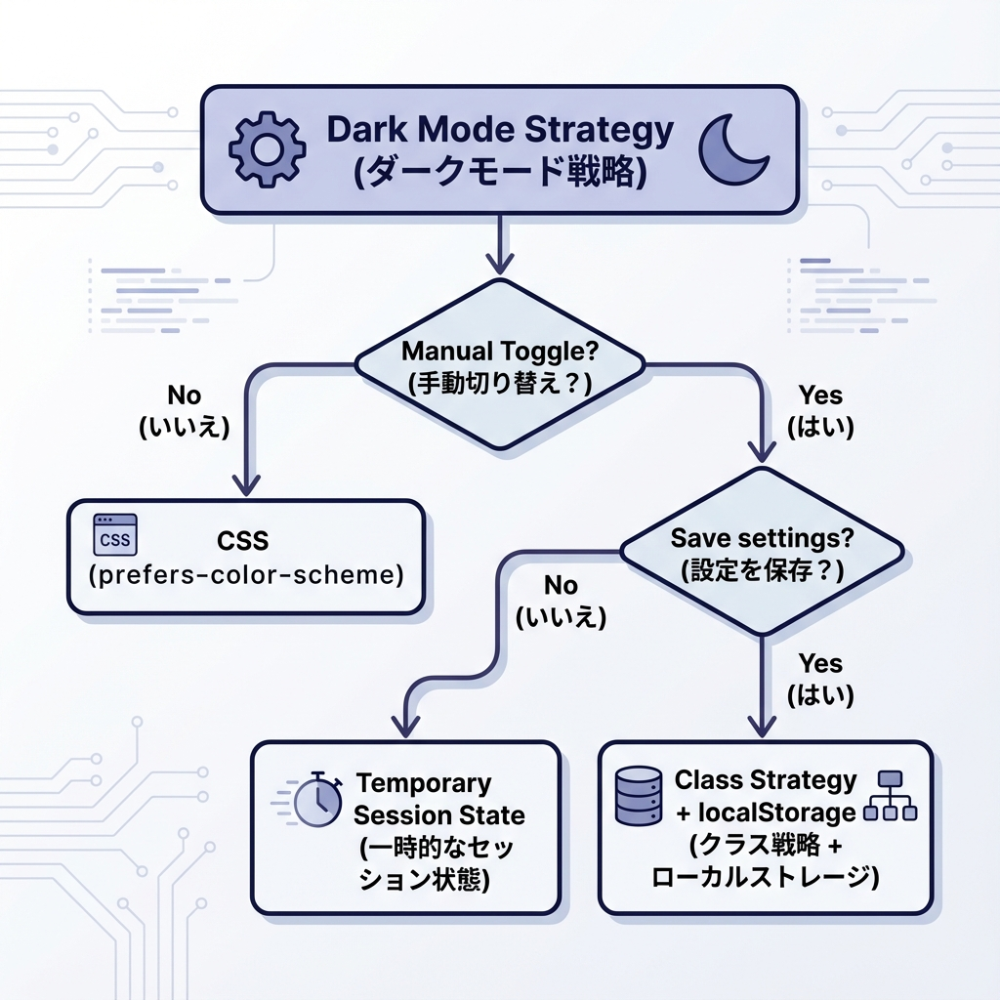
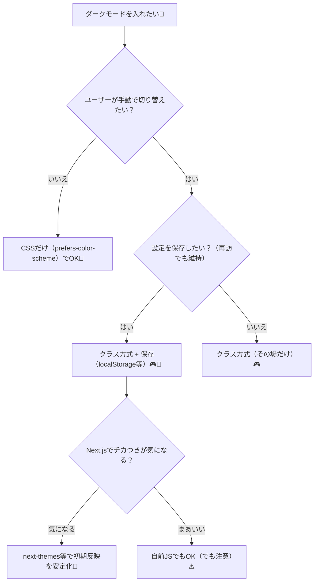

# 第56章：ダークモードの方針：CSSでやる？クラスでやる？🌙

ダークモードって「暗い配色に切り替える」だけじゃなくて、**“どうやって切り替える設計にするか”** が超大事だよ〜！😆🖤
この章では、Next.js（App Router）でよく使う2つの方針を、迷わないように整理していくね🧭✨

---

## この章のゴール🎯

* ダークモードの実装方針を2種類（CSS / クラス）で理解する🌙
* どっちを選ぶべきか判断できるようになる✅
* Next.jsで「それっぽく動く」最小実装ができる💪✨

---

## ダークモードの方針は大きく2つ🌙🔀

### ① CSSだけでやる（OS設定に合わせる）🧊

* OS/ブラウザの設定（ライト/ダーク）に自動追従✨
* JavaScriptいらない！👍
* でも…**手動切り替えボタンは作りにくい**（作れなくはないけど、結局JSが必要になりがち）😵‍💫
  `prefers-color-scheme` っていう仕組みを使うよ〜！ ([MDN Web Docs][1])

### ② クラスでやる（`dark` を付け替える）🎮

* `html` や `body` に `dark` クラスを付けたり外したりして切り替える💡
* 手動トグル（ボタン）も、保存（localStorage）もやりやすい😍
* ただし、Next.jsだと**最初の表示で一瞬チカッと色が変わる問題（フラッシュ）**に気を配る必要あり⚠️

---

## どっちにする？迷ったらこれでOK🧭🌙





---

## まず結論：学習用＆実務寄りなら「クラス方式」がおすすめ💖

理由はこれ👇

* ボタンで切り替えできる🔘✨
* 好みを保存できる💾
* Tailwindでも一般的にクラス方式がよく使われるよ〜！ ([tailwindcss.com][2])

---

## 実装①：CSSだけでダーク対応（最小・自動）🧊🌙

### ✅ `app/globals.css` に書く（例）

ポイントは **CSS変数** で色をまとめること！🎨✨

```css
/* app/globals.css */
:root {
  color-scheme: light dark; /* ブラウザのフォーム部品にもヒントを出す */
  --bg: #ffffff;
  --text: #111111;
  --card: #f4f4f5;
}

@media (prefers-color-scheme: dark) {
  :root {
    --bg: #0b0f19;
    --text: #e7e9ee;
    --card: #111827;
  }
}

body {
  background: var(--bg);
  color: var(--text);
}

.card {
  background: var(--card);
  padding: 16px;
  border-radius: 12px;
}
```

`prefers-color-scheme` はOS/ブラウザの設定に合わせてくれるよ〜！([MDN Web Docs][1])
あと `color-scheme` を入れると、入力欄とかスクロールバー系が馴染みやすくなることがあるよ✨ ([MDN Web Docs][3])

---

## 実装②：クラス方式で「手動切り替え」までやる🎮🌙（おすすめ）

Next.js（App Router）で「チカつき」や「Hydration警告」を避けたいなら、**next-themes** がラクで安定しやすいよ🧰✨
（`<html>` に `suppressHydrationWarning` が必要、って注意も公式に書かれてるよ）([GitHub][4])
Hydrationの考え方自体はNext.js公式の注意も見ておくと安心！([nextjs.org][5])

---

### 1) インストール💿✨（PowerShellでOK）

```bash
npm i next-themes
```

---

### 2) `app/providers.tsx` を作る（Client Component）🧩

```tsx
"use client";

import { ThemeProvider } from "next-themes";

export function Providers({ children }: { children: React.ReactNode }) {
  return (
    <ThemeProvider
      attribute="class"   // html に class="dark" を付ける方式
      defaultTheme="system"
      enableSystem
    >
      {children}
    </ThemeProvider>
  );
}
```

---

### 3) `app/layout.tsx` で包む🧱✨

```tsx
import "./globals.css";
import { Providers } from "./providers";

export default function RootLayout({
  children,
}: {
  children: React.ReactNode;
}) {
  return (
    <html lang="ja" suppressHydrationWarning>
      <body>
        <Providers>{children}</Providers>
      </body>
    </html>
  );
}
```

`next-themes` が `html` を書き換えるので、`suppressHydrationWarning` が必要になることがあるよ〜！([GitHub][4])

---

### 4) ダーク/ライトの色を「クラス」で切り替えるCSSを書く🎨🌙

```css
/* app/globals.css */
:root {
  color-scheme: light dark;
  --bg: #ffffff;
  --text: #111111;
  --card: #f4f4f5;
}

/* html に dark クラスが付いたら上書き */
html.dark {
  --bg: #0b0f19;
  --text: #e7e9ee;
  --card: #111827;
}

body {
  background: var(--bg);
  color: var(--text);
}

.card {
  background: var(--card);
  padding: 16px;
  border-radius: 12px;
}
```

---

### 5) トグルボタンを作る🔘✨（`components/ThemeToggle.tsx`）

最初の表示ズレ防止で「マウント後に表示」するのがコツだよ〜！🫶
（Hydrationのズレ回避の考え方は公式メッセージも参考になるよ）([nextjs.org][5])

```tsx
"use client";

import { useEffect, useState } from "react";
import { useTheme } from "next-themes";

export function ThemeToggle() {
  const { theme, setTheme, resolvedTheme } = useTheme();
  const [mounted, setMounted] = useState(false);

  useEffect(() => setMounted(true), []);

  if (!mounted) return null; // 最初は表示しない（ズレ防止）

  const current = theme === "system" ? resolvedTheme : theme;

  return (
    <button
      type="button"
      onClick={() => setTheme(current === "dark" ? "light" : "dark")}
      style={{
        padding: 12,
        borderRadius: 12,
        border: "1px solid #ccc",
        background: "transparent",
        cursor: "pointer",
      }}
    >
      {current === "dark" ? "🌙 ダーク" : "☀️ ライト"}（タップで切替）
    </button>
  );
}
```

---

### 6) `app/page.tsx` に置いて動作確認🏁✨

```tsx
import { ThemeToggle } from "@/components/ThemeToggle";

export default function Page() {
  return (
    <main style={{ padding: 24 }}>
      <h1>ダークモード練習🌙✨</h1>
      <ThemeToggle />

      <div className="card" style={{ marginTop: 16 }}>
        カードだよ〜🫶 背景色が切り替わればOK！
      </div>
    </main>
  );
}
```

---

## まとめ：この章の“方針”だけ覚えれば勝ち🏆🌙

* **自動でOK**なら → `prefers-color-scheme`（CSSだけ）🧊 ([MDN Web Docs][1])
* **手動切替したい**なら → **クラス方式**（`html.dark` など）🎮
* Next.jsで安定させたいなら → `next-themes` が便利🧰（Hydration注意）([GitHub][4])
* Tailwindでも「クラス方式」がよく使われるよ〜🌙✨ ([tailwindcss.com][2])

---

## ちょい練習💪💕（1分）

* ボタンの文言を「🌙 Moon / ☀️ Sun」にしてみよ〜😆
* `.card` に `box-shadow` を付けて、ライト/ダークで影の濃さを変えてみよ〜✨

[1]: https://developer.mozilla.org/ja/docs/Web/CSS/Reference/At-rules/%40media/prefers-color-scheme?utm_source=chatgpt.com "prefers-color-scheme - CSS - MDN Web Docs - Mozilla"
[2]: https://tailwindcss.com/docs/dark-mode?utm_source=chatgpt.com "Dark mode - Core concepts"
[3]: https://developer.mozilla.org/ja/docs/Web/CSS/Reference/Properties/color-scheme?utm_source=chatgpt.com "color-scheme - CSS - MDN Web Docs"
[4]: https://github.com/pacocoursey/next-themes?utm_source=chatgpt.com "pacocoursey/next-themes: Perfect Next.js dark mode in 2 ..."
[5]: https://nextjs.org/docs/messages/react-hydration-error?utm_source=chatgpt.com "Text content does not match server-rendered HTML"
