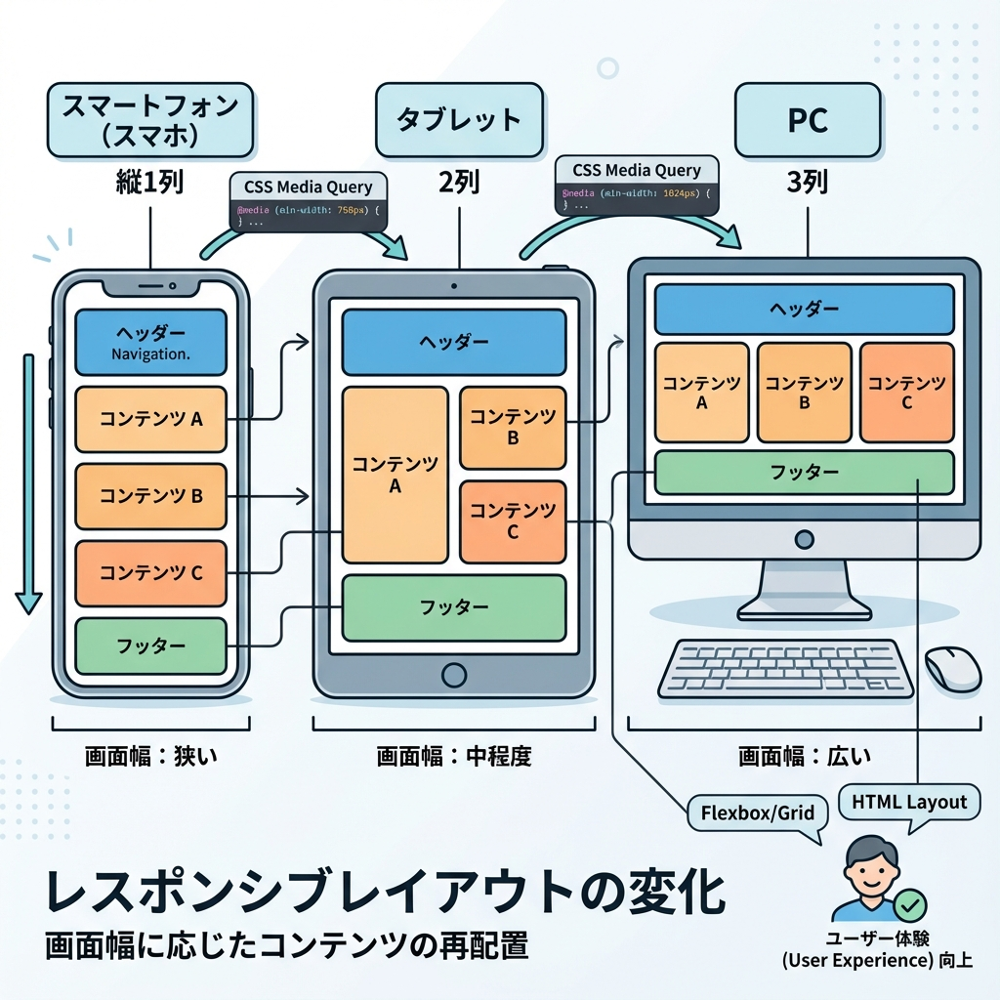
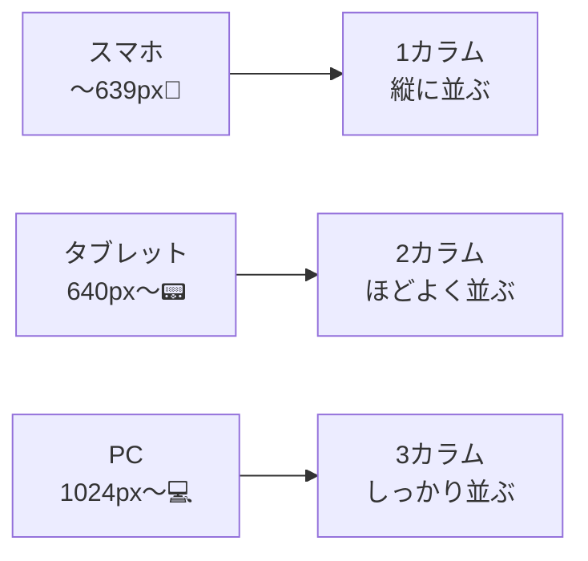

# 第57章：レスポンシブの最小セット📱

この章のゴールはこれ👇
**「スマホでもPCでも崩れない」ための“最低限の型”を手に入れること**だよ〜！🎀

---

## 1) レスポンシブってなに？📏🌈

画面の幅に合わせて、**レイアウト（並び方・余白・文字サイズ）を切り替える**ことだよ😊
スマホで見たら縦にスッ…、PCなら横にシュッ…みたいなやつ✨

---

## 2) まず覚える“最小セット”✅📦

これだけ押さえれば、だいたい戦えるよ💪😆

### ✅ 最小セット（これだけやろう）

1. **Viewport（スマホで縮小されない設定）**📱
2. **幅は基本 `%` / `max-width` で“伸び縮み”**🧸
3. **画像は `max-width: 100%` でハミ出し防止**🖼️
4. **レイアウトは `grid` / `flex` を使う**🧱
5. **Media Query は “増やしすぎない”**（2〜3段階でOK）✂️

---

## 3) 図でイメージするよ📱➡️💻



「スマホは1列、タブレットは2列、PCは3列」みたいな基本パターンが超よく使われるよ〜✨



---

## 4) Next.js 側の準備：Viewportを入れる📱🧩

App Router なら、`app/layout.tsx` に **viewport** を書いておくと安心だよ✨

```tsx
// app/layout.tsx
export const viewport = {
  width: "device-width",
  initialScale: 1,
};

export default function RootLayout({
  children,
}: {
  children: React.ReactNode;
}) {
  return (
    <html lang="ja">
      <body>{children}</body>
    </html>
  );
}
```

---

## 5) 実践：カード一覧を“最小レスポンシブ”で作る🪄📦

### ① `app/page.tsx`（カードを並べる）

```tsx
// app/page.tsx
import styles from "./page.module.css";

const items = [
  { id: 1, title: "ゼミ発表の準備", desc: "スライドの構成を決める" },
  { id: 2, title: "カフェで作業", desc: "課題を進める" },
  { id: 3, title: "レポート提出", desc: "引用チェックも忘れずに" },
  { id: 4, title: "バイト", desc: "シフト確認！" },
  { id: 5, title: "友だちとごはん", desc: "予約しとくと安心" },
  { id: 6, title: "自分メンテ", desc: "早めに寝る😴" },
];

export default function Home() {
  return (
    <main className={styles.page}>
      <header className={styles.header}>
        <h1 className={styles.title}>今週の予定🗓️✨</h1>
        <p className={styles.subtitle}>スマホでも見やすいカード一覧だよ〜📱💻</p>
      </header>

      <section className={styles.grid}>
        {items.map((x) => (
          <article key={x.id} className={styles.card}>
            <h2 className={styles.cardTitle}>{x.title}</h2>
            <p className={styles.cardDesc}>{x.desc}</p>
            <button className={styles.button}>くわしく見る👀</button>
          </article>
        ))}
      </section>
    </main>
  );
}
```

### ② `app/page.module.css`（レスポンシブの本体🎯）

ポイントはこれ👇

* **`max-width` で中央寄せ**
* **`grid` + `minmax()` で自動調整**
* **Media Query は 2段階くらい**（増やしすぎない✂️）

```css
/* app/page.module.css */

.page {
  padding: 24px;
}

.header {
  max-width: 960px;
  margin: 0 auto 16px;
}

.title {
  font-size: clamp(20px, 3vw, 32px);
  margin: 0 0 6px;
}

.subtitle {
  margin: 0;
  opacity: 0.8;
}

/* ✅ ここが主役：最小レスポンシブGrid */
.grid {
  max-width: 960px;
  margin: 0 auto;
  display: grid;
  gap: 12px;

  /* スマホ基準：1カラム */
  grid-template-columns: 1fr;
}

.card {
  border: 1px solid #ddd;
  border-radius: 14px;
  padding: 14px;
}

.cardTitle {
  margin: 0 0 8px;
  font-size: 18px;
}

.cardDesc {
  margin: 0 0 12px;
  line-height: 1.6;
}

.button {
  border: 1px solid #aaa;
  background: transparent;
  padding: 8px 10px;
  border-radius: 10px;
  cursor: pointer;
}

/* ✅ 640px〜：2カラム（タブレット想定📟） */
@media (min-width: 640px) {
  .grid {
    grid-template-columns: repeat(2, minmax(0, 1fr));
  }
}

/* ✅ 1024px〜：3カラム（PC想定💻） */
@media (min-width: 1024px) {
  .grid {
    grid-template-columns: repeat(3, minmax(0, 1fr));
  }
}
```

---

## 6) これだけは覚えて！“ハミ出し”対策3点セット🧯📦

スマホでよくある事故が「横スクロール出ちゃう😭」なんだけど、原因はだいたいコレ👇

### ✅ ① 画像がデカい

（今回は画像ないけど、基本はこれ！）

```css
img {
  max-width: 100%;
  height: auto;
}
```

### ✅ ② 長い英数字やURLが折り返さない

```css
.cardDesc {
  overflow-wrap: anywhere;
}
```

### ✅ ③ 幅を固定pxにしすぎた

`width: 600px;` みたいな固定は、スマホだと崩れやすいよ〜💦
基本は **`max-width` + 自動余白** が安心✨

---

## 7) ミニ練習🎮✨（5分でOK）

上の例を動かして、これをやってみてね👇😆

* スマホ幅にして **1列** になってる？📱
* 640px以上で **2列** になる？📟
* 1024px以上で **3列** になる？💻
* 文字サイズが `clamp()` で自然に変わってる？🔍

---

## 8) よくあるつまずきQ&A🫶💡

### Q. Media Queryっていっぱい必要？😵

A. 最初は **2段階で十分**！
「スマホ → タブレット → PC」くらいでOKだよ✨

### Q. GridとFlexどっち？🤔

A. **一覧（カードの集合）はGridが超強い**🔥
ヘッダーの左右配置とかはFlexが便利〜😊

---

## まとめ🎉📌

この章の“最小セット”はこれだけ👇

* **Viewportを設定**📱
* **`max-width` で中央寄せ**🧸
* **Gridで1→2→3カラム**🧱
* **Media Queryは増やしすぎない**✂️

ここまでできたら、もう「スマホで崩れる😭」がかなり減るよ〜！😆💖
