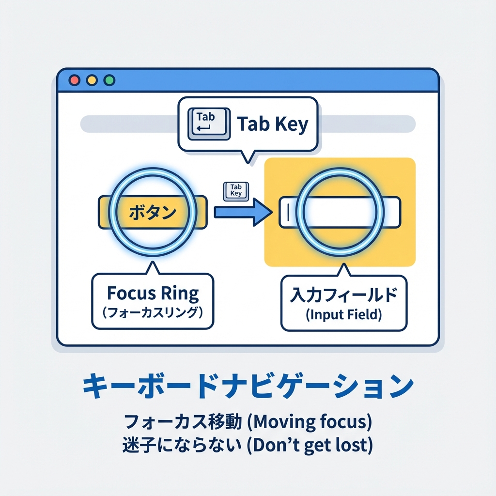
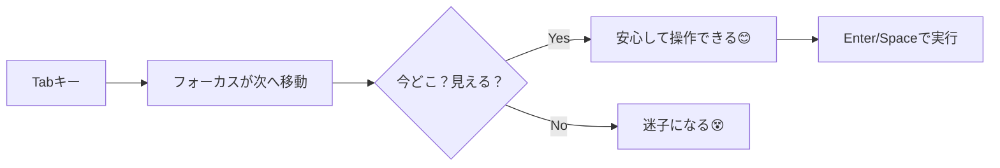

# 第58章：アクセシビリティ：ボタン/ラベル/フォーカス🧑‍🦽

## この章のゴール🎯

* クリックだけじゃなく、**キーボード（Tab/Enter/Space）でも気持ちよく操作できるUI**にする💻⌨️
* **ボタン・ラベル・フォーカス**の“最低ライン”を守って、誰にとっても使いやすくする🌈
* 「ariaって何…😵」にならずに、**まずはHTMLの正攻法**で勝てるようになる🫶

---

## アクセシビリティってなに？🫧

ざっくり言うと、
**「いろんな人・いろんな状況でも使えるようにすること」**だよ😊✨

* マウスが使えない（手がふさがってる/怪我/環境）🙌
* 画面を読み上げて使う（スクリーンリーダー）🔊
* 小さい画面・暗い場所・低速回線📱🌙🐢

こういう時に「ちゃんと押せる」「どこを操作中かわかる」って、めちゃ大事💡

---

## 1) ボタン：まず“buttonを使う”が最強👑🔘

### ✅ いいボタン（正解）

* クリックできるものは **`<button>`** を使う
* アイコンだけのボタンは **説明（ラベル）**を付ける

```tsx
export function GoodButtons() {
  return (
    <div style={{ display: "flex", gap: 12, alignItems: "center" }}>
      <button type="button">保存する</button>

      {/* アイコンだけの場合：aria-labelで意味を補う */}
      <button type="button" aria-label="検索">
        🔍
      </button>
    </div>
  );
}
```

### ❌ よくあるNG（やりがち🥺）

* `div` や `span` をボタンっぽくしてクリックさせる
  → キーボード操作や読み上げで詰みやすい💥

```tsx
// NG例：見た目はボタンでも、アクセシビリティ的に弱い😢
export function BadButton() {
  return <div onClick={() => alert("clicked!")}>押してね</div>;
}
```

### ボタンの小ワザ✨

* 送信ボタンは `type="submit"`
* 送信じゃないボタンは `type="button"`（これ超大事！😳）

  * フォーム内のボタンがうっかり送信しちゃう事故を防ぐ🧯

---

## 2) ラベル：入力欄は“誰？”がわかるように🏷️📝

入力フォームは、**見た目の文字**だけじゃなくて、機械にも「これは何の入力？」って伝えたいの💡
そこで **`label` + `htmlFor` + `id`** のセットが王道だよ✨

```tsx
export function GoodLabelForm() {
  return (
    <form>
      <div style={{ marginBottom: 12 }}>
        <label htmlFor="email">メールアドレス</label><br />
        <input id="email" name="email" type="email" autoComplete="email" />
      </div>

      <div style={{ marginBottom: 12 }}>
        <label htmlFor="msg">メッセージ</label><br />
        <textarea id="msg" name="message" rows={4} />
      </div>

      <button type="submit">送信</button>
    </form>
  );
}
```

### ✅ さらに親切：ヒント文は `aria-describedby` 💬

「パスワードは8文字以上だよ」みたいな補足を、読み上げにも伝えられるよ🔊

```tsx
export function PasswordField() {
  return (
    <div>
      <label htmlFor="pw">パスワード</label><br />
      <input id="pw" type="password" aria-describedby="pw-help" />
      <p id="pw-help">8文字以上で入力してね</p>
    </div>
  );
}
```

---

## 3) フォーカス：今どこ操作してるか“光らせる”✨🟦

キーボード操作の人は **Tab** を押して移動するよ⌨️
だから「今どこにいるか」が見えないと、迷子になる😵‍💫

### フォーカス移動のイメージ図🧭





### ✅ `:focus-visible` で“キーボードの時だけ”枠線を出す🟦

マウスクリック時は出さず、Tab操作の時だけ出す…みたいにできるよ✨
（“見た目がダサいから消す”はNG！消すなら代わりを用意してね🥺）

**CSS Modules例：`components/a11y.module.css`**

```css
.focusRing:focus-visible {
  outline: 3px solid currentColor;
  outline-offset: 3px;
  border-radius: 8px;
}

.input {
  padding: 8px 10px;
  border: 1px solid #aaa;
  border-radius: 8px;
}

.button {
  padding: 10px 14px;
  border: 1px solid #666;
  border-radius: 10px;
  cursor: pointer;
}
```

**使う側（TSX）**

```tsx
import styles from "./a11y.module.css";

export function FocusDemo() {
  return (
    <div style={{ display: "grid", gap: 10, maxWidth: 360 }}>
      <label htmlFor="name">お名前</label>
      <input id="name" className={`${styles.input} ${styles.focusRing}`} />

      <button type="button" className={`${styles.button} ${styles.focusRing}`}>
        つぎへ
      </button>
    </div>
  );
}
```

---

## 4) まとめ：この章の“最小チェックリスト”✅🎀

* ✅ クリックできるものは `button` / リンクは `a`（or `Link`）
* ✅ フォームは `label(htmlFor) + id` を基本セットにする
* ✅ フォーカス（Tab移動）で「今どこ？」が見えるようにする
* ✅ アイコンだけは `aria-label` で意味を補う
* ✅ `type="button"` を忘れない（フォーム事故防止🚑）

---

## やってみよう（ミニ課題）🧪💖

**目標：アクセシブルな“お問い合わせフォーム”を1枚作る📮✨**

### 手順🔧

1. `app/a11y/page.tsx` を作る
2. 下のコンポーネントを貼る
3. 実行したら、**Tabキーだけ**で操作してみる（これ大事！⌨️👀）

**`app/a11y/page.tsx`**

```tsx
import styles from "./page.module.css";

export default function Page() {
  return (
    <main className={styles.main}>
      <h1 className={styles.title}>お問い合わせ📮</h1>

      <form className={styles.form}>
        <div className={styles.field}>
          <label htmlFor="email" className={styles.label}>メールアドレス</label>
          <input
            id="email"
            name="email"
            type="email"
            autoComplete="email"
            className={`${styles.input} ${styles.focusRing}`}
            required
          />
        </div>

        <div className={styles.field}>
          <label htmlFor="topic" className={styles.label}>用件</label>
          <select
            id="topic"
            name="topic"
            className={`${styles.input} ${styles.focusRing}`}
            defaultValue="general"
          >
            <option value="general">一般</option>
            <option value="bug">不具合</option>
            <option value="other">その他</option>
          </select>
        </div>

        <div className={styles.field}>
          <label htmlFor="message" className={styles.label}>内容</label>
          <textarea
            id="message"
            name="message"
            rows={5}
            className={`${styles.input} ${styles.focusRing}`}
            aria-describedby="msg-help"
            required
          />
          <p id="msg-help" className={styles.help}>200文字くらいまででOKだよ🫶</p>
        </div>

        <div className={styles.actions}>
          <button type="submit" className={`${styles.button} ${styles.focusRing}`}>
            送信する✨
          </button>

          <button type="button" className={`${styles.button} ${styles.focusRing}`} aria-label="入力内容をリセット">
            リセット🧼
          </button>
        </div>
      </form>
    </main>
  );
}
```

**`app/a11y/page.module.css`**

```css
.main {
  padding: 24px;
  max-width: 520px;
  margin: 0 auto;
}

.title {
  font-size: 24px;
  margin-bottom: 16px;
}

.form {
  display: grid;
  gap: 16px;
}

.field {
  display: grid;
  gap: 6px;
}

.label {
  font-weight: 600;
}

.help {
  font-size: 12px;
  opacity: 0.8;
}

.input {
  padding: 10px 12px;
  border: 1px solid #999;
  border-radius: 12px;
}

.actions {
  display: flex;
  gap: 12px;
  margin-top: 8px;
}

.button {
  padding: 10px 14px;
  border: 1px solid #666;
  border-radius: 12px;
  cursor: pointer;
  background: transparent;
}

.focusRing:focus-visible {
  outline: 3px solid currentColor;
  outline-offset: 3px;
}
```

### できたらチェック✅😆

* Tabで「メール → 用件 → 内容 → 送信 → リセット」の順に移動できる？
* フォーカスがちゃんと見える？🟦
* ラベルクリックで入力欄にフォーカス入る？👆
* アイコン（今回はリセット）に意味が付いてる？（`aria-label`）🫶

---

次の章（第59章）は「カード一覧を“それっぽく”仕上げる」だけど、今回は**第58章ここまで**だよ〜！🎉💖
