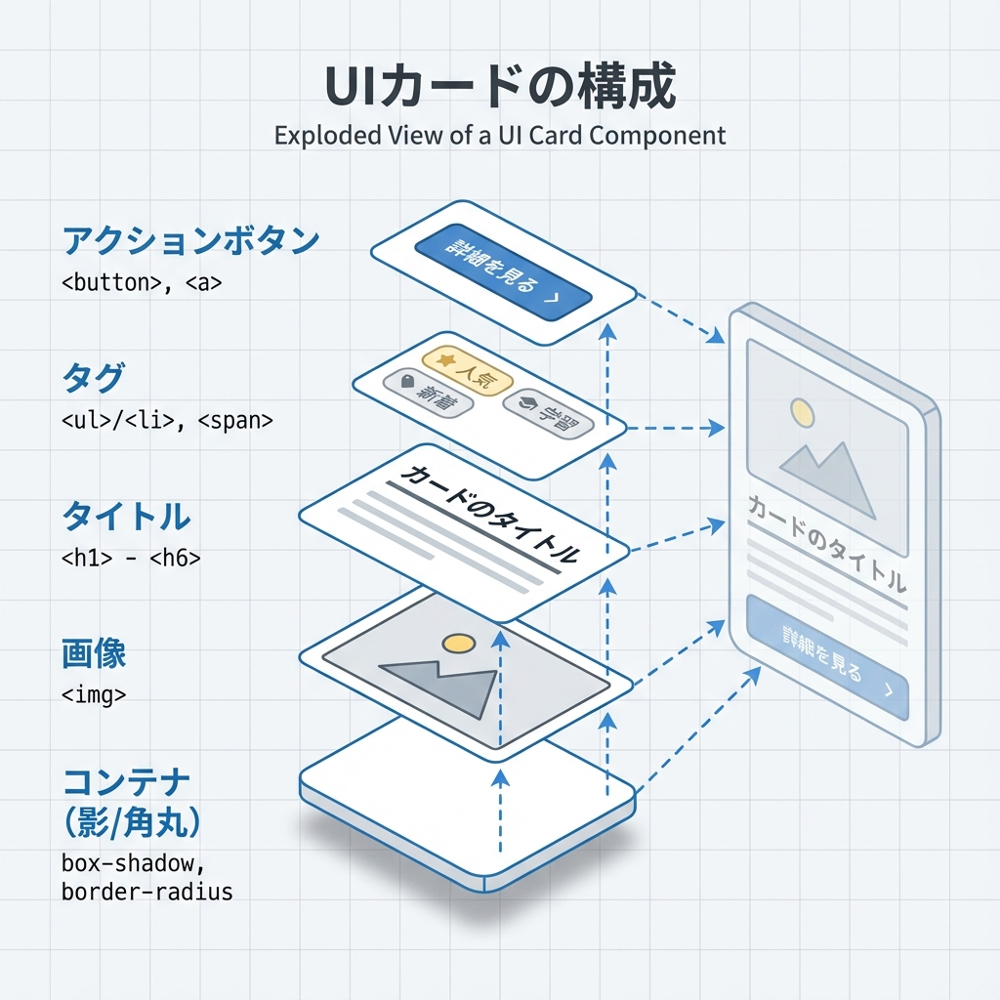
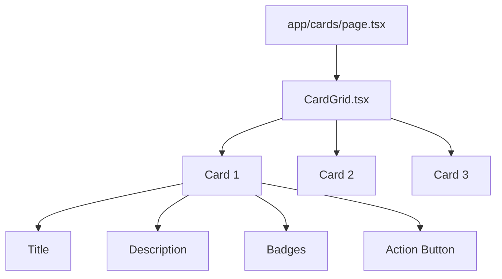

# 第59章：練習：カード一覧を“それっぽく”仕上げる✨

今日は「カードが並ぶ一覧ページ」を、**一気に“ちゃんとしてる感”**にするよ〜！😆💖
見た目が整うと、作っててテンション上がるやつ…！🔥✨

---

## 今日のゴール🎯

* カードが **きれいに並ぶ（Grid）** 🧱✨
* **余白・影・角丸・ホバー**で“それっぽい”UIにする🫧
* **タグ（バッジ）・ボタン・文章の省略**も入れて完成度UP⬆️🎀
* **フォーカス（キーボード操作）**もちゃんと対応🧑‍🦽✨

---

## 完成イメージ（構造）🧩



「ページ」→「カード一覧」→「カード（中にタイトル/本文/タグ/ボタン）」って感じ🌸



---

## 1) ページを作る📄✨（`/cards` を追加）

`app/cards/page.tsx` を作ってね！🛠️💕

```tsx
// app/cards/page.tsx
import CardGrid, { type CardItem } from "@/components/CardGrid";

const items: CardItem[] = [
  {
    id: "1",
    title: "ゼミ発表まとめノート📝",
    description:
      "ゼミの発表内容を分かりやすくまとめたい！ポイントは“見出し→要点→具体例”の順に並べること✨",
    tags: ["Study", "Memo"],
    date: "2025-12-25",
  },
  {
    id: "2",
    title: "カフェ巡りメモ☕️",
    description:
      "雰囲気が良かったカフェを記録🍰 写真・場所・おすすめメニュー・混み具合をセットで残すと神！",
    tags: ["Life", "Cafe"],
    date: "2025-12-20",
  },
  {
    id: "3",
    title: "就活ToDoチェックリスト✅",
    description:
      "ES・自己分析・面接練習…やること多すぎ問題😭 だからこそ“分解して見える化”が勝ち✨",
    tags: ["Career", "Todo"],
    date: "2025-12-10",
  },
  {
    id: "4",
    title: "旅行プラン：箱根🧳",
    description:
      "温泉・ごはん・美術館…ぜんぶ盛りたい！移動時間を先に固めると、プランが一気に現実的になるよ🚃✨",
    tags: ["Travel", "Plan"],
    date: "2025-11-30",
  },
];

export default function CardsPage() {
  return (
    <main style={{ padding: 24 }}>
      <h1 style={{ fontSize: 24, fontWeight: 700, marginBottom: 8 }}>
        カード一覧✨
      </h1>
      <p style={{ marginBottom: 16, opacity: 0.8 }}>
        “それっぽい”カードUIを作る練習だよ〜！💖
      </p>

      <CardGrid items={items} />
    </main>
  );
}
```

---

## 2) カード一覧コンポーネントを作る🧱✨

`components/CardGrid.tsx` を作ってね！
ここで「カードの見た目」と「並べ方」をやるよ〜😊🎀

```tsx
// components/CardGrid.tsx
import styles from "./CardGrid.module.css";

export type CardItem = {
  id: string;
  title: string;
  description: string;
  tags: string[];
  date: string; // 表示用に軽く使うだけ
};

type Props = {
  items: CardItem[];
};

export default function CardGrid({ items }: Props) {
  return (
    <section className={styles.grid} aria-label="カード一覧">
      {items.map((item) => (
        <article key={item.id} className={styles.card}>
          <div className={styles.header}>
            <h2 className={styles.title}>{item.title}</h2>
            <time className={styles.date} dateTime={item.date}>
              {item.date}
            </time>
          </div>

          <p className={styles.desc}>{item.description}</p>

          <div className={styles.badges} aria-label="タグ">
            {item.tags.map((tag) => (
              <span key={tag} className={styles.badge}>
                {tag}
              </span>
            ))}
          </div>

          <div className={styles.actions}>
            <a href="#" className={styles.button}>
              詳細を見る 👀✨
            </a>
          </div>
        </article>
      ))}
    </section>
  );
}
```

---

## 3) CSS Modulesで“それっぽさ”を作る💅✨

`components/CardGrid.module.css` を作ってね！
ここが今日のメインディッシュ🍝💕（UIが一気に生きる）

```css
/* components/CardGrid.module.css */

.grid {
  display: grid;
  grid-template-columns: repeat(auto-fit, minmax(240px, 1fr));
  gap: 16px;
}

.card {
  background: white;
  border: 1px solid rgba(0, 0, 0, 0.06);
  border-radius: 16px;
  padding: 16px;
  box-shadow: 0 6px 18px rgba(0, 0, 0, 0.06);
  transition: transform 160ms ease, box-shadow 160ms ease, border-color 160ms ease;
}

.card:hover {
  transform: translateY(-2px);
  box-shadow: 0 10px 26px rgba(0, 0, 0, 0.10);
  border-color: rgba(0, 0, 0, 0.10);
}

.header {
  display: flex;
  gap: 12px;
  align-items: baseline;
  justify-content: space-between;
  margin-bottom: 10px;
}

.title {
  font-size: 16px;
  font-weight: 700;
  line-height: 1.3;
  margin: 0;
}

.date {
  font-size: 12px;
  opacity: 0.65;
  white-space: nowrap;
}

.desc {
  margin: 0 0 12px 0;
  font-size: 14px;
  line-height: 1.6;
  opacity: 0.85;

  /* 文章が長いときの“いい感じ省略”✨ */
  display: -webkit-box;
  -webkit-line-clamp: 3;
  -webkit-box-orient: vertical;
  overflow: hidden;
}

.badges {
  display: flex;
  flex-wrap: wrap;
  gap: 8px;
  margin-bottom: 14px;
}

.badge {
  font-size: 12px;
  padding: 6px 10px;
  border-radius: 999px;
  background: rgba(0, 0, 0, 0.06);
}

.actions {
  display: flex;
  justify-content: flex-end;
}

.button {
  display: inline-flex;
  align-items: center;
  gap: 6px;

  font-size: 13px;
  font-weight: 600;

  padding: 10px 12px;
  border-radius: 12px;

  text-decoration: none;
  background: rgba(0, 0, 0, 0.92);
  color: white;

  transition: transform 140ms ease, opacity 140ms ease;
}

.button:hover {
  opacity: 0.92;
  transform: translateY(-1px);
}

.button:focus-visible {
  outline: 3px solid rgba(0, 0, 0, 0.35);
  outline-offset: 3px;
}

/* 動きが苦手な人向け🫶 */
@media (prefers-reduced-motion: reduce) {
  .card,
  .button {
    transition: none;
  }
}
```

---

## 4) 動作確認✅✨

1. 開発サーバー起動：`npm run dev` 🚀
2. ブラウザで `http://localhost:3000/cards` を開く👀💕
3. ✅ カードが並ぶ？
4. ✅ ホバーでふわっと浮く？🫧
5. ✅ Tabキーでボタンにフォーカスできる？⌨️✨（枠が出たらOK！）

---

## “それっぽさ”のコツまとめ🎀✨（超大事）

* **余白（padding/gap）が8割**🧼✨
* **角丸（16px前後）＋影（薄め）**でカードっぽさ爆上がり🫶
* **文章は3行で省略**すると見た目が崩れにくい📏
* **ホバーは「ちょい動く＋影増える」**が自然🫧
* **focus-visible**を入れると“できてる感”が一気に上がる👑✨

---

## アレンジ課題🎨✨（やると一気に上手くなる）

できそうなのからでOKだよ〜！😊💖

* 🔥 `badge` の色をタグごとに変える（Studyは青っぽく、Lifeは緑っぽく…みたいに）
* ✨ カード全体をクリックできるようにする（`<a>`で包む or 擬似リンク）
* 🧁 1枚目のカードだけ「おすすめ」バッジを付ける
* 📱 画面が狭いときだけ `padding` を少し減らす（メディアクエリ）

---

## よくあるつまずき🧯😵

* **CSSが当たらない**
  → `import styles from "./CardGrid.module.css";` とファイル名の一致をチェック👀✅
* **`@/components/...` が解決できない**
  → 以前の章でパスエイリアス設定してる前提だけど、ダメなら相対パスで一旦OK👍
* **文章省略が効かない**
  → `display: -webkit-box;` と `-webkit-line-clamp` のセットが必要だよ〜📌✨

---

ここまでできたら、第59章クリア🎉💖
カード一覧って、地味だけど「アプリっぽさ」の中心だから、仕上げる練習はめちゃ効くよ〜！✨🃏✨
