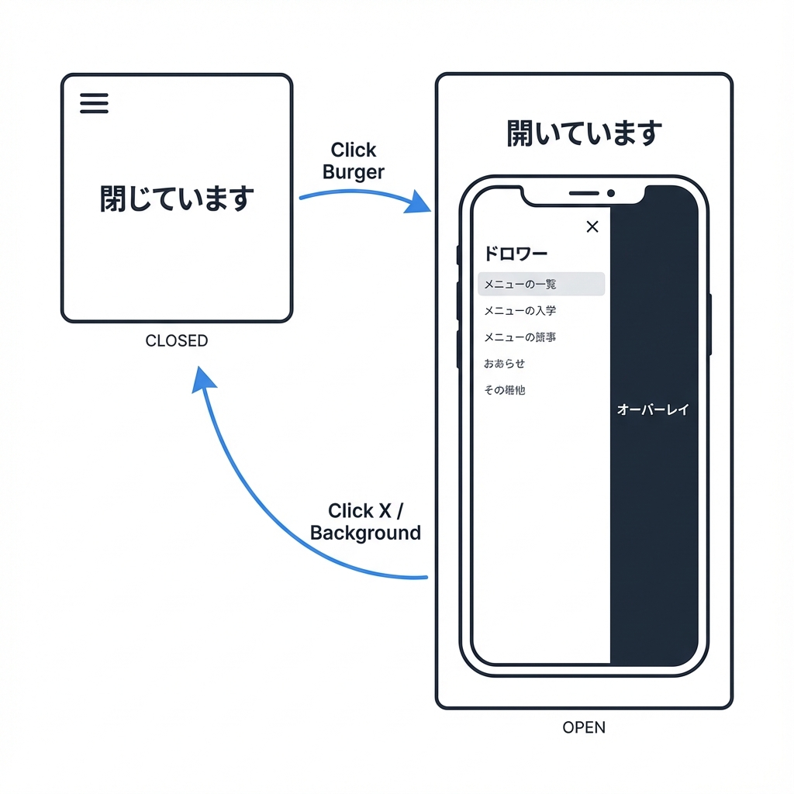
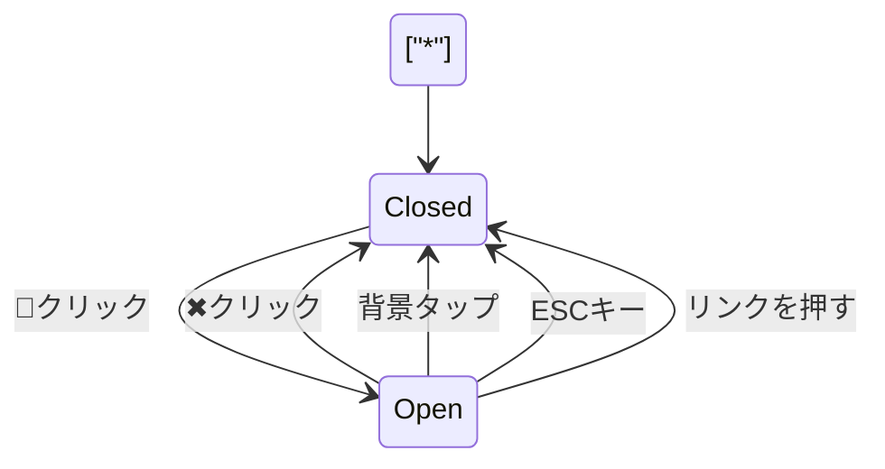
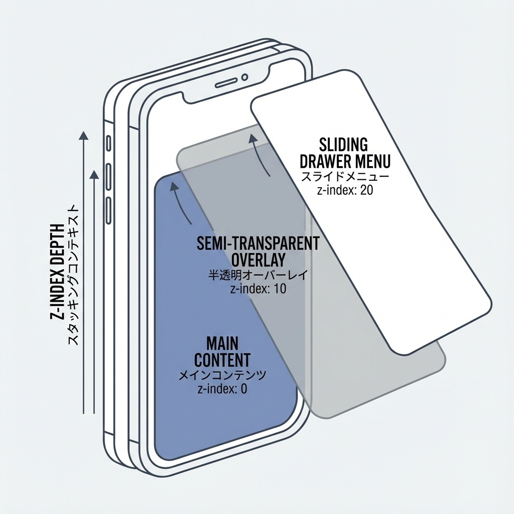
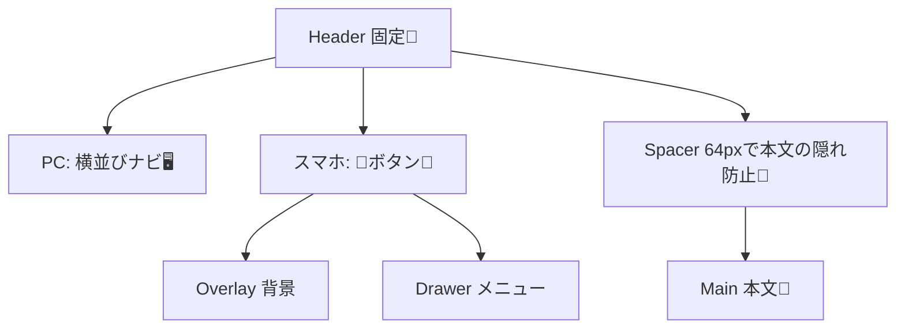

# 第60章：練習：ヘッダー固定＋スマホメニューを作る🍔

今日は「上に固定されたヘッダー」と「スマホで開くハンバーガーメニュー」を作るよ〜！😆📱
完成すると、どのページでもヘッダーがついてきて、スマホではメニューがスッと開く感じになります✨

---

## ゴール🎯

* ヘッダーを画面上部に固定（スクロールしても消えない）🧲
* PCでは横並びメニュー🖥️
* スマホでは 🍔 ボタンでメニューが開く📱
* 開いてる間は背景スクロールを止める🛑
* 閉じ方がいろいろ（ボタン/背景タップ/ESC/リンク押下）✅

---

## まずイメージ👀（動きの流れ）





---

## ① ルート（ページ）をちょい用意する📄✨

メニューに並べるページがあると楽しいので、最低2つ作るよ〜😊

* `app/about/page.tsx`
* `app/contact/page.tsx`

**app/about/page.tsx**

```tsx
export default function AboutPage() {
  return (
    <main style={{ padding: 24 }}>
      <h1>About 🌸</h1>
      <p>これはAboutページだよ〜😊</p>
    </main>
  );
}
```

**app/contact/page.tsx**

```tsx
export default function ContactPage() {
  return (
    <main style={{ padding: 24 }}>
      <h1>Contact 📮</h1>
      <p>これはContactページだよ〜😊</p>
    </main>
  );
}
```

---

## ② ヘッダーコンポーネントを作る🧩🍔

次の2ファイルを作成してね👇

* `components/Header/Header.tsx`
* `components/Header/Header.module.css`

### components/Header/Header.tsx

```tsx
"use client";

import Link from "next/link";
import { useEffect, useId, useState } from "react";
import styles from "./Header.module.css";

const NAV_ITEMS = [
  { href: "/", label: "Home 🏠" },
  { href: "/about", label: "About 🌸" },
  { href: "/contact", label: "Contact 📮" },
];

export function Header() {
  const [open, setOpen] = useState(false);
  const dialogId = useId();

  // メニューが開いてる間、背景スクロールを止める🛑
  useEffect(() => {
    if (!open) return;

    const prevOverflow = document.body.style.overflow;
    document.body.style.overflow = "hidden";

    return () => {
      document.body.style.overflow = prevOverflow;
    };
  }, [open]);

  // ESCで閉じる⌨️
  useEffect(() => {
    if (!open) return;

    const onKeyDown = (e: KeyboardEvent) => {
      if (e.key === "Escape") setOpen(false);
    };

    window.addEventListener("keydown", onKeyDown);
    return () => window.removeEventListener("keydown", onKeyDown);
  }, [open]);

  const close = () => setOpen(false);
  const toggle = () => setOpen((v) => !v);

  return (
    <>
      <header className={styles.header}>
        <div className={styles.inner}>
          <Link className={styles.brand} href="/" onClick={close}>
            MiniSite ✨
          </Link>

          {/* PC用ナビ🖥️ */}
          <nav className={styles.navDesktop} aria-label="Main navigation">
            {NAV_ITEMS.map((item) => (
              <Link key={item.href} className={styles.navLink} href={item.href}>
                {item.label}
              </Link>
            ))}
          </nav>

          {/* スマホ用ボタン📱 */}
          <button
            type="button"
            className={styles.burger}
            onClick={toggle}
            aria-label={open ? "メニューを閉じる" : "メニューを開く"}
            aria-expanded={open}
            aria-controls={dialogId}
          >
            <span className={styles.burgerLines} aria-hidden="true" />
          </button>
        </div>
      </header>

      {/* スマホ用：オーバーレイ＋ドロワー📱 */}
      <div
        className={`${styles.overlay} ${open ? styles.overlayOpen : ""}`}
        onClick={close}
        aria-hidden={!open}
      />

      <aside
        id={dialogId}
        className={`${styles.drawer} ${open ? styles.drawerOpen : ""}`}
        aria-label="Mobile menu"
      >
        <div className={styles.drawerTop}>
          <span className={styles.drawerTitle}>Menu 🍔</span>
          <button
            type="button"
            className={styles.closeBtn}
            onClick={close}
            aria-label="メニューを閉じる"
          >
            ✖
          </button>
        </div>

        <nav className={styles.navMobile}>
          {NAV_ITEMS.map((item) => (
            <Link
              key={item.href}
              className={styles.navMobileLink}
              href={item.href}
              onClick={close}
            >
              {item.label}
            </Link>
          ))}
        </nav>
      </aside>

      {/* 固定ヘッダーぶん、本文が隠れないようにスペーサーを入れる🧱 */}
      <div className={styles.headerSpacer} />
    </>
  );
}
```

### components/Header/Header.module.css

```css
.header {
  position: fixed;
  top: 0;
  left: 0;
  right: 0;
  height: 64px;
  background: white;
  border-bottom: 1px solid rgba(0, 0, 0, 0.08);
  z-index: 50;
}

.inner {
  height: 100%;
  max-width: 980px;
  margin: 0 auto;
  padding: 0 16px;
  display: flex;
  align-items: center;
  justify-content: space-between;
  gap: 12px;
}

.brand {
  font-weight: 700;
  text-decoration: none;
  color: #111;
}

.navDesktop {
  display: none;
  gap: 12px;
  align-items: center;
}

.navLink {
  text-decoration: none;
  color: #111;
  padding: 8px 10px;
  border-radius: 10px;
}

.navLink:hover {
  background: rgba(0, 0, 0, 0.06);
}

/* 🍔ボタン */
.burger {
  display: inline-flex;
  align-items: center;
  justify-content: center;
  width: 44px;
  height: 44px;
  border: 1px solid rgba(0, 0, 0, 0.12);
  background: white;
  border-radius: 12px;
  cursor: pointer;
}

.burgerLines {
  width: 18px;
  height: 12px;
  display: inline-block;
  background:
    linear-gradient(#111 0 0) 0 0 / 100% 2px,
    linear-gradient(#111 0 0) 0 50% / 100% 2px,
    linear-gradient(#111 0 0) 0 100% / 100% 2px;
  background-repeat: no-repeat;
}

/* オーバーレイ（背景） */
.overlay {
  position: fixed;
  inset: 0;
  background: rgba(0, 0, 0, 0.35);
  opacity: 0;
  pointer-events: none;
  transition: opacity 160ms ease;
  z-index: 60;
}

.overlayOpen {
  opacity: 1;
  pointer-events: auto;
}

/* ドロワー（右から出るメニュー） */
.drawer {
  position: fixed;
  top: 0;
  right: 0;
  width: min(320px, 85vw);
  height: 100vh;
  background: white;
  transform: translateX(100%);
  transition: transform 180ms ease;
  z-index: 70;
  padding: 16px;
  display: flex;
  flex-direction: column;
  gap: 12px;
}

.drawerOpen {
  transform: translateX(0);
}

.drawerTop {
  display: flex;
  align-items: center;
  justify-content: space-between;
}

.drawerTitle {
  font-weight: 700;
}

.closeBtn {
  width: 40px;
  height: 40px;
  border-radius: 12px;
  border: 1px solid rgba(0, 0, 0, 0.12);
  background: white;
  cursor: pointer;
}

.navMobile {
  display: flex;
  flex-direction: column;
  gap: 8px;
}

.navMobileLink {
  text-decoration: none;
  color: #111;
  padding: 12px 12px;
  border-radius: 12px;
  border: 1px solid rgba(0, 0, 0, 0.08);
}

.navMobileLink:hover {
  background: rgba(0, 0, 0, 0.06);
}

/* 固定ヘッダーぶんの余白 */
.headerSpacer {
  height: 64px;
}

/* PCではメニュー横並び、🍔は消す */
@media (min-width: 768px) {
  .navDesktop {
    display: flex;
  }

  .burger {
    display: none;
  }

  .overlay {
    display: none;
  }

  .drawer {
    display: none;
  }
}
```

---

## ③ layout にヘッダーを差し込む🧱✨

`app/layout.tsx` に `<Header />` を入れるよ〜😊

**app/layout.tsx（例）**

```tsx
import type { Metadata } from "next";
import "./globals.css";
import { Header } from "@/components/Header/Header";

export const metadata: Metadata = {
  title: "MiniSite",
};

export default function RootLayout({
  children,
}: {
  children: React.ReactNode;
}) {
  return (
    <html lang="ja">
      <body>
        <Header />
        {children}
      </body>
    </html>
  );
}
```

---

## ④ スクロールできるようにトップにダミー文章を置く📜（確認用）

`app/page.tsx` を軽くして、スクロール確認できるようにしよ〜😆

```tsx
export default function HomePage() {
  return (
    <main style={{ padding: 24 }}>
      <h1>Home 🏠</h1>
      <p>ヘッダーが固定されてるか、スクロールして確認してね〜✨</p>

      <div style={{ height: 1200, marginTop: 16 }}>
        <p>ここはスクロール用のダミー領域だよ〜📜</p>
        <p>ずっとヘッダーが上にいるはず！🧲</p>
      </div>
    </main>
  );
}
```

---

## ⑤ 仕上がりの構造（ざっくり）🧠






---

## 動作チェック✅🎉

以下をチェックしてOKならクリア！✨

* スクロールしてもヘッダーが上に固定されてる🧲
* 幅を狭くすると 🍔 が出る📱
* 🍔押すとメニューが右から出る➡️
* 背景をタップすると閉じる👆
* ESCキーで閉じる⌨️
* メニューを開いてる間、背景がスクロールしない🛑

---

## おまけ課題（できたら強い）💪✨

* 現在ページのリンクだけ「薄く色を変える」🎨
* メニューが開いたら最初のリンクにフォーカスを当てる👀
* アニメーションを少しだけなめらかにする（transition調整）🫧

---

これで「固定ヘッダー＋スマホメニュー」完成だよ〜！🍔🎉
次は、メニューに“今どこ？”表示（アクティブ表示）を付けると一気にそれっぽくなります😆✨
