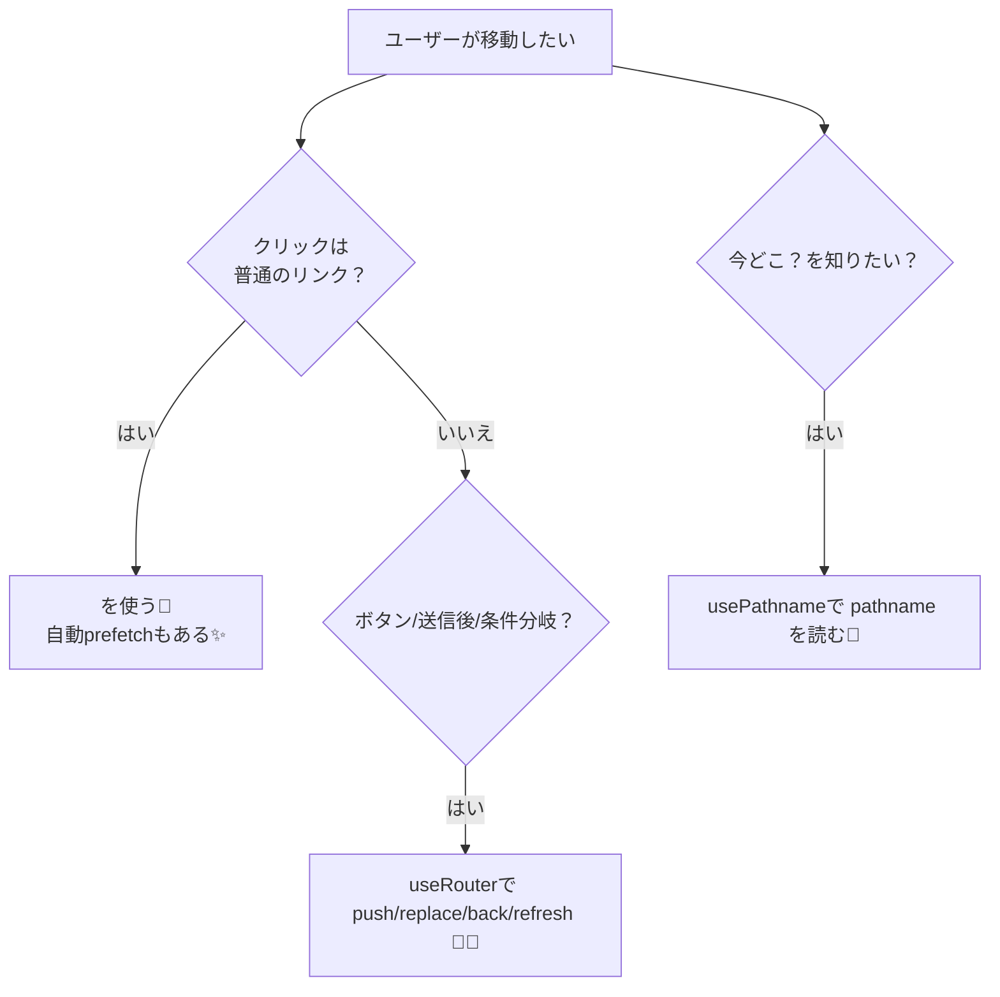

# 第61章：`useRouter` / `usePathname` の使いどころ🧭

この章では、「今どこ？」を知る `usePathname` と、「次どこ行く？」を決める `useRouter` を、迷わず使い分けできるようにします🥳💡

---

## 1) まず結論：いつ何を使うの？🤔➡️😌

### ✅ `usePathname`（いまの場所を読む📍）

* 「ヘッダーで“今いるページ”をハイライトしたい」✨
* 「ページが変わったら analytics を動かしたい」📈
* 「/blog/aaa みたいな“パス”だけ欲しい」🧭
  `usePathname` は **Client Component の hook**で、現在の **pathname（`/about` とか）**が取れます📍 ([Next.js][1])

### ✅ `useRouter`（画面遷移をする🚗💨）

* ボタンを押したら移動したい（`router.push()`）🖱️➡️
* 置き換えたい（履歴を残したくないとき `router.replace()`）🧼
* “再読み込み”っぽく最新を取り直したい（`router.refresh()`）🔄
* ブラウザの戻る/進むをしたい（`router.back()` / `router.forward()`）⬅️➡️
  `useRouter` も **Client Component の hook**で、基本は `<Link>` が推奨です（必要なときだけ `useRouter`）🚦 ([Next.js][2])

---

## 2) ざっくり図解：Link / useRouter / usePathname の関係🗺️




`<Link>` は表示されると **prefetch** してくれるのが強みだよ〜✨（体感速くなるやつ） ([Next.js][3])

---

## 3) 超重要：App Router では import 先が違うよ⚠️

App Router の場合は **`next/navigation`** から読み込むよ✅
（`next/router` じゃない！ここで詰まりがち🥹）

* `useRouter` → `next/navigation` から ([Next.js][2])
* `pathname` は `usePathname()` に置き換え ([Next.js][2])

---

## 4) ハンズオン①：ヘッダーで“今いるページ”をハイライトしよう🌸📍

### 4-1) `components/NavBar.tsx` を作る（Client Component）🧩

```tsx
'use client'

import Link from 'next/link'
import { usePathname } from 'next/navigation'
import styles from './NavBar.module.css'

const links = [
  { href: '/', label: 'Home🏠' },
  { href: '/about', label: 'About🌷' },
  { href: '/news', label: 'News📰' },
]

export function NavBar() {
  const pathname = usePathname()

  return (
    <nav className={styles.nav}>
      {links.map((l) => {
        const isActive = pathname === l.href
        return (
          <Link
            key={l.href}
            href={l.href}
            className={`${styles.link} ${isActive ? styles.active : ''}`}
          >
            {l.label}
          </Link>
        )
      })}
    </nav>
  )
}
```

### 4-2) `components/NavBar.module.css` を作る🎀

```css
.nav {
  display: flex;
  gap: 12px;
  padding: 12px 16px;
  border-bottom: 1px solid #ddd;
}

.link {
  text-decoration: none;
  padding: 8px 10px;
  border-radius: 10px;
  color: #333;
}

.active {
  font-weight: 700;
  border: 1px solid #333;
}
```

### 4-3) `app/layout.tsx` で表示する🏠✨

```tsx
import type { ReactNode } from 'react'
import { NavBar } from '@/components/NavBar'

export default function RootLayout({ children }: { children: ReactNode }) {
  return (
    <html lang="ja">
      <body>
        <NavBar />
        {children}
      </body>
    </html>
  )
}
```

✅ `/about` に行くと About が太字＆枠付きになったら成功〜！🎉

> メモ📝：`usePathname` は Client Component 専用で、Server Component では現在URLの読み取りはサポートされません📍 ([Next.js][1])

---

## 5) ハンズオン②：ボタンで画面遷移してみよう🚗💨

`useRouter` は「ボタン押したら移動」みたいなときに便利だよ〜！🖱️✨

### 5-1) `components/GoButtons.tsx` を作る🧩

```tsx
'use client'

import { useRouter } from 'next/navigation'

export function GoButtons() {
  const router = useRouter()

  return (
    <div style={{ display: 'flex', gap: 10, flexWrap: 'wrap' }}>
      <button onClick={() => router.push('/about')}>Aboutへ push➡️</button>
      <button onClick={() => router.replace('/news')}>Newsへ replace🧼</button>
      <button onClick={() => router.back()}>戻る⬅️</button>
      <button onClick={() => router.forward()}>進む➡️</button>
      <button onClick={() => router.refresh()}>refresh🔄</button>
    </div>
  )
}
```

`push / replace / refresh / back / forward` が使えるよ、って公式に書かれてるやつだよ〜📚 ([Next.js][2])

### 5-2) どこかのページで表示する（例：`app/page.tsx`）🏠

```tsx
import { GoButtons } from '@/components/GoButtons'

export default function Page() {
  return (
    <main style={{ padding: 16 }}>
      <h1>トップだよ〜🏠✨</h1>
      <GoButtons />
    </main>
  )
}
```

---

## 6) よくある注意点（ここだけは守ろ！）⚠️🫶

### ✅ ① `router.push()` に“怪しいURL”を入れないでね😱

ユーザー入力をそのまま `push/replace` に渡すのは危険なことがあるよ（XSSの原因）🧨
公式も「信頼できないURLを送らないで」って注意してます⚠️ ([Next.js][2])

### ✅ ② 基本の移動は `<Link>` が推奨だよ🔗✨

自動prefetchが効いて、体感サクサクになりやすいからね〜🌈 ([Next.js][2])

---

## 7) ミニ練習（5分）⏱️🎓

### 練習A🌸：アクティブ表示をちょい賢くする

* `/news/123` みたいな“配下”でも News を光らせたい✨
  ヒント：`pathname.startsWith('/news')` を使う💡

### 練習B🚗：遷移時にスクロール位置を維持したい

* `router.push('/about', { scroll: false })` を試してみてね🧠
  （これも公式にあるオプションだよ） ([Next.js][2])

---

ここまでできたら第61章クリア〜！🎉🧭
`usePathname` で「現在地📍」、`useRouter` で「移動🚗」って覚えると迷いにくいよ〜😊✨

[1]: https://nextjs.org/docs/app/api-reference/functions/use-pathname "Functions: usePathname | Next.js"
[2]: https://nextjs.org/docs/app/api-reference/functions/use-router "Functions: useRouter | Next.js"
[3]: https://nextjs.org/docs/app/getting-started/linking-and-navigating "Getting Started: Linking and Navigating | Next.js"
