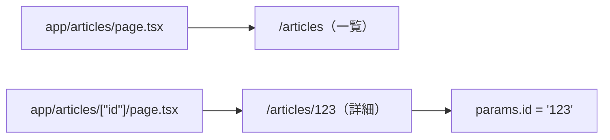
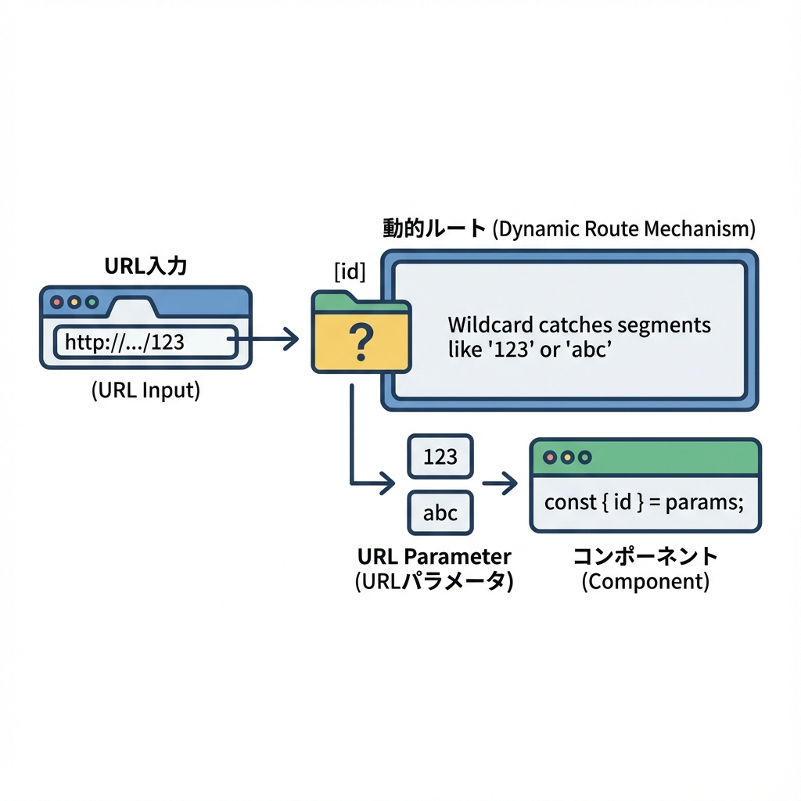

# 第62章：Dynamic Routeで詳細ページを作る🔍

今回は「一覧 → 詳細」みたいな **王道の画面構成**を Next.js（App Router）で作るよ〜！😊
URLが `/articles/1` とか `/articles/hello` みたいに **変わる部分**を扱えるようになるのがゴールです🎯💕

---

## 1) Dynamic Routeってなに？🧩

フォルダ名を **`[id]`** みたいに `[]` で囲むと、そこが **可変（dynamic）** になります✨
そして、その値は `params` から受け取れます📦

たとえば👇

* `app/articles/page.tsx` → `/articles`
* `app/articles/[id]/page.tsx` → `/articles/1` や `/articles/abc` など

---

## 2) フォルダ構成を作ろう📁✨（これが今回の主役！）

こんな構成を作ります👇

* `app/articles/page.tsx`（一覧）
* `app/articles/[id]/page.tsx`（詳細）

---

## 3) 図でイメージを掴む🗺️💡（Mermaid）





---

## 4) 一覧ページを作る📰✨（`/articles`）

まずは「記事一覧」っぽいページを作って、詳細へのリンクを貼ろう💨

`app/articles/page.tsx` を作成👇

```tsx
import Link from "next/link";

type Article = {
  id: string;
  title: string;
};

const articles: Article[] = [
  { id: "1", title: "はじめてのNext.js" },
  { id: "2", title: "Dynamic Route入門" },
  { id: "hello", title: "idが文字でもOKだよ" },
];

export default function ArticlesPage() {
  return (
    <main style={{ padding: 24 }}>
      <h1>記事一覧📰</h1>

      <ul style={{ lineHeight: 2 }}>
        {articles.map((a) => (
          <li key={a.id}>
            <Link href={`/articles/${a.id}`}>👉 {a.title}</Link>
          </li>
        ))}
      </ul>
    </main>
  );
}
```

ポイント💡

* `<a>` じゃなくて **`Link`** を使うのがNext流🔗✨
* ``href={`/articles/${a.id}`}`` で、動的なURLを作ってるよ〜😊

---

## 5) 詳細ページを作る🔎✨（`/articles/[id]`）

次に「詳細ページ」を作ります！
`app/articles/[id]/page.tsx` を作成👇

```tsx
type Article = {
  id: string;
  title: string;
  body: string;
};

const articles: Article[] = [
  { id: "1", title: "はじめてのNext.js", body: "Next.jsはReactをパワーアップしてくれるよ✨" },
  { id: "2", title: "Dynamic Route入門", body: "フォルダ名を[id]にすると params で受け取れるよ📦" },
  { id: "hello", title: "idが文字でもOKだよ", body: "idは文字列として受け取るのが基本だよ〜😊" },
];

export default async function ArticleDetailPage({
  params,
}: {
  params: Promise<{ id: string }>;
}) {
  const { id } = await params;
  const article = articles.find((a) => a.id === id);

  if (!article) {
    return (
      <main style={{ padding: 24 }}>
        <h1>記事が見つかりませんでした🥺</h1>
        <p>URLのid（{id}）に対応する記事がないみたい…</p>
      </main>
    );
  }

  return (
    <main style={{ padding: 24 }}>
      <p style={{ opacity: 0.7 }}>id: {id}</p>
      <h1>{article.title} 🔎</h1>
      <p style={{ marginTop: 16 }}>{article.body}</p>

      <p style={{ marginTop: 24 }}>
        <a href="/articles">← 一覧に戻る</a>
      </p>
    </main>
  );
}
```

ここが超大事💖

* `app/articles/[id]/page.tsx` の **`[id]`** がポイント！
* `params.id` に **URLの値**が入ります（例：`/articles/2` → `params.id === "2"`）🎉

---

## 6) よくあるハマりポイント集🪤💦

* `[id]` の角括弧を忘れて `id` フォルダにしちゃう😵
  → **Dynamicにならない**ので注意！
* `params.id` は基本 **文字列**だよ🎀
  → 数字として扱いたいなら `Number(params.id)` とかにする（でも今回は文字のままでOK）👌
* 一覧で `Link` を使わず `a` タグ連打してしまう😇
  → もちろん動くこともあるけど、まずは `Link` に慣れよう✨

---

## 7) ミニ練習🎓💞（5〜10分）

やることはこれだけ！✨

* `app/students/page.tsx`（学生一覧）
* `app/students/[name]/page.tsx`（学生詳細）

例URL：

* `/students`
* `/students/haruka`
* `/students/miki`

できたら、詳細ページに「一覧に戻る」リンクも付けてね😊🔙

---

## ✅ この章のゴール達成チェック🎯

* [ ] `app/.../[id]/page.tsx` を作れた📁✨
* [ ] `params.id` でURLの値を取れた📦
* [ ] 一覧から詳細へ `Link` で飛べた🔗💨

---

次の章（第63章）では、`?q=...` みたいな **検索パラメータ**も読めるようにして、もっと“Webアプリっぽく”していくよ〜🕵️✨
