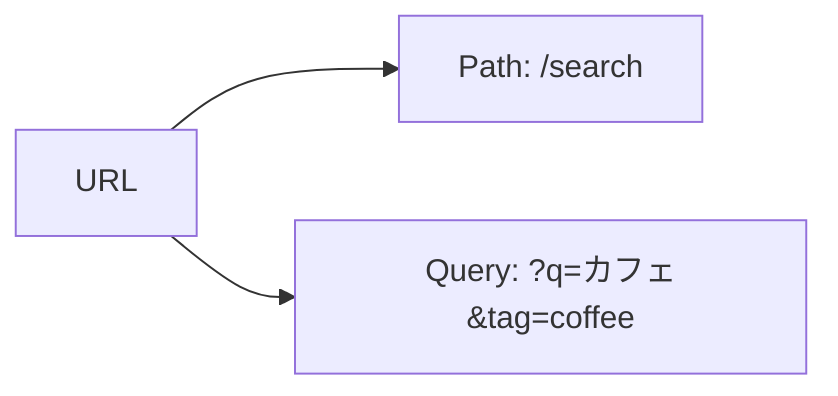
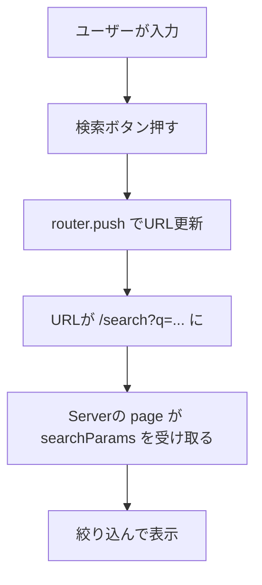
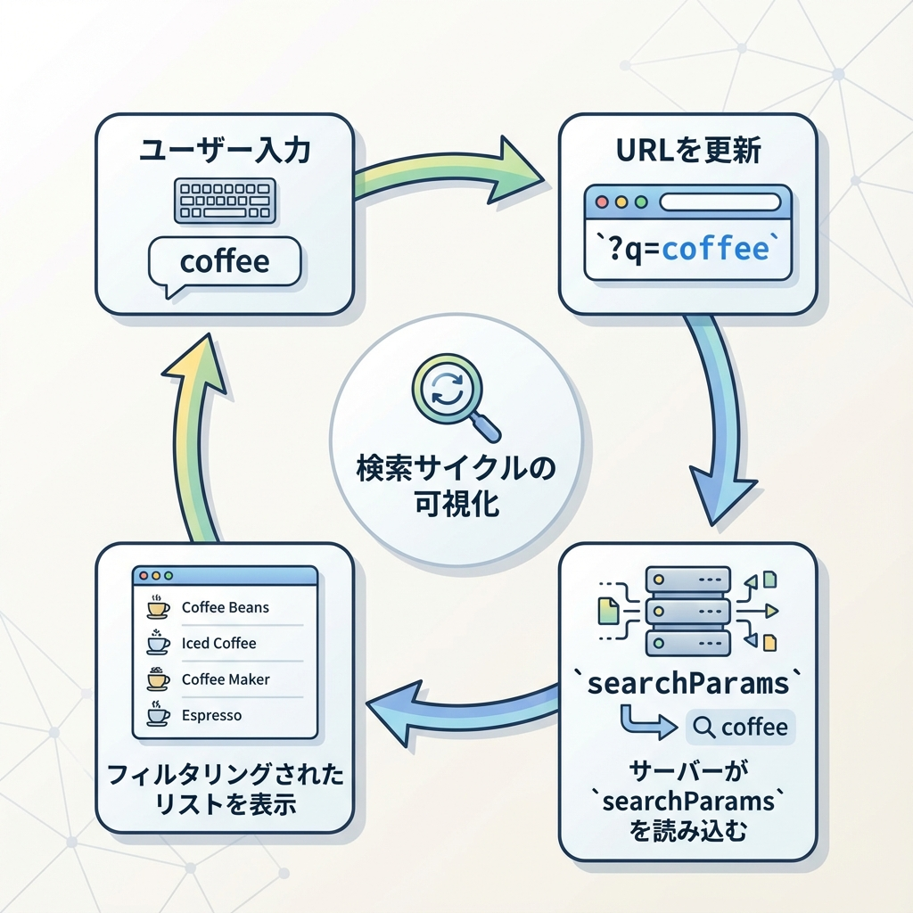

# 第63章：検索パラメータ（`?q=`）を読む🕵️

今回は「URLのうしろに付く検索パラメータ（クエリ）」を読む方法だよ〜！😊
例：

* /search?q=カフェ
* /items?tag=coffee&sort=popular

「検索窓で入力 → URLに反映 → そのURLから表示を変える」っていう、Webっぽさ満点のやつです☕🌸

---

## 1) 検索パラメータってどこ？👀

URLはざっくりこう👇



* **Path**：どのページか（/search とか）
* **Query（検索パラメータ）**：ページ内の条件（q=カフェ とか）✨

---

## 2) Next.js（App Router）で読む方法は2つあるよ✌️💡

### A. ページ（Server Component）で読む：searchParams を受け取る🍵

ページの関数に **searchParams** が渡ってくるよ！

* いいところ：URLを読むだけならシンプル✨
* 使いどころ：検索結果一覧の表示など（サーバー側で絞り込み）🧠

### B. コンポーネント（Client Component）で読む：useSearchParams を使う🎮

検索フォームの入力欄みたいに「ブラウザで動くUI」はこっち！

* いいところ：入力欄とURLを同期しやすい😍
* 注意：Client Component でしか使えないよ（"use client" が必要）⚠️

---

## 3) ミニ実装：検索ページを作ろう🌷🔎

### ✅ ゴール（完成イメージ）

* /search に行く
* 検索欄に入力して「検索」押す
* URLが /search?q=xxxx になる
* その q を読んで「結果」を絞り込んで表示する🎉

---

## 4) フォルダ構成📁✨

* app/search/page.tsx
* components/SearchBox.tsx

（components フォルダが無ければ作ってOKだよ😊）

---

## 5) コードを書く✍️✨

### 5-1) app/search/page.tsx（Serverで searchParams を読む）🍵

```tsx
// app/search/page.tsx
import SearchBox from "@/components/SearchBox";

type SearchParams = Promise<{
  q?: string | string[];
}>;

const ITEMS = [
  "カフェ巡り",
  "コーヒー豆",
  "抹茶ラテ",
  "紅茶専門店",
  "チョコケーキ",
  "朝ごはん",
];

function normalizeParam(value: string | string[] | undefined): string {
  if (Array.isArray(value)) return value[0] ?? "";
  return value ?? "";
}

export default async function Page({ searchParams }: { searchParams: SearchParams }) {
  const { q: rawQ } = await searchParams;
  const q = normalizeParam(rawQ).trim();

  const filtered = q
    ? ITEMS.filter((x) => x.toLowerCase().includes(q.toLowerCase()))
    : ITEMS;

  return (
    <main style={{ padding: 24, fontFamily: "system-ui" }}>
      <h1 style={{ fontSize: 24, marginBottom: 12 }}>検索ページ 🔍✨</h1>

      <SearchBox />

      <p style={{ marginTop: 16 }}>
        今の q： <b>{q || "（未指定）"}</b>
      </p>

      <ul style={{ marginTop: 12, lineHeight: 1.9 }}>
        {filtered.map((item) => (
          <li key={item}>🍰 {item}</li>
        ))}
      </ul>

      {!filtered.length && (
        <p style={{ marginTop: 12 }}>見つからなかったよ〜🥲</p>
      )}
    </main>
  );
}
```

ポイント💡

* **searchParams.q** は「重複した場合」に配列になることがあるので、いちおう安全にしてるよ🧷
* q が空なら全部表示、入ってたら絞り込み✨

---

### 5-2) components/SearchBox.tsx（ClientでURLを読む＆更新する）🎮🧡

```tsx
// components/SearchBox.tsx
"use client";

import { useEffect, useState } from "react";
import { useRouter, useSearchParams } from "next/navigation";

export default function SearchBox() {
  const router = useRouter();
  const searchParams = useSearchParams();

  const qFromUrl = searchParams.get("q") ?? "";
  const [q, setQ] = useState(qFromUrl);

  // URLが変わった時、入力欄も追従させる（戻る/進むでもズレない✨）
  useEffect(() => {
    setQ(qFromUrl);
  }, [qFromUrl]);

  function onSubmit(e: React.FormEvent) {
    e.preventDefault();

    const params = new URLSearchParams(searchParams.toString());

    const nextQ = q.trim();
    if (nextQ) {
      params.set("q", nextQ);
    } else {
      params.delete("q"); // 空なら消してURLをきれいに✨
    }

    const query = params.toString();
    router.push(query ? `/search?${query}` : "/search");
  }

  return (
    <form onSubmit={onSubmit} style={{ display: "flex", gap: 8 }}>
      <input
        value={q}
        onChange={(e) => setQ(e.target.value)}
        placeholder="例：カフェ"
        style={{
          padding: "10px 12px",
          width: 260,
          borderRadius: 10,
          border: "1px solid #ccc",
        }}
      />
      <button
        type="submit"
        style={{
          padding: "10px 14px",
          borderRadius: 10,
          border: "1px solid #ccc",
          cursor: "pointer",
          background: "white",
        }}
      >
        検索 🔎
      </button>
    </form>
  );
}
```

ポイント💡

* **useSearchParams()** は URL の今の状態を読めるよ👀
* URL更新は **router.push()** でOK✨
* **URLSearchParams** を使うと、スペースなどもいい感じにエンコードしてくれるよ🧼

---

## 6) 動きの流れ（図でイメージ）🧠✨





---

## 7) よくあるハマり⚠️😵‍💫

* **useSearchParams を Server Component で使っちゃう**
  → Client Component で使うものだよ〜！（"use client" 必須）🎮

* **検索が空なのに ?q= が残る**
  → params.delete("q") で消すとURLがきれい✨

* **入力欄とURLがズレる（戻る/進むで変）**
  → useEffect で URL の q を state に反映すると安心😊

---

## 8) ミニ練習🎀（すぐできる！）

1つだけ追加してみて〜😍

### 練習A：tag も増やす🏷️

* /search?q=カフェ&tag=drink みたいにして
* tag がある時だけ “ドリンクっぽいものだけ” 出す（雑でOK！笑）☕✨

ヒント：

* Client側：params.set("tag", "drink") みたいに追加
* Server側：searchParams.tag を同じように normalizeParam する

---

これで「URLの ?q= を読む」完璧〜！🎉😊
次の章（第64章）に進むと、見た目の枠を分けたりして、さらにアプリっぽくなっていくよ〜📦✨
