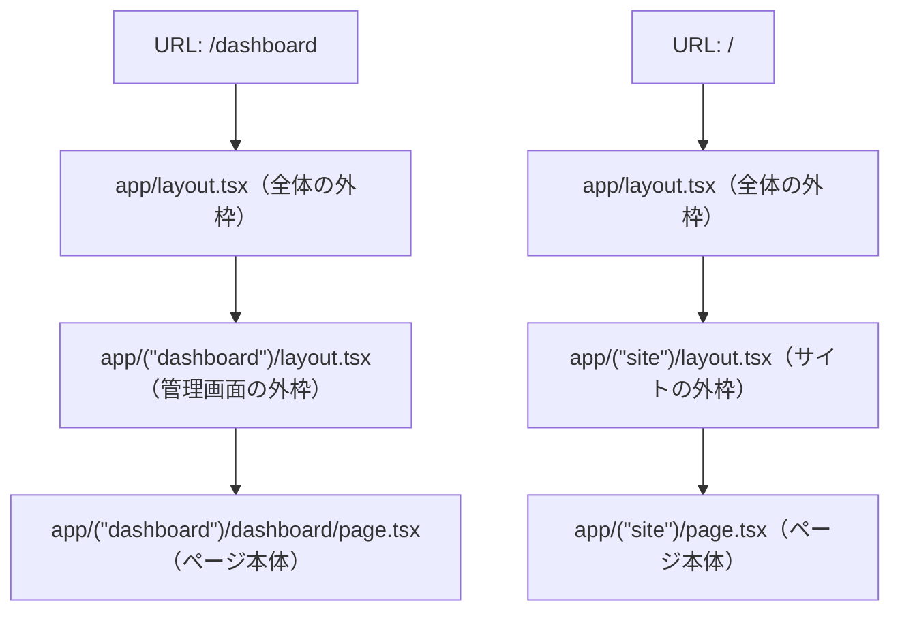
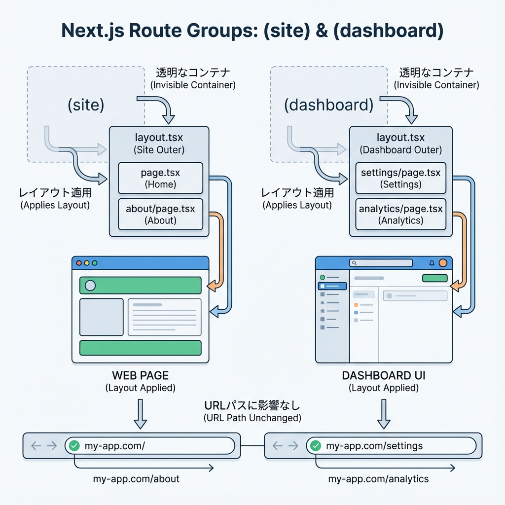

# 第64章：Route Groupで“見た目の枠”を分ける📦

Route Group（ルートグループ）を使うと、**URLはそのまま**なのに、ページの見た目の「外枠（レイアウト）」だけを **区間ごとに変えられる** よ〜！🥳
たとえば…

* 公開ページは「ヘッダー＋フッター」あり 🏠
* 管理画面は「サイドバー」あり 🧑‍💻

みたいに、同じアプリの中で“世界観”を分けられるのが強い💪✨

---

## 1) Route Groupってなに？🤔💡

`app/(site)/...` みたいに **カッコ `( )` のフォルダ**を作ると、それが Route Group 📦

* ✅ **URLには出ない**（ここ大事！）
* ✅ でも **layout.tsx はその区間だけ効く**（ここが目的！）

---

## 2) まずは完成イメージを掴もう👀✨

### ✅ こうしたい（URLは普通のまま）

* `/` は「サイト用レイアウト」🏠
* `/dashboard` は「管理画面レイアウト」🧑‍💻

### ✅ でもフォルダはこう分ける（Route Groupで区間を分ける）

```text
app/
  layout.tsx                 ← 全体の一番外側（ルートレイアウト）
  (site)/
    layout.tsx               ← 公開ページの外枠🏠
    page.tsx                 ← /
    about/
      page.tsx               ← /about
  (dashboard)/
    layout.tsx               ← 管理画面の外枠🧑‍💻
    dashboard/
      page.tsx               ← /dashboard
```

> `(site)` や `(dashboard)` は **見た目の整理用**だから、URLには出ないよ〜！😆✨

---

## 3) 図解：URLと「外枠」の重なり方🧩🏗️





ポイントはこれ👇
**同じ app/layout.tsx の中に、区間ごとの layout.tsx が“追加で重なる”**感じだよ〜！🧁✨

---

## 4) 実装してみよう！🛠️✨

### 4-1) ルートレイアウト（全ページ共通）🧱

`app/layout.tsx`

```tsx
export default function RootLayout({
  children,
}: {
  children: React.ReactNode;
}) {
  return (
    <html lang="ja">
      <body style={{ margin: 0, fontFamily: "system-ui" }}>
        {children}
      </body>
    </html>
  );
}
```

---

### 4-2) 公開ページ用レイアウト（site）🏠🌸

`app/(site)/layout.tsx`

```tsx
import Link from "next/link";

export default function SiteLayout({ children }: { children: React.ReactNode }) {
  return (
    <div>
      <header style={{ padding: 16, borderBottom: "1px solid #ddd" }}>
        <nav style={{ display: "flex", gap: 12 }}>
          <Link href="/">Home</Link>
          <Link href="/about">About</Link>
          <Link href="/dashboard">Dashboard</Link>
        </nav>
      </header>

      <main style={{ padding: 16 }}>{children}</main>

      <footer style={{ padding: 16, borderTop: "1px solid #ddd" }}>
        <small>© My App 🌷</small>
      </footer>
    </div>
  );
}
```

---

### 4-3) 管理画面用レイアウト（dashboard）🧑‍💻🪟

`app/(dashboard)/layout.tsx`

```tsx
import Link from "next/link";

export default function DashboardLayout({
  children,
}: {
  children: React.ReactNode;
}) {
  return (
    <div style={{ display: "flex", minHeight: "100vh" }}>
      <aside
        style={{
          width: 220,
          padding: 16,
          borderRight: "1px solid #ddd",
        }}
      >
        <h2 style={{ marginTop: 0 }}>管理メニュー🧑‍💻</h2>
        <ul style={{ paddingLeft: 16 }}>
          <li>
            <Link href="/dashboard">Dashboard</Link>
          </li>
          <li>
            <Link href="/">サイトへ戻る🏠</Link>
          </li>
        </ul>
      </aside>

      <main style={{ padding: 16, flex: 1 }}>{children}</main>
    </div>
  );
}
```

---

### 4-4) ページも用意しよう📄✨

`app/(site)/page.tsx`

```tsx
export default function HomePage() {
  return (
    <div>
      <h1>ホームだよ〜🏠✨</h1>
      <p>ここは公開ページ用のレイアウトが当たってるよ🌸</p>
    </div>
  );
}
```

`app/(site)/about/page.tsx`

```tsx
export default function AboutPage() {
  return (
    <div>
      <h1>Aboutだよ〜📝✨</h1>
      <p>URLは /about だけど、(site) の中にあるよ📦</p>
    </div>
  );
}
```

`app/(dashboard)/dashboard/page.tsx`

```tsx
export default function DashboardPage() {
  return (
    <div>
      <h1>ダッシュボード📊✨</h1>
      <p>ここは管理画面用レイアウト（サイドバー付き）だよ🪟</p>
    </div>
  );
}
```

---

## 5) ここが大事！Route Groupの“勘違いあるある”😵‍💫➡️😆

### ✅ URLに `(site)` は入らない

* フォルダは `app/(dashboard)/dashboard/page.tsx`
* でもURLは **`/dashboard`** だよ！✨

### ✅ LinkもURLだけ書く

* `href="/dashboard"` ✅
* `href="/(dashboard)/dashboard"` ❌（そんなURLは存在しないよ〜😂）

---

## 6) ミニ練習🎯✨（5分でできる）

### 練習①：管理画面に「設定」ページを追加しよう⚙️😊

目標：`/settings` を作って、**管理画面レイアウト**を当てる！

ヒント：こういう構成にするとOK👇

```text
app/
  (dashboard)/
    settings/
      page.tsx     ← /settings だけど管理レイアウトが当たる✨
```

`app/(dashboard)/settings/page.tsx` は好きな文章でOKだよ〜🫶✨

---

## 7) まとめ🎁✨

* Route Group `(xxx)` は **URLに出ない整理フォルダ**📦
* でも **layout.tsx を区間ごとに当てられる**から、

  * 公開サイト🏠
  * 管理画面🧑‍💻
    みたいに「見た目の枠」を分けるのに超便利〜！🥰💕

次に進むと、もっと強い“同時表示”とか“モーダル遷移”みたいな世界も出てくるんだけど…
第64章はまず「区間ごとの外枠を切り替える」ここがゴールだよ〜！🎉✨
