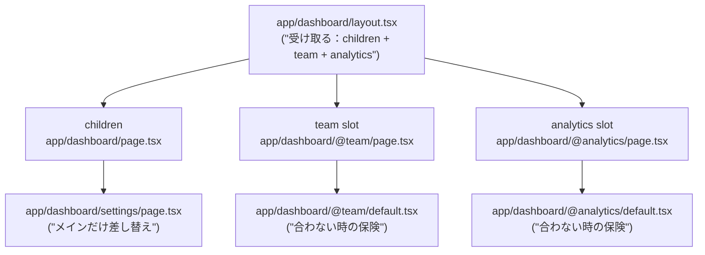
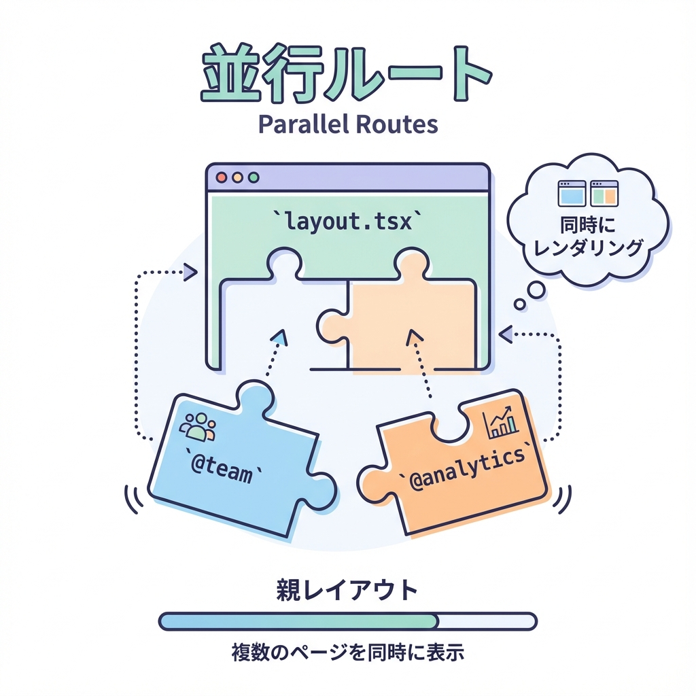

# 第65章：Parallel Routes の考え方（ダッシュボードに強い）🪟

ダッシュボードって、「メイン」「右の通知」「左のメニュー」みたいに、**1画面に複数のエリア**が並びがちだよね😊
Parallel Routes（パラレルルート）は、その複数エリアを **“それぞれ別ルート”として同時に描画できる仕組み**だよ〜！🧩✨ ([Next.js][1])

---

## 1) Parallel Routes ってなに？🧠💡

* ふつうのルーティング：`/dashboard` は 1つのページ（ツリー）で構成される
* Parallel Routes：`/dashboard` の中で **複数のページ（ツリー）を同時に表示**できる

  * 例：`team` パネルと `analytics` パネルを同じ画面で並べる🪟🪟 ([Next.js][1])

そして、Parallel Routes は **“スロット（slot）”** という考え方で作るよ👇
スロットは `@folder` で作って、同じ階層の `layout.tsx` に **props として渡される**のがポイント！🎁 ([Next.js][1])

---

## 2) イメージ図（スロットが layout に刺さる）🧩➡️🧱





---

## 3) 最重要ルール3つだけ覚えよ〜📌✨

### ✅ ルール①：`@xxx` フォルダが “スロット” 🌟

* `@team` とか `@analytics` とかね！ ([Next.js][1])

### ✅ ルール②：スロット名は **URLに出ない**😳

* `@team/members` を作っても、URLは `.../members` みたいに見える（`@team` はURLに入らない） ([Next.js][1])

### ✅ ルール③：`default.tsx` は “保険” 🛟

「そのURLに対するページがスロット側に無い」時、
**リロード（F5）すると default が必要**になることがあるよ！無いと 404 になることも😱 ([Next.js][1])

---

## 4) ハンズオン：ミニダッシュボードを作ろう〜！🏗️🎉

### フォルダ構成（まずこれを作る）📁✨

```txt
app/
  dashboard/
    dashboard.module.css
    layout.tsx
    page.tsx
    settings/
      page.tsx

    @team/
      page.tsx
      default.tsx

    @analytics/
      page.tsx
      loading.tsx
      error.tsx
      default.tsx
```

---

### 4-1) `app/dashboard/layout.tsx`（3カラムで並べる）🪟🪟🪟

```tsx
import styles from './dashboard.module.css'

export default function DashboardLayout({
  children,
  team,
  analytics,
}: {
  children: React.ReactNode
  team: React.ReactNode
  analytics: React.ReactNode
}) {
  return (
    <div className={styles.wrap}>
      <header className={styles.header}>
        <h1 className={styles.title}>Dashboard 🪟✨</h1>
        <p className={styles.sub}>Parallel Routes で 3エリア同時表示 💖</p>
      </header>

      <div className={styles.grid}>
        <main className={styles.main}>
          <h2 className={styles.h2}>Main 🧡</h2>
          {children}
        </main>

        <aside className={styles.panel}>
          <h2 className={styles.h2}>Team 👥</h2>
          {team}
        </aside>

        <aside className={styles.panel}>
          <h2 className={styles.h2}>Analytics 📊</h2>
          {analytics}
        </aside>
      </div>
    </div>
  )
}
```

---

### 4-2) `app/dashboard/dashboard.module.css`（見た目かる〜く）💅✨

```css
.wrap {
  padding: 16px;
  font-family: system-ui, -apple-system, "Segoe UI", sans-serif;
}

.header {
  margin-bottom: 12px;
}

.title {
  margin: 0;
  font-size: 22px;
}

.sub {
  margin: 4px 0 0;
  color: #666;
}

.grid {
  display: grid;
  grid-template-columns: 1.6fr 1fr 1fr;
  gap: 12px;
  align-items: start;
}

.main, .panel {
  border: 1px solid #ddd;
  border-radius: 12px;
  padding: 12px;
  background: #fff;
}

.h2 {
  margin: 0 0 8px;
  font-size: 16px;
}
```

---

### 4-3) `app/dashboard/page.tsx`（メイン枠：/dashboard）🏠✨

```tsx
import Link from 'next/link'

export default function DashboardPage() {
  return (
    <div>
      <p>ここはメインエリアだよ〜😊🧡</p>

      <ul>
        <li>
          <Link href="/dashboard/settings">設定ページへ ⚙️➡️</Link>
        </li>
        <li>
          <Link href="/dashboard">ダッシュボードTOPへ 🏠</Link>
        </li>
      </ul>

      <p style={{ marginTop: 12 }}>
        💡 右の2つ（Team/Analytics）は、同時に別スロットで描画されてるよ🪟✨
      </p>
    </div>
  )
}
```

---

### 4-4) `@team` スロット（常に出したいパネル）👥✨

`app/dashboard/@team/page.tsx`

```tsx
export default function TeamPanel() {
  return (
    <div>
      <p>チームの今日の予定だよ〜📅✨</p>
      <ul>
        <li>ゼミ：13:00〜 📚</li>
        <li>ミーティング：16:00〜 🧑‍💻</li>
      </ul>
    </div>
  )
}
```

`app/dashboard/@team/default.tsx`

```tsx
export default function TeamDefault() {
  return <p>Teamパネルはこの画面では省略だよ🙂🛟</p>
}
```

---

### 4-5) `@analytics` スロット（わざと “遅い” パネル）📊⏳

`app/dashboard/@analytics/page.tsx`

```tsx
function sleep(ms: number) {
  return new Promise((r) => setTimeout(r, ms))
}

export default async function AnalyticsPanel() {
  // デモ用：わざと遅くするよ〜⏳（本番で多用はしないでね）
  await sleep(1200)

  return (
    <div>
      <p>アクセス解析だよ〜📊✨</p>
      <ul>
        <li>PV：1,234 👀</li>
        <li>UU：456 🙋‍♀️</li>
        <li>直帰率：38% 🏃‍♀️</li>
      </ul>
    </div>
  )
}
```

`app/dashboard/@analytics/loading.tsx`（このスロットだけローディング出せる！）🫧

```tsx
export default function AnalyticsLoading() {
  return <p>解析データ読み込み中…⏳📊</p>
}
```

`app/dashboard/@analytics/error.tsx`（このスロットだけエラーUI）🧯

```tsx
'use client'

export default function AnalyticsError({
  error,
  reset,
}: {
  error: Error
  reset: () => void
}) {
  return (
    <div>
      <p>うわっ…解析パネルでエラー🥺🧯</p>
      <p style={{ color: '#666' }}>{error.message}</p>
      <button onClick={() => reset()}>もう一回やる🔁✨</button>
    </div>
  )
}
```

`app/dashboard/@analytics/default.tsx`（保険🛟）
※ `default` は「初回ロードやリロード時に、合わないスロットをどうする？」のための fallback だよ〜！ ([Next.js][1])

```tsx
export default function AnalyticsDefault() {
  return <p>この画面では解析パネルはお休み〜🙂🛟</p>
}
```

---

### 4-6) `/dashboard/settings`（メインだけ切り替える）⚙️✨

`app/dashboard/settings/page.tsx`

```tsx
import Link from 'next/link'

export default function DashboardSettings() {
  return (
    <div>
      <p>設定ページだよ〜⚙️✨</p>
      <p>ここではメインだけが差し替わるイメージ！😊</p>
      <Link href="/dashboard">戻る🏠⬅️</Link>
    </div>
  )
}
```

---

## 5) 動かして確認しよ〜！🧪💻

1. `npm run dev` で起動 ▶️
2. `http://localhost:3000/dashboard` を開く🏠
3. 右の Analytics が **遅れて出る**（loading が先に出る）⏳📊
4. 「設定ページへ⚙️➡️」を押して `.../dashboard/settings` に移動
5. そのまま **F5でリロード**してみてね

   * スロット側に該当ページが無い時、`default.tsx` が表示されることがあるよ🛟✨ ([Next.js][1])

---

## 6) 「え、なんで便利なの？」まとめ🧁✨

Parallel Routes がダッシュボードに強い理由はこれ👇

* ✅ **同じ画面に複数エリアを同時表示できる**（team と analytics を並べる、みたいに） ([Next.js][1])
* ✅ **スロットごとに loading / error を分けられる**（解析だけ待つ、解析だけ落ちても他は生きる） ([Next.js][1])
* ✅ クライアント遷移（Linkで移動）では、スロットごとに “表示状態” を保持しやすい（挙動の違いは docs の Behavior 参照） ([Next.js][1])

---

## 7) ちょい注意ポイント⚠️🐣

* スロットは **URLに出ない**から、フォルダを見て「どこが表示に刺さるか」を意識すると迷子になりにくいよ🗺️✨ ([Next.js][1])
* 同じ階層で、片方だけ静的・片方だけ動的…みたいな混在はできないケースがあるよ（同レベルのスロットはまとめて扱われる）🧊⚡ ([Next.js][1])

---

## 8) ミニ確認クイズ（3問）📝💖

1. `@analytics` は URL に出る？出ない？😳
2. スロットの中身は `layout.tsx` に何として渡される？🎁
3. リロードしたとき、合わないスロットの保険になるファイルは？🛟

（答え：1) 出ない 2) props 3) `default.tsx` / `default.js`） ([Next.js][1])

[1]: https://nextjs.org/docs/app/api-reference/file-conventions/parallel-routes "File-system conventions: Parallel Routes | Next.js"
