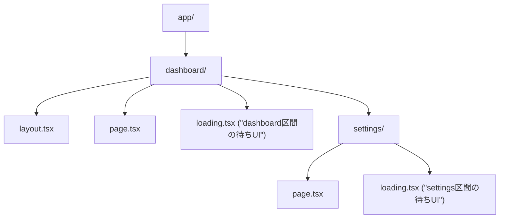
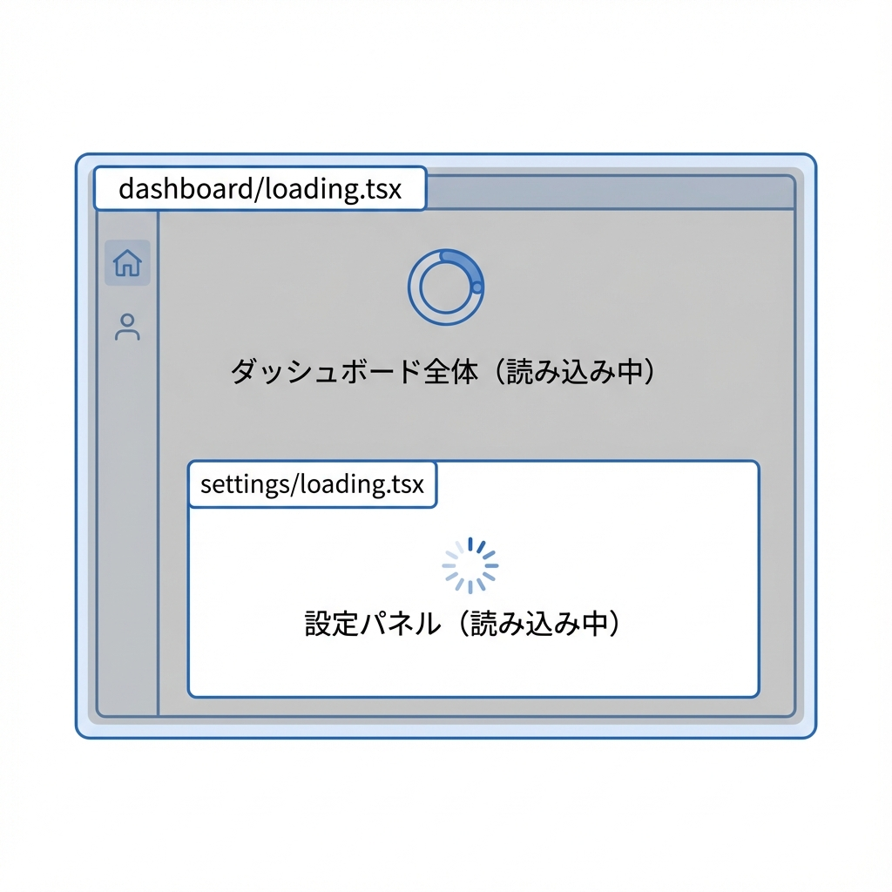
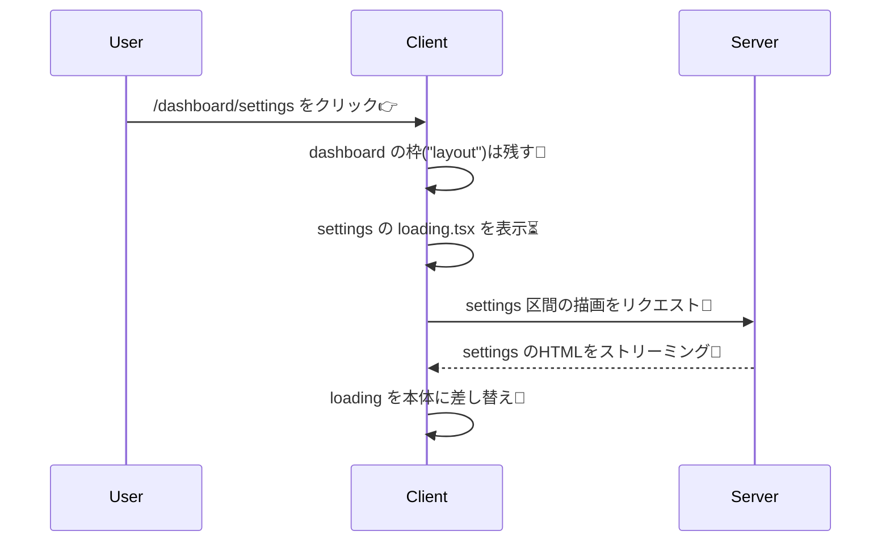

# 第67章：`loading.tsx` を“区間ごと”に置く⏳

この章では、**ページ全体じゃなくて「この部分だけ待ってね〜」**を作れるようにするよ〜！🥰
Next.js の App Router は、フォルダ（＝区間/セグメント）ごとに `loading.tsx` を置けるのが強いんだ〜✨

---

## 1) 「区間（セグメント）」ってなに？🧩

App Router では、`app/` 配下の **フォルダ1個 = だいたい1区間（Route Segment）** だよ📁
その区間が表示されるとき、**中の Server Component が待ち（suspend）**になると、`loading.tsx` が “待ち画面” として出せるよ〜⏳✨ ([Next.js][1])

---

## 2) `loading.tsx` の超ルール✅

* `app/○○/loading.tsx` を置くと、**その区間（○○）の読み込み中**に表示される⏳
* さらにネストした `app/○○/△△/loading.tsx` を置くと、**もっと内側の区間だけ**に効かせられる🪄
* `loading.tsx` は **自動で Suspense 境界を作ってくれる**（だから簡単！）✨ ([Next.js][2])

---

## 3) 図でイメージしよう🧠✨（どこに置くと、どこが待つ？）





ポイントはこれ👇✨

* `/dashboard` に行く → **dashboard/loading.tsx** が効く⏳
* `/dashboard/settings` に行く → **settings/loading.tsx** が効いて、外側（dashboardの枠）は残りやすい🧡

---

## 4) ハンズオン：区間ごとローディングを体験しよう🎮✨

### ゴール🏁

* `/dashboard` は dashboard の待ちUI
* `/dashboard/settings` は settings の待ちUI
  をそれぞれ見えるようにするよ〜！👀💕

---

### 手順A：ページを用意する📄

#### ① `app/page.tsx`（入口ページ）

```tsx
import Link from "next/link";

export default function Home() {
  return (
    <main style={{ padding: 24, fontFamily: "system-ui" }}>
      <h1>デモ：区間ごと loading.tsx ⏳</h1>

      <ul style={{ lineHeight: 2 }}>
        <li>
          <Link href="/dashboard" prefetch={false}>
            /dashboard へ行く👉
          </Link>
        </li>
        <li>
          <Link href="/dashboard/settings" prefetch={false}>
            /dashboard/settings へ行く👉
          </Link>
        </li>
      </ul>

      <p style={{ marginTop: 16, opacity: 0.8 }}>
        ※ prefetch を切ると、ローディングが目で見えやすいよ〜👀✨
      </p>
    </main>
  );
}
```

> `prefetch={false}` は「先読みしないでね」の指定だよ🫶
> 先読みがあると速すぎて、ローディングが一瞬で終わって見えないことがあるの🥹 ([Next.js][3])

---

### 手順B：`/dashboard` 区間を作る📁

#### ② `app/dashboard/layout.tsx`（枠）

```tsx
export default function DashboardLayout({
  children,
}: {
  children: React.ReactNode;
}) {
  return (
    <section style={{ padding: 24, borderTop: "1px solid #ddd" }}>
      <header style={{ marginBottom: 12 }}>
        <strong>Dashboard の枠だよ🧱✨</strong>
      </header>
      {children}
    </section>
  );
}
```

#### ③ `app/dashboard/page.tsx`（わざと遅くする🐢）

```tsx
const wait = (ms: number) => new Promise((r) => setTimeout(r, ms));

export default async function DashboardPage() {
  await wait(1500); // わざと遅延🐢

  return (
    <div>
      <h2>/dashboard 📊</h2>
      <p>読み込み終わったよ〜！🎉</p>
    </div>
  );
}
```

#### ④ `app/dashboard/loading.tsx`（dashboard区間の待ちUI⏳）

```tsx
export default function LoadingDashboard() {
  return (
    <div style={{ padding: 24 }}>
      <p style={{ fontSize: 18 }}>Dashboard を読み込み中…⏳✨</p>
      <p style={{ opacity: 0.7 }}>ちょっと待ってね〜☺️</p>
    </div>
  );
}
```

---

### 手順C：もっと内側の `/dashboard/settings` 区間を作る🪄

#### ⑤ `app/dashboard/settings/page.tsx`（さらに遅くする🐢）

```tsx
const wait = (ms: number) => new Promise((r) => setTimeout(r, ms));

export default async function SettingsPage() {
  await wait(2000); // さらに遅延🐢🐢

  return (
    <div>
      <h2>/dashboard/settings ⚙️</h2>
      <p>設定ページだよ〜！🎀</p>
    </div>
  );
}
```

#### ⑥ `app/dashboard/settings/loading.tsx`（settings区間だけの待ちUI⏳）

```tsx
export default function LoadingSettings() {
  return (
    <div style={{ padding: 24 }}>
      <p style={{ fontSize: 18 }}>設定を読み込み中…⚙️⏳</p>
      <p style={{ opacity: 0.7 }}>ここだけ先に待ち表示できるのが強い✨</p>
    </div>
  );
}
```

---

## 5) 「区間ごと」だと何がうれしいの？🥰

たとえば `/dashboard/settings` に移動するとき👇
**Dashboard の枠（layout）は残しつつ、settings 部分だけ loading にできる**から、体感がめちゃ良くなるよ〜✨ ([Next.js][1])



---

## 6) よくある「見えない！」問題あるある🥹🧯

* **速すぎて見えない**：prefetch やキャッシュで一瞬で終わることあるよ〜💨
  → `prefetch={false}` で確認がラク👀 ([Next.js][3])
* **ファイル名ミス**：`loading.tsx`（綴り大事！）
* **どこに置けばいいか迷子**：
  → “待たせたい区間のフォルダ直下” に置く！📁✨ ([Next.js][1])
* **Route Group `(group)` を使ってる**：URLに出ないけど、整理用フォルダとして使えるよ📦（もちろんこの中に `loading.tsx` も置ける） ([Next.js][4])

---

## 7) ミニチェック（3問）📝✨

1. `app/dashboard/loading.tsx` は、どの区間の待ちUI？🤔
2. `/dashboard/settings` を “settingsだけ” ローディングにしたい時、どこに `loading.tsx` を置く？📁
3. ローディングが見えない時に、まず疑うといいのは？💨

（答え）

1. dashboard 区間
2. `app/dashboard/settings/loading.tsx`
3. prefetch/キャッシュで速すぎる、ファイル位置ミス、ファイル名ミス など！

---

## まとめ🎀

* `loading.tsx` は **フォルダ（区間）ごと**に置ける⏳✨
* ネストすればするほど、**“必要な場所だけ待たせる”** ができてUXが良くなる🫶
* `prefetch={false}` で挙動確認もしやすいよ👀💕 ([Next.js][3])

[1]: https://nextjs.org/docs/app/api-reference/file-conventions/loading?utm_source=chatgpt.com "File-system conventions: loading.js"
[2]: https://nextjs.org/learn/dashboard-app/streaming?utm_source=chatgpt.com "Streaming - App Router"
[3]: https://nextjs.org/docs/app/guides/prefetching?utm_source=chatgpt.com "Guides: Prefetching"
[4]: https://nextjs.org/docs/app/api-reference/file-conventions/route-groups?utm_source=chatgpt.com "File-system conventions: Route Groups"
