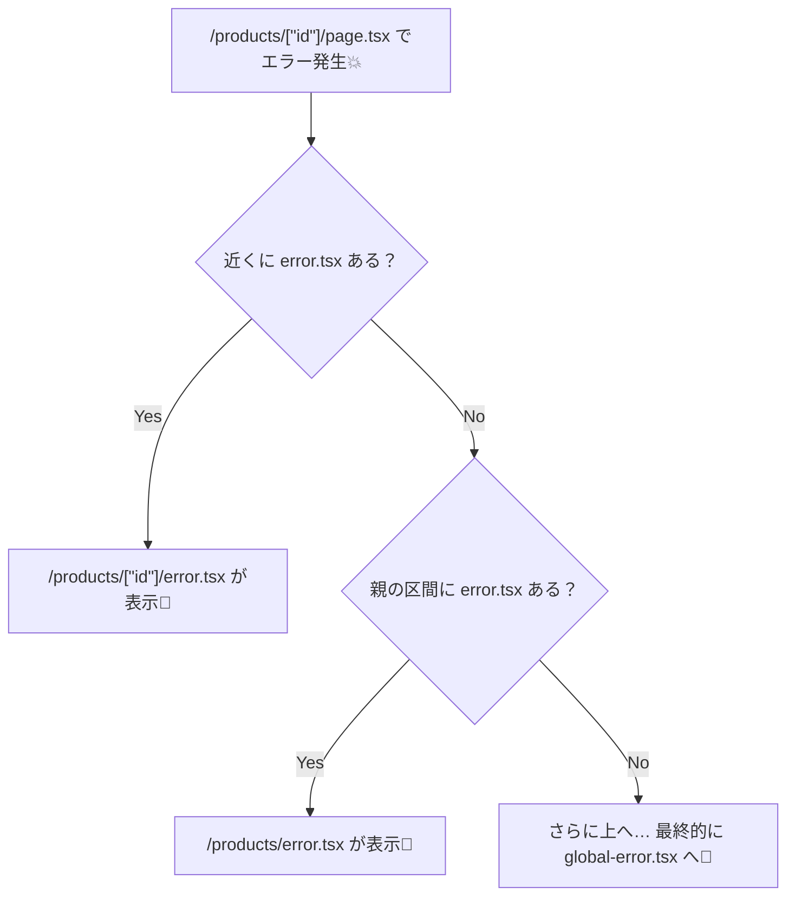
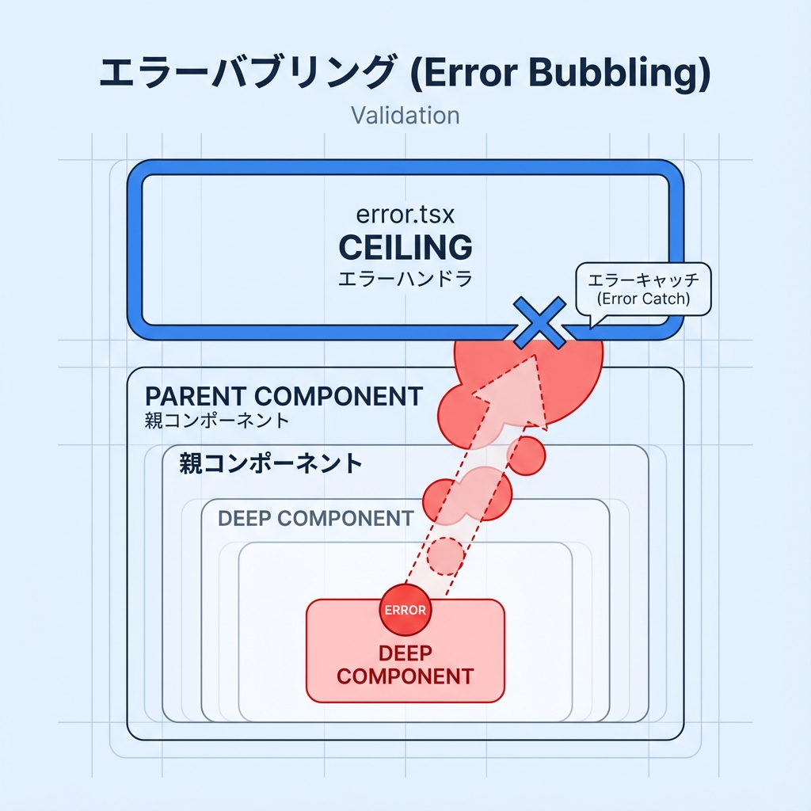

# 第68章：エラー境界を“区間ごと”に置く🧯

Next.js（App Router）のエラー処理って、ざっくり言うと **「フォルダ（= ルートセグメント）ごとに、守れる」** んだよね😊
そのために使うのが **`error.tsx`**（= その区間専用のエラー画面）だよ〜！🧸 ([Next.js][1])

---

### 1) “区間（ルートセグメント）”ってなに？🧩

App Routerでは、`app/` 配下の **フォルダが区間（セグメント）** になりやすいよ📁✨
そして **その区間の中で起きた予期せぬエラー（throwされたエラー）** は、**いちばん近い `error.tsx`** が受け止めるの！🧯 ([Next.js][1])

---

### 2) “区間ごと”に置くメリット💡

* ✅ **壊れた場所だけ** エラー表示にできる（他の部分は普通に動く）🫶
* ✅ 「商品詳細だけ落ちた」みたいな時も、一覧ページやヘッダーは生き残れる✨
* ✅ エラー画面に **「再試行ボタン」** も付けられる🔁 ([Next.js][2])

---

### 3) エラーが「どこに吸い込まれるか」図解🗺️（Mermaid）





ポイントはこれ👇
**エラーは「いちばん近い親のエラー境界」まで“泡のように上に上がる”**よ🫧 ([Next.js][1])

---

## 4) ハンズオン：`error.tsx` を区間ごとに置いてみよう🎮✨

### ゴール🎯

* `/products` は **一覧**
* `/products/1` は **詳細**
* 詳細がコケても、**影響を最小化**できるようにする🧯

---

### (1) フォルダ構成を作る📁

こんな感じにするよ👇

```txt
app/
  products/
    page.tsx
    error.tsx
    [id]/
      page.tsx
      error.tsx
```

---

### (2) 一覧ページ：`app/products/page.tsx` 🛒

```tsx
export default function ProductsPage() {
  return (
    <main style={{ padding: 24 }}>
      <h1>Products 🛍️</h1>
      <ul>
        <li><a href="/products/1">Product 1</a></li>
        <li><a href="/products/2">Product 2</a></li>
      </ul>
      <p>※ ここは普通に表示されるはず😊</p>
    </main>
  );
}
```

---

### (3) 詳細ページ：`app/products/[id]/page.tsx` 🔍

「わざとエラー」を起こして、境界が効くのを体験するよ💥

```tsx
export default async function ProductDetailPage({
  params,
}: {
  params: Promise<{ id: string }>;
}) {
  const { id } = await params;

  // わざと落とす（例：id=2 のときだけ落ちる）
  if (id === "2") {
    throw new Error("在庫情報の取得に失敗しました💥（デモ）");
  }

  return (
    <main style={{ padding: 24 }}>
      <h1>Product Detail 🔎</h1>
      <p>id: {id}</p>
      <p>ここは正常表示✨</p>
    </main>
  );
}
```

---

### (4) products区間のエラー境界：`app/products/error.tsx` 🧯

ここが **`/products` 配下の“ざっくり保険”** になるよ！

```tsx
"use client";

import { useEffect } from "react";

export default function ProductsError({
  error,
  reset,
}: {
  error: Error & { digest?: string };
  reset: () => void;
}) {
  useEffect(() => {
    console.error("[products error]", error);
  }, [error]);

  return (
    <main style={{ padding: 24 }}>
      <h2>Productsエリアで問題が発生したよ🥲🧯</h2>
      <p style={{ opacity: 0.8 }}>
        ちょっとした通信ミスかも！よかったら再試行してみてね🔁
      </p>

      <button
        onClick={() => reset()}
        style={{ padding: "8px 12px", marginTop: 12 }}
      >
        もう一回ためす🔁
      </button>
    </main>
  );
}
```

* `error.tsx` は **Client Component 必須** だから、先頭に `"use client"` がいるよ⚠️ ([Next.js][2])
* `reset()` は **その区間の再レンダリングを試す** ボタンにできるよ🔁 ([Next.js][2])

---

### (5) detail区間のエラー境界：`app/products/[id]/error.tsx` 🎯

ここが今回の主役！✨
**詳細ページだけのエラーを、詳細ページだけで受け止める**よ🧯

```tsx
"use client";

export default function ProductDetailError({
  error,
  reset,
}: {
  error: Error & { digest?: string };
  reset: () => void;
}) {
  return (
    <main style={{ padding: 24 }}>
      <h2>この商品ページだけ表示できなかったよ😵‍💫🧯</h2>
      <p style={{ opacity: 0.8 }}>
        ほかのページは見られるから安心してね🫶
      </p>

      <details style={{ marginTop: 12 }}>
        <summary>開発中だけ：エラー内容を見る👀</summary>
        <pre style={{ whiteSpace: "pre-wrap" }}>{error.message}</pre>
      </details>

      <button
        onClick={() => reset()}
        style={{ padding: "8px 12px", marginTop: 12 }}
      >
        再読み込みしてみる🔁
      </button>

      <p style={{ marginTop: 16 }}>
        <a href="/products">← 一覧へ戻る🛒</a>
      </p>
    </main>
  );
}
```

---

### (6) 動作チェック✅

開発サーバを起動して…

```bash
npm run dev
```

ブラウザでここを見てね👇

```txt
http://localhost:3000/products/1  → 正常✨
http://localhost:3000/products/2  → [id]/error.tsx が出る🧯
http://localhost:3000/products    → 一覧は普通に生きてる🫶
```

---

## 5) よくあるハマりどころ🥺（ここ超だいじ！）

### ✅ ① `error.tsx` に `"use client"` を付け忘れる

→ エラー境界はClient Component必須だよ⚠️ ([Next.js][2])

### ✅ ② 「クリックした時のエラー」が捕まらない

Error Boundary（= `error.tsx`）は **レンダリング中のエラー** を捕まえる仕組みで、**イベントハンドラの中のエラーは捕まえない**よ🙅‍♀️
クリック処理は `try/catch` で自分で握って `useState` とかで表示してあげてね🧸 ([Next.js][1])

---

## 6) どこに置くのが正解？置き方のコツ📍✨

迷ったらこの2つだけ覚えよ😊

* 🧯 **ユーザーが戻れる単位**で置く
  （例：詳細が落ちても“一覧へ戻る”ができる）
* ✂️ **小さく分けすぎない**
  （最初は「機能ごと」くらいでOK：`/products`, `/dashboard`, `/settings` など）

---

## 7) さらに最後の保険：`global-error.tsx`（知識だけ）🧯🌍

もし「アプリ全体が死ぬ」系のときは、`app/global-error.tsx` で最終防衛もできるよ（`<html><body>` が必要）🛡️ ([Next.js][2])

---

## 8) ミニ確認クイズ🎓✨

1. エラーはどの `error.tsx` に捕まる？
   → **いちばん近い親のエラー境界**🫧 ([Next.js][1])

2. `error.tsx` の先頭に必要な一言は？
   → `"use client"` 🧯 ([Next.js][2])

3. `reset()` は何をしてくれる？
   → **その区間の再レンダリングを試す**🔁 ([Next.js][2])

---

ここまでできたら、第68章はクリアだよ〜！🎉🧯✨

[1]: https://nextjs.org/docs/app/getting-started/error-handling "Getting Started: Error Handling | Next.js"
[2]: https://nextjs.org/docs/app/api-reference/file-conventions/error "File-system conventions: error.js | Next.js"
