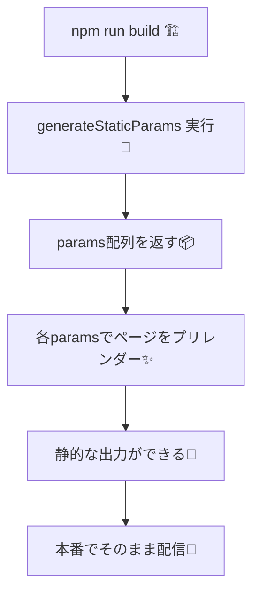

# 第69章：`generateStaticParams` の役割（静的生成）🧊

## 今日はここがゴールだよ🎯💖

* `/posts/[slug]` みたいな **動的URL** を、**ビルド時に“静的ページ”として先に作れる**ようになる🙌
* 「このslug一覧は決まってるよ！」って Next.js に教える方法がわかる🧠✨
* ついでに「一覧にないURLは404にする」設定もできるようになる🚪❌ ([Next.js][1])

---

## `generateStaticParams` ってなに？🤔🧊

動的ルート（例：`app/posts/[slug]/page.tsx`）に対して、**どの `slug` のページを作るか（= パラメータ一覧）を返す関数**だよ✨
これがあると Next.js は **ビルド時にその分のページを先に作ってくれる**の！速いし安定しやすい〜🚀💖 ([Next.js][1])

### ざっくり一言でいうと…📌

「`/posts/ai`, `/posts/react`, `/posts/nextjs` を静的に作っておいてね〜！」って宣言する係🧊✨ ([Next.js][1])

---

## 図でイメージするよ🧩🧊（Mermaid）




---

## 実例：ミニブログを“静的に”作ってみよう📝✨

### 1) 投稿データ（固定リスト）を用意する📚

`src/lib/posts.ts` を作ってね（場所は自由だけど、こうすると分かりやすいよ😊）

```ts
// src/lib/posts.ts
export type Post = {
  slug: string
  title: string
  body: string
}

export const posts: Post[] = [
  { slug: "react", title: "Reactのはじめ方", body: "Reactたのしい〜！" },
  { slug: "nextjs", title: "Next.js入門", body: "ルーティング最高！" },
  { slug: "ts", title: "TypeScript基礎", body: "型があると安心！" },
]
```

---

### 2) 動的ルートを作る：`app/posts/[slug]/page.tsx` 🛣️✨

ここが本題っ💡
`generateStaticParams` が **`[{ slug: "react" }, ...]` みたいな配列**を返すのがポイントだよ🧊📦 ([Next.js][1])

```tsx
// app/posts/[slug]/page.tsx
import { notFound } from "next/navigation"
import { posts } from "@/lib/posts"

export function generateStaticParams() {
  return posts.map((p) => ({ slug: p.slug }))
}

// ✅ 一覧にないslugは 404 にしたいならこれ！
export const dynamicParams = false

export default async function Page({
  params,
}: {
  params: Promise<{ slug: string }>
}) {
  const { slug } = await params

  const post = posts.find((p) => p.slug === slug)
  if (!post) notFound()

  return (
    <main style={{ padding: 24 }}>
      <h1>{post.title}</h1>
      <p>{post.body}</p>
    </main>
  )
}
```

#### ここ、超だいじポイント3つ🧠✨

* `generateStaticParams` は **配列を返す**（空でも配列！）→ そうじゃないと動的扱いになっちゃうことがあるよ⚠️ ([Next.js][1])
* 戻り値のキー名は **`[slug]` なら `slug`**！一致してないと作れない🥲 ([Next.js][1])
* `export const dynamicParams = false` を付けると、**一覧にないURLは404**になるよ🚪❌ ([Next.js][1])

---

## 動かして確認しよ〜🪄✨（Windows想定）

### 開発で見る👀

1. PowerShell でプロジェクトへ移動📁
2. 起動🎮

```bash
npm run dev
```

ブラウザで👇を開いてみてね😊

* `http://localhost:3000/posts/react` ✅
* `http://localhost:3000/posts/nextjs` ✅
* `http://localhost:3000/posts/unknown` → `dynamicParams = false` なら **404** になるはず🚪❌

### ビルドで「静的生成」を体験🏗️🧊

```bash
npm run build
```

ビルド中に `generateStaticParams` が使われて、指定した分のページが作られるイメージだよ✨ ([Next.js][1])

---

## よくあるミスあるある😵‍💫（先に回避しよ！）

* `return posts.map(p => ({ id: p.slug }))` みたいに **キー名を間違える**（`slug` じゃないとダメ）🥲
* `generateStaticParams` を書いたのに、**配列を返してない**（必ず配列！）⚠️ ([Next.js][1])
* `dynamicParams = false` を付けたのに、一覧にないslugへ行って「壊れた！」ってなる（それ、正常に404だよ！😂） ([Next.js][1])

---

## ミニ練習（3分）⏳💖

1. `posts.ts` に1件追加してみてね➕✨（例：`slug: "css"`）
2. `http://localhost:3000/posts/css` が表示できたら勝ち🏆💕

---

ここまでできたら、動的ルートを「静的に作る」感覚がもう身についてるよ〜🧊✨

[1]: https://nextjs.org/docs/app/api-reference/functions/generate-static-params "Functions: generateStaticParams | Next.js"
