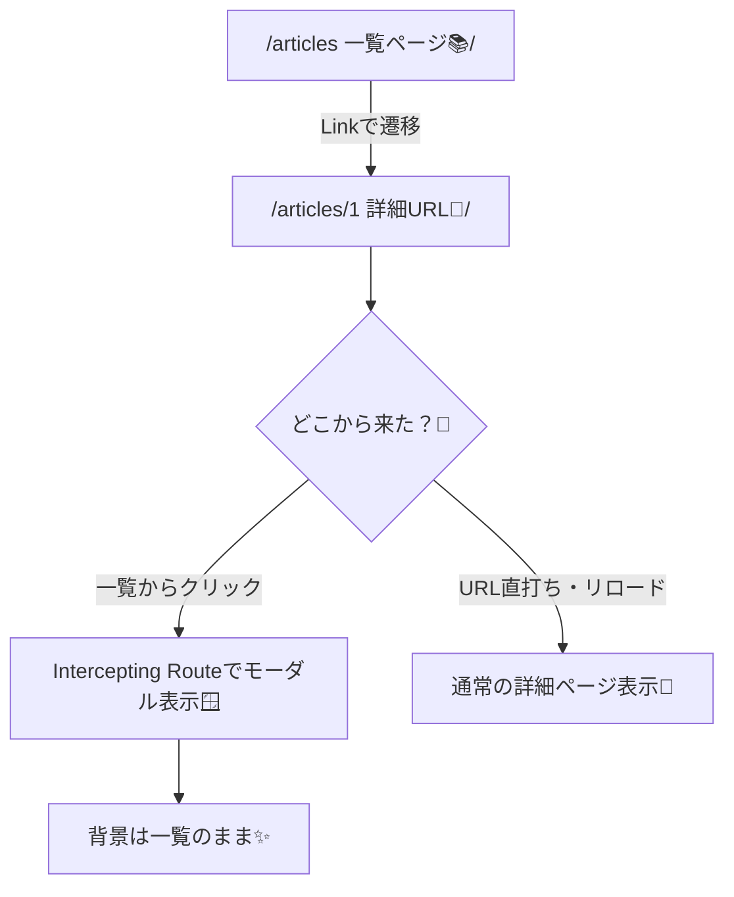
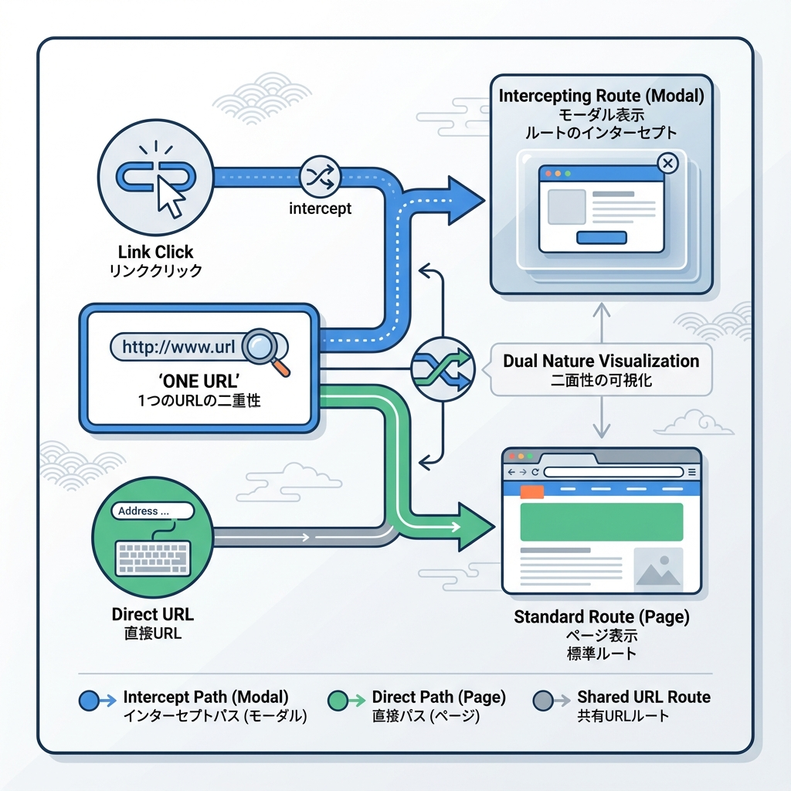

# 第70章：練習：記事一覧→詳細→モーダル表示を体験📰

この章では、「記事一覧」から記事を開くと **モーダル（ふわっと重なる詳細）** が出て、**URLはちゃんと詳細のURLになる** 体験を作ります😊
さらに！URLを直打ちしたときは **通常の詳細ページ** として表示されるようにもします✨

---

## できあがりイメージ🎬✨

* `/articles`：記事一覧📚
* 一覧から記事をクリック 👉 **モーダルで詳細**（背景は一覧のまま）🪟
* `/articles/1` を直で開く 👉 **通常の詳細ページ**（モーダルじゃない）📄

---

## しくみの図解🧠🗺️（Mermaid）





ポイントはこの2つだよ👇

* **Parallel Routes**：`@modal` という “モーダル用スロット” を用意する🪟
* **Intercepting Routes**：一覧から来たときだけ “詳細をモーダルとして差し込む” 🪄

---

## フォルダ構成（今回作る場所）🗂️✨

```txt
app/
  articles/
    layout.tsx
    page.tsx
    [id]/
      page.tsx
    @modal/
      default.tsx
      (.)[id]/
        page.tsx
    _data/
      articles.ts
components/
  Modal.tsx
```

---

## Step 1：記事データを用意する📦📝

`app/articles/_data/articles.ts` を作ってね👇

```ts
// app/articles/_data/articles.ts
export type Article = {
  id: string;
  title: string;
  body: string;
};

const articles: Article[] = [
  { id: "1", title: "学食の神メニュー発見🍛✨", body: "今日のカレー、優勝でした…！トッピングで世界が変わる🍳" },
  { id: "2", title: "ゼミ発表こわい😵‍💫→対策まとめ📌", body: "結論から話す＆スライドは少なく！練習は3回がちょうどいい🎤" },
  { id: "3", title: "Next.jsのモーダル遷移が楽しい🪄", body: "URLが変わるのにモーダル！これがルーティングの気持ちよさ🌈" },
];

export function getArticles() {
  return articles;
}

export function getArticle(id: string) {
  return articles.find((a) => a.id === id) ?? null;
}
```

---

## Step 2：`/articles` のレイアウトに “モーダル枠” を追加🪟🧱

`app/articles/layout.tsx` を作成👇
ここが **Parallel Routes の受け口**（`modal`）になるよ✨

```tsx
// app/articles/layout.tsx
import type { ReactNode } from "react";

export default function ArticlesLayout({
  children,
  modal,
}: {
  children: ReactNode;
  modal: ReactNode; // ← @modal スロットがここに入るよ🪟
}) {
  return (
    <div style={{ padding: 16 }}>
      <h1 style={{ fontSize: 24, marginBottom: 12 }}>記事ビューア📰✨</h1>
      {children}
      {modal}
    </div>
  );
}
```

---

## Step 3：モーダルが無いときは “何も表示しない” を用意🙈

`app/articles/@modal/default.tsx` を作るよ👇
これが無いと、モーダル枠が未定義で困ることがあるよ💡

```tsx
// app/articles/@modal/default.tsx
export default function Default() {
  return null;
}
```

---

## Step 4：記事一覧ページ `/articles` を作る📚🔗

`app/articles/page.tsx` を作成👇

```tsx
// app/articles/page.tsx
import Link from "next/link";
import { getArticles } from "./_data/articles";

export default function ArticlesPage() {
  const articles = getArticles();

  return (
    <div>
      <p style={{ marginBottom: 12 }}>
        一覧からクリックすると、モーダルで詳細が出るよ🪄🪟
      </p>

      <ul style={{ display: "grid", gap: 10, padding: 0, listStyle: "none" }}>
        {articles.map((a) => (
          <li
            key={a.id}
            style={{
              border: "1px solid #ddd",
              borderRadius: 12,
              padding: 12,
              background: "white",
            }}
          >
            <Link href={`/articles/${a.id}`} style={{ textDecoration: "none" }}>
              <div style={{ fontSize: 18, fontWeight: 700 }}>{a.title}</div>
              <div style={{ opacity: 0.7, marginTop: 4 }}>クリックして詳細へ👉</div>
            </Link>
          </li>
        ))}
      </ul>
    </div>
  );
}
```

---

## Step 5：通常の詳細ページ `/articles/[id]` を作る📄🔍

`app/articles/[id]/page.tsx` を作成👇
URL直打ち・リロード時はここが表示されるよ😊

```tsx
// app/articles/[id]/page.tsx
import Link from "next/link";
import { getArticle } from "../_data/articles";

export default async function ArticleDetailPage({ params }: { params: Promise<{ id: string }> }) {
  const { id } = await params;
  const article = getArticle(id);

  if (!article) {
    return (
      <div>
        <p>記事が見つからなかったよ🥲</p>
        <Link href="/articles">一覧へ戻る</Link>
      </div>
    );
  }

  return (
    <div style={{ border: "1px solid #ddd", borderRadius: 12, padding: 16, background: "white" }}>
      <div style={{ marginBottom: 10 }}>
        <Link href="/articles">← 一覧に戻る</Link>
      </div>

      <h2 style={{ fontSize: 22, marginBottom: 8 }}>{article.title}</h2>
      <p style={{ lineHeight: 1.8 }}>{article.body}</p>

      <p style={{ marginTop: 14, opacity: 0.7 }}>
        ※ これは「通常の詳細ページ」だよ📄（URL直打ち・リロード向け）
      </p>
    </div>
  );
}
```

---

## Step 6：モーダルUI（閉じる動きはクライアント）を作る🪟❌

`components/Modal.tsx` を作成👇
背景クリック or ボタンで閉じるよ😊

```tsx
// components/Modal.tsx
"use client";

import { ReactNode } from "react";
import { useRouter } from "next/navigation";

export default function Modal({ children }: { children: ReactNode }) {
  const router = useRouter();

  const close = () => {
    // 一覧から来ている想定なので、戻るでOK👌
    router.back();
  };

  return (
    <div
      role="dialog"
      aria-modal="true"
      onClick={close}
      style={{
        position: "fixed",
        inset: 0,
        background: "rgba(0,0,0,0.35)",
        display: "grid",
        placeItems: "center",
        padding: 16,
      }}
    >
      <div
        onClick={(e) => e.stopPropagation()}
        style={{
          width: "min(720px, 100%)",
          background: "white",
          borderRadius: 16,
          padding: 16,
          boxShadow: "0 20px 60px rgba(0,0,0,0.25)",
        }}
      >
        <div style={{ display: "flex", justifyContent: "space-between", gap: 12, alignItems: "center" }}>
          <div style={{ fontWeight: 800 }}>モーダル詳細🪟✨</div>
          <button
            onClick={close}
            style={{
              border: "1px solid #ddd",
              borderRadius: 10,
              padding: "6px 10px",
              background: "white",
              cursor: "pointer",
            }}
          >
            閉じる❌
          </button>
        </div>

        <div style={{ marginTop: 12 }}>{children}</div>
      </div>
    </div>
  );
}
```

---

## Step 7：Intercepting Routeで “詳細をモーダルとして差し込む” 🪄🪟

ここがこの章の主役〜！！🎉
`app/articles/@modal/(.)[id]/page.tsx` を作成👇

* `(.)[id]` が **Intercepting Routes** の合図🪄
* 一覧から `Link` で `/articles/1` に行くと、このモーダル側が優先表示されるよ✨

```tsx
// app/articles/@modal/(.)[id]/page.tsx
import Modal from "@/components/Modal";
import { getArticle } from "../../_data/articles";

export default async function ArticleModalPage({ params }: { params: Promise<{ id: string }> }) {
  const { id } = await params;
  const article = getArticle(id);

  if (!article) return null;

  return (
    <Modal>
      <h2 style={{ fontSize: 20, marginBottom: 8 }}>{article.title}</h2>
      <p style={{ lineHeight: 1.8 }}>{article.body}</p>
      <p style={{ marginTop: 12, opacity: 0.7 }}>
        ※ 一覧の上に重なってるよ🪟✨（URLは詳細のまま！）
      </p>
    </Modal>
  );
}
```

---

## 動作チェック✅🧪（ここ大事！）

1. 起動する🚀

```bash
npm run dev
```

2. ブラウザで開く🌐

* `http://localhost:3000/articles`

3. 一覧から記事をクリック🖱️

* ✅ 背景は一覧のまま
* ✅ モーダルが出る
* ✅ URLは `/articles/1` みたいに詳細になってる

4. 新しいタブで直に開く🔗

* `http://localhost:3000/articles/1`
* ✅ モーダルじゃなくて通常詳細ページが出る📄

---

## ミニ課題🌸（できたら最強💪✨）

* 🔥 課題1：モーダル内に「次へ →」「← 前へ」ボタンをつける
* 🔥 課題2：背景スクロールを止める（モーダル中だけ）🧊
* 🔥 課題3：記事が見つからないとき、モーダルでも「見つからない🥲」を表示する

---

ここまでできたら、Next.jsのルーティング応用が一気に「気持ちいい」ゾーンに入るよ〜🛣️✨🪄
