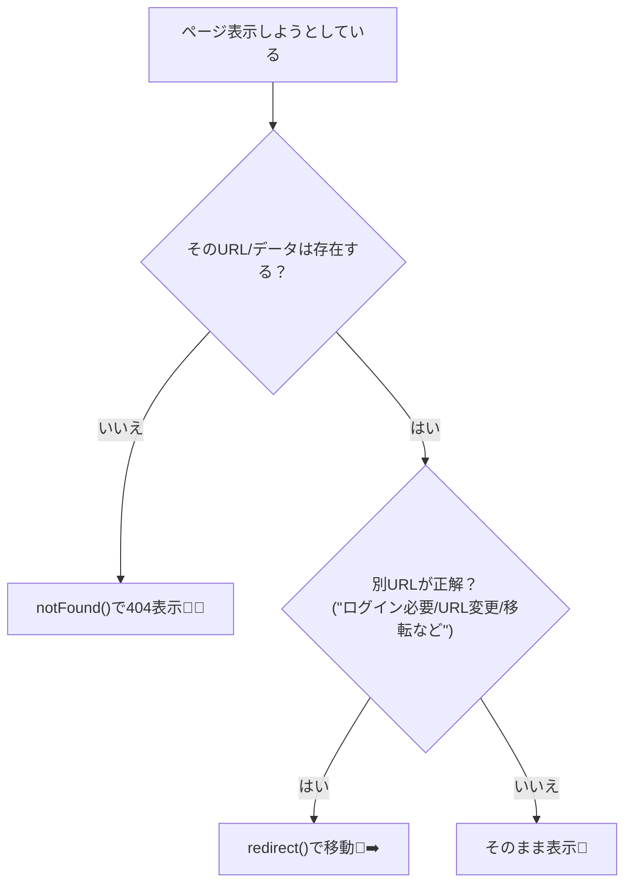
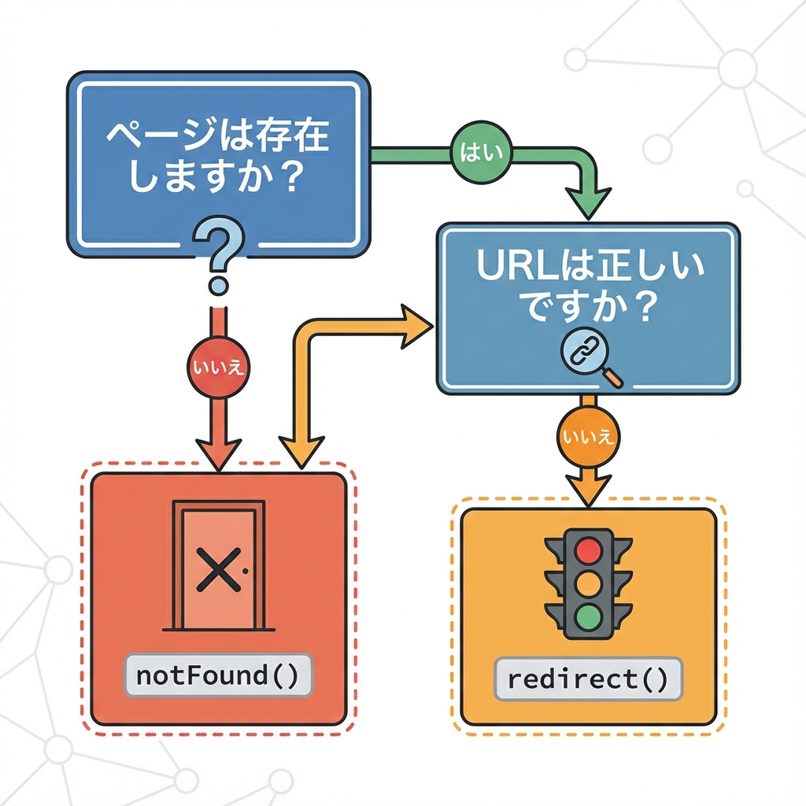

# 第71章：`redirect()` と `notFound()` の使いどころ🚦

## ゴール🎯

「この状況、**ページ移動させる？** それとも **404を見せる？**」を迷わず判断できて、実装もサクッと書けるようになることだよ〜😊✨

---

## まず結論：この2つは“分岐スイッチ”🎛️

* `redirect()` 👉 **別のURLへ強制移動**させたいとき🚶‍♀️➡️🏠
* `notFound()` 👉 **存在しない扱い（404）**にしたいとき🚪❌

どっちも「処理をそこで打ち切って」画面を切り替える感じだよ！（実は内部的には“投げて止める”タイプ）([Next.js][1])

---

## 図解：どっちを使う？🤔🗺️（Mermaid）





---

## `notFound()`：404を“きれいに”出す担当🚪❌

### いつ使う？🥺

* `/posts/123` みたいな詳細ページで、**IDのデータが存在しない**
* ユーザーが手入力で変なURLを開いた
* 「その情報は公開されてない」など、**見せない＝404にしたい**（仕様次第）

`notFound()` を呼ぶと、そのルート区間の `not-found.tsx` が表示されるよ〜🧸✨
さらに `<meta name="robots" content="noindex" />` も入れてくれる（検索に載せない配慮）っていうのが地味にえらい👏([Next.js][1])

### 例：`[id]` のデータが無ければ404にする📄

`app/posts/[id]/page.tsx`

```tsx
import { notFound } from "next/navigation";

type Props = {
  params: Promise<{ id: string }>;
};

async function getPost(id: string) {
  // 例：本当はDBやAPIに取りに行く想定だよ🫶
  const fakeDB: Record<string, { title: string }> = {
    "1": { title: "はじめての投稿🎀" },
    "2": { title: "Next.jsたのしい🥳" },
  };
  return fakeDB[id] ?? null;
}

export default async function Page({ params }: Props) {
  const { id } = await params;
  const post = await getPost(id);

  if (!post) {
    notFound(); // 🚪❌ ここで404へ
  }

  return (
    <main>
      <h1>{post.title}</h1>
      <p>id: {id}</p>
    </main>
  );
}
```

---

## `redirect()`：別ページへ“移動させる”担当🚦➡️

### いつ使う？😊

* ログインしてない人を `/login` に飛ばす🔐➡️
* 古いURLから新しいURLへ案内する（移転）🏠➡️🏡
* フォーム送信のあと、一覧へ戻す（成功後の画面遷移）📮➡️📋

`redirect()` は **Server Components / Route Handlers / Server Actions** などで使えるよ〜📌([Next.js][2])
あと大事ポイント：`redirect()` は“投げて止める系”だから、`try/catch` の `try` の中で呼ぶとハマりやすい！って公式が注意してるよ⚠️（呼ぶなら try の外が安心）([Next.js][3])

### 例：未ログインなら `/login` に飛ばす🔐

`app/dashboard/page.tsx`

```tsx
import { redirect } from "next/navigation";

async function getSession() {
  // 例：本当はCookie/認証で判定する想定だよ🍪
  return null; // ←未ログイン想定
}

export default async function Page() {
  const session = await getSession();

  if (!session) {
    redirect("/login"); // 🚦➡️
  }

  return <h1>ダッシュボードへようこそ🎉</h1>;
}
```

---

## 使い分けの“超シンプルルール”💡

* **そのページ（データ）が存在しない** 👉 `notFound()` 🚪❌
* **存在はするけど、行き先が別にある** 👉 `redirect()` 🚦➡️

補足ちょいだけ👇

* URLが恒久的に変わった（今後ずっと）なら `permanentRedirect()`（308）もあるよ〜🧭([Next.js][4])

---

## よくあるミスあるある😵‍💫（回避しよ〜）

* `notFound()` を「404ページにリダイレクトするもの」だと思う
  → これは **“404として扱って not-found を表示”** するものだよ🧸（移動じゃない）([GitHub][5])
* `redirect()` を `try { ... }` の中で呼んで、catchに吸われて混乱
  → **tryの外**で呼ぶのが安全寄り⚠️([Next.js][3])

---

## ミニ練習🎀（10〜15分でOK）

### お題1：`notFound()` 練習🚪

* `app/members/[id]/page.tsx` を作る
* `id` が `"1"` と `"2"` 以外なら `notFound()`

### お題2：`redirect()` 練習🚦

* `app/settings/page.tsx` で「未ログインなら `/login` に redirect」
* ログインなら設定画面を表示✨

できたら「存在しない」ケースと「移動させたい」ケースの違い、体感で覚えられるよ〜🥳🎉

[1]: https://nextjs.org/docs/app/api-reference/functions/not-found?utm_source=chatgpt.com "Functions: notFound"
[2]: https://nextjs.org/docs/app/guides/redirecting?utm_source=chatgpt.com "Guides: Redirecting"
[3]: https://nextjs.org/docs/app/api-reference/functions/redirect?utm_source=chatgpt.com "Functions: redirect"
[4]: https://nextjs.org/docs/app/api-reference/functions/permanentRedirect?utm_source=chatgpt.com "Functions: permanentRedirect"
[5]: https://github.com/vercel/next.js/discussions/52233?utm_source=chatgpt.com "[App Route] How can I redirect to 404 or not-found from the ..."
