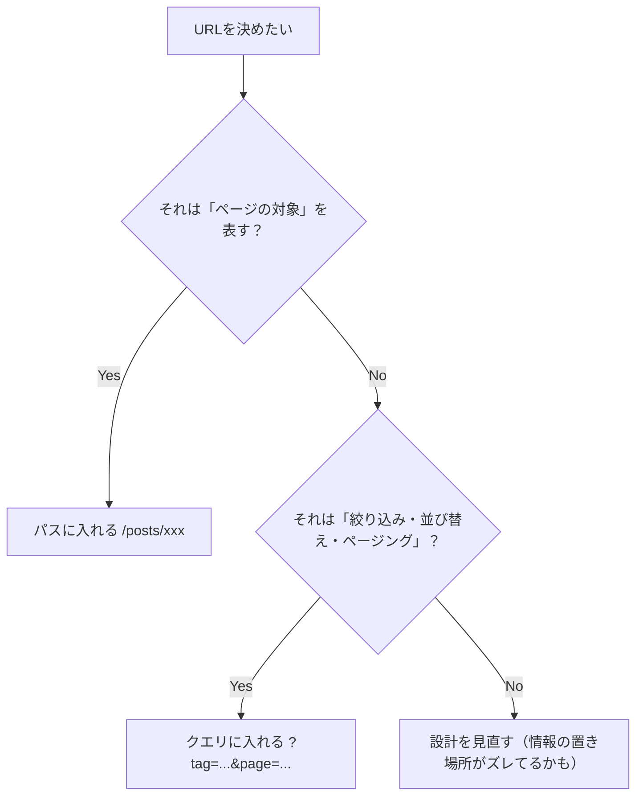
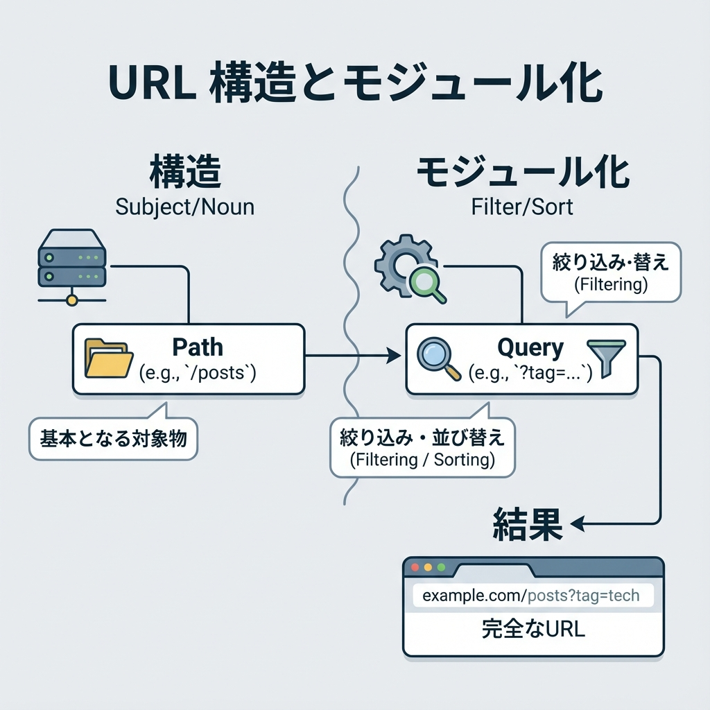

# 第72章：URL設計のコツ：人間に優しいURLにする😊

## この章でできるようになること🎯

* URLを見ただけで「何のページ？」が伝わる設計にできる😊
* 「パスに入れるもの」と「クエリ（?xxx=）に入れるもの」を迷わなくなる🧠✨
* Next.js（App Router）で“キレイなURL”を作るフォルダ設計ができる📁🛣️

---

## 人間に優しいURLって、どんなの？👀💡

人間に優しいURLは、ざっくり言うとこう👇

* 読める📖（意味がわかる）
* 予想できる🔮（次のページも想像できる）
* 共有しやすい📩（SNSやLINEで貼っても安心）
* SEO的にも嬉しい🔎（検索エンジンにも伝わりやすい）

たとえば…

* ✅ `/posts/react-server-components`（何の記事か分かる😊）
* ❌ `/p?x=12`（なにそれ〜🥺）

---

## まず結論：URL設計 7つのルール🧷✨

### ルール①：URLは「名詞」で作る📚

URLは「何を見せる場所か」なので、動詞より名詞が向いてるよ〜😊

* ✅ `/posts`（記事）
* ✅ `/users`（ユーザー）
* ❌ `/getPosts`（取得って何…？😵）

---

### ルール②：階層は深くしすぎない🏠➡️🏠➡️🏠（疲れる🥺）

深いURLは、理解も管理も大変💦
目安：**2〜4階層くらい**が気持ちいいことが多いよ✨

* ✅ `/posts/nextjs-url-design`
* △ `/school/department/2025/teacher/123/profile`（うわぁ…😇）

---

### ルール③：複数形ルールを統一する👯‍♀️✨

一覧ページはだいたい複数形が自然（英語の慣習）
アプリ全体で統一すると、迷子が減るよ〜🗺️

* ✅ `/posts` 一覧
* ✅ `/posts/[slug]` 詳細
* ❌ `/post` と `/posts` が混在（混乱〜🌀）

---

### ルール④：小文字＋ハイフンが基本🌿

* ✅ `my-first-post`（読みやすい）
* ❌ `MyFirstPost`（見づらい）
* ❌ `my_first_post`（環境によって好み割れがち）

---

### ルール⑤：詳細ページは “slug” を使うと優しい😊🪄

slug = URLに入れる“読みやすい名前”だよ✨

* ✅ `/posts/nextjs-url-design`
* ❌ `/posts/38712`（数字だけだと人間に優しくない🥺）

ただし！DB的に **一意にしたい** ときはこういう“合わせ技”もアリ👇

* ✅ `/posts/38712-nextjs-url-design`（強い💪✨）

---

### ルール⑥：パスは「何か（対象）」、クエリは「絞り込み」🔍

ここめちゃ大事〜！🫶

* **パス**：それ自体がページの“アイデンティティ”

  * ✅ `/posts/react-19`
* **クエリ**：検索・並び替え・ページングなど

  * ✅ `/posts?tag=nextjs&sort=popular&page=2`

---

### ルール⑦：URLはできるだけ変えない（変えるなら逃げ道）🚦

一度共有されたURLは、ブックマークやSNSに残るよ〜📌
変える可能性があるなら、最初から **長生きする設計** にしよ😊

---

## URL設計の全体像（どこに何を入れる？）🧠🗺️





---

## Next.js（App Router）で“キレイなURL”を作る考え方📁🛣️

### 1) フォルダ＝URLの道🏠

* `app/posts/page.tsx` → `/posts`
* `app/posts/[slug]/page.tsx` → `/posts/なんか-slug`

### 2) Route Group は「整理だけ」できる📦（URLに出ない！）

たとえば、見た目の枠や用途で整理したくても、URLは増やしたくないときに便利✨

* `app/(site)/posts/page.tsx` → `/posts`（`(site)` はURLに出ない😊）

---

## よくある “ダメURL” → “いいURL” 変換例🧼✨

* ❌ `/blog/article?id=12`
  ✅ `/posts/12-nextjs-url-design`（または `/posts/nextjs-url-design`）

* ❌ `/userProfile/akikun`
  ✅ `/users/akikun`

* ❌ `/posts?postId=react-19`（対象がクエリにいる）
  ✅ `/posts/react-19`

* ❌ `/posts/NextJSURLDesign`
  ✅ `/posts/nextjs-url-design`

---

## ミニ演習：学科ブログのURLを“人間に優しく”設計しよう🌸📝

### お題：学科ブログ（一覧・詳細・タグ検索）🎓✨

欲しいページはこれ👇

1. 記事一覧
2. 記事詳細
3. タグで絞り込み（例：Next.jsタグだけ）

### まずURL設計（答えの例）✅

* 一覧：`/posts`
* 詳細：`/posts/[slug]`
* タグ絞り込み：`/posts?tag=nextjs`

「タグは絞り込み」だからクエリにしたよ😊🔍

---

## フォルダ構成（このまま作れるよ！）📁✨

```text
app/
  (site)/
    posts/
      page.tsx
      [slug]/
        page.tsx
```

---

## 実装ミニ例（超シンプル）💻✨

### 記事一覧：`app/(site)/posts/page.tsx` 📰

```tsx
type Props = {
  searchParams: Promise<{ tag?: string }>;
};

export default async function PostsPage({ searchParams }: Props) {
  const { tag } = await searchParams;

  return (
    <main style={{ padding: 24 }}>
      <h1>記事一覧📰</h1>
      {tag ? <p>タグで絞り込み中：#{tag} 🔍✨</p> : <p>全部の記事だよ〜😊</p>}

      <ul>
        <li><a href="/posts/nextjs-url-design">人間に優しいURL設計😊🔗</a></li>
        <li><a href="/posts/react-19-basics">React 19 基本まとめ⚛️✨</a></li>
      </ul>

      <hr />
      <p>
        例：<a href="/posts?tag=nextjs">/posts?tag=nextjs</a> 🏷️
      </p>
    </main>
  );
}
```

### 記事詳細：`app/(site)/posts/[slug]/page.tsx` 🧩

```tsx
type Props = {
  params: Promise<{ slug: string }>;
};

export default async function PostDetailPage({ params }: Props) {
  const { slug } = await params;
  return (
    <main style={{ padding: 24 }}>
      <p><a href="/posts">← 記事一覧へ戻る😊</a></p>
      <h1>記事詳細📄✨</h1>
      <p>slug：{slug} 🧷</p>
    </main>
  );
}
```

---

## 最後に：URL設計チェックリスト✅💖

* [ ] URLだけ見て「何のページか」分かる？👀
* [ ] 一覧は複数形で統一してる？（`/posts` とか）👯‍♀️
* [ ] 詳細はslugで読みやすい？🪄
* [ ] “対象” はパス、“絞り込み” はクエリになってる？🔍
* [ ] 将来も変えずに使えそう？（長生きURL）📌

---

必要なら、あなたの作りたいアプリ案を1つ教えてくれたら、その題材に合わせて「URL設計案（URL一覧＋フォルダ構成）」を一緒に作るよ〜😊🫶✨
