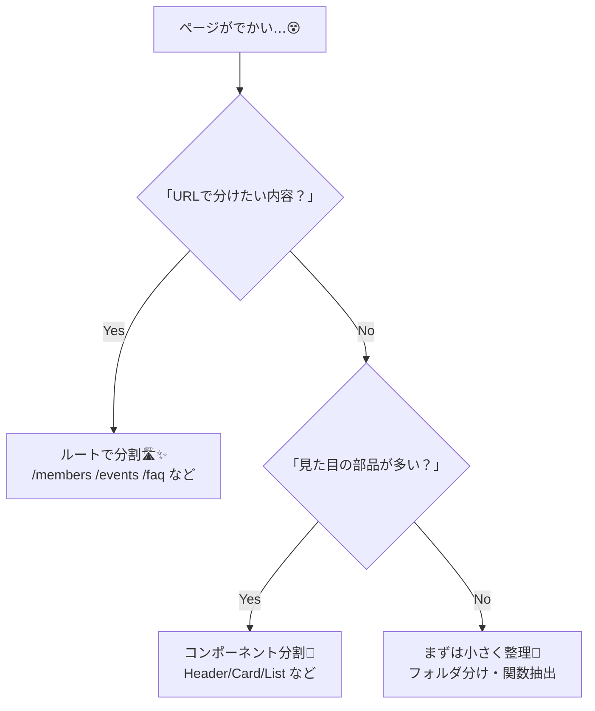
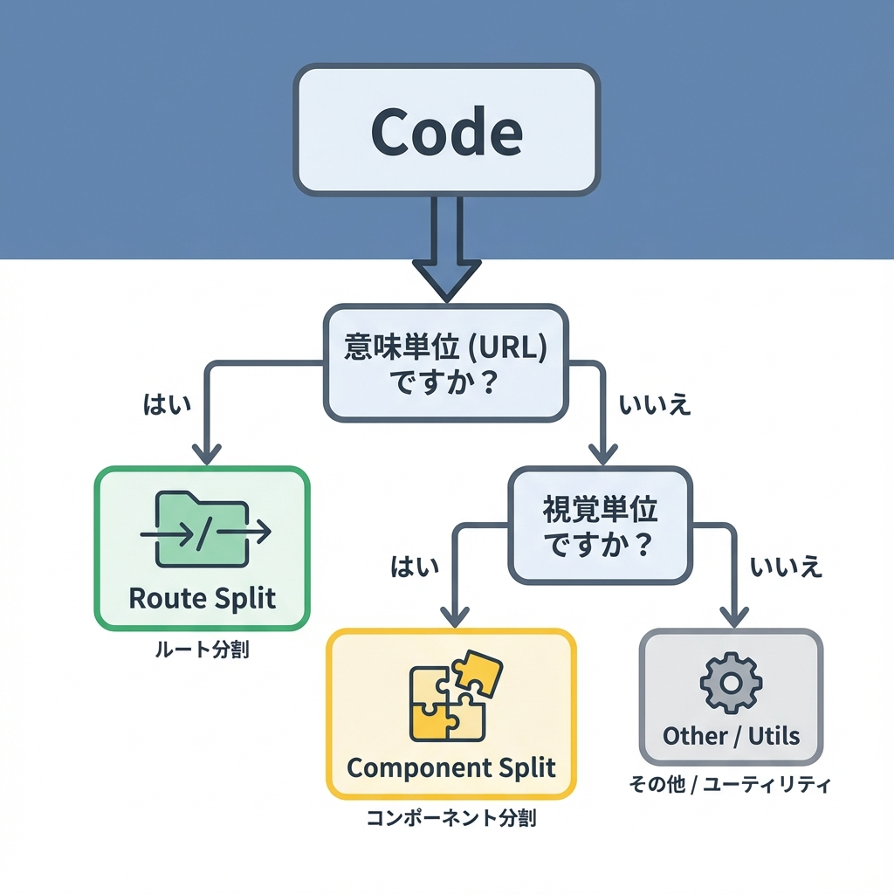

# 第73章：ページ分割のコツ：肥大化したら“ルートで分割”✂️

「1ページに全部つめこみすぎて、もう編集したくない…😵‍💫」ってなったら、**コンポーネント分割だけじゃなくて、URL（ルート）でも分ける**のが超おすすめだよ〜！🫶💖
ページがスッキリするし、ユーザーも迷子になりにくいし、読み込みも分けやすくなるよ⏳✨

---

## 1) まず結論：こんなとき “ルート分割” しよ！✂️🛣️

✅ **ルート分割したほうがいいサイン**（あるある〜！）

* スクロールが長すぎて「どこに何書いたっけ？」ってなる📜😵
* 1ファイルがでかくて探すだけで疲れる🧠💦
* 「概要」「メンバー」「イベント」「FAQ」みたいに、内容がハッキリ別れてる📦
* そのセクションだけ **URLで共有したい**（例：`/circle/events` を友だちに送る）🔗💌
* その区間だけ `loading.tsx` / `error.tsx` を分けたくなる⏳🧯

---

## 2) 図解：コンポーネント分割 vs ルート分割 🧩🛣️





ポイントはこれ👇

* **URLとして意味があるまとまり** → ルート分割🛣️
* **同じページ内の部品** → コンポーネント分割🧩

---

## 3) 例：サークル紹介ページが肥大化したケース🌸📣

### 🧨 Before：`/circle` 1ページに全部入り（つらい）

* 概要
* 活動内容
* メンバー
* 年間イベント
* ギャラリー
* FAQ
  → ぜんぶ `app/circle/page.tsx` に書いてて巨大…😇

### ✨ After：ルート分割してスッキリ！

* `/circle`（概要）
* `/circle/members`（メンバー）
* `/circle/events`（イベント）
* `/circle/gallery`（写真）
* `/circle/faq`（よくある質問）

---

## 4) フォルダ構成：こう分けると気持ちいい🗂️💗

```txt
app/
  circle/
    layout.tsx
    page.tsx
    members/
      page.tsx
    events/
      page.tsx
    gallery/
      page.tsx
    faq/
      page.tsx
```

ここで大事なのは👇

* `circle/layout.tsx` を作ると、**/circle配下で共通の枠（ナビとか）** を置けるよ🧱✨

---

## 5) 共通レイアウト（ナビ付き）を作る 🧭💕

`app/circle/layout.tsx`

```tsx
import Link from "next/link";
import type { ReactNode } from "react";

export default function CircleLayout({ children }: { children: ReactNode }) {
  return (
    <div style={{ maxWidth: 900, margin: "0 auto", padding: 16 }}>
      <header style={{ marginBottom: 16 }}>
        <h1 style={{ margin: 0 }}>サークル紹介🌸</h1>
        <nav style={{ display: "flex", gap: 12, marginTop: 12, flexWrap: "wrap" }}>
          <Link href="/circle">概要</Link>
          <Link href="/circle/members">メンバー</Link>
          <Link href="/circle/events">イベント</Link>
          <Link href="/circle/gallery">ギャラリー</Link>
          <Link href="/circle/faq">FAQ</Link>
        </nav>
      </header>

      <main>{children}</main>
    </div>
  );
}
```

これで、各ページは **中身だけ** 書けばOKになるよ〜！🥳✨

---

## 6) 各ページは“中身だけ”にして軽くする🪽

`app/circle/page.tsx`（概要）

```tsx
export default function CircleTopPage() {
  return (
    <section>
      <h2>どんなサークル？😊</h2>
      <p>
        週1でゆるっと活動してます〜！📚✨ 初心者さん大歓迎だよ🫶
      </p>
    </section>
  );
}
```

`app/circle/events/page.tsx`（イベント）

```tsx
export default function CircleEventsPage() {
  const events = [
    { title: "新歓ランチ🍝", month: "4月" },
    { title: "夏合宿🏖️", month: "8月" },
    { title: "学園祭展示🎪", month: "11月" },
  ];

  return (
    <section>
      <h2>年間イベント📅✨</h2>
      <ul>
        {events.map((e) => (
          <li key={e.title}>
            {e.month}：{e.title}
          </li>
        ))}
      </ul>
    </section>
  );
}
```

---

## 7) ルート分割の“うれしい副作用”🎁✨

* **URLで案内できる**：イベントだけ見せたい時に `/circle/events` を送れる📩🔗
* **ページごとに読み込み演出できる**：`app/circle/events/loading.tsx` とか置ける⏳💖
* **エラーも局所化できる**：`app/circle/events/error.tsx` だけ守れる🧯
* **責任が分かれる**：「この内容どこ？」が減る🧠✨

---

## 8) 迷わない“分け方ルール”3つ🧭🫶

1. **ユーザーが押したくなるメニュー単位で分ける**（タブ/ナビになるやつ）🧭
2. **共有したくなる単位で分ける**（リンクで渡したい）🔗
3. **更新頻度が違うものは分ける**（FAQだけ増える、とか）📝

---

## 9) 練習ミッション🎮✨（15〜25分）

### ✅ お題

いま `app/circle/page.tsx` に “概要/メンバー/イベント/FAQ” を全部書いてる想定でOK！

### ✅ やること

* `app/circle/layout.tsx` を作ってナビを置く🧱
* `members/events/faq` のフォルダを作って `page.tsx` を置く📄
* それぞれのページに見出しと文章をちょこっと入れる✍️💖

### ✅ できたら最高

* `events/loading.tsx` を作って「読み込み中だよ〜⏳」って表示してみる🎀

---

## 10) 今日のまとめ🎉

* ページが巨大になったら、**“URLとして意味がある単位”でルート分割**しよ✂️🛣️
* `layout.tsx` で共通枠（ナビ）を作ると、各ページが軽くなる🧱✨
* 分割は「開発がラク」だけじゃなくて「使う人にも優しい」になる🫶🌸
