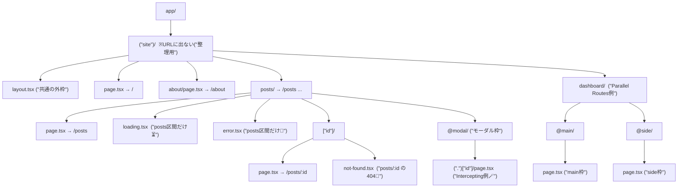
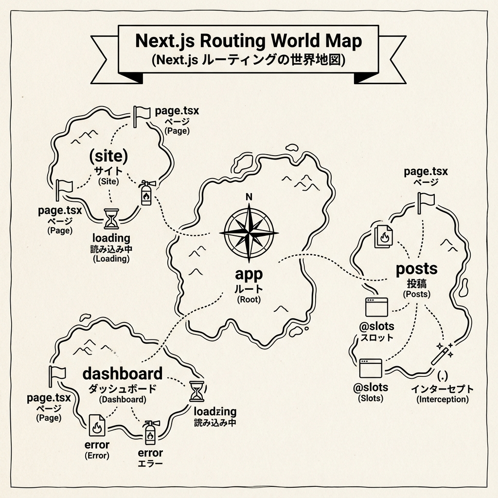

# 第74章：復習：迷子にならないためのルーティング地図🗺️

ここまでで「ルーティングの道具」がいっぱい出てきたから、**最後に“地図”として頭に整理**しようね🥰
ゴールはこれ👇

* 今見てるURLが **どのフォルダ/ファイルに対応するか** すぐ言える🧭
* 迷った時に **どこを見ればいいか** 分かる👀
* 「この画面だけ loading/error を出したい！」ができる⏳🧯

---

## 1) まずは超重要ルール3つだけ📌✨

### ルールA：**URLは基本的に `app/` のフォルダ構造**📁➡️🌐

* `app/about/page.tsx` → `/about`
* `app/posts/[id]/page.tsx` → `/posts/123` みたいな感じ🧩

### ルールB：画面は **`page.tsx` が最終ゴール**🏁

* フォルダを掘っていって、最後に `page.tsx` があれば「そのURLの画面」！

### ルールC：その区間（セグメント）ごとに **`layout/loading/error/not-found` を置ける**🎁

* 「このエリアだけ」ローディング出す、エラー分ける、ができるのが強い💪✨

---

## 2) ルーティング地図（フォルダ構造＝世界地図）🗺️🧠

次の図は「よくある構成」を**地図っぽく**したものだよ😊
（Route Group / Dynamic Route / Parallel / Intercepting まで一気に載せるね！）





### この地図の読み方👀✨

* **`(site)`** は「フォルダとして整理するだけ」📦（URLには出ない）
* **`[id]`** は「可変」🧩（`/posts/1` でも `/posts/999` でもOK）
* **`loading.tsx` / `error.tsx`** は、そのフォルダ（区間）配下で効く⏳🧯
* **`@main` / `@side`** は Parallel Routes（同じURLで“枠を並行表示”）🪟
* **`(.)[id]`** は Intercepting Routes（通常遷移を“横取りしてモーダル”みたいにする）🪄

---

## 3) 迷ったらこの「対応表」で一発解決🔍✨

| やりたいこと            | だいたい使うもの            | 置く場所の目安                |
| ----------------- | ------------------- | ---------------------- |
| 「このURLの画面を作りたい」   | `page.tsx`          | 対応するフォルダの中             |
| 「共通のヘッダー/フッター欲しい」 | `layout.tsx`        | 共通にしたい一番上の区間           |
| 「このエリアだけ読み込み中表示」  | `loading.tsx`       | そのエリアのフォルダ             |
| 「このエリアだけエラーUI」    | `error.tsx`         | そのエリアのフォルダ             |
| 「404を丁寧に案内したい」    | `not-found.tsx`     | 404を出したい区間             |
| 「存在しない時に404へ」     | `notFound()`        | 主に Server 側（page等）     |
| 「別ページへ飛ばしたい」      | `redirect()`        | 主に Server 側（page等）     |
| 「URLから ?q= を読む」   | `useSearchParams()` | Client Component 側     |
| 「現在のパスを知る」        | `usePathname()`     | Client Component 側     |
| 「ボタンで戻る/進む/遷移」    | `useRouter()`       | Client Component 側     |
| 「同じURLで枠を並行表示」    | `@slot`             | ルート配下の Parallel Routes |
| 「詳細をモーダルで見せたい」    | `(.)` / `(..)`      | Intercepting Routes    |

---

## 4) ルーティングで迷子になる“あるある”＆脱出法🏃‍♀️💨

### あるある①：`page.tsx` を作ったのに表示されない😵‍💫

✅ チェック：

* 置き場所が `app/` 配下？（`src/app` の場合もあるよ📁）
* フォルダ名・ファイル名が正確？（`page.tsx` の綴りミス多い😇）
* `layout.tsx` が壊れてない？（レイアウト側のエラーで全部止まることある🧯）

---

### あるある②：`loading.tsx` を置いたのに出ない😳

✅ ありがち原因：

* その区間で「待ち」が発生してない（すぐ描画されてる）
* 期待してる場所と違う区間に置いてる（1階層ズレると効かない）📦

---

### あるある③：Dynamic Route がごちゃる（`[id]` どこ？）🧩

✅ 迷ったら：

* URLを分解して、**スラッシュごとにフォルダにする**だけ！✂️

例：`/posts/123/comments`
→ `app/posts/[id]/comments/page.tsx` 🧠✨

---

## 5) “迷子にならない”最強の手順（毎回これでOK）✅🗺️

ルーティングを作る時は、次の順番にすると脳がスッキリするよ☺️🌸

1. **作りたいURLを紙に書く**📝（例：`/posts`, `/posts/1`）
2. URLを `/` で割って、**フォルダにする**📁
3. 最後に **`page.tsx`** を置く🏁
4. 共通枠が必要なら上に **`layout.tsx`** 🧱
5. “その区間だけ”待つ/壊れる/見つからない に **`loading/error/not-found`** を置く⏳🧯🚪
6. モーダルや並行表示が必要なら **@slot / (.)** を検討🪄🪟

---

## 6) ミニ練習：ルーティング地図を自分で描いてみよう🖊️✨

### お題🎓💖

「学内ポータル」っぽいミニ構成を作るイメージで、フォルダだけ作ってみてね！

* `/` トップ
* `/news` お知らせ一覧
* `/news/1` お知らせ詳細（`[id]`）
* `/mypage` マイページ
* `news` 区間だけ `loading.tsx` と `error.tsx` を付ける

フォルダ地図（答え例）👇

```text
app/
  (site)/
    layout.tsx
    page.tsx
    news/
      page.tsx
      loading.tsx
      error.tsx
      [id]/
        page.tsx
        not-found.tsx
    mypage/
      page.tsx
```

できたら **「このURLはどのファイル？」クイズ**を自分に出してみてね😆🧠✨
たとえば「`/news/5` はどこ？」→ `app/(site)/news/[id]/page.tsx` 🎯

---

## 7) まとめ：あなたの“ルーティング地図”はこれで完成🏁🗺️💕

* URLは基本 **フォルダ構造**📁
* 画面のゴールは **`page.tsx`** 🏁
* 区間ごとに **`layout/loading/error/not-found`** を置ける🎁
* 高度なUIは **Parallel（@slot）** と **Intercepting（(.)）** が効く🪄🪟

次の章（データ取得）に行くと、**「待つ」や「キャッシュ」**が入ってさらに楽しくなるよ〜！🥳✨
