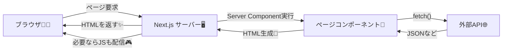
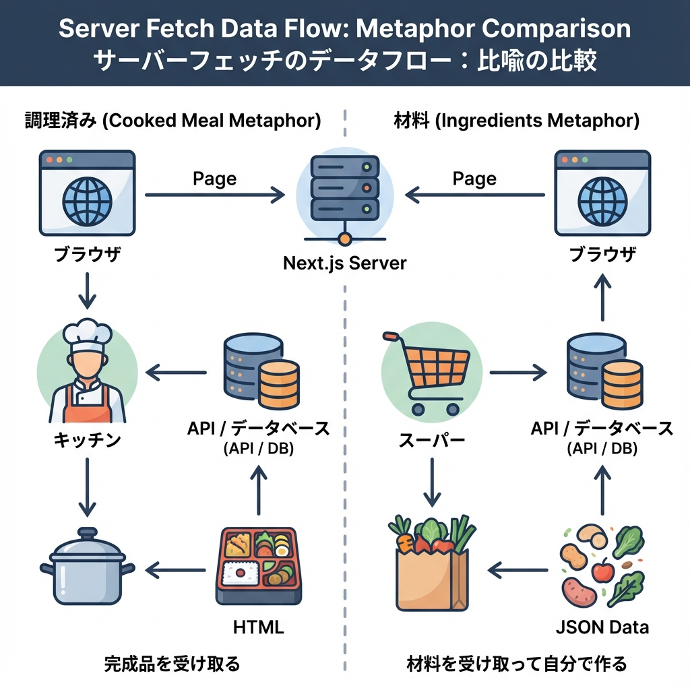

# 第75章：Serverで `fetch` するのが基本になる話🍵

ここからのNext.js（App Router）はね、**「まずServerでデータを取って画面を作る」**が基本の考え方になるよ〜！😋🫶
（そして必要なところだけをClientにする感じ🎮）

---

## なんでServerで `fetch` が基本なの？🤔💡

### 1) 画面が“先に”出せる（体感が速い）⚡🪄

Serverでデータを取ってHTMLを作ってから返すので、**最初の表示が気持ちよく**なりやすいよ〜！✨

### 2) APIキーとか秘密を守れる🔐🛡️

Serverなら `.env.local` の秘密情報を使っても、**ブラウザに漏れにくい**よ！（超大事💥）

### 3) クライアント側のJavaScriptを増やしにくい📦➡️🪶

Clientで `useEffect` し始めると、状態管理が増えがち…🥺
Server中心だと、**シンプルに作りやすい**よ〜！🧼✨

### 4) SEO的にも有利になりやすい🔎📝

HTMLにデータが入った状態で返しやすいので、検索エンジンにも読みやすい形になりがち👍✨

### 5) Next.jsが“賢く”最適化しやすい🧠✨

Next.jsの `fetch` は、あとで出てくる**キャッシュ**とも仲良しだよ🧊（詳しくは次の章で！）

---

## 図でイメージ！📨➡️🍵（Server fetch の流れ）





ポイントはこれ👇
**「ブラウザが直接APIへ取りに行く」じゃなくて、まずServerが取りに行く**イメージだよ〜🍵✨

---

## 最小コード：Server Componentで `fetch` して表示する🧊📥

App Routerでは、基本のページ（`page.tsx`）は**Server Component（デフォルト）**だから、普通に `await fetch()` できるよ！

```tsx
// app/page.tsx
type Todo = {
  id: number;
  title: string;
};

export default async function Page() {
  const res = await fetch("https://jsonplaceholder.typicode.com/todos?_limit=5");

  if (!res.ok) {
    // 通信失敗なら、エラーとして扱う（のちの error.tsx で良い感じにできる）
    throw new Error("データ取得に失敗しました🥺");
  }

  const todos: Todo[] = await res.json();

  return (
    <main style={{ padding: 16 }}>
      <h1>ServerでfetchしたTODO一覧🍵</h1>
      <ul>
        {todos.map((t) => (
          <li key={t.id}>✅ {t.title}</li>
        ))}
      </ul>
    </main>
  );
}
```

✅ これで「ページを開いたとき」にServerが取得して、HTMLを作って返してくれるよ〜！✨

---

## Clientで取る場合と何が違う？🎮🆚🧊

### Client fetch（`useEffect`）の雰囲気😵‍💫

「画面が出てから取りに行く」ので、ローディング状態や状態管理が増えがち！

```tsx
"use client";

import { useEffect, useState } from "react";

type Todo = { id: number; title: string };

export default function Page() {
  const [todos, setTodos] = useState<Todo[]>([]);

  useEffect(() => {
    fetch("https://jsonplaceholder.typicode.com/todos?_limit=5")
      .then((r) => r.json())
      .then(setTodos);
  }, []);

  return (
    <main>
      <h1>ClientでfetchしたTODO🎮</h1>
      <ul>
        {todos.map((t) => (
          <li key={t.id}>{t.title}</li>
        ))}
      </ul>
    </main>
  );
}
```

**どっちが良い？**の答えはだいたいこれ👇

* **まずServer fetch**：一覧表示・詳細表示・初期表示に必要なデータ📄✨
* **Client fetch**：検索条件を触った瞬間に更新したい、とか、入力に合わせて変わるUI🔍🎮

（Client側で取る話は、もっと後ろの章でちゃんと整理するよ🫶）

---

## ミニ演習🎯：`/users` ページをServer fetchで作ろう🌸

### 1) ファイルを作る📁✨

`app/users/page.tsx` を作成！

### 2) コピペでOK🙆‍♀️💖

```tsx
// app/users/page.tsx
type User = {
  id: number;
  name: string;
  email: string;
};

export default async function UsersPage() {
  const res = await fetch("https://jsonplaceholder.typicode.com/users");

  if (!res.ok) {
    throw new Error("ユーザー一覧が取れなかったよ🥺");
  }

  const users: User[] = await res.json();

  return (
    <main style={{ padding: 16 }}>
      <h1>ユーザー一覧（Server fetch）🍵✨</h1>

      <ul>
        {users.map((u) => (
          <li key={u.id} style={{ marginBottom: 8 }}>
            <div>👤 {u.name}</div>
            <div>📧 {u.email}</div>
          </li>
        ))}
      </ul>
    </main>
  );
}
```

### 3) 起動してアクセス🚀

VS Codeのターミナル（PowerShellでもOK）で👇

```bash
npm run dev
```

ブラウザで👇
`http://localhost:3000/users` に行けたら成功〜！🎉🎉🎉

---

## よくあるつまずきポイント🪤（ここだけ注意！）

* **`"use client"` を付けるとServer fetchの話じゃなくなる**（Clientになっちゃう）🎮⚠️
* **Server Componentでは `useState` / `useEffect` は使えない**（使うならClient）🧊🙅‍♀️
* **秘密情報（APIキーとか）はClientに持たせない**（まずServerで守る）🔐✨

---

## まとめ🍵💖

* App Routerは **Server Componentがデフォルト**🧊
* だからまずは **Serverで `fetch` → 画面を作る**が基本✨
* Clientにするのは **“操作が必要なところだけ”**🎮🫶

次の章で「なんで勝手に速くなるの？（キャッシュ）」を気持ちよく理解していこうね〜🧊⚡😆
