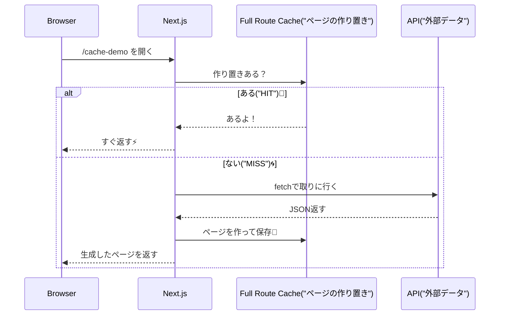
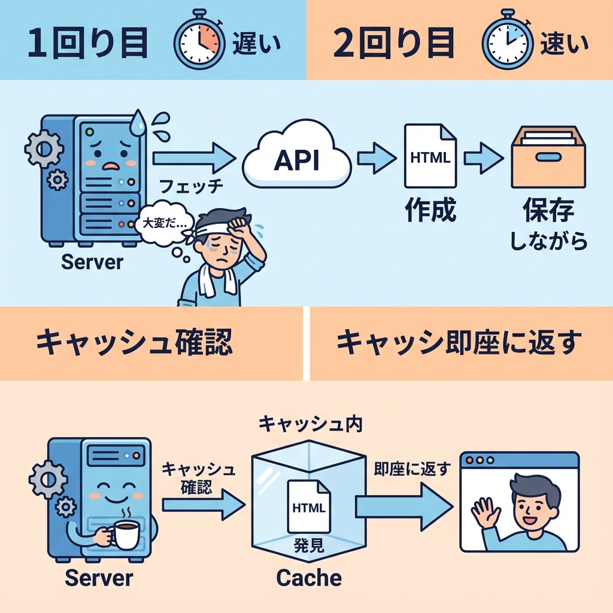

# 第76章：`fetch` の結果が“勝手に速くなる”理由（キャッシュ）⚡

この章では、「え、なんか2回目以降めっちゃ速い…なにこれ？」ってなる **Next.jsの“自動キャッシュっぽさ”** を、やさしくほどきます☺️🍵
（※ここでいうキャッシュは「同じ仕事をもう一回やらない工夫」だよ〜！）

---

## 1) まず結論：速いのは「同じデータを取りに行かない／同じ画面を作り直さない」から🏃‍♀️💨

Next.jsは、できるだけ…

* 🧊 **同じデータ取得（`fetch`）をムダに繰り返さない**
* 🧊 **同じ画面の生成（レンダリング）をムダに繰り返さない**
* 🧊 **画面移動（ナビゲーション）でもサーバーに行く回数を減らす**

…っていう方向で最適化してくれます✨
公式ドキュメントでも、Next.jsは「レンダリングの仕事やデータリクエストをキャッシュして、性能とコストを改善する」方針だよ〜と説明されています。([Next.js][1])

---

## 2) 「`fetch` が勝手にキャッシュされてる？」に見える正体👀🧠

ここ、ちょい大事ポイントです💡

### ✅ `fetch` 自体は “デフォルトでは毎回取りに行く” 寄り（特に開発中）🏗️

`fetch` の `cache` オプションのデフォルトは、公式の `fetch` リファレンスでは **`auto no cache`（デフォルト）** と説明されていて、**開発中は毎回リモートに取りに行く**動きになります。([Next.js][2])
さらに「`fetch` レスポンスはデフォルトではキャッシュされない」とも書かれています。([Next.js][3])

### ✅ でも「ページが速い」のは、ページ（HTML/RSC）がキャッシュされてることが多い🍱✨

`fetch` が毎回…というより、**ページそのものが事前に作られて保管される（プリレンダー＆キャッシュ）**ケースが多いです。
公式でも「`fetch` はデフォルトでキャッシュしないけど、ルートはプリレンダーされ、出力がキャッシュされる」と説明があります。([Next.js][4])

つまり、体感としてはこう👇

* 🥇 1回目：サーバーでページ作る（＋必要ならデータ取りに行く）
* 🥈 2回目以降：**作り置きを出す** → 速い⚡

---

## 3) 図でイメージ：1回目だけ頑張って、次から楽する🧊➡️⚡





---

## 4) 体験してみよう：本当に“作り置き”なの？🧪👩‍🔬

> ここ、**開発モードだと挙動が分かりにくい**です🙏
> 公式でも、開発中は毎回 `fetch` しがち、って説明があります。([Next.js][2])
> なので **本番モード（build/start）** で見ます✨

### 手順①：デモページを作る📄✨

`app/cache-demo/page.tsx` を作って、これを貼ってね👇

```tsx
// app/cache-demo/page.tsx
type Post = { id: string; title: string }

export default async function Page() {
  const now = new Date().toISOString()
  console.log("[cache-demo] render at:", now)

  const res = await fetch("https://api.vercel.app/blog")
  const posts: Post[] = await res.json()

  return (
    <main style={{ padding: 16 }}>
      <h1>Cache Demo 🧊⚡</h1>

      <p>
        この時刻が「ずっと同じ」なら、ページが作り置きされてる可能性が高いよ😊
      </p>

      <p>
        <b>Server time:</b> {now}
      </p>

      <h2>Posts</h2>
      <ul>
        {posts.slice(0, 5).map((p) => (
          <li key={p.id}>{p.title}</li>
        ))}
      </ul>
    </main>
  )
}
```

### 手順②：本番モードで起動する（Windows）🪟🚀

PowerShell でプロジェクト直下から👇

```bash
npm run build
npm run start
```

### 手順③：ブラウザで確認👀✨

* `http://localhost:3000/cache-demo` を開く
* **リロードしても `Server time` が変わらない**なら、かなり「作り置き」っぽい！🧊
* ターミナルの `console.log` も、毎回出ない／出方が変わるはず！

---

## 5) どういう時に“作り置き”できないの？🍪🔐

Next.jsは **リクエストごとに内容が変わりそう**だと判断すると、ページの作り置きをやめます🙅‍♀️
たとえば、**cookie/headers/searchParams** など “その人のリクエスト依存” を使うと、ルートが動的になり、ページの作り置き（Full Route Cache）から外れます。([Next.js][1])

イメージ👇

* 🧁 **みんな同じ内容** → 作り置きできる（速い）
* 🍱 **ログイン中の人だけ違う表示** → 毎回作る（必要！）

---

## 6) よくある「えっ」ポイント😳💥

### 「開発中は毎回遅いんだけど…？」

それ普通です！
開発中は `fetch` が毎回走る前提の説明があります。([Next.js][2])
なので、キャッシュ体感は **build/start** のほうが分かりやすいよ〜😊

### 「データが更新されないんだけど…？」

それ、**“速い代わりに古い”**が起きてるかも🧊
この対策（更新のさせ方）は、次の章でちゃんと扱う（`no-store` や `revalidate` など）ので安心してね😉✨ ([Next.js][3])

---

## まとめ🧡

* ⚡ 速いのは「同じ仕事を繰り返さない」から
* 🧊 `fetch` そのものが常にキャッシュされるというより、**ページの作り置き（プリレンダー＆キャッシュ）**で速くなることが多い([Next.js][4])
* 🍪 cookie/headers みたいな“人によって変わる情報”を使うと、作り置きをやめて毎回作る（それが正しい！）([Next.js][1])
* 🧪 体感確認は **本番モード（build/start）** がいちばん分かりやすい([Next.js][2])

次章では、この「速いけど古いかも？」を、ちゃんとコントロールする方法に進みますよ〜！⏱️✨

[1]: https://nextjs.org/docs/app/guides/caching "Guides: Caching | Next.js"
[2]: https://nextjs.org/docs/app/api-reference/functions/fetch "Functions: fetch | Next.js"
[3]: https://nextjs.org/docs/app/getting-started/caching-and-revalidating "Getting Started: Caching and Revalidating | Next.js"
[4]: https://nextjs.org/docs/app/getting-started/fetching-data "Getting Started: Fetching Data | Next.js"
