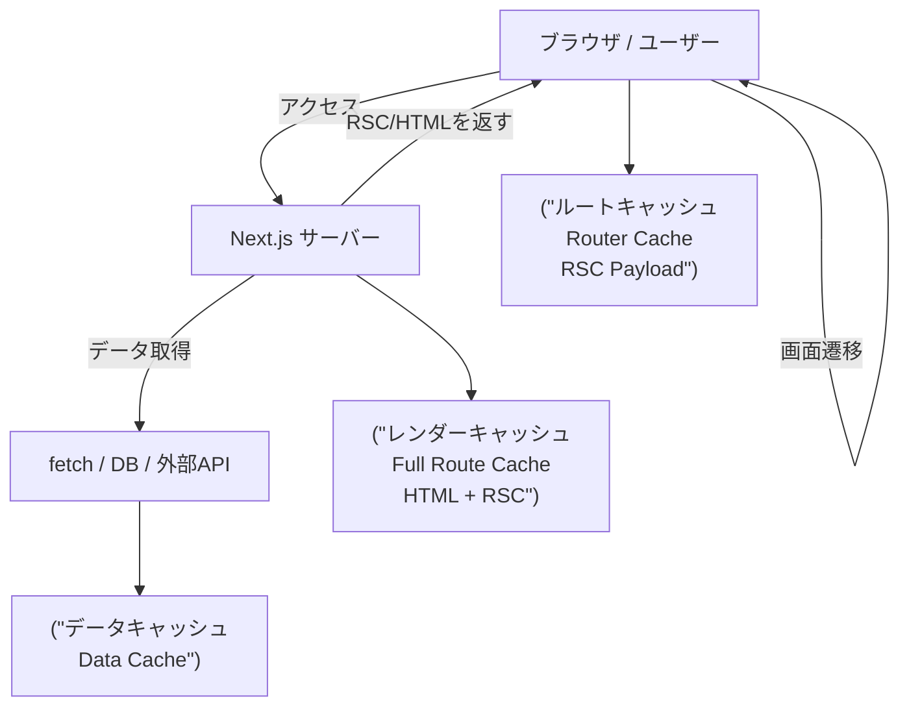
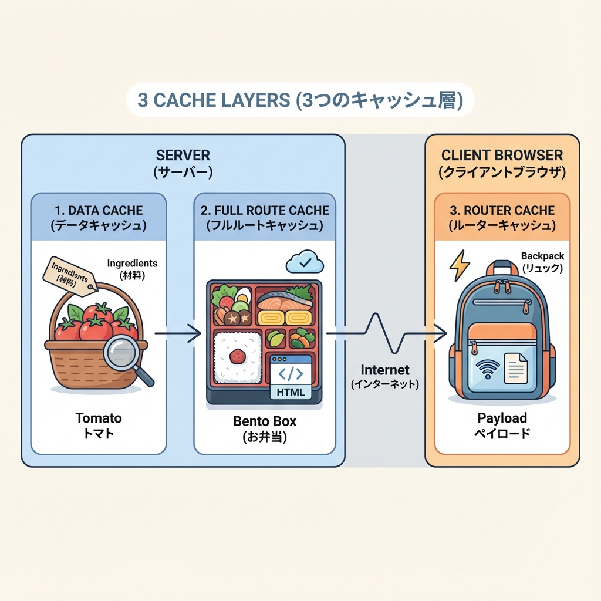

# 第77章：キャッシュの種類：データ/レンダー/ルート ざっくり🧠

この章は「Next.jsのキャッシュって、結局なにがどこに溜まるの？」を一発で整理する回だよ〜！😊✨
Next.js（App Router）には主に **3つの“場所が違うキャッシュ”** があると思うとスッキリするよ💡
（公式ドキュメントだと Data Cache / Full Route Cache / Router Cache って呼ばれるやつ！） ([Next.js][1])

---

## 1) 今日のゴール🎯✨

* **3種類のキャッシュ**を「何が入ってる？どこにある？いつ効く？」で説明できる🧩
* 「キャッシュのせいで更新が反映されない😵」ときに、**どの層を疑うか**の当たりがつく🔍

---

## 2) まず結論：キャッシュは“層”になってる🧊🧊🧊

Next.jsのキャッシュを、ざっくりこう覚えると超ラクだよ😊

* **データキャッシュ（Data Cache）**：APIの返り値とか、DBの結果とか「材料」🍅
* **レンダーキャッシュ（Full Route Cache）**：ページを作った「完成品」🍱（HTML / RSCの結果） ([Next.js][1])
* **ルートキャッシュ（Router Cache）**：画面遷移のときにクライアント側で使う「持ち歩き用」🎒（RSC payload） ([Next.js][1])

---

## 3) 図で見る：どこに何が溜まる？🗺️✨（超ざっくり）

ポイントはこれ👇

* **Data Cache と Full Route Cache はサーバー側**
* **Router Cache はクライアント側（ブラウザ）** ([Next.js][1])

---

## 4) それぞれを“ひとことで”覚える🧠💕

### A. データキャッシュ（Data Cache）🍵

**「データそのもの」を溜める場所**だよ〜！
たとえば `fetch()` で取ったJSONとか、DBクエリ結果とか🧾

* どこ？👉 **サーバー**
* 何が入る？👉 **データ（API結果など）**
* うれしいこと👉 同じデータを何回も取りに行かなくてよくなる💨
* 期間👉 **永続（再検証で更新できる）** ([Next.js][1])

ちなみに `fetch` の `cache` オプションは、**ブラウザキャッシュじゃなくて “Next.jsのData Cache” に対する指定**だよ、って公式が言ってるよ📌 ([Next.js][2])

---

### B. レンダーキャッシュ（Full Route Cache）🍱✨

**「ページをレンダリングした結果（完成品）」**を溜める場所！

* どこ？👉 **サーバー**
* 何が入る？👉 **HTML と RSC payload** ([Next.js][1])
* うれしいこと👉 もう作ってある完成品を配れるから速い⚡
* 期間👉 **永続（再検証で更新できる）** ([Next.js][1])

「静的に作れるページ」だと、ここがめっちゃ効く感じだね😆

---

### C. ルートキャッシュ（Router Cache）🎒🌟

**画面遷移のときに、ブラウザ側で“次の表示”をスムーズにするキャッシュ**！

* どこ？👉 **クライアント（ブラウザ）**
* 何が入る？👉 **RSC payload（画面遷移で使うやつ）** ([Next.js][1])
* うれしいこと👉 遷移のたびにサーバーへ行く回数を減らせる🚶‍♀️💨
* 期間👉 **ユーザーのセッション or 時間ベース** ([Next.js][1])

---

## 5) よくある混乱ポイント🥺➡️😊

### 「キャッシュって、勝手に全部溜まるの？」🧊

2025年の今のNext.jsだと、**`fetch` はデフォルトでキャッシュされない**（必要なら `cache: 'force-cache'` を付ける）ってガイドにあるよ！ ([Next.js][3])
なので「データは毎回取り直してるけど、ページはプリレンダーされて速い」みたいなケースも起きるよ〜😳 ([Next.js][3])

### 「更新したのに表示が変わらない！」🔄😵

まずこの順で疑うと迷子になりにくいよ👇

1. **完成品（レンダーキャッシュ）が残ってる？** 🍱
2. **材料（データキャッシュ）が古い？** 🍅
3. **ブラウザ側（ルートキャッシュ）が持ってる？** 🎒

---

## 6) ミニたとえ話で固定する🎀

* **データキャッシュ**：冷蔵庫の食材🍅（材料が残る）
* **レンダーキャッシュ**：作り置き弁当🍱（完成品が残る）
* **ルートキャッシュ**：通学バッグのメモ🎒（移動中に使う）

「どれが古いと困る？」が直感でわかるようになるよ😊✨

---

## 7) ちょい確認クイズ📝💡（答えは下）

1. APIの返り値が溜まるのはどれ？
2. HTML/RSCの“完成品”が溜まるのはどれ？
3. 画面遷移を速くするために、ブラウザ側で効くのはどれ？

---

### ✅答え🎉

1. データキャッシュ（Data Cache）🍅
2. レンダーキャッシュ（Full Route Cache）🍱
3. ルートキャッシュ（Router Cache）🎒

---

次の章（第78章）で「じゃあ `no-store` って何に効くの？🔥」って話につながるよ〜😊✨

[1]: https://nextjs.org/docs/app/guides/caching "Guides: Caching | Next.js"
[2]: https://nextjs.org/docs/app/api-reference/functions/fetch "Functions: fetch | Next.js"
[3]: https://nextjs.org/docs/app/getting-started/caching-and-revalidating "Getting Started: Caching and Revalidating | Next.js"
