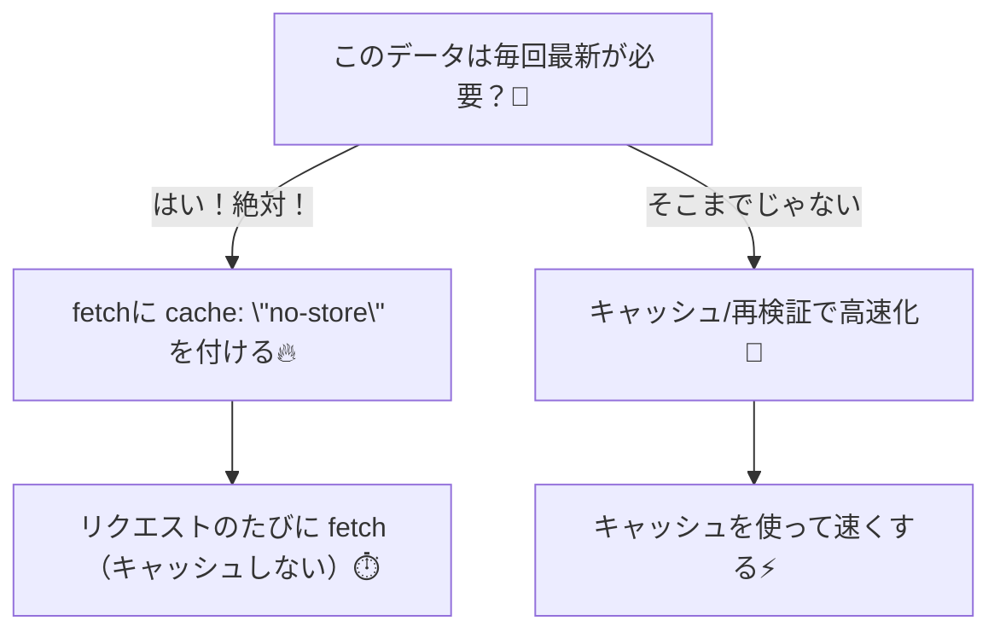
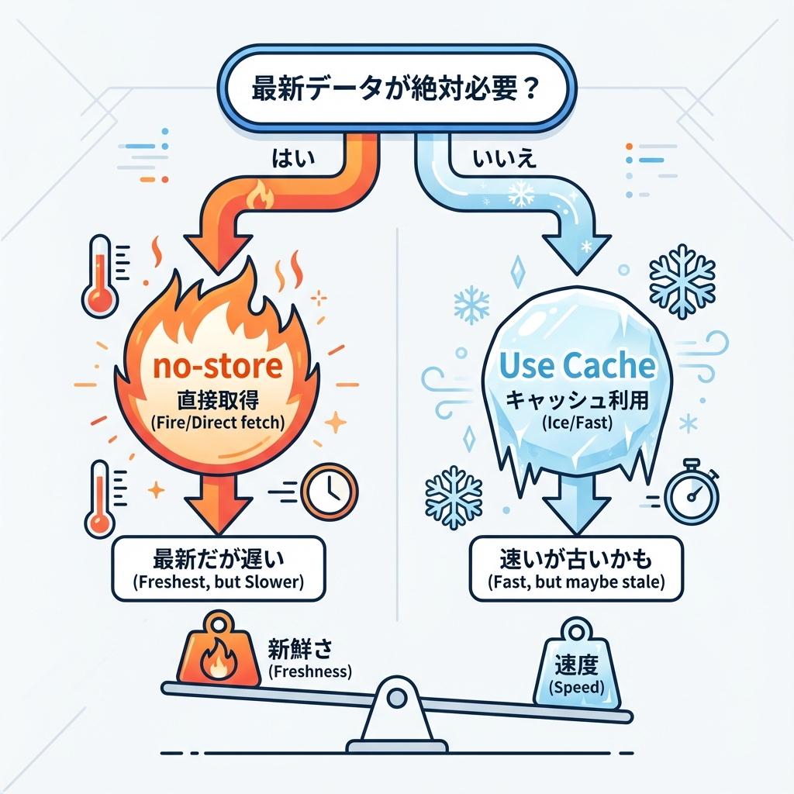

# 第78章：`cache: "no-store"` の使いどころ🧊➡️🔥

## 今日のゴール🎯

「このデータ、**毎回ぜったい最新じゃないと困る！**」って時に、Next.js の `fetch` で **キャッシュをしない**設定（`cache: "no-store"`）を使えるようになるよ〜😊✨

---

## `cache: "no-store"` ってなに？🤔

Next.js のサーバー側 `fetch()` は、ただの Web の `fetch` じゃなくて、**Next.js の Data Cache（永続キャッシュ）**と連携できるように拡張されてるよ🍵
その中で `cache: "no-store"` を付けると…

* **毎回リモートから取りに行く（毎リクエスト fetch）**
* **キャッシュに保存しない**

っていう挙動になるの！🔥 ([Next.js][1])

---

## どういう時に使うの？💡（使いどころリスト✨）

### ✅ 1) 画面を開くたびに変わってほしいデータ⏱️

* 現在時刻⌚
* 在庫数📦
* リアルタイムランキング📈
* “いま何人オンライン？”👥

**ちょっと古い情報が出ると困る**系は `no-store` が向いてるよ〜！

### ✅ 2) ユーザーごとに内容が変わる（混ざったら事故）🚨

* マイページの通知🔔
* 個人の購入履歴🧾
* 管理画面の売上（権限あり）🔐

キャッシュが効くと「別の人の結果が見える」みたいな事故が怖いので、**迷ったら no-store** が安心😊（Next.js は `fetch` のキャッシュ挙動を制御できるよ、って公式も説明してる） ([Next.js][1])

### ✅ 3) “絶対に最新”が要件になってる時📌

「ダッシュボードは常に最新」みたいに仕様に書かれてるやつ✨
パフォーマンスより正確さが勝つやつね🙂

---

## 逆に、使わない方がいい時🙅‍♀️

`no-store` は便利なんだけど、**毎回サーバーやAPIに取りに行く**から…

* アクセスが多いページだと、APIが苦しむ😵‍💫
* 表示が遅くなりやすい🐢
* コストも増えやすい💸

「ちょい最新でOK（例：1分ごと更新）」みたいな時は、**別の仕組み**のほうが向いてるよ（これは後で扱うやつ😉）

---

## 図解：`no-store` を選ぶ判断🧊🔥（Mermaid）





---

## 実装例：毎回最新の「現在時刻」を表示する⌚✨

### 1) ページを作る📄

`app/time/page.tsx` を作って、こう書いてね👇

```tsx
type TimeApiResponse = {
  datetime?: string;
};

export default async function TimePage() {
  const res = await fetch("https://worldtimeapi.org/api/timezone/Asia/Tokyo", {
    cache: "no-store",
  });

  if (!res.ok) {
    throw new Error("時刻APIの取得に失敗したよ🥺");
  }

  const data: TimeApiResponse = await res.json();

  return (
    <main style={{ padding: 24 }}>
      <h1>現在時刻（毎回最新）⌚✨</h1>
      <p>APIのdatetime: {data.datetime ?? "取得できなかったよ🥺"}</p>
      <p style={{ marginTop: 12 }}>
        このページを更新すると、毎回APIに取りに行くよ〜🔥
      </p>
    </main>
  );
}
```

### 2) 動かす▶️

```bash
npm run dev
```

> ちなみに開発中（dev）は、設定によっては「元々毎回取りに行って見える」こともあるよ〜！
> `fetch` のデフォルト挙動は **開発と本番（build）で違う**ことがあるって公式にも書かれてるよ📝 ([Next.js][1])

---

## よくある勘違いポイント😵‍💫（ここ大事！）

### 「ブラウザの fetch」と意味が同じ？🌐

* **ブラウザ**の `cache` は「HTTPキャッシュとの付き合い方」
* **Next.jsサーバー**の `cache` は「Next.js の Data Cache との付き合い方」

っていう違いがあるよ！✨（公式がこの違いを説明してるよ） ([Next.js][1])

---

## ミニ練習🎮（5分でOK）

1. さっきの `cache: "no-store"` を **消して**みる✂️
2. 画面更新して、表示がどう変わるか観察👀
3. 「毎回最新が必要か？」を自分で判断して、付ける/付けないを決めてみよ〜😊✨

---

## まとめ🍙✨

* `cache: "no-store"` は **「毎回最新が必要」な fetch に付ける**🔥
* 付けると **毎リクエスト fetch（キャッシュしない）**になるよ ([Next.js][1])
* ただし **負荷は増える**から、使いどころを選ぶのがコツ🙂💡

[1]: https://nextjs.org/docs/app/api-reference/functions/fetch "Functions: fetch | Next.js"
