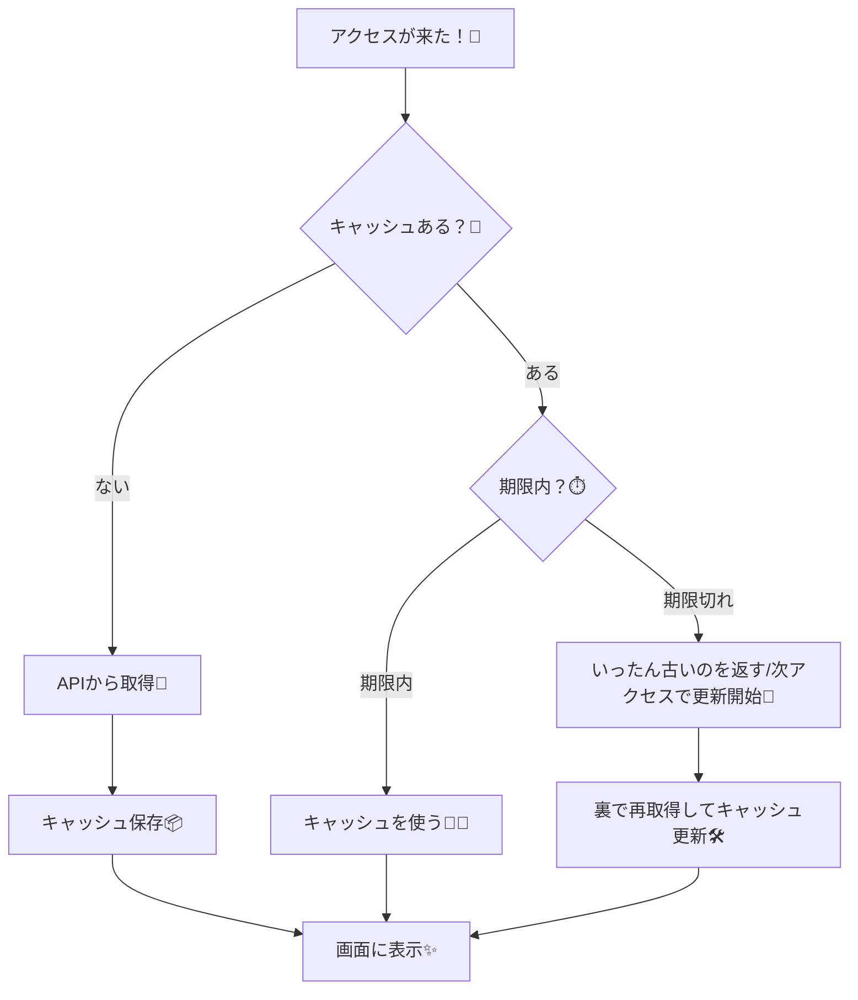

# 第79章：`revalidate` の考え方（ちょい更新したい）⏱️

今日は **「キャッシュは使いたいけど、たまに新しくしたい」**って時の合言葉 👉 `revalidate` だよ〜！😊💕

---

## 1) `revalidate`って結局なに？🤔💡

一言でいうと…

**「このデータ、何秒くらい“新鮮”って扱っていい？」**を決める仕組みだよ🍓🧊

* `revalidate: 60` なら
  👉 **最大でも60秒に1回**くらいのペースで新しくしようね、って感じ⏱️
* ずっと最新じゃなくてOKなデータ（ニュース一覧、ランキング、ブログ記事など）にぴったり📰✨

Next.jsの公式でも、**一定時間ごとに再取得して新しいデータにする**のが “time-based revalidation” だよ〜って説明されてるよ📘✨ ([Next.js][1])

---

## 2) どう動くの？（超ざっくり）🧠🔁

ポイントはここ👇

✅ **期限が切れた瞬間に勝手に更新されるわけじゃない**
✅ **次に誰かがアクセスした時に**「更新しよっか」って動き始めることが多いよ🚪✨
（＝アクセスがトリガーになりやすい）

公式でも `export const revalidate = 3600 // revalidate at most every hour` みたいに **“at most”**（最大でも）ってニュアンスで書かれてるよ⏱️ ([Next.js][1])

---

## 3) イメージ図：冷蔵庫の「賞味期限」モデル🧊🍱

* キャッシュ＝冷蔵庫
* `revalidate`＝賞味期限（秒）
* 期限内＝そのまま食べる
* 期限切れ＝次の人が開けたタイミングで作り直し（更新）




> ※ “期限切れの扱い（古いの返す/待つ）” は状況で変わりうるけど、学習としては
> **「期限切れ→次のアクセスをきっかけに更新が走る」**って覚えるとラクだよ😊✨

---

## 4) `revalidate`はどこで決めるの？📍🧩

大きく2つの考え方があるよ〜！

### A. ページ/レイアウト単位で「このルートはこの頻度」🧱

`export const revalidate = number` みたいに設定できるよ（Route Segment Config）📦

* `false | 0 | number` が使えるよ〜 ([Next.js][2])
* **開発中（Dev）は基本キャッシュされない**ので、挙動確認は本番モードが前提になりやすいよ🧪 ([Next.js][2])

### B. `fetch`ごとに「このデータはこの頻度」🍵

`fetch(url, { next: { revalidate: 60 } })` みたいに、データ単位で決める感じだよ⏱️ ([Next.js][1])

---

## 5) どんな時に使う？使わない？🎯🙅‍♀️

### 使うと気持ちいい例😍✨

* ブログ記事一覧📝（毎秒は変わらないけど、たまに増える）
* ランキング🏆（数分〜数時間に1回でOK）
* お知らせ一覧📢（更新は時々）

### 使わない方がいい例🙅‍♀️💦

* ログイン中の個人データ👤（人によって違う）
* 毎回最新が必要（残高、在庫、株価っぽいもの）📈
  → こういうのは `no-store` 的な方向が合うことが多いよ（後ろの章でやるイメージ！）🔥 ([Next.js][1])

---

## 6) ミニ実験：10秒だけ同じ結果になってほしい！🧪⏱️

「本番モード」っぽく動かすと体感しやすいよ〜！（Devだとキャッシュされないことが多いので注意）🧠✨ ([Next.js][2])

### `app/revalidate-demo/page.tsx`（例）

```tsx
export default async function Page() {
  const res = await fetch("https://httpbin.org/uuid", {
    next: { revalidate: 10 },
  });
  const data = (await res.json()) as { uuid: string };

  return (
    <main style={{ padding: 24 }}>
      <h1>revalidate デモ ⏱️</h1>
      <p>下のUUIDが「10秒くらい同じ」なら成功🎉</p>
      <pre style={{ fontSize: 18 }}>{data.uuid}</pre>
    </main>
  );
}
```

#### ざっくり確認の流れ（Windows想定）🪟✨

1. `npm run build`
2. `npm start`
3. ブラウザでページを開いて、10秒以内に更新🔄
4. ちょい待って（10秒以上）また更新🔄

> API側の都合や環境で挙動が100%同じにならない場合もあるけど、学習としてはこの方向でOKだよ〜😊✨

---

## 7) ありがちハマりポイント集🪤😵‍💫

* **Devで試して「変わらない/毎回変わる」って混乱する**
  → Devはキャッシュされない前提になりやすいよ🧪 ([Next.js][2])
* **`revalidate`は「きっちり毎N秒で更新」じゃなくて「最大でもN秒に1回」感覚**
  → “at most” のイメージが大事⏱️ ([Next.js][1])
* **Route Segment の `revalidate` は “式” で書けないことがある**
  → `600` はOKでも `60 * 10` はダメ、みたいな話があるよ📌 ([Next.js][2])

---

## まとめ🎀✨

* `revalidate` は **「キャッシュの賞味期限（秒）」**🍓🧊
* **ちょい更新したい**（でも毎回最新はいらない）時の最適解になりやすい⏱️
* **次のアクセスが更新のきっかけ**になりやすいので、“最大でもN秒に1回” の感覚で覚える😊✨ ([Next.js][1])

次は（第80章で）`next: { revalidate }` をもう少し「手になじむ」感じにしていこ〜！💪💕

[1]: https://nextjs.org/docs/14/app/building-your-application/data-fetching/fetching-caching-and-revalidating "Data Fetching: Fetching, Caching, and Revalidating | Next.js"
[2]: https://nextjs.org/docs/app/api-reference/file-conventions/route-segment-config "File-system conventions: Route Segment Config | Next.js"
