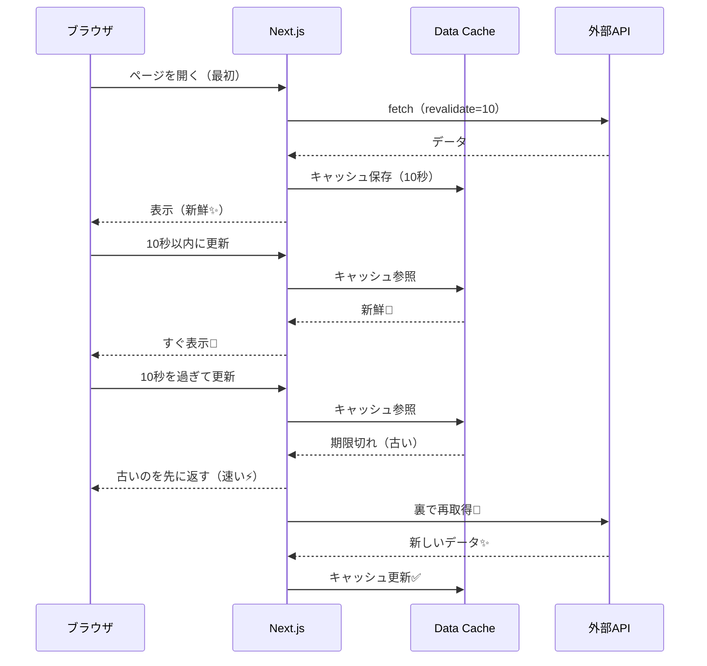
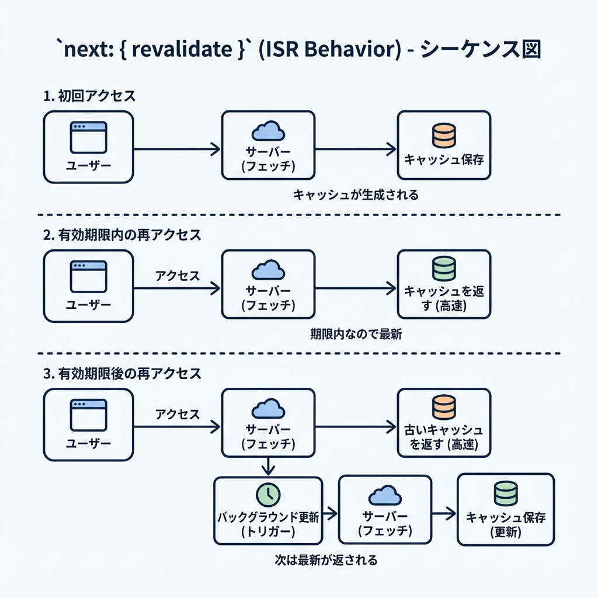

# 第80章：`next: { revalidate }` の雰囲気を掴む🧩

この章のゴールはこれだけ！✨
**「このデータ、ずっと最新じゃなくていいかも…」**って時に、**何秒ごとに更新するか**を「fetch 1回ごと」に指定できるようになることだよ〜😊🍵
（これ、**ほどよく速く**できてめっちゃ便利！）

---

## 1) まず結論：next: \{ revalidate \} は何？🧠✨

Server 側の fetch にこう書くやつ👇

```ts
fetch("https://...", { next: { revalidate: 60 } })
```

意味は超ざっくりこう！👇

* **最大 60 秒間**は、前に取ってきた結果（キャッシュ）を使う🧊
* **60 秒を過ぎたあと**のアクセスで、まずは古い結果をパッと返して（速い）🚀
  裏でこっそり取り直して更新する（次の人から新しいのが出る）🔁✨
  ※いわゆる ISR 的な「古いの返しつつ裏で更新」挙動だよ〜 ([Next.js][1])

「revalidate」自体は **秒数**で、Next.js の fetch 拡張で **false / 0 / 数字**が指定できるよ👇 ([Next.js][2])

* **false**：ずっとキャッシュ（ほぼ無期限）🧊
* **0**：キャッシュしない（毎回取りにいく）🔥
* **数字**：その秒数を上限にキャッシュ⏱️

---

## 2) 図でイメージ！「1回目は取りに行く → 期限内は再利用 → 期限切れは裏で更新」🧊🔁





---

## 3) ハンズオン：10秒ごとに「時刻API」を更新してみよう🕰️🌸

### 手順A：ページを作る📄✨

プロジェクトの中で、次のファイルを作ってね👇

* `app/revalidate-demo/page.tsx`

中身をこれにするよ〜😊（コピペOK！）

```tsx
type WorldTimeApiResponse = {
  datetime: string; // 例: "2025-12-25T12:34:56.789+09:00"
  timezone: string; // 例: "Asia/Tokyo"
};

async function getTokyoTime(): Promise<WorldTimeApiResponse> {
  const res = await fetch("https://worldtimeapi.org/api/timezone/Asia/Tokyo", {
    next: { revalidate: 10 }, // ★ここが第80章ポイント！
  });

  if (!res.ok) {
    throw new Error("時刻APIの取得に失敗しました🥲");
  }

  return res.json();
}

export default async function Page() {
  const data = await getTokyoTime();

  return (
    <main style={{ padding: 24, fontFamily: "system-ui" }}>
      <h1 style={{ fontSize: 24, marginBottom: 12 }}>
        revalidate-demo ⏱️🧊
      </h1>

      <p style={{ marginBottom: 8 }}>
        これは <b>next: {"{ revalidate: 10 }"}</b> を使ったデモだよ😊✨
      </p>

      <ul style={{ lineHeight: 1.8 }}>
        <li>timezone：{data.timezone} 🌏</li>
        <li>
          APIのdatetime：<b>{data.datetime}</b> 🕰️
        </li>
      </ul>

      <p style={{ marginTop: 16, opacity: 0.8 }}>
        コツ：10秒以内に更新すると同じ値になりやすいよ🧊 / 10秒超えたら挙動を観察してね🔁✨
      </p>
    </main>
  );
}
```

### 手順B：本番モードで確認する（おすすめ）✅🚀

開発モードだとキャッシュの見え方がブレることがあるから、**挙動を見たい日は本番モード**がわかりやすいよ〜😊✨ ([Next.js][2])

ターミナルで👇

```bash
npm run build
npm start
```

ブラウザで👇

* `http://localhost:3000/revalidate-demo`

---

## 4) 観察ポイント（ここが楽しい）👀✨

1. ページを開く（1回目）
2. **10秒以内**にリロード → **同じ datetime** が出やすい🧊
3. **10秒を過ぎて**リロード →

   * 1回目は古いのが出ることがある（速いから）⚡
   * もう1回リロードすると新しいのが出ることがある🔁✨
     ※これが「古いの返しつつ裏で更新」っぽい挙動だよ〜 ([Next.js][1])

---

## 5) よくあるハマり（回避しよっ）🪤🥲

### ハマり①：DevTools の「ハードリロード」で効かない😵

開発中のハードリロード等で `cache-control: no-cache` が付くと、**cache / revalidate / tags が無視**されることがあるよ〜 ([Next.js][2])
👉 まずは普通のリロードで試すのがおすすめ😊

### ハマり②：同じURLを違う秒数で revalidate して混乱🤯

同じURLを同じ画面内で複数回 fetch して、revalidate が違うと **小さい秒数が優先**されたりするよ〜 ([Next.js][2])
👉 迷ったら「そのURLはこの秒数」って揃えるのが安全✨

### ハマり③：cache: "no-store" と一緒に書いちゃった😇

`revalidate` と `no-store` はケンカしがちで、矛盾すると無視される（開発だと警告）ことがあるよ〜 ([Next.js][2])
👉 “毎回最新”にしたいなら **revalidate: 0** か **no-store** のどっちかに寄せるのが◎

---

## 6) まとめ（第80章の合言葉）🎀✨

* **next: \{ revalidate: 秒 \}** は「この fetch の更新頻度」を決める⏱️
* **速さ**と**新しさ**のバランスを取る仕組み🧊⚡
* 期限切れ後は **古いのを返して裏で更新**、が起きやすい（ISRっぽい）🔁 ([Next.js][1])

---

## おまけミニ確認クイズ🎓💡

1. `revalidate: 0` はどんな意味？🔥
2. 同じURLを `revalidate: 60` と `revalidate: 10` で混ぜたら、どっちが効きやすい？🧠
3. 10秒を過ぎた直後の最初のアクセスで「古い値」が出ることがあるのはなぜ？🔁

（答え合わせしたければ、送ってくれたら一緒にやるよ〜😊🌸）

[1]: https://nextjs.org/docs/app/guides/incremental-static-regeneration?utm_source=chatgpt.com "How to implement Incremental Static Regeneration (ISR)"
[2]: https://nextjs.org/docs/app/api-reference/functions/fetch "Functions: fetch | Next.js"
