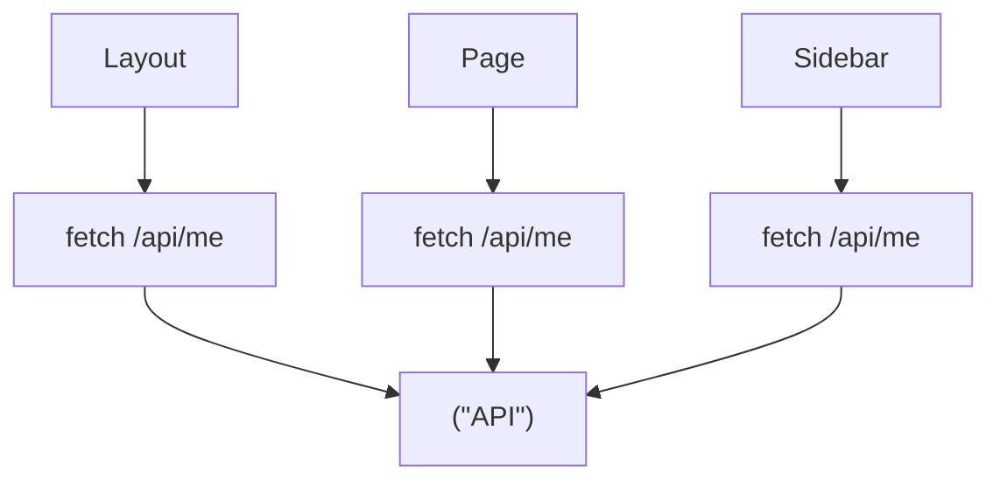
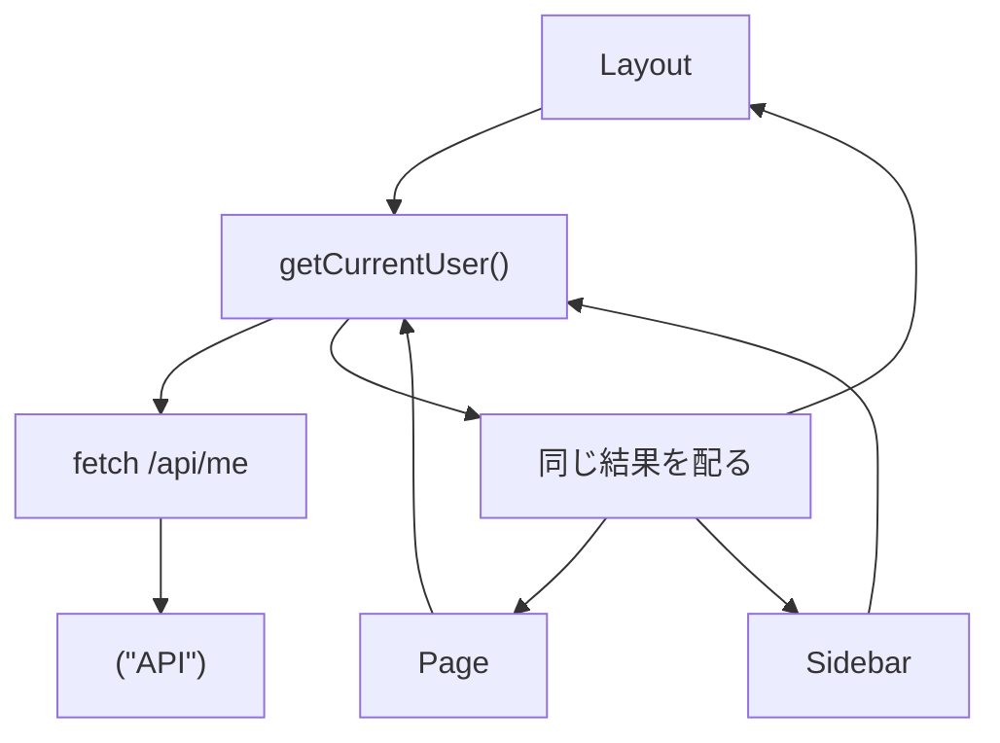
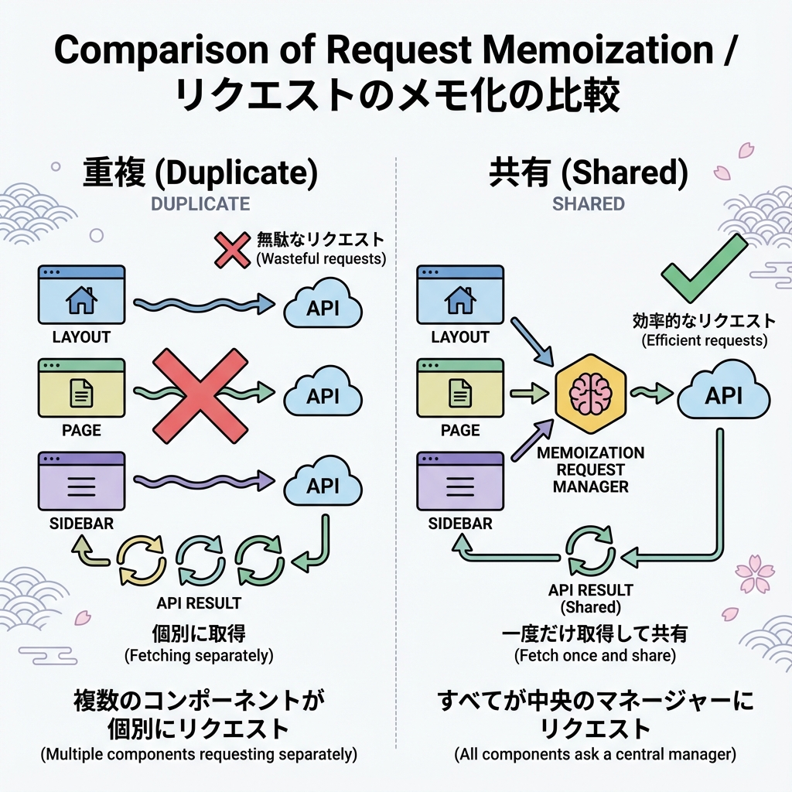

# 第81章：リクエストの重複を減らす考え方（同じデータは共有）🍱

この章のゴールはこれだよ〜！💡
**「同じデータが欲しいコンポーネントが何個あっても、ムダに同じ通信（or DB問い合わせ）を増やさない」**ようにすること🧠💕

---

## 1) ありがちな事故：同じユーザー情報を3回取りに行ってる😇📡📡📡

たとえば、こんな画面👇

* ヘッダーに「こんにちは、◯◯さん」😊
* 本文に「プロフィール」📄
* サイドバーに「アカウント」⚙️

全部「同じユーザー情報」が必要なのに、各コンポーネントがそれぞれ `fetch("/api/me")` したら…
**同じリクエストが何回も飛んじゃう**ことがあるよね〜😭💸（遅くなる・料金や制限がキツい・ログがうるさい）

---

## 2) まず知っておきたい：Next.jsには「同じfetchは1回にまとめる」仕組みがある🍀

Next.js は `fetch` を拡張していて、**URLとオプションが同じ `fetch` を自動でメモ化（重複排除）**してくれるよ✅
だから、**同じデータを複数箇所で `fetch` しても、レンダリング中は1回にまとまる**ことがあるの✨ ([Next.js][1])

しかもポイント！
`{ cache: "no-store" }` みたいに **データキャッシュしない設定でも**、「重複排除（メモ化）」自体は効く（＝同じレンダーパス中の二重通信は避けられる）よ🍵 ([Next.js][1])

> ただし、**URLやoptionsがちょっとでも違うと別物扱い**になるよ⚠️（ヘッダー、クエリ、`next: { revalidate }` なども含めて）

---

## 3) 図でつかむ：重複してる状態 vs 共有できてる状態🧩

### ❌ 重複してる状態（ムダが発生）💦



### ✅ 共有できてる状態（1回でみんな使う）🍱✨





---

## 4) 実戦テク：3つの「重複を減らす作法」🌟

### 作法A：データ取得を「1つの関数」に集める📦（最重要！）

同じデータを取りに行く処理を、あちこちに散らさないで
`src/lib/` に **1本化**しちゃうのが超おすすめ🥰

### 作法B：`cache()` で「同じ引数なら同じ結果」を保証する🍪

`fetch` 以外（DB/ORM/SDK）って、Nextの `fetch` 重複排除が効かないことがあるのね😵
そこで **Reactの `cache()`** を使うと、**同じ引数の呼び出しは1回にまとまる**よ✨

### 作法C：「同じURL/同じoptions」を守る🧷

同じに見えて、地味に違うと別リクエスト判定になるよ⚠️
例：

* `?t=${Date.now()}` を付けてる🧨（毎回違うURLになる）
* `headers` がコンポーネントごとに違う📮
* `cache`/`next` オプションがバラバラ🌀

---

## 5) ハンズオン：ヘッダーとページで同じユーザーを共有する😊🪄

### ① `src/lib/getUser.ts` を作る📄

```ts
// src/lib/getUser.ts
import { cache } from "react";

export type User = {
  id: number;
  name: string;
  username: string;
  email: string;
};

// 同じ id なら結果（Promise）を共有してくれる✨
export const getUser = cache(async (id: number): Promise<User> => {
  console.log("[getUser] fetching...", id); // サーバー側ログで回数チェック👀

  const res = await fetch(`https://jsonplaceholder.typicode.com/users/${id}`, {
    cache: "no-store", // 今回は「毎回新鮮」だけど、重複排除は効く🍵
  });

  if (!res.ok) throw new Error("Failed to fetch user");
  return res.json();
});
```

### ② ヘッダー用コンポーネント `components/UserHello.tsx` 🍀

```ts
// components/UserHello.tsx
import { getUser } from "@/lib/getUser";

export default async function UserHello() {
  const user = await getUser(1);

  return (
    <div style={{ padding: 12, borderBottom: "1px solid #ddd" }}>
      こんにちは、<b>{user.name}</b> さん 😊🌸
    </div>
  );
}
```

### ③ ページ側 `app/page.tsx` 📄

```ts
// app/page.tsx
import { getUser } from "@/lib/getUser";

export default async function Page() {
  const user = await getUser(1);

  return (
    <main style={{ padding: 12 }}>
      <h1>プロフィール</h1>
      <ul>
        <li>name: {user.name}</li>
        <li>username: {user.username}</li>
        <li>email: {user.email}</li>
      </ul>
    </main>
  );
}
```

### ④ レイアウトでヘッダーを表示 `app/layout.tsx` 🧱

```ts
// app/layout.tsx
import type { ReactNode } from "react";
import UserHello from "@/components/UserHello";

export default function RootLayout({ children }: { children: ReactNode }) {
  return (
    <html lang="ja">
      <body>
        <UserHello />
        {children}
      </body>
    </html>
  );
}
```

✅ これで、**ヘッダーとページが両方 `getUser(1)` を呼んでも**
`cache()` のおかげで **同じレンダリング中は1回にまとまりやすい**よ〜🍱✨

> 開発モードはHMRやリフレッシュ挙動の都合で、キャッシュ設定が期待通りに見えないこともあるよ（本番と完全に同じではない）👀 ([Next.js][1])

---

## 6) よくある落とし穴（ここだけ見て！）⚠️🥺

* **URLが毎回違う**（例：`Date.now()`、ランダム）🎲 → 共有できない
* **fetchのoptionsが違う**（headers/next/cache）🧷 → 別リクエスト扱い
* **同じデータをServer Actionで取りに行ってる**（POST扱い）📮 → 重複しやすい（※読み取りは基本 `fetch`/DB直で）
* **「とりあえず no-store」乱用**🔥 → “毎回取りに行く”ので、必要なところだけにしよ〜（この章は「重複排除」が主役！）

---

## 7) ミニ課題（5分）🧪🎀

1. `components/UserMiniCard.tsx` を作って、また `getUser(1)` を呼ぶ
2. `layout.tsx` に `<UserMiniCard />` を追加
3. ターミナルのサーバーログで **`[getUser] fetching... 1` が増えすぎない**か観察👀✨

できたら勝ち〜！🎉🎉🎉

[1]: https://nextjs.org/docs/app/guides/caching "Guides: Caching | Next.js"
