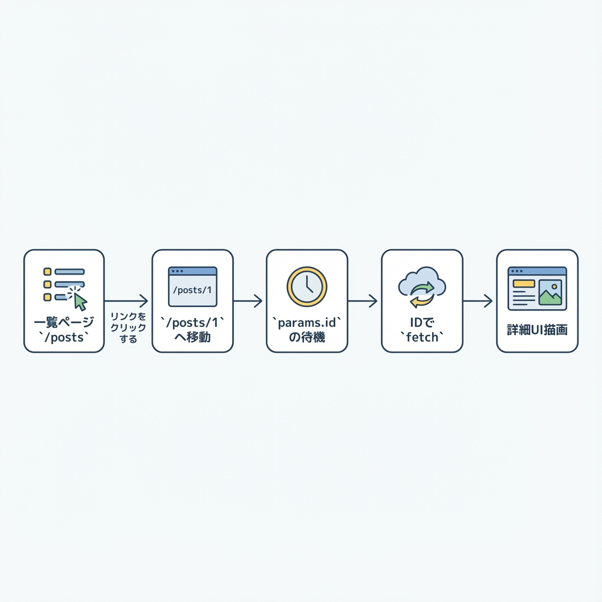
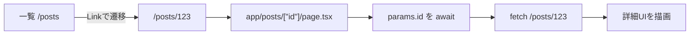
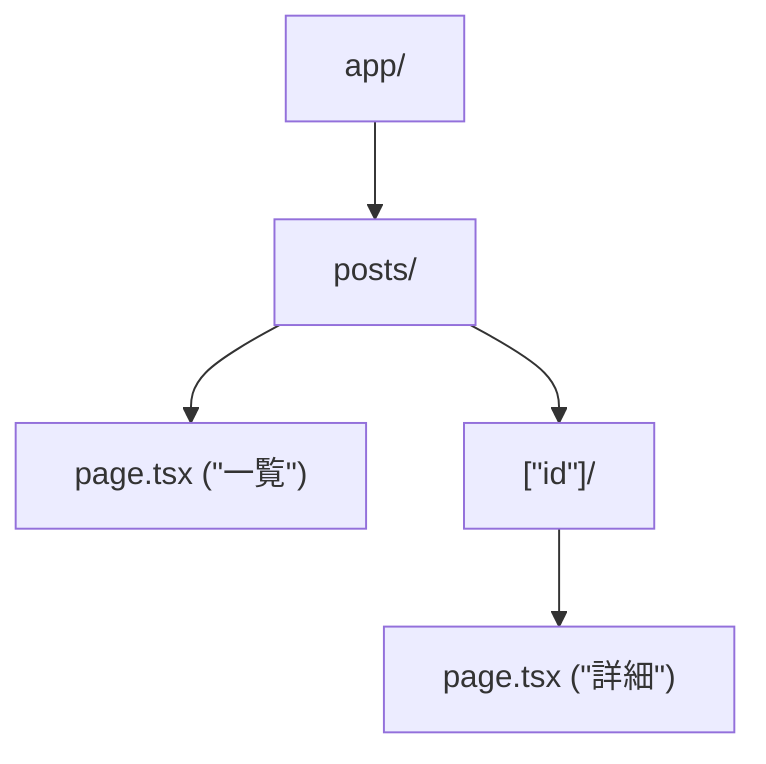

# 第83章：練習：詳細ページでIDを使って取得する🔎

今日は「一覧 → クリック → 詳細ページでIDつき取得」を完成させるよ〜！🎉
URLが `/posts/1` みたいになるやつです🧩

（この章では、例として **JSONPlaceholder** の `/posts/{id}` を使います📮）

---

## ゴール🎯

* `/posts` に一覧がある前提で、各タイトルをクリックすると…
* `/posts/1` みたいな **詳細ページ**へ移動🧭
* 詳細ページで **URLの `id` を使って `fetch`** して表示📥✨

---

## 図解：クリックして詳細が出るまで🗺️





`params` が **Promise** になってるのがポイントだよ〜！🧠✨ ([Next.js][1])

---

## 1) フォルダを作る📁✨（動的ルート）

次の構成になるように作ってね👇



---

## 2) 詳細ページを作る🧾🔎（`app/posts/[id]/page.tsx`）

> ✅ Next.js 15以降は `params` が Promise なので、`await` で取り出すよ！ ([Next.js][1])
> ✅ `PageProps` は、型生成（dev/build/typegen）後にグローバルで使えるよ！ ([Next.js][1])

```tsx
import Link from "next/link";
import { notFound } from "next/navigation";

type Post = {
  userId: number;
  id: number;
  title: string;
  body: string;
};

async function getPost(id: number): Promise<Post | null> {
  const res = await fetch(`https://jsonplaceholder.typicode.com/posts/${id}`);

  if (res.status === 404) return null;
  if (!res.ok) throw new Error("Failed to fetch post");

  return res.json();
}

export default async function Page(props: PageProps<"/posts/[id]">) {
  const { id } = await props.params;

  const idNum = Number(id);
  if (!Number.isInteger(idNum) || idNum <= 0) notFound();

  const post = await getPost(idNum);
  if (!post) notFound();

  return (
    <main style={{ padding: 24, maxWidth: 720, margin: "0 auto" }}>
      <p>
        <Link href="/posts">← 一覧へ戻る</Link>
      </p>

      <h1 style={{ marginTop: 16 }}>{post.title}</h1>
      <p style={{ whiteSpace: "pre-wrap", lineHeight: 1.8 }}>{post.body}</p>

      <hr style={{ margin: "24px 0" }} />
      <small>
        post id: {post.id} / user id: {post.userId}
      </small>
    </main>
  );
}
```

### 🌟もし `PageProps` がまだ使えなかったら（すぐ直る版）

`npm run dev` を一度動かすと型生成されて直ることが多いよ〜🛠️✨ ([Next.js][1])
それでも今すぐ進みたい時は、いったんこの書き方でもOK👇

```tsx
export default async function Page({
  params,
}: {
  params: Promise<{ id: string }>;
}) {
  const { id } = await params;
  // あとは同じ！
}
```

---

## 3) 一覧から詳細へリンクする🔗✨（一覧ページ側）

`/posts` の一覧で、タイトルを `Link` にするだけ〜😊

（例：`app/posts/page.tsx` のリスト部分）

```tsx
import Link from "next/link";

// ...
<li key={post.id}>
  <Link href={`/posts/${post.id}`}>{post.title}</Link>
</li>
// ...
```

---

## 動作チェック✅🎮

* `npm run dev` で起動💨
* ブラウザで

  * `http://localhost:3000/posts`（一覧）
  * そこからクリック → `/posts/1`（詳細）
* 直打ちでもOK：`/posts/10` とか 🔢✨

---

## よくあるつまずき（ここだけ見て！）🧯

* **`params.id` が取れない**：`params` は Promise だから `await` が必要だよ〜！ ([Next.js][1])
* **データ取得の基本**：Server Component で `fetch` して `await` すればOK🍵 ([Next.js][2])

---

## おまけミニチャレンジ🎁✨

* 詳細ページに「次へ →」「← 前へ」ボタンを付けて、`idNum + 1` に移動してみよ〜🚶‍♀️➡️🚶‍♀️
* `fetch(..., { cache: "no-store" })` を付けて挙動の違いも見てみてね👀（更新系のAPIで差が出やすいよ） ([Next.js][2])

[1]: https://nextjs.org/docs/app/api-reference/file-conventions/page "File-system conventions: page.js | Next.js"
[2]: https://nextjs.org/docs/app/getting-started/fetching-data "Getting Started: Fetching Data | Next.js"
