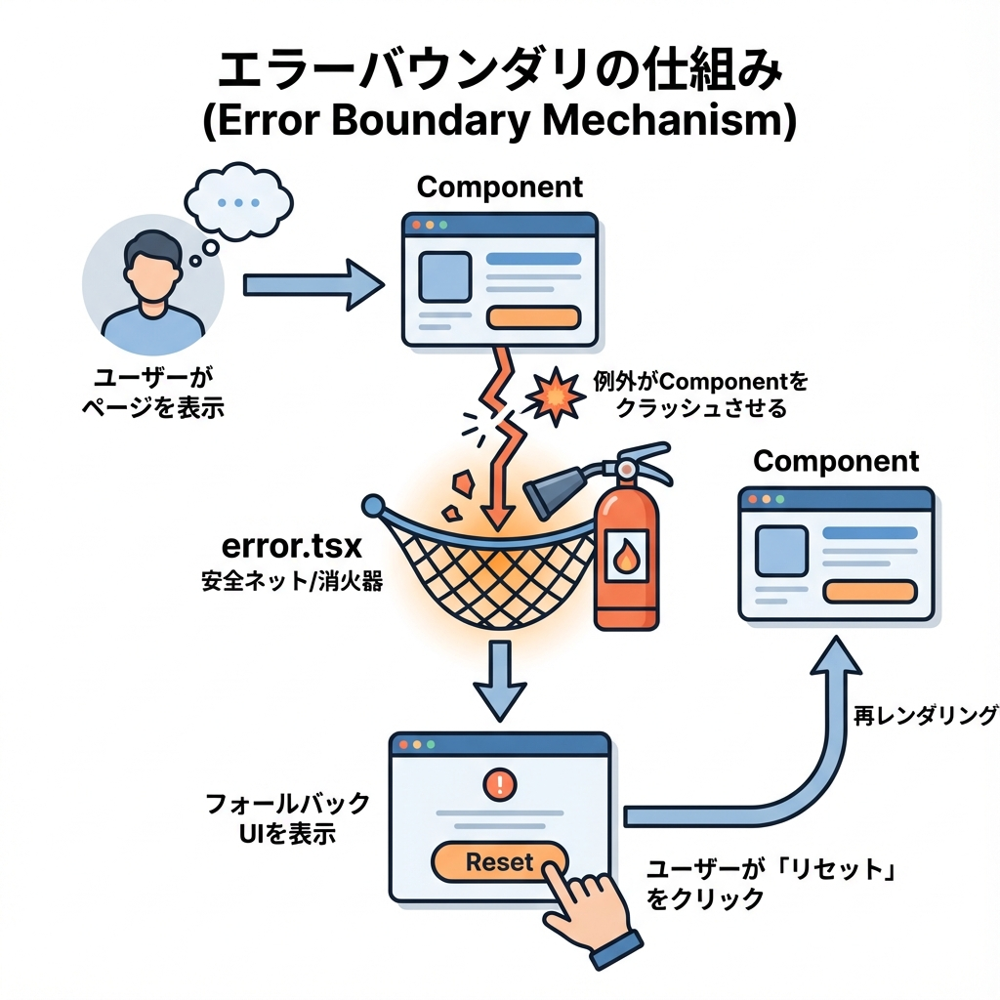
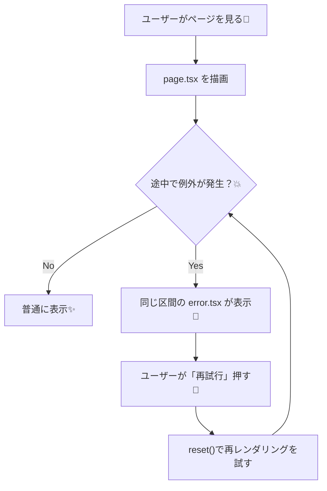

# 第84章：エラー時の表示を整える（`error.tsx`活用）🧯

この章では、「通信に失敗した」「バグで落ちた」みたいな **予期しないエラー** が起きた時に、ユーザーにやさしい画面を出す方法をやるよ〜！😊💡
Next.js（App Router）は **`error.tsx` を置くだけ** で、そのルート区間にエラーバウンダリー（保険）を作れます🛟✨ ([Next.js][1])

---

## 1) `error.tsx` って何？🤔💭

エラーには大きく2種類あるよ👇

* ✅ **想定内のエラー**：バリデーション失敗、入力ミス、ログイン失敗…など（戻り値で扱うのが基本） ([Next.js][2])
* 💥 **想定外のエラー**：バグ、例外、通信まわりの想定外…など（投げたエラーを境界で受ける） ([Next.js][2])

`error.tsx` はこの **想定外のエラー** を受け止めて、**クラッシュの代わりに“かわりの画面”を表示**してくれるファイルだよ🧯✨ ([Next.js][1])

しかもポイントはこれ👇

* `error.tsx` は **ルートセグメント（そのフォルダ配下）** のエラーをまとめて受け止める🧱 ([Next.js][1])
* **Client Componentである必要がある**ので、先頭に `'use client'` が必須！🧡 ([Next.js][1])
* propsで `error` と `reset()` を受け取れるよ🔁 ([Next.js][1])

---

## 2) 仕組みの図解（ざっくり）🧠🗺️





`reset()` は「もう一回その区間を描画しなおしてみる」って感じだよ🔁 ([Next.js][1])

---

## 3) 実際に作ってみよう！🛠️🎀（わざと失敗→エラー画面）

### 3-1) フォルダ構成📁✨

`app/demo-error/` を作って、その中に `page.tsx` と `error.tsx` を置くよ！

```txt
app/
  demo-error/
    page.tsx
    error.tsx
```

---

### 3-2) `page.tsx`（失敗するfetchを用意）📥💥

`?fail=1` が付いてたら **壊れたURL** にfetchして、わざとエラーにするよ😈✨

```tsx
// app/demo-error/page.tsx
export default async function Page({ searchParams }: { searchParams: Promise<{ fail?: string }> }) {
  const { fail } = await searchParams
  const shouldFail = fail === '1'

  const url = shouldFail
    ? 'https://jsonplaceholder.typicode.com/__broken__' // わざと壊す💥
    : 'https://jsonplaceholder.typicode.com/posts?_limit=5'

  const res = await fetch(url)

  // fetch自体が成功しても、404/500なら res.ok が false だよ⚠️
  if (!res.ok) {
    throw new Error(`データ取得に失敗しました（status: ${res.status}）`)
  }

  const posts: Array<{ id: number; title: string }> = await res.json()

  return (
    <main style={{ padding: 16 }}>
      <h1>デモ：エラー表示を整える🧯✨</h1>

      <p>
        ふつうの表示🙂：
        <a href="/demo-error" style={{ marginLeft: 8 }}>
          /demo-error
        </a>
      </p>

      <p>
        わざと失敗😵：
        <a href="/demo-error?fail=1" style={{ marginLeft: 8 }}>
          /demo-error?fail=1
        </a>
      </p>

      <hr style={{ margin: '16px 0' }} />

      <ul>
        {posts.map((p) => (
          <li key={p.id}>{p.title}</li>
        ))}
      </ul>
    </main>
  )
}
```

---

### 3-3) `error.tsx`（エラー画面を作る）🧯💖

`error.tsx` は **必ずClient Component** なので先頭に `'use client'` を書くよ！ ([Next.js][1])
`reset()` をボタンに繋ぐと「もう一回！」ができる✨ ([Next.js][1])

```tsx
// app/demo-error/error.tsx
'use client'

import { useEffect } from 'react'

export default function Error({
  error,
  reset,
}: {
  error: Error & { digest?: string }
  reset: () => void
}) {
  useEffect(() => {
    // 本番では監視ツールに送ったりする想定📡
    console.error(error)
  }, [error])

  return (
    <main style={{ padding: 16 }}>
      <h1>ごめんね、エラーが起きちゃった…😵‍💫🧯</h1>

      <p style={{ marginTop: 8 }}>
        もう一回やってみる？🔁
      </p>

      <div style={{ display: 'flex', gap: 8, marginTop: 12 }}>
        <button onClick={() => reset()} style={{ padding: '8px 12px' }}>
          再試行する🔁
        </button>

        <a href="/demo-error" style={{ padding: '8px 12px', display: 'inline-block' }}>
          安全なページへ戻る🏠
        </a>
      </div>

      <hr style={{ margin: '16px 0' }} />

      <details>
        <summary>開発中だけ：エラー詳細を見る🧪</summary>
        <pre style={{ whiteSpace: 'pre-wrap' }}>{error.message}</pre>
        {error.digest && <p>digest: {error.digest}</p>}
      </details>
    </main>
  )
}
```

補足：本番ではサーバー由来のエラー詳細をそのまま出さない挙動になることがあるよ（情報漏えい防止）🕵️‍♀️🔒 ([Next.js][1])

---

### 3-4) 動作チェック✅🎉

1. ターミナルで `npm run dev` 🚀
2. ブラウザで

   * `http://localhost:3000/demo-error`（成功🙂）
   * `http://localhost:3000/demo-error?fail=1`（失敗😵→ `error.tsx` 表示🧯）

「再試行🔁」を押すと、その区間の再レンダリングを試すよ！ ([Next.js][1])
（ただし `?fail=1` のままだと、そりゃまた失敗するよね😂）

---

## 4) よくあるハマり🔥あるある3つ

* **`'use client'` 書き忘れ** → `error.tsx` はClient必須だよ〜！🧡 ([Next.js][1])
* **どこに置けばいいか迷子** → “その区間だけ守りたい”フォルダの中に置く（例：`app/demo-error/error.tsx`）🗺️ ([Next.js][3])
* **エラー文言を出しすぎ** → 本番は詳細を隠す方が安全。必要なら `digest` でログと突き合わせるイメージ🧾✨ ([Next.js][1])

---

## 5) 練習問題✍️🌸（10〜15分）

1. `app/profile/` を作って、`page.tsx` で `throw new Error('プロフィール取得失敗')` を入れてみよう😈
2. `app/profile/error.tsx` を作って、

   * 「トップへ戻る🏠」
   * 「再試行🔁」
     を付けよう💖
3. 余裕があれば、`details` の中に **開発中だけ** `error.message` を表示してみよう🧪✨

---

## まとめ🧁✨

* `error.tsx` は **予期しないエラー** 用の“保険画面”🧯 ([Next.js][2])
* **ルートセグメントの境界**として働く（置いたフォルダ配下を守る）🧱 ([Next.js][3])
* **Client Component必須**で、`error` と `reset()` を使って「再試行🔁」が作れるよ💖 ([Next.js][1])

次（第85章）で `loading.tsx` を整えると、「エラーもローディングも可愛い」最強UIになるよ〜！⏳💘

[1]: https://nextjs.org/docs/app/api-reference/file-conventions/error "File-system conventions: error.js | Next.js"
[2]: https://nextjs.org/docs/app/getting-started/error-handling "Getting Started: Error Handling | Next.js"
[3]: https://nextjs.org/learn/dashboard-app/error-handling "App Router: Handling Errors | Next.js"
