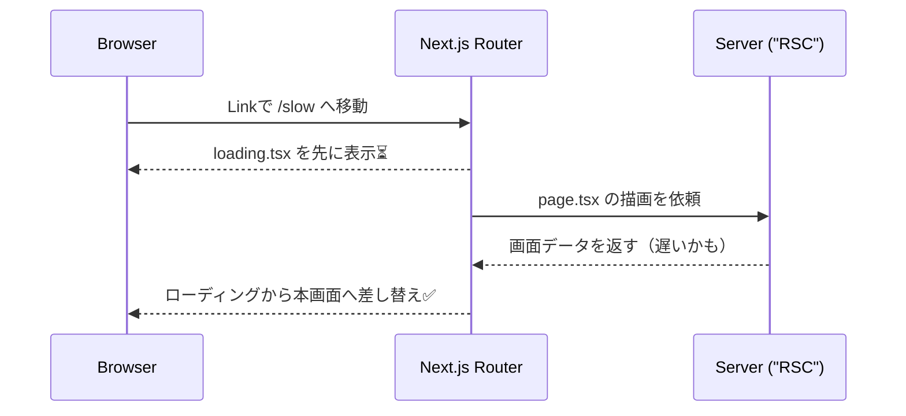

# 第85章：ローディングを整える（`loading.tsx`活用）⏳

## この章のゴール🎯

* ページ移動や初回表示で「待ってる感」をいい感じに見せるUIを作れるようになるよ🫶
* `loading.tsx` を置くだけで、Next.jsが“自動で”ローディング表示→完了したら差し替え、をやってくれるのを体験するよ🌊✨ ([Next.js][1])

---

## `loading.tsx` ってなに？🤔

`loading.tsx` は、**特定のルート（= ルートセグメント）が読み込み中の間だけ表示される**「待ち画面」だよ⏳
Next.jsはこれを **React Suspense** を使っていい感じに扱ってくれて、**サーバーから中身が届いたら自動で差し替え**してくれるよ🔁✨ ([Next.js][1])

---

## どこに置くの？（超重要）📁✨

基本はこれだけ覚えればOK🙆‍♀️💕

* `app/◯◯/page.tsx` があるフォルダに
  👉 `app/◯◯/loading.tsx` を置く
* すると、`/◯◯` に移動したとき、そのページが重い間だけ `loading.tsx` が出るよ⏳✨ ([Next.js][1])

---

## 図でイメージしよう📨➡️⏳➡️✅（Mermaid）




---

## ミニ実験：わざと遅いページを作って体験しよ😆⏳

ここでは `app/slow` ってページを作って、2秒待ってから表示するようにするよ🕰️✨
（これで `loading.tsx` の効果がハッキリ分かる！）

### 1) フォルダを作る📁

* `app/slow/` を作ってね✨

  * VSCodeのエクスプローラーで右クリック→新しいフォルダーでもOK🙆‍♀️

### 2) 遅いページを作る（`page.tsx`）🐢

`app/slow/page.tsx` を作って、これを貼り付けてね👇

```tsx
// app/slow/page.tsx
type Item = {
  id: number;
  title: string;
};

const wait = (ms: number) => new Promise<void>((r) => setTimeout(r, ms));

async function getItems(): Promise<Item[]> {
  // わざと遅くする（2秒）
  await wait(2000);

  // 本来はここが fetch などのデータ取得になるイメージ✨
  return [
    { id: 1, title: "ゼミ資料まとめ" },
    { id: 2, title: "カフェで課題やる" },
    { id: 3, title: "就活メモ整理" },
  ];
}

export default async function Page() {
  const items = await getItems();

  return (
    <main style={{ padding: 16 }}>
      <h1 style={{ fontSize: 24, marginBottom: 12 }}>🐢 ゆっくりページ</h1>
      <p style={{ marginBottom: 12 }}>2秒待ってから表示されます…！</p>

      <ul style={{ lineHeight: 1.9 }}>
        {items.map((x) => (
          <li key={x.id}>✅ {x.title}</li>
        ))}
      </ul>
    </main>
  );
}
```

### 3) ローディング画面を作る（`loading.tsx`）⏳💖

同じフォルダに `app/slow/loading.tsx` を作って、これを貼ってね👇

```tsx
// app/slow/loading.tsx
import styles from "./loading.module.css";

export default function Loading() {
  return (
    <main style={{ padding: 16 }} aria-busy="true" aria-live="polite">
      <h1 style={{ fontSize: 24, marginBottom: 12 }}>⏳ 読み込み中…</h1>
      <p style={{ marginBottom: 12 }}>ちょっとだけ待ってね〜🫶</p>

      <div className={styles.stack}>
        <div className={styles.skeleton} />
        <div className={styles.skeleton} />
        <div className={styles.skeleton} />
      </div>
    </main>
  );
}
```

### 4) スケルトン用CSS（`loading.module.css`）🧁✨

`app/slow/loading.module.css` を作って、これ👇

```css
/* app/slow/loading.module.css */
.stack {
  display: grid;
  gap: 10px;
  max-width: 420px;
}

.skeleton {
  height: 18px;
  border-radius: 10px;
  background: linear-gradient(90deg, #e9e9e9, #f7f7f7, #e9e9e9);
  background-size: 200% 100%;
  animation: shimmer 1.1s infinite linear;
}

@keyframes shimmer {
  0% {
    background-position: 200% 0;
  }
  100% {
    background-position: -200% 0;
  }
}
```

### 5) 動かして確認しよ💨

開発サーバーを起動して、ブラウザで見てね✨

```bash
npm run dev
```

* `http://localhost:3000/slow` に行く
  👉 まずローディングが出て ⏳ → 2秒後に本画面に切り替わる ✅
  この“切り替え”をNext.jsが自動でやってくれるよ✨ ([Next.js][1])

---

## よく使う置き方パターン3つ🍀

### パターンA：そのページだけにローディングを付けたい🎯

* `app/slow/loading.tsx`
  👉 `/slow` の間だけローディングが出る⏳✨

### パターンB：フォルダ配下まとめて同じローディングにしたい📦

* `app/dashboard/loading.tsx` を置くと

  * `/dashboard`
  * `/dashboard/settings`
  * `/dashboard/xxx`
    みたいな配下でも効くよ（同じセグメント配下だから）📁✨ ([Next.js][1])

### パターンC：アプリ全体に“共通ローディング”を置きたい🌍

* `app/loading.tsx`
  👉 かなり広く効くので、やりすぎると「毎回全部真っ白…😢」になりやすいから注意〜⚠️

---

## ハマりやすいポイント（先に回避）🧯💡

* `loading.tsx` は **ルートの読み込み中**に強いよ💪
  でも、ページ表示後に **Client側で `useEffect` して取るデータ**は、別でローディングUIが必要になりがち（この章では「ルートローディング」に集中でOK）🎮
* ローディングは「くるくる」より、**“形が崩れないスケルトン”**が体験よくなりやすいよ🧁✨

---

## 仕上げチェック✅🎀

* [ ] `app/slow/loading.tsx` を置いた
* [ ] `/slow` を開くと先にローディングが見える⏳
* [ ] 2秒後に本画面へ自動で切り替わる🔁
* [ ] ローディング中でもページが“可愛く”見える🫶✨

---

必要なら、この章の続きとして「ローディングを“ページ全体”じゃなく“部分だけ”に出す」やり方（より上級の気持ちよさ💖）も、同じテンションで一緒に作れるよ😆🌟

[1]: https://nextjs.org/docs/app/api-reference/file-conventions/loading?utm_source=chatgpt.com "File-system conventions: loading.js"
