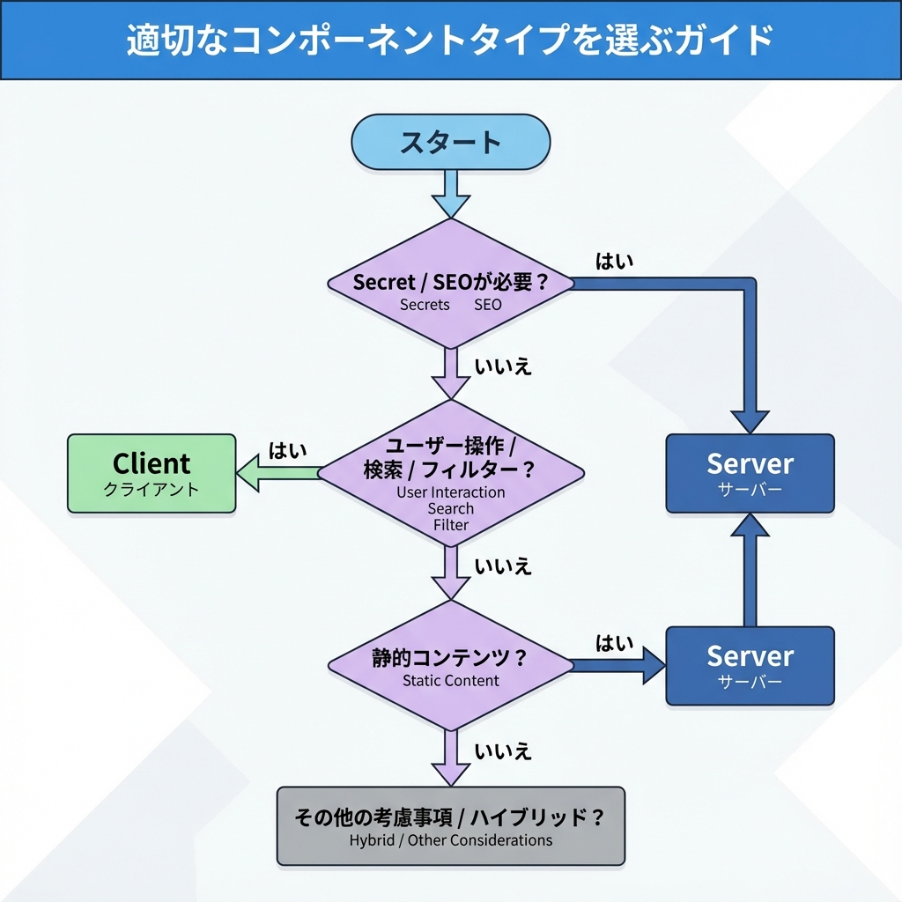
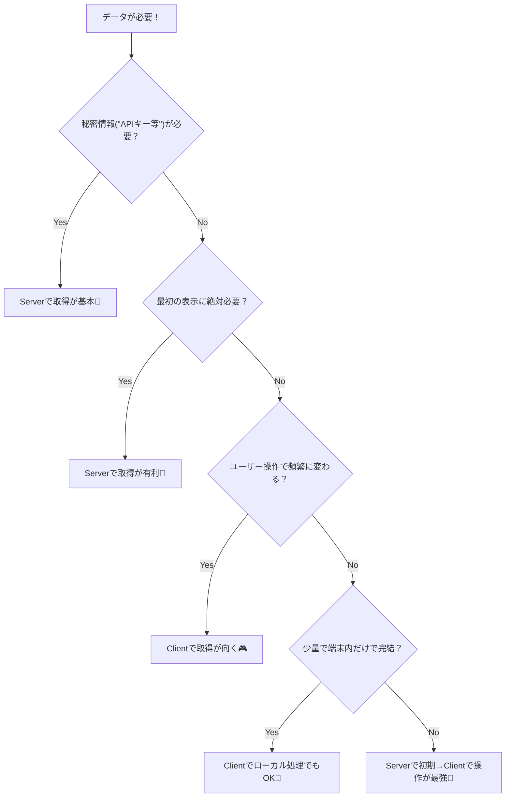

# 第87章：Client側で取るのはどんな時？（検索/操作UI）🎮

この章は「**ユーザーが触った瞬間に変わるUI**」のために、**ブラウザ（Client）でデータ取得するのが向いてる場面**をつかむ回だよ〜😊💡

---

## 今日のゴール🎯

* 「Serverで取るべき？ Clientで取るべき？」を**サクッと判断**できるようになる🧠✨
* **検索フォーム・フィルタ・ページ切り替え**みたいな“操作UI”のときに、Client取得が強い理由を理解する🔍🎮
* 最小のサンプルで「Client取得の型」を作れるようになる🛠️🌸

---

## まず結論：Clientで取るのが得意な場面🏆🎮

「ユーザーが操作するたびに結果が変わる」なら、Clientが向きやすいよ👇

* 🔎 **検索**（入力するたびに結果が変わる）
* 🎚️ **絞り込み・ソート**（チェックボックス/セレクトで変わる）
* 📄 **ページネーション**（次へ・前へ）
* ♾️ **無限スクロール**（スクロールで追加読み込み）
* 🔁 **定期更新（ポーリング）**（最新コメント/通知など）
* 🧩 **部分だけ更新**（画面全体を作り直すほどじゃない）
* 🧑‍💻 **ブラウザだけが持つ情報を使う**（画面サイズ・ローカル状態など）

---

## 逆に…Clientで取るのが苦手な場面😵‍💫💦

* 🗝️ **秘密情報（APIキー等）を使う**必要がある
  → Server側で取るのが基本！（秘密がブラウザに漏れちゃう） ([Next.js][1])
* 🚀 **最初に表示したいメインデータ**（SEO/初速が大事）
  → Server Componentsで取るほうが、送るJSも減って速くなりやすいよ ([Next.js][1])
* 🫧 **Suspenseで“待ちUI”を綺麗にやりたい**（※注意）
  `useEffect` の中でfetchしても、Suspenseはそれを待ってくれないの 🥺（別のやり方が必要） ([React][2])

---

## 判断フロー（迷ったらこれ）🗺️✨





✨いちばん多いのは最後の **「Serverで初期表示 → Clientで検索や絞り込み」** だよ〜！

---

## 重要ポイント：Client Componentは “asyncで直接await”しない🙅‍♀️

Next.jsでは **Client Componentを `async function` にしない**のが基本だよ（注意メッセージもある）
→ Clientで取るなら、まずは `useEffect` か、ライブラリ（SWRなど）でいこうね😊 ([Next.js][3])

---

## ハンズオン：検索UI（Clientで取得＋絞り込み）🔎🎀

### やること🌟

* 初回にClientで一覧を取得📥
* 入力欄でタイトル検索して絞り込み🔎
* ついでに「読み込み中」も表示⏳

### 1) ページを作る📄✨（App Router）

`app/search/page.tsx` を作ってね！

```tsx
'use client';

import { useEffect, useMemo, useState } from 'react';
import { useDeferredValue } from 'react';

type Post = {
  id: number;
  title: string;
  body: string;
};

export default function SearchPage() {
  const [posts, setPosts] = useState<Post[]>([]);
  const [q, setQ] = useState('');
  const deferredQ = useDeferredValue(q); // 入力の引っかかり軽減✨
  const [loading, setLoading] = useState(true);
  const [error, setError] = useState<string | null>(null);

  useEffect(() => {
    const controller = new AbortController();

    (async () => {
      try {
        setLoading(true);
        setError(null);

        // 公開ダミーAPI（学習用）✨
        const res = await fetch('https://jsonplaceholder.typicode.com/posts', {
          signal: controller.signal,
        });
        if (!res.ok) throw new Error(`Fetch failed: ${res.status}`);

        const data: Post[] = await res.json();
        setPosts(data);
      } catch (e) {
        if (e instanceof DOMException && e.name === 'AbortError') return;
        setError(e instanceof Error ? e.message : 'Unknown error');
      } finally {
        setLoading(false);
      }
    })();

    return () => controller.abort();
  }, []);

  const filtered = useMemo(() => {
    const key = deferredQ.trim().toLowerCase();
    if (!key) return posts.slice(0, 20); // 最初は20件だけ表示
    return posts
      .filter((p) => p.title.toLowerCase().includes(key))
      .slice(0, 20);
  }, [posts, deferredQ]);

  return (
    <main style={{ padding: 16, maxWidth: 720, margin: '0 auto' }}>
      <h1 style={{ fontSize: 24, fontWeight: 700 }}>記事検索🔎✨</h1>

      <label style={{ display: 'block', marginTop: 12 }}>
        キーワード📝
        <input
          value={q}
          onChange={(e) => setQ(e.target.value)}
          placeholder="例：qui"
          style={{
            display: 'block',
            width: '100%',
            padding: 10,
            marginTop: 6,
            borderRadius: 10,
            border: '1px solid #ccc',
          }}
        />
      </label>

      {loading && <p style={{ marginTop: 12 }}>読み込み中だよ…⏳</p>}
      {error && <p style={{ marginTop: 12 }}>エラーだよ…🥺 {error}</p>}

      {!loading && !error && (
        <>
          <p style={{ marginTop: 12 }}>
            表示：{filtered.length} 件（最大20件）📚✨
          </p>

          <ul style={{ marginTop: 8, paddingLeft: 18 }}>
            {filtered.map((p) => (
              <li key={p.id} style={{ marginBottom: 10 }}>
                <div style={{ fontWeight: 700 }}>{p.title}</div>
                <div style={{ opacity: 0.8, fontSize: 14 }}>{p.body}</div>
              </li>
            ))}
          </ul>
        </>
      )}
    </main>
  );
}
```

### 2) 起動して見てみよう🚀（Windows / PowerShell）

```bash
npm run dev
```

ブラウザで `http://localhost:3000/search` を開いて、入力すると絞り込みが動けばOKだよ〜🎉💕

---

## もう一歩：Clientで取るなら “SWR” が便利🧁✨

Client取得が増えてくると、**キャッシュ・再取得・フォーカス復帰時の更新**とかが面倒になりがち…🥺
そこでNext.js側も **SWRをおすすめ**してるよ〜！ ([Next.js][4])

（この章では雰囲気だけ！）例：

```tsx
'use client';

import useSWR from 'swr';

const fetcher = (url: string) => fetch(url).then((r) => r.json());

export default function ProfileMini() {
  const { data, isLoading, error } = useSWR('/api/profile', fetcher);

  if (isLoading) return <p>読み込み中…⏳</p>;
  if (error) return <p>エラー…🥺</p>;

  return <p>こんにちは、{data.name} さん😊</p>;
}
```

---

## よくある落とし穴まとめ🪤😳

* 🌀 入力のたびに毎回fetchしてしまって重い
  → **debounce（少し待ってから実行）**や、まずは「一括取得→ローカル絞り込み」もアリ💡
* 🔐 APIキーをClientに置いてしまう
  → **絶対NG寄り**！Serverへ移動しようね ([Next.js][1])
* 🫧 Suspenseで待たせたいのに `useEffect` でfetchしちゃう
  → Suspenseはそれを待たないよ（別設計が必要） ([React][2])

---

## チェックリスト✅✨（これだけ覚えれば勝ち）

* ☑️ **操作で変わる（検索/絞り込み/ページ切替）** → Clientが向く🎮
* ☑️ **最初に出したいメイン** → Serverが強い🧊
* ☑️ **秘密がいる** → Server一択に近い🔐
* ☑️ Client取得が増えたら **SWR等を検討**🍰 ([Next.js][4])

---

以上が「第87章」だよ〜😊🎀

[1]: https://nextjs.org/docs/app/getting-started/server-and-client-components?utm_source=chatgpt.com "Getting Started: Server and Client Components"
[2]: https://react.dev/reference/react/Suspense?utm_source=chatgpt.com "<Suspense> – React"
[3]: https://nextjs.org/docs/messages/no-async-client-component?utm_source=chatgpt.com "No async Client Component"
[4]: https://nextjs.org/docs/pages/building-your-application/data-fetching/client-side?utm_source=chatgpt.com "Data Fetching: Client-side Fetching"
