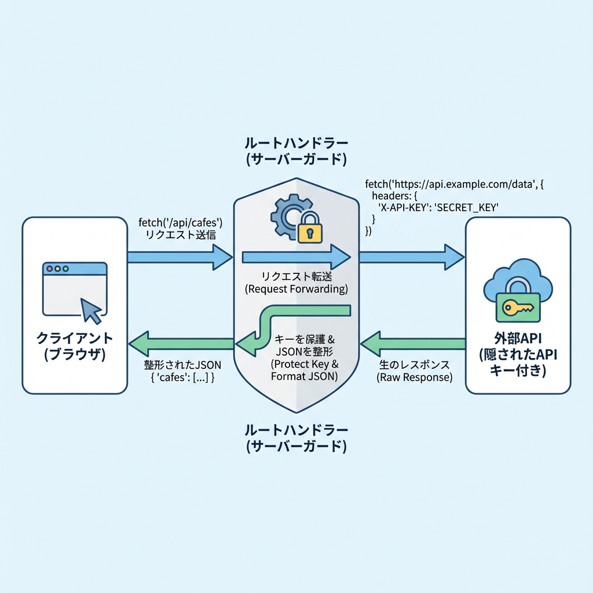
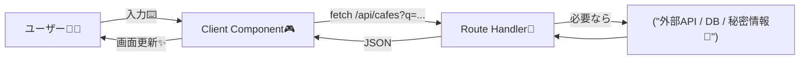

# 第88章：Route Handler経由でクライアント取得する導線🚪

この章は「クライアント（画面側）からデータを取りたいんだけど…直接外部APIを叩くのはちょっと怖い🥺」ってときの、超王道ルートを作る回だよ〜☕️🌸
結論：**画面 →（fetch）→ 自分のアプリ内API（Route Handler）→ 外部API/DB** みたいに“間に1枚かませる”のがめちゃ便利！😺✨ ([Next.js][1])

---

## 1) まずイメージ🌈（なにが嬉しいの？）

Route Handler を挟むと、こういうメリットが出るよ〜！🎁

* **APIキーを隠せる🔐**（クライアントに出さなくてOK） ([Next.js][2])
* **CORSで詰まりにくい🧯**（同一オリジンの `/api/...` を叩くだけ）
* **レスポンス形を整えられる🧼**（画面が使いやすいJSONに変換）
* **バリデーションや制限をサーバーでできる🛡️**
* （必要なら）**キャッシュ方針もコントロールできる🧊** ([Next.js][1])

---

## 2) 全体の流れ（図でスッキリ🧠）





---

## 3) ハンズオン：検索UI → Route Handler 経由で一覧取得☕🔎

今回は「カフェ検索」ミニ例でいくね！🍰✨
入力した文字で、サーバー側（Route Handler）が候補を返して、画面に表示するよ〜🎀

### 作るファイル構成🗂️

* `app/api/cafes/route.ts`（アプリ内API 🚪）
* `app/cafes/page.tsx`（ページ 🏠）
* `app/cafes/CafeSearch.tsx`（検索UI：クライアント 🎮）

> Route Handler は `app` 配下の `route.ts` で作るよ〜！ ([Next.js][1])
> ちなみに、同じルート階層に `page.tsx` と `route.ts` を置くと競合しちゃうので、`app/api/...` に置くのが安全👍 ([Next.js][1])

---

### 3-1) Route Handler（アプリ内API）を作る🚪🧪

`app/api/cafes/route.ts`

```tsx
import { NextResponse } from 'next/server'

type Cafe = {
  id: string
  name: string
  area: string
  tags: string[]
}

const cafes: Cafe[] = [
  { id: '1', name: 'Campus Latte', area: '渋谷', tags: ['ラテ', '電源'] },
  { id: '2', name: 'Morning Bagel', area: '新宿', tags: ['ベーグル', '朝'] },
  { id: '3', name: 'Quiet Study Cafe', area: '池袋', tags: ['静か', 'Wi-Fi', '電源'] },
  { id: '4', name: 'Sweet Time', area: '吉祥寺', tags: ['スイーツ', '紅茶'] },
]

export async function GET(request: Request) {
  const { searchParams } = new URL(request.url)
  const q = (searchParams.get('q') ?? '').trim()

  // ちょいガード：長すぎ入力は弾く（サーバー側で守る🛡️）
  if (q.length > 30) {
    return NextResponse.json({ error: '検索文字が長すぎるよ〜🥺（30文字まで）' }, { status: 400 })
  }

  // 空なら空配列（「まだ検索してない」扱い）✨
  if (q.length === 0) {
    return NextResponse.json({ items: [] as Cafe[] })
  }

  const needle = q.toLowerCase()
  const items = cafes.filter((c) =>
    `${c.name} ${c.area} ${c.tags.join(' ')}`.toLowerCase().includes(needle)
  )

  return NextResponse.json({ items })
}
```

ポイント🎯

* `GET` を export するだけで `/api/cafes` が生えるよ！ ([Next.js][3])
* `NextResponse.json(...)` は便利なヘルパーだよ〜🍪とかも扱える！ ([Next.js][4])
* クエリ（`?q=`）は `new URL(request.url).searchParams` で取れる👌 ([Next.js][3])

---

### 3-2) 検索UI（Client Component）を作る🎮💗

`app/cafes/CafeSearch.tsx`

```tsx
'use client'

import { useEffect, useState } from 'react'

type Cafe = {
  id: string
  name: string
  area: string
  tags: string[]
}

type ApiOk = { items: Cafe[] }
type ApiErr = { error: string }

export default function CafeSearch() {
  const [q, setQ] = useState('')
  const [items, setItems] = useState<Cafe[]>([])
  const [loading, setLoading] = useState(false)
  const [error, setError] = useState<string | null>(null)

  useEffect(() => {
    const controller = new AbortController()

    const run = async () => {
      setLoading(true)
      setError(null)

      try {
        const res = await fetch(`/api/cafes?q=${encodeURIComponent(q)}`, {
          signal: controller.signal,
        })

        const data = (await res.json()) as ApiOk | ApiErr

        if (!res.ok) {
          setItems([])
          setError('error' in data ? data.error : '取得に失敗したよ〜🥺')
          return
        }

        setItems('items' in data ? data.items : [])
      } catch (e) {
        if ((e as any)?.name === 'AbortError') return
        setError('通信に失敗したよ〜📡💦')
      } finally {
        setLoading(false)
      }
    }

    run()
    return () => controller.abort()
  }, [q])

  return (
    <section style={{ maxWidth: 520 }}>
      <label style={{ display: 'block', fontWeight: 700 }}>
        カフェ検索 ☕🔎
      </label>

      <input
        value={q}
        onChange={(e) => setQ(e.target.value)}
        placeholder="例：渋谷 / ラテ / 電源…"
        style={{
          width: '100%',
          padding: '10px 12px',
          border: '1px solid #ccc',
          borderRadius: 10,
          marginTop: 8,
        }}
      />

      <div style={{ marginTop: 12 }}>
        {loading && <p>読み込み中…⏳</p>}
        {error && <p style={{ color: 'crimson' }}>⚠️ {error}</p>}

        {!loading && !error && q.length > 0 && items.length === 0 && (
          <p>見つからなかった…🥺（別の言葉でも試してみてね）</p>
        )}

        <ul style={{ paddingLeft: 18 }}>
          {items.map((c) => (
            <li key={c.id} style={{ marginTop: 6 }}>
              <b>{c.name}</b>（{c.area}）{' '}
              <small>#{c.tags.join(' #')}</small>
            </li>
          ))}
        </ul>
      </div>
    </section>
  )
}
```

ここが大事💡

* `useState` / `useEffect` を使うから **`'use client'` が必須**だよ〜🎮✨
* 連打入力でも破綻しないように `AbortController` で前の通信をキャンセルしてるよ✂️🧠

---

### 3-3) ページに置いて完成🏁🌸

`app/cafes/page.tsx`

```tsx
import CafeSearch from './CafeSearch'

export default function Page() {
  return (
    <main style={{ padding: 24 }}>
      <h1>カフェ探し🍰</h1>
      <p>入力すると、アプリ内API（Route Handler）経由で検索するよ〜✨</p>
      <CafeSearch />
    </main>
  )
}
```

---

## 4) 動かし方（WindowsでもOK）🪟✨

```bash
npm run dev
```

ブラウザで👇

```text
http://localhost:3000/cafes
http://localhost:3000/api/cafes?q=latte
```

---

## 5) Route Handler を挟む理由（超大事3つ）🔐🧯🧼

### ✅ ① 秘密を守れる（APIキーとか）🔐

`.env.local` に書いた値は、**`NEXT_PUBLIC_` が付いてない限り**クライアントから見えないよ〜！ ([Next.js][2])
だから Route Handler の中でだけ使えば安心感アップ😺

```env
# .env.local
DATA_API_KEY=xxxxxxxxxxxx
```

Route Handler 側で：

```ts
const apiKey = process.env.DATA_API_KEY
```

---

### ✅ ② 外部APIのクセを“吸収”できる🧼

外部APIが返すデータって「画面で使いにくい形」だったりするじゃん？🥺
Route Handler で **必要な形に整形してから返す**と、画面コードがめっちゃ綺麗になるよ〜✨

---

### ✅ ③ 画面は `/api/...` だけ叩けばOK（CORSに悩まない）🧯

クライアントは同じアプリの `/api/cafes` を叩くだけだから、余計なトラブルが減るよ〜😌

---

## 6) キャッシュちょいメモ🧊（必要なときだけ！）

* Route Handler は **デフォルトではキャッシュされない**よ〜（基本は都度実行） ([Next.js][1])
* でも GET に限って、設定でキャッシュ寄りにもできるよ🧊✨（例：`dynamic` や `revalidate`） ([Next.js][5])

例（キャッシュ寄りにするイメージ）👇

```ts
export const dynamic = 'force-static'
export const revalidate = 60 // 60秒（数字は直書きが安全） 
```

---

## 7) よくあるミス集（ここだけ先に潰す😇）

* `app/api/cafes/route.ts` を作ったのに 404 😭
  → **フォルダ名と `route.ts` の場所**をもう一回チェック！ ([Next.js][1])
* 画面側で `useEffect` 使ったら怒られた😵
  → **`'use client'` を付ける！**🎮
* `page.tsx` と同階層に `route.ts` を置いて混乱😵‍💫
  → 同じルートで競合することがあるので、まずは **`app/api/...`** に置くのが安心！ ([Next.js][1])

---

## 8) ミニ課題（5分でOK）🎒✨

1. `tags` に「喫煙」「テラス」みたいなのを追加してみて🚬🌿
2. `q` が空のときは「おすすめ3件」を返すようにしてみて🎁
3. 400エラーになったとき、画面にもっと優しいメッセージを出してみて🫶

---

ここまでできたら、「画面から安全にデータを取る基本導線」完成だよ〜！🚪✨

[1]: https://nextjs.org/docs/app/getting-started/route-handlers "Getting Started: Route Handlers | Next.js"
[2]: https://nextjs.org/docs/pages/guides/environment-variables?utm_source=chatgpt.com "Guides: Environment Variables"
[3]: https://nextjs.org/docs/app/api-reference/file-conventions/route "File-system conventions: route.js | Next.js"
[4]: https://nextjs.org/docs/app/api-reference/functions/next-response?utm_source=chatgpt.com "Functions: NextResponse"
[5]: https://nextjs.org/docs/app/api-reference/file-conventions/route-segment-config "File-system conventions: Route Segment Config | Next.js"
