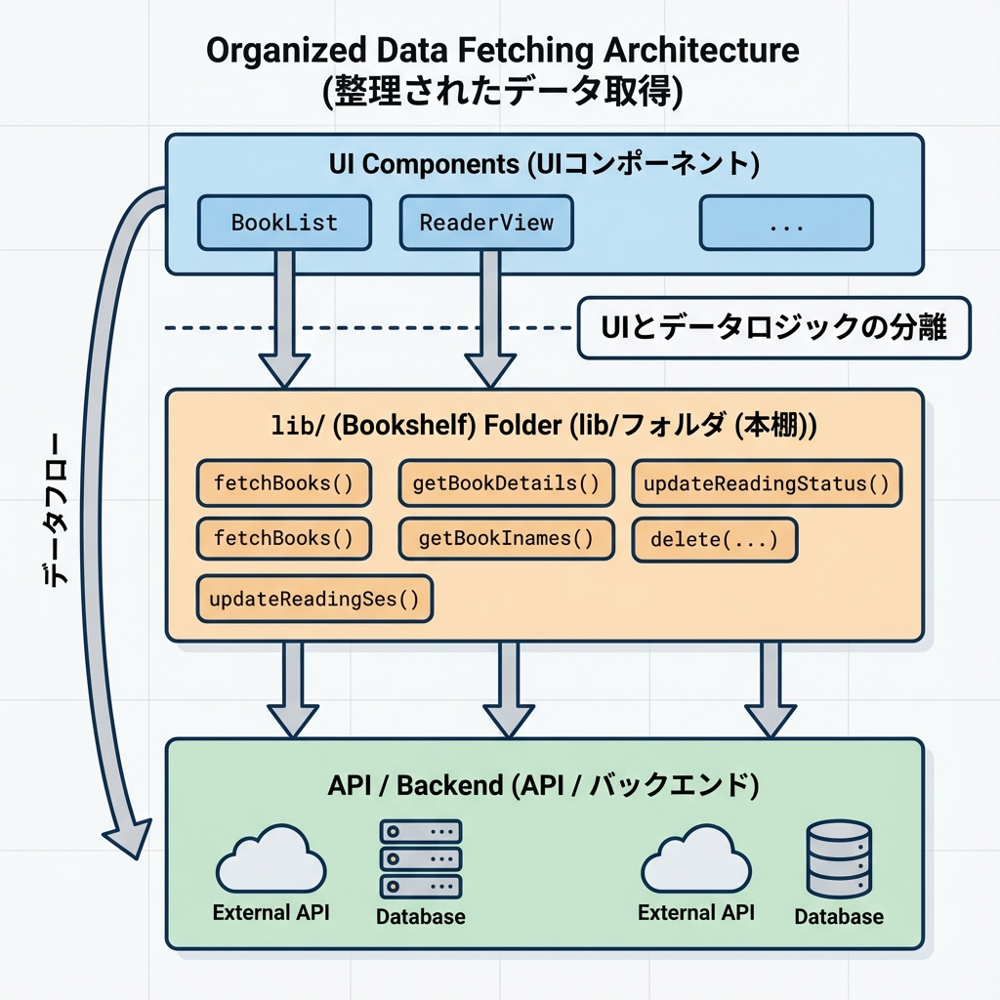
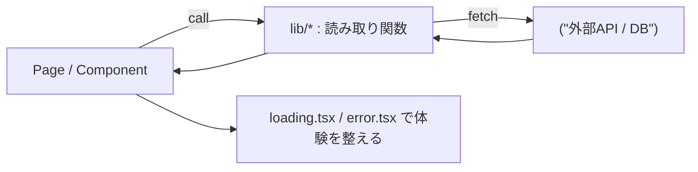
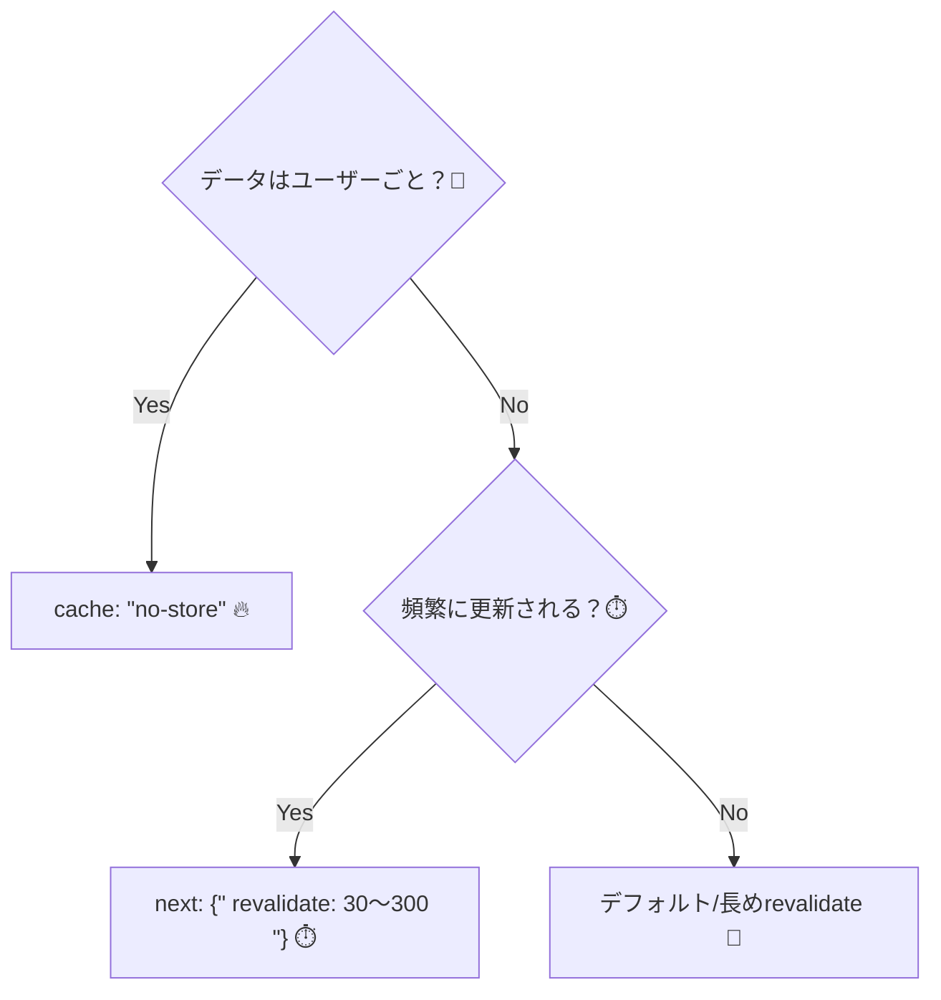

# 第89章：データ取得の設計：まず“読み取り”を固める📚

この章はね、「データ取得（fetch）って結局どう置けばいいの？🥺」を迷わない形にする回だよ〜！💪💖
**“まず読み取り（一覧・詳細）を安定させる”**だけで、開発がめっちゃラクになるよ😊🌸

---

## この章のゴール🎯✨

* 「一覧ページ」「詳細ページ」で **同じルールでデータを読む**ようにする📖
* fetchの置き場所を固定して、**どこを見ればいいか迷わない**🗺️
* **キャッシュ（速さ）と鮮度（新しさ）**を“意図して”決められる🧊⏱️
* エラー/ローディングも含めて、読み取り体験を整える🧯⏳

---

## “読み取りを固める”って何？📚🤔

書き込み（追加/更新/削除）より先に、まずは

* 一覧を表示する📋
* 詳細を表示する🔎

この2つを **同じ設計でスッと作れる状態**にすることだよ😊
Next.js（App Router）は **Server Component でデータ取得**が基本なので、読み取りをここに寄せるとスッキリするよ〜🍵
（Server Component で `fetch` などのI/Oができるよ） ([Next.js][1])

---

## まず決めるのはこの3つだけ🧠✨

### ① 何を読む？（データの形）🧩

「ページに必要な形だけ」決めよう🎀
例：投稿一覧なら `id, title` があればOK、詳細なら `body` も要る、みたいにね😊

### ② どこで読む？（置き場所）📦

おすすめは **`lib/` に“読み取り関数”を集約**！
ページ側は `await getPosts()` みたいに呼ぶだけにする✨

### ③ どれくらい新しくしたい？（キャッシュ方針）🧊⏱️

Next.js の `fetch` はサーバー側で **キャッシュ/再検証を設定できる**よ（拡張 `fetch`） ([Next.js][2])
迷ったら最初はこの2択でOK👇

* だいたい更新されない：`revalidate: 60`（1分ごとに更新）⏱️
* ユーザーごとに違う/常に最新：`cache: "no-store"`🔥

（※ `cache: "no-store"` や `revalidate: 0` でキャッシュを避けられるよ） ([Next.js][3])

---

## 図解：読み取り設計の“型”📦➡️📄（これに寄せると勝ち🫶）





---

## 例：投稿「一覧 → 詳細」の読み取りを“型”で作る🧁✨

ここでは外部APIとして、よくある練習用のエンドポイントを使うよ（URLはコードに入れてね💡）

### フォルダ構成（読み取りが迷子にならない）🗂️

```text
src/
  app/
    posts/
      page.tsx
      loading.tsx
      error.tsx
      [id]/
        page.tsx
  lib/
    posts.ts
```

---

## 1) `lib/posts.ts`：読み取り関数をここに集約📚✨

ポイントは👇

* **型を置く**
* **fetchをここに閉じ込める**
* **エラーは投げる（ページ側の error.tsx で拾える）**

```ts
// src/lib/posts.ts
export type Post = {
  id: number;
  title: string;
  body: string;
};

const API_BASE = "https://jsonplaceholder.typicode.com";

async function fetchJson<T>(input: RequestInfo, init?: RequestInit): Promise<T> {
  const res = await fetch(input, init);

  if (!res.ok) {
    // error.tsx に流れるように「投げる」✨
    throw new Error(`Fetch failed: ${res.status} ${res.statusText}`);
  }
  return (await res.json()) as T;
}

// 一覧：ほどほどに新しければOK（例：60秒で再検証）⏱️
export async function getPosts(): Promise<Pick<Post, "id" | "title">[]> {
  return fetchJson(`${API_BASE}/posts`, {
    next: { revalidate: 60 },
  });
}

// 詳細：デモとして「常に最新」にしたいなら no-store 🔥
//（運用ではここも revalidate に揃えてもOKだよ😊）
export async function getPost(id: string): Promise<Post> {
  return fetchJson(`${API_BASE}/posts/${id}`, {
    cache: "no-store",
  });
}
```

`fetch` に `next: { revalidate }` や `cache` を付けて、サーバー側のデータキャッシュ挙動をコントロールできるよ ([Next.js][2])

---

## 2) 一覧ページ `app/posts/page.tsx` 📋✨

```tsx
// src/app/posts/page.tsx
import Link from "next/link";
import { getPosts } from "@/lib/posts";

export default async function PostsPage() {
  const posts = await getPosts();

  return (
    <main style={{ padding: 16 }}>
      <h1>投稿一覧📚</h1>

      <ul style={{ lineHeight: 1.9 }}>
        {posts.slice(0, 10).map((p) => (
          <li key={p.id}>
            <Link href={`/posts/${p.id}`}>#{p.id} {p.title}</Link>
          </li>
        ))}
      </ul>
    </main>
  );
}
```

---

## 3) ローディング `app/posts/loading.tsx` ⏳💗

```tsx
// src/app/posts/loading.tsx
export default function Loading() {
  return (
    <main style={{ padding: 16 }}>
      <p>読み込み中だよ…⏳✨</p>
      <p>ちょっと待ってね🫶</p>
    </main>
  );
}
```

---

## 4) エラー `app/posts/error.tsx` 🧯🥺

```tsx
// src/app/posts/error.tsx
"use client";

export default function Error({ error, reset }: { error: Error; reset: () => void }) {
  return (
    <main style={{ padding: 16 }}>
      <h2>ごめんね、読み込み失敗しちゃった🥺🧯</h2>
      <p style={{ opacity: 0.8 }}>{error.message}</p>

      <button onClick={() => reset()} style={{ marginTop: 12, padding: "8px 12px" }}>
        もう一回やってみる🔁✨
      </button>
    </main>
  );
}
```

---

## 5) 詳細ページ `app/posts/[id]/page.tsx` 🔎✨

```tsx
// src/app/posts/[id]/page.tsx
import Link from "next/link";
import { getPost } from "@/lib/posts";

export default async function PostDetailPage({ params }: { params: Promise<{ id: string }> }) {
  const { id } = await params;
  const post = await getPost(id);

  return (
    <main style={{ padding: 16 }}>
      <Link href="/posts">← 一覧へ戻る📋</Link>

      <h1 style={{ marginTop: 12 }}>#{post.id} {post.title} ✨</h1>
      <p style={{ whiteSpace: "pre-wrap", lineHeight: 1.9 }}>{post.body}</p>
    </main>
  );
}
```

---

## キャッシュ設計の“ミニ判断”🧊🧠

「どれ使う？」って迷ったら、まずこの分岐でOKだよ😊



ちなみに、`cache: "no-store"` や `revalidate: 0` などでキャッシュを避けられるよ ([Next.js][3])
（あと `cookies()` や `headers()` みたいな “Dynamic API” を使うと動的扱いになりやすい…みたいなルールもあるよ） ([Next.js][3])

---

## この章の“型”チェックリスト✅💖

読み取りを固める時は、これが揃ってたら勝ち〜！🎉

* [ ] `lib/` に **読み取り関数**がまとまってる📦
* [ ] **一覧**（Read many）と **詳細**（Read one）がある📋🔎
* [ ] キャッシュ方針が **関数側で見える**（`revalidate` / `no-store`）🧊🔥
* [ ] `loading.tsx` と `error.tsx` がある⏳🧯
* [ ] ページ側は「取って表示」だけ（ごちゃごちゃしない）✨

---

## ミニ練習（読み取り設計の筋トレ🏋️‍♀️✨）

1. **詳細も `revalidate: 60` に揃える**（一覧と同じ鮮度にする）🧊
2. 一覧表示を `slice(0, 10)` → `slice(0, 30)` にして、重くなりそうなら「何を削る？」を考える🧠
3. `fetchJson` に `console.log("fetching...")` を入れて、キャッシュ設定を変えた時の挙動の違いを観察👀✨（開発中は差が見えにくいこともあるよ）

---

ここまでできたら、もう **「読み取りはこの型で作る！」**が完成だよ📚💗
データ取得がブレなくなると、次の機能追加がめっちゃ気持ちよく進む〜！😆✨

[1]: https://nextjs.org/docs/app/getting-started/fetching-data?utm_source=chatgpt.com "Getting Started: Fetching Data"
[2]: https://nextjs.org/docs/app/api-reference/functions/fetch?utm_source=chatgpt.com "Functions: fetch"
[3]: https://nextjs.org/docs/14/app/building-your-application/data-fetching/fetching-caching-and-revalidating?utm_source=chatgpt.com "Data Fetching, Caching, and Revalidating"
