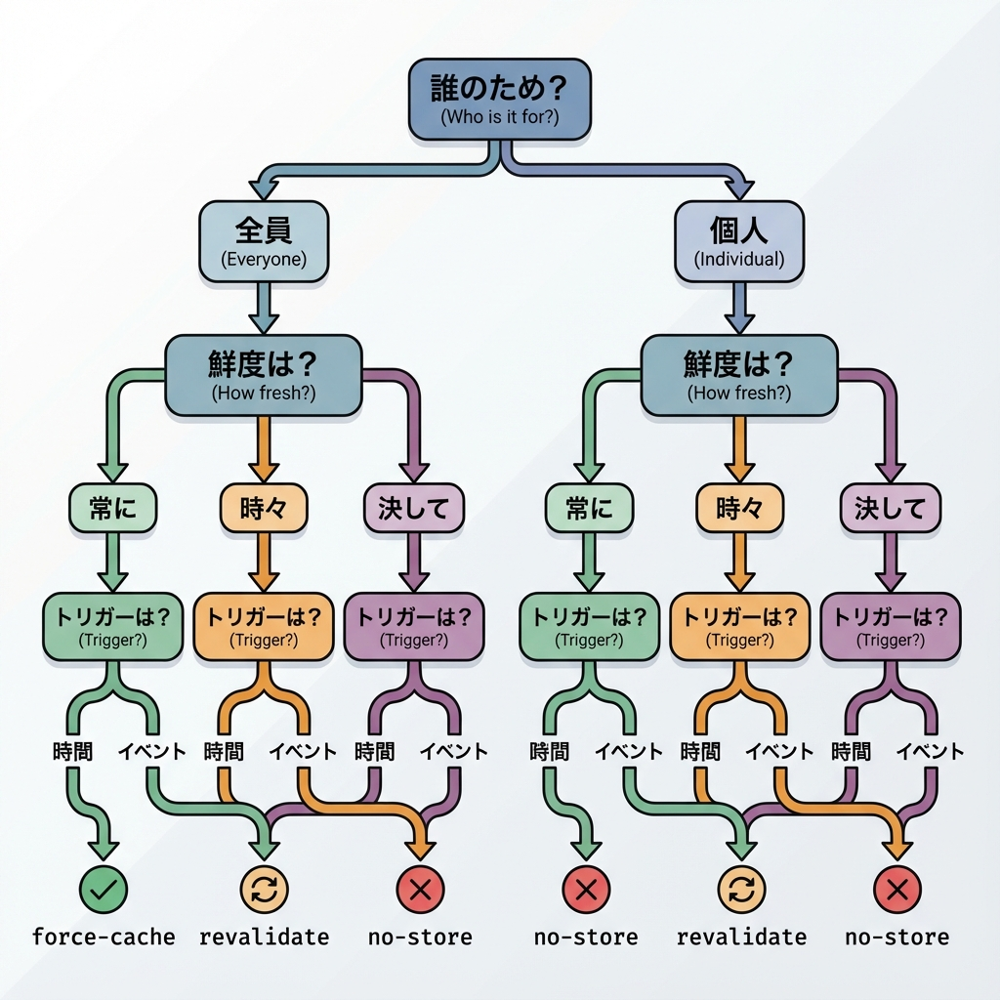
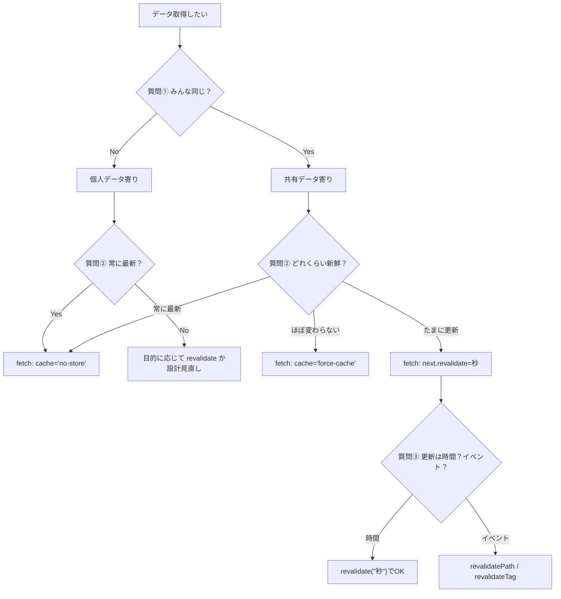

# 第90章：復習：キャッシュで混乱しないための3つの質問🧠

キャッシュって、**速くなる代わりに「いつ更新されるの？」が分かりにくい**のが落とし穴だよね🥲
でも大丈夫！ここでは **3つの質問**で、毎回ブレずに判断できる“考え方の型”を作るよ〜😊💕

---

## まず超ざっくり：Next.jsのキャッシュは「1種類」じゃない😳🧊

Next.jsには主に、こんなキャッシュがあるよ👇（細かい実装を全部覚える必要はないよ！）
「いま何が効いてる？」の混乱を減らすために、存在だけ把握しておこ〜🫶
（Request Memoization / Data Cache / Full Route Cache / Router Cache） ([Next.js][1])

---

## ✅ キャッシュで混乱しないための「3つの質問」🧠✨

ここが本題！この3つを順番に聞くだけでOKだよ🙆‍♀️🌸

### 質問①：そのデータ、**誰のため**？👤🌍

* ✅ **みんな同じ**（例：ブログ記事一覧、商品一覧、学校のお知らせ）
  → キャッシュしやすい✨
* ❌ **人によって違う**（例：ログイン中のユーザー情報、カート、マイページ）
  → 基本はキャッシュしない（または工夫が必要）🔒

---

### 質問②：そのデータ、**どれくらい新鮮**であるべき？⏱️🥗

* 🟢 **常に最新が必要**（例：在庫、残席、現在のポイント）
  → `no-store`（毎回取りに行く）🔥
* 🟡 **ちょい古くてもOK**（例：ランキング、ニュース、今日の天気）
  → `revalidate: 秒`（定期更新）🔁
* 🔵 **ほぼ変わらない**（例：利用規約、固定のプロフィール）
  → `force-cache`（しっかりキャッシュ）🧊

---

### 質問③：更新は **時間でやる？それともイベントでやる？**⏰🎯

* ⏰ **時間で更新**：
  → `next: { revalidate: 3600 }` みたいに「何秒ごと」
* 🎯 **イベントで更新**：
  → 「投稿した」「保存した」みたいなタイミングで `revalidatePath` / `revalidateTag`
* 🔄 **今この画面だけ更新したい**：
  → `router.refresh()`（画面の再取得）※データキャッシュ自体は消さない ([Next.js][1])

---

## 図解：3つの質問で決める“キャッシュ分岐”🗺️🧊





---

## Next.js 2025の重要ポイント（ここだけは知っておくと勝ち）🏆✨

### ✅ `fetch` は “基本はキャッシュされない” と思ってOK🙆‍♀️

Next.jsでは、**`fetch` の結果はデフォルトではキャッシュされない**よ。
キャッシュしたいなら、明示的に `cache: 'force-cache'` を付けるのが分かりやすい👌 ([Next.js][2])

### ✅ 開発中（`npm run dev`）はキャッシュ挙動が分かりにくい🥲

開発モードでは、HMR（ホットリロード）の都合で `fetch` の挙動が本番と違って見えることがあるよ〜！ ([Next.js][1])
「キャッシュ効いてる？」をちゃんと見たい時は、後半のミニ実験みたいに **本番モードで確認**が安心✨

---

## 迷ったらこの早見表🧾✨（超使う）

| 目的      | だいたいの答え                    | 例               |
| ------- | -------------------------- | --------------- |
| とにかく最新  | `cache: 'no-store'`        | 残席 / 在庫 / マイページ |
| 定期更新でOK | `next: { revalidate: 60 }` | ランキング / ニュース    |
| ほぼ固定    | `cache: 'force-cache'`     | 利用規約 / 固定ページ    |

---

## ミニ実験：3種類のfetchを“見える化”しよう🔬🧪✨

「ほんとに変わる？止まる？」を、**時刻で確認**するよ⌚💕

### ① APIを作る（現在時刻を返す）🕒

`app/api/now/route.ts`

```ts
export const dynamic = "force-dynamic";

export async function GET() {
  return Response.json({
    now: new Date().toISOString(),
  });
}
```

### ② 3パターンで表示するページを作る📄

`app/cache-check/page.tsx`

```ts
async function getNowNoStore() {
  const res = await fetch("http://localhost:3000/api/now", { cache: "no-store" });
  return res.json() as Promise<{ now: string }>;
}

async function getNowRevalidate10() {
  const res = await fetch("http://localhost:3000/api/now", {
    next: { revalidate: 10 },
  });
  return res.json() as Promise<{ now: string }>;
}

async function getNowForceCache() {
  const res = await fetch("http://localhost:3000/api/now", { cache: "force-cache" });
  return res.json() as Promise<{ now: string }>;
}

export default async function Page() {
  const [a, b, c] = await Promise.all([
    getNowNoStore(),
    getNowRevalidate10(),
    getNowForceCache(),
  ]);

  return (
    <main style={{ padding: 24, fontFamily: "system-ui" }}>
      <h1>キャッシュ実験🧊🔁🔥</h1>

      <ul>
        <li>🔥 no-store：{a.now}</li>
        <li>🔁 revalidate(10s)：{b.now}</li>
        <li>🧊 force-cache：{c.now}</li>
      </ul>

      <p>ブラウザ更新（F5）して、時刻の変化を見てね😊</p>
    </main>
  );
}
```

### ③ 本番モードで確認（大事！）🧸✨

PowerShellで👇

```bash
npm run build
npm start
```

* 🔥 `no-store`：毎回変わるはず
* 🔁 `revalidate(10)`：10秒過ぎたら更新されるはず
* 🧊 `force-cache`：ずっと同じになりやすい（キャッシュが効く） ([Next.js][3])

---

## よくある混乱あるある😂🌀（→3つの質問で解決）

### 😵「更新したのに画面が変わらない！」

👉 質問③で確認：

* “データキャッシュ自体”を更新したい？ → `revalidatePath` / `revalidateTag`
* “今の画面を再取得したいだけ”？ → `router.refresh()` ([Next.js][1])

### 😵「戻るボタンで古い表示になる…」

👉 それ、**Router Cache（クライアント側）**の影響かも！
必要なら `router.refresh()` を使う判断もあるよ🔄 ([Next.js][1])

---

## 最後のまとめ：この章のゴール🎯✨

迷ったら、この順で自分に聞くだけ！🥰

1. **誰のデータ？**（みんな同じ？個人？）👤🌍
2. **鮮度どれくらい？**（常に？たまに？ほぼ固定？）⏱️
3. **更新スイッチは？**（時間？イベント？画面更新だけ？）⏰🎯🔄

これでキャッシュ迷子、かなり減るよ〜🫶🧊✨

[1]: https://nextjs.org/docs/app/guides/caching "Guides: Caching | Next.js"
[2]: https://nextjs.org/docs/app/getting-started/caching-and-revalidating "Getting Started: Caching and Revalidating | Next.js"
[3]: https://nextjs.org/docs/app/api-reference/functions/fetch "Functions: fetch | Next.js"
