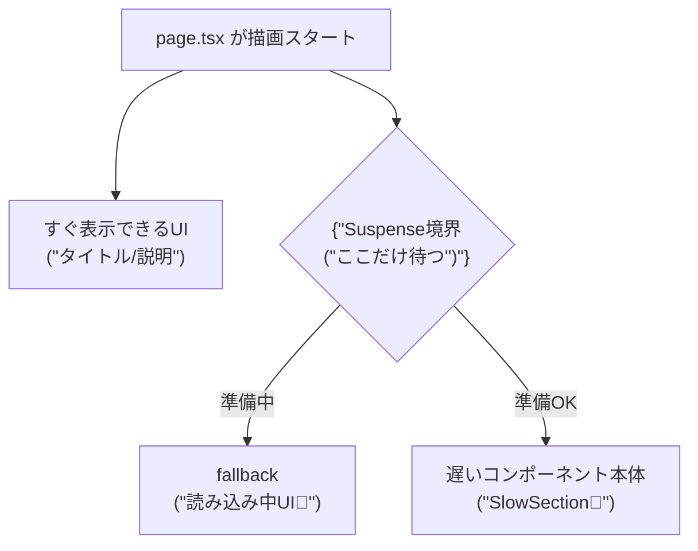

# 第91章：`Suspense` は“待つUI”を部品化する🫧

## この章のゴール🎯

* 「ここだけ読み込み中…」を **ページ全体じゃなく“部分だけ”** にできるようになる😊
* `Suspense` を使って **待つ見た目（fallback）をコンポーネントとして切り出す** 感覚をつかむ🧩

---

## 1) `Suspense` って結局なに？🤔🫧

`<Suspense>` は、**子コンポーネントの準備が終わるまで**、代わりに **fallback（仮の表示）** を出してくれる“待機ゾーン”だよ〜⏳✨
子が「まだ無理〜！」って一時停止（suspend）すると、自動で fallback に切り替わる感じ！ ([React][1])

---

## 2) 何がうれしいの？🥰🌊

### ✅ “待つ場所”を小さくできる🧁

ページ全体が真っ白で待つんじゃなくて、
**先に見せられるところは先に見せて**、遅い部分だけ「読み込み中」を出せるよ💡

Next.js（App Router）は `Suspense` と相性がよくて、**HTMLを小分けに送って先に表示する（Streaming）** ができるのが強い✨ ([Next.js][2])

---

## 3) まずはミニ実験しよ〜！🧪💖（一部だけ遅いページ）

「タイトルはすぐ出る ✅ でも下のエリアだけ2秒遅れる…」を作るよ〜⏳🌸

### 手順①：ページを作る📁✨

プロジェクトの中で、次のファイルを作ってね👇
`app/suspense-demo/page.tsx`

### 手順②：コードを書く✍️

```tsx
import { Suspense } from "react";

// わざと遅くする関数（2秒待つ）
function sleep(ms: number) {
  return new Promise<void>((resolve) => setTimeout(resolve, ms));
}

// 遅いコンポーネント（Server Componentのまま async でOK）
async function SlowSection() {
  await sleep(2000);

  return (
    <section style={{ padding: 12, border: "1px solid #ddd", borderRadius: 12 }}>
      <h2>やっと来た〜！🎉</h2>
      <p>このエリアだけ 2秒待ってから表示されたよ⏳✨</p>
    </section>
  );
}

function LoadingBox() {
  return (
    <section style={{ padding: 12, border: "1px dashed #aaa", borderRadius: 12 }}>
      <h2>読み込み中…🫧</h2>
      <p>ここは fallback（待ってる間の表示）だよ〜🐣</p>
    </section>
  );
}

export default function Page() {
  return (
    <main style={{ padding: 24, display: "grid", gap: 12 }}>
      <h1>Suspenseデモ🫧</h1>
      <p>タイトルや説明はすぐ見えるよ！下だけ遅れて出るよ！😊</p>

      <Suspense fallback={<LoadingBox />}>
        <SlowSection />
      </Suspense>
    </main>
  );
}
```

### 手順③：表示してみる👀✨

開発サーバー起動（もう起動中ならOK）👇

```bash
npm run dev
```

ブラウザで👇にアクセス：
`http://localhost:3000/suspense-demo`

**見どころ👀💡**

* 最初にページの上の部分が出る🙆‍♀️✨
* 下のエリアだけ「読み込み中…」が出る🫧
* 2秒後に下が差し替わる🎉

この「差し替わる部分」を作るのが、`Suspense` の超大事ポイントだよ〜！ ([Next.js][3])

---

## 4) 超重要：`await` を“どこに置くか”で結果が変わる⚠️😵‍💫

### ❌ ダメ例：親（Page）で待つと、全部待つ💥

```tsx
export default async function Page() {
  await sleep(2000); // ここで待つと…ページ全体が待つ😭
  return <div>...</div>;
}
```

### ✅ 良い例：遅い部分を子に寄せて、`Suspense` で包む🧁✨

* 「遅い処理」は **子コンポーネント** に移動
* 親は **すぐ描画**
* 遅い子だけ `Suspense` で待つ

Next.js では、こういう「遅い部分だけを request time に回す」ために **親が `Suspense` で fallback を用意する必要がある**、という整理がされてるよ🧠 ([Next.js][4])

---

## 5) 図でイメージつかもう🫶🗺️（Mermaid）




---

## 6) つまずきポイントあるある🧯😇

* **fallback を重くしすぎる**：待ってる間の表示は軽めでOKだよ〜🪶 ([React][1])
* **「全部が待ってる」状態になる**：だいたい `await` が親にあるパターン🥲（子に寄せよ！）
* **“どこが遅いか”が分からない**：まずは今回みたいに `sleep()` で再現すると理解しやすいよ🧪✨

---

## 7) ミニ練習🎀💪

1. `sleep(2000)` を `sleep(5000)` にしてみよ〜⏳
2. fallback の文言を変えて、もっと可愛くしてみよ〜🧸💖
3. `SlowSection` をもう1個増やして、**別の `Suspense` で包む**とどうなるか見てみよ〜🪄✨

---

## まとめ🧡

* `Suspense` は **「待つUI」を部品化**するための仕組みだよ🫧
* **遅い部分だけ** `Suspense` で包むと、ページ全体を止めずに済む😊
* Next.js（App Router）は `Suspense` による **Streaming（先に見せる）** が得意✨ ([Next.js][2])

[1]: https://react.dev/reference/react/Suspense?utm_source=chatgpt.com "<Suspense> – React"
[2]: https://nextjs.org/docs/app/api-reference/file-conventions/loading?utm_source=chatgpt.com "File-system conventions: loading.js"
[3]: https://nextjs.org/learn/dashboard-app/streaming?utm_source=chatgpt.com "Streaming - App Router"
[4]: https://nextjs.org/docs/app/getting-started/cache-components?utm_source=chatgpt.com "Getting Started: Cache Components"
