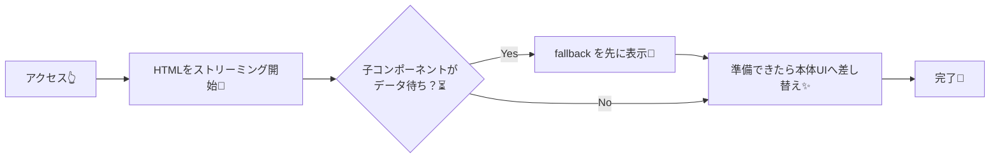

# 第92章：`fallback` の作り方（軽くてOK）🧸

`<Suspense>` を使うと、**中のUIが“準備できるまで”の間だけ表示する仮UI**（＝`fallback`）を用意できます😊
Next.js（App Router）は **Streaming + Suspense** をサポートしていて、`fallback`（スケルトンやスピナーなど）を先に見せて、準備ができたら本体に差し替えられます🌊 ([Next.js][1])

---

## 1) `fallback` って何を作ればいいの？🤔🫧

結論：**「軽い・短い・それっぽい」** でOKです🙆‍♀️💕

* ✅ **軽い**：`fallback` 自体で `fetch` しない（重くしない）💨
* ✅ **短い**：見た目は最低限（スケルトン/スピナー/“読み込み中”）🧁
* ✅ **それっぽい**：本体UIの“形”に近いと安心する（スケルトン）🦴✨

※ Next.jsでは、ある処理を「リクエスト時に後回し」にするには、**親が Suspense で fallback を用意する**必要があるよ〜、という説明もあります📌（`fallback` が“先に見える殻”になるイメージ） ([Next.js][2])

---

## 2) イメージ図：fallback → 本体に差し替え 🌊🔁




---

## 3) いちばん簡単な `fallback`（まずはこれでOK）🍼✨

`app/articles/page.tsx` を作って、`<Suspense fallback={...}>` を置くだけです👇
（App Router の `page.tsx` は基本 Server Component なので、そのまま書けるよ😊）

```tsx
// app/articles/page.tsx
import { Suspense } from "react";
import { ArticleList } from "@/components/ArticleList";

export default function Page() {
  return (
    <main style={{ padding: 16 }}>
      <h1>記事一覧 📰</h1>

      <Suspense fallback={<p>読み込み中…⏳</p>}>
        <ArticleList />
      </Suspense>
    </main>
  );
}
```

この形は、Next.js公式でも「非同期処理中は fallback（スケルトン/スピナーなど）を表示して、終わったら差し替える」と説明されています🫶 ([Next.js][1])

---

## 4) “軽いけど可愛い”スケルトン fallback を作ろう 🦴💖

### 4-1) まずはスケルトン部品（fallback用コンポーネント）🧩

```tsx
// components/ArticleListSkeleton.tsx
import styles from "./ArticleListSkeleton.module.css";

export function ArticleListSkeleton() {
  return (
    <div className={styles.wrap} role="status" aria-live="polite" aria-busy="true">
      <p className={styles.label}>読み込み中…⏳</p>

      <ul className={styles.list}>
        <li className={styles.item} />
        <li className={styles.item} />
        <li className={styles.item} />
      </ul>
    </div>
  );
}
```

### 4-2) CSS Modules（超シンプルでOK）🎨✨

```css
/* components/ArticleListSkeleton.module.css */
.wrap {
  margin-top: 12px;
}

.label {
  margin: 0 0 8px;
  opacity: 0.7;
}

.list {
  list-style: none;
  padding: 0;
  margin: 0;
  display: grid;
  gap: 10px;
}

.item {
  height: 44px;
  border-radius: 10px;
  background: #e9e9e9;
  animation: pulse 1.1s ease-in-out infinite;
}

/* ふわっと点滅するだけ（軽い！） */
@keyframes pulse {
  0% { opacity: 0.55; }
  50% { opacity: 1; }
  100% { opacity: 0.55; }
}
```

### 4-3) `fallback` にスケルトンを入れる 🧸➡️🦴

```tsx
// app/articles/page.tsx
import { Suspense } from "react";
import { ArticleList } from "@/components/ArticleList";
import { ArticleListSkeleton } from "@/components/ArticleListSkeleton";

export default function Page() {
  return (
    <main style={{ padding: 16 }}>
      <h1>記事一覧 📰</h1>

      <Suspense fallback={<ArticleListSkeleton />}>
        <ArticleList />
      </Suspense>
    </main>
  );
}
```

---

## 5) 「待たせる本体」サンプル（動作確認用）⏳🧪

本体の `ArticleList` を **わざと遅くして**、fallback が見えるかチェックします👀✨

```tsx
// components/ArticleList.tsx
async function sleep(ms: number) {
  return new Promise((resolve) => setTimeout(resolve, ms));
}

export async function ArticleList() {
  // わざと 1.2秒待つ（デモ用）⏳
  await sleep(1200);

  const items = ["はじめてのNext.js", "Suspense入門", "スケルトン最高"];

  return (
    <ul style={{ paddingLeft: 18 }}>
      {items.map((t) => (
        <li key={t}>{t}</li>
      ))}
    </ul>
  );
}
```

---

## 6) `fallback` を作るときのコツ（ここ超大事）🫶📌

* ✅ **“形”を合わせる**：本体とだいたい同じ高さ/幅にするとガクッと動かない（安心）🧱
* ✅ **軽いUIだけ**：画像の大量表示や重い計算は避ける💦
* ✅ **アクセシビリティ**：`role="status"` / `aria-busy="true"` を付けるとやさしい🥰
* ❌ **fallback の中で fetch**：待つUIがさらに待つ…みたいになりがち😵‍💫

---

## 7) ミニ練習（5分）🧪🎀

1. スケルトンの行数を **3 → 6** にしてみる 🦴🦴🦴🦴🦴🦴
2. `.item` の `height` を本体の行に合わせて調整してみる 📏✨
3. `読み込み中…⏳` の文言を自分のアプリっぽく変える（“頑張って準備中だよ〜💪”とか）😊💕

---

必要なら、この章の続きとして「どんな場面で `fallback` を置くのが気持ちいいか（ページの一部だけ待たせる設計）」みたいな実例も増やせるよ〜🫧✨

[1]: https://nextjs.org/docs/app/api-reference/file-conventions/loading?utm_source=chatgpt.com "File-system conventions: loading.js"
[2]: https://nextjs.org/docs/app/getting-started/cache-components?utm_source=chatgpt.com "Getting Started: Cache Components"
