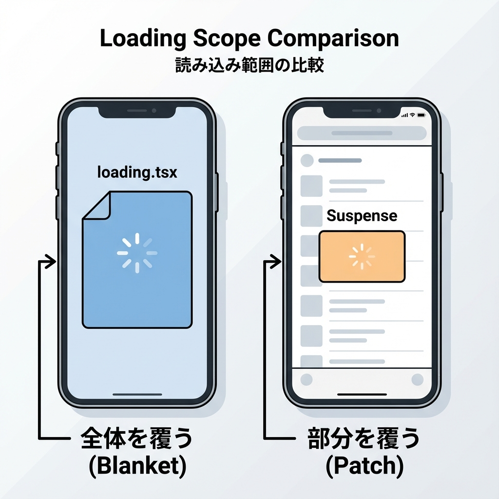
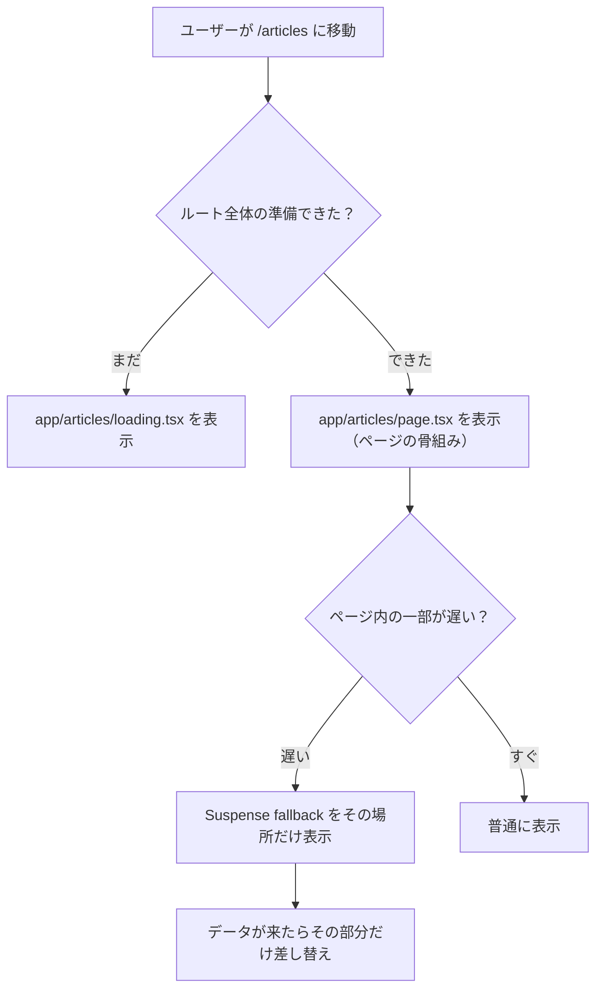

# 第93章：`loading.tsx` と `Suspense` の使い分け🤝

この章では、「どこまでを“読み込み中”にするか」を上手にコントロールするコツを覚えるよ〜！😺🌸
Next.js の読み込みUIは大きく2種類👇

* **`loading.tsx`**：ルート（ページ）単位の“待ち”を担当⏳🏠
* **`Suspense`**：ページの一部分だけ“待ち”を担当🫧🧩

---

## 1) ざっくり結論（迷ったらこれ！）🎯

* ページ遷移した瞬間に「ページ全体の読み込み中」を見せたい 👉 **`loading.tsx`** 🧱⏳
* ページは先に出して、**中の一部（例：ランキング/コメント/おすすめ）だけ遅れてOK** 👉 **`Suspense`** 🫧🌊

---

## 2) 何が違うの？（イメージ図）🧠✨





---

## 3) `loading.tsx` が得意なこと 🧱⏳

### ✅ 得意

* **ページ遷移中**に「画面まるごと読み込み中」を出す
* 「真っ白」を防ぐ（ユーザーが不安にならない）😌✨
* ルート単位で管理できてラク（置くだけ）📦

### ⚠️ 苦手

* ページの中の**一部分だけ**を細かく待たせるのは苦手（基本“全体用”）

---

## 4) `Suspense` が得意なこと 🫧🧩

### ✅ 得意

* **ページは先に見せて**、遅いパーツだけ後で出す（体感が速い）🌊⚡
* 1ページの中に「ここだけローディング」を何個も作れる🧸🧸🧸
* UI設計が上手になる（“待ち”の境界を自分で決められる）💡

### ⚠️ 苦手

* 使いどころが曖昧だと、境界が増えて逆に分かりにくい😵‍💫
  → **“遅い場所だけ”**に絞るのがコツ！

---

## 5) 実例で覚える：記事一覧ページを作って使い分ける📰✨

ここからはミニ構成で理解するよ〜！🍀
`/articles` に移動すると…

* 遷移直後：**ページ全体のローディング**（`loading.tsx`）⏳
* ページが出た後：右側の**ランキングだけ遅れて出る**（`Suspense`）🫧

---

### Step 0：フォルダ構成（完成形）📁✨

```text
app/
  articles/
    loading.tsx
    page.tsx
components/
  Ranking.tsx
lib/
  sleep.ts
```

---

### Step 1：待ち時間を作る `sleep` を用意（デモ用）😴⏱️

```ts
// lib/sleep.ts
export const sleep = (ms: number) =>
  new Promise<void>((resolve) => setTimeout(resolve, ms));
```

---

### Step 2：ルート全体のローディング `loading.tsx` を置く🧱⏳

```tsx
// app/articles/loading.tsx
export default function Loading() {
  return (
    <main style={{ padding: 16 }}>
      <h1>記事一覧</h1>
      <p>読み込み中だよ…🫧</p>

      {/* それっぽい骨組み（スケルトン風） */}
      <ul>
        <li>▧▧▧▧▧▧▧</li>
        <li>▧▧▧▧▧▧▧</li>
        <li>▧▧▧▧▧▧▧</li>
      </ul>
    </main>
  );
}
```

ポイント👉 **`/articles` へ移動した瞬間**に、まずこれが出やすいよ〜！😊

---

### Step 3：ページ本体で `Suspense` を使う🫧🧩

```tsx
// app/articles/page.tsx
import { Suspense } from "react";
import Ranking from "@/components/Ranking";

function ArticleList() {
  // ここは速い想定（すぐ表示される）
  return (
    <ul>
      <li>はじめての Next.js（仮）📘</li>
      <li>ルーティング楽しい（仮）🛣️</li>
      <li>Suspense ってなに（仮）🫧</li>
    </ul>
  );
}

export default function Page() {
  return (
    <main style={{ padding: 16 }}>
      <h1>記事一覧 📰</h1>

      <div style={{ display: "grid", gridTemplateColumns: "2fr 1fr", gap: 16 }}>
        <section style={{ border: "1px solid #ddd", padding: 12, borderRadius: 12 }}>
          <h2>新着</h2>
          <ArticleList />
        </section>

        <aside style={{ border: "1px solid #ddd", padding: 12, borderRadius: 12 }}>
          <h2>ランキング</h2>

          <Suspense fallback={<p>ランキング読み込み中…⏳✨</p>}>
            <Ranking />
          </Suspense>
        </aside>
      </div>
    </main>
  );
}
```

---

### Step 4：遅いパーツ（ランキング）を“わざと遅く”する⏱️😺

```tsx
// components/Ranking.tsx
import { sleep } from "@/lib/sleep";

export default async function Ranking() {
  await sleep(1500); // わざと遅くする（デモ用）😴

  return (
    <ol>
      <li>Next.jsの基本🛣️</li>
      <li>Server/Clientの違い🧊🎮</li>
      <li>キャッシュってなに🧠🧊</li>
    </ol>
  );
}
```

これで完成！🎉
ページの左（新着）は先に見えて、右（ランキング）だけ後から出るよ〜！🌊✨

---

## 6) 使い分けの「判断フロー」🧭💡

* それが **ページ遷移の最初から必要**？

  * はい 👉 `loading.tsx` ⏳
  * いいえ（ページは先に出てOK）👉 `Suspense` 🫧

* それが **ページの一部分**？

  * はい 👉 `Suspense` 🧩
  * いいえ（全体）👉 `loading.tsx` 🧱

---

## 7) よくあるミス（ここ注意！）🪤

* **全部を Suspense で包む**
  → それ、`loading.tsx` と役割かぶりがち😵‍💫
  → “遅いところだけ”に絞ろう👌✨

* **`loading.tsx` を重く作りすぎる**
  → ローディングなのにさらに重い…みたいになりがち😂
  → 文字＋軽い骨組み程度が最強🫶

---

## 8) ミニ練習（5分）🏃‍♀️💨

1. ランキング以外に、下に **「コメント欄」** を追加してみよう💬
2. コメント欄は `sleep(2000)` にして、`Suspense` で包む
3. fallback は「コメント読み込み中…💭」にしてみてね😊

---

## まとめ🎁✨

* **`loading.tsx`**：ルート（ページ）単位の“待ち”⏳🏠
* **`Suspense`**：ページの一部だけ“待ち”🫧🧩
* 体感速度を上げたいなら、**「ページは先に出す＋遅い場所だけ待つ」**が強い🌊⚡

次章（第94章）で、この“先に見せる”がさらに気持ちよくなる Streaming の話に繋がるよ〜！😺🌸
