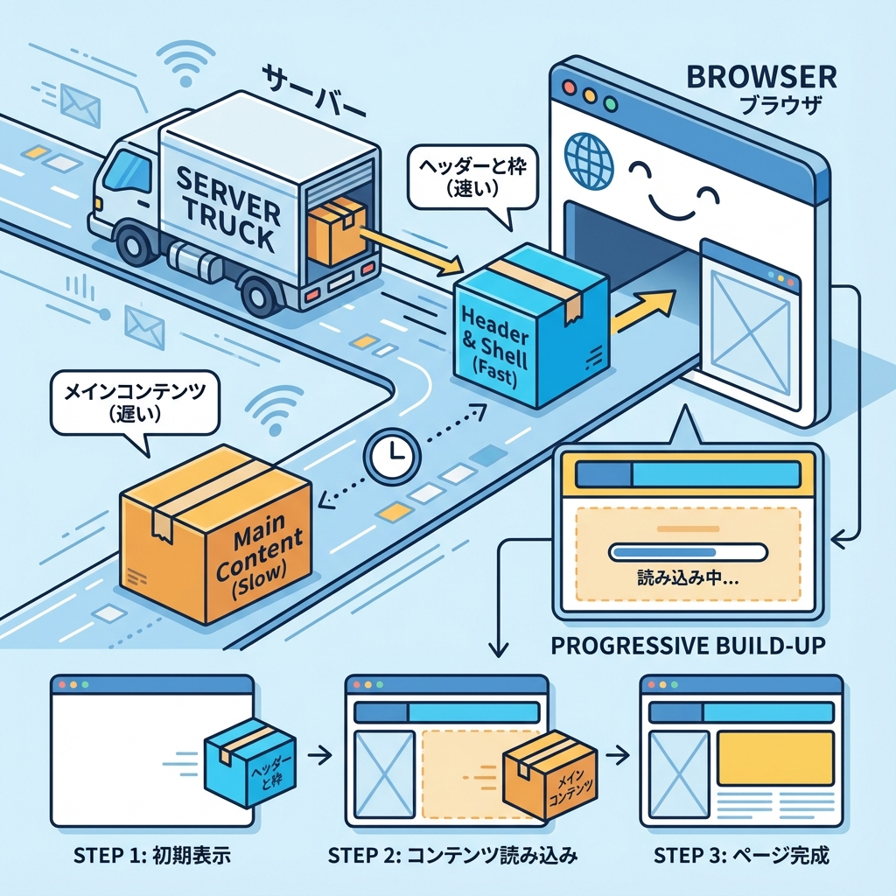
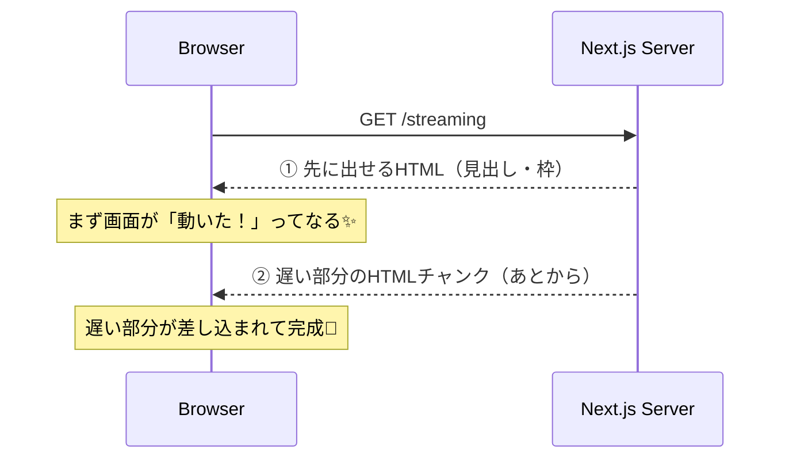
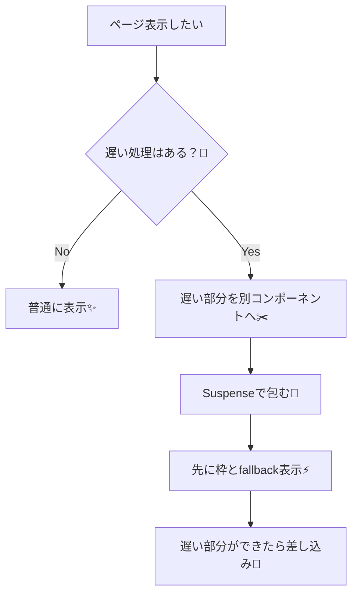

# 第94章：Streamingで“先に見せる”ができる🌊

Next.js（App Router）では **“ページが全部そろう前に、先に表示できる部分だけ先に出す”** ってことができます😊
これが **Streaming（ストリーミング）** だよ〜！🎬💨

---

## 1. Streamingってなに？🤔🌊

イメージはこれ👇

* 🧱 **先に出せるUI（見出し、枠、説明文）** をまず表示
* 🐢 **遅いUI（重い処理・遅いfetch）** はあとから届いて差し込まれる
* ⏳ その「待ってる間」をいい感じに見せるのが **Suspense + fallback** だよ🫧

---

## 2. ざっくり図解（どんな順番で届く？）📨➡️🖥️





---

## 3. 今日のゴール🎯✨

✅ 「見出し」はすぐ表示
✅ 「遅いデータ部分」はあとから表示
✅ 待ってる間は「読み込み中…」を出す⏳🐣

---

## 4. ハンズオン：Streamingを体験しよう🧪🌊

### Step 1：ページを作る📄✨

`app/streaming/page.tsx` を作ってね😊

```tsx
// app/streaming/page.tsx
import { Suspense } from "react";
import SlowSection from "./slow-section";

export default function Page() {
  return (
    <main style={{ padding: 24 }}>
      <h1 style={{ fontSize: 28, marginBottom: 12 }}>Streaming体験ページ🌊✨</h1>

      <p style={{ marginBottom: 16 }}>
        見出しと説明は先に出るよ😊 そのあと遅い部分が追加されるよ〜⏳
      </p>

      <section
        style={{
          border: "1px solid #ddd",
          borderRadius: 12,
          padding: 16,
          marginBottom: 16,
        }}
      >
        <h2 style={{ fontSize: 20, marginBottom: 8 }}>先に表示されるゾーン⚡</h2>
        <ul>
          <li>見出し</li>
          <li>説明文</li>
          <li>枠</li>
        </ul>
      </section>

      <Suspense
        fallback={
          <div
            style={{
              border: "1px dashed #bbb",
              borderRadius: 12,
              padding: 16,
            }}
          >
            <h2 style={{ fontSize: 20, marginBottom: 8 }}>遅いゾーン🐢</h2>
            <p>読み込み中だよ〜⏳💤</p>
          </div>
        }
      >
        {/* ここが「遅れて届く」パーツになる🌊 */}
        <SlowSection />
      </Suspense>
    </main>
  );
}
```

---

### Step 2：わざと遅いコンポーネントを作る🐢💤

同じフォルダに `app/streaming/slow-section.tsx` を作ってね！

```tsx
// app/streaming/slow-section.tsx
async function sleep(ms: number) {
  return new Promise((resolve) => setTimeout(resolve, ms));
}

export default async function SlowSection() {
  // わざと遅くする（2.5秒）🐢💤
  await sleep(2500);

  // 本当はここに fetch() が来るイメージだよ📡
  const items = ["カフェ巡り☕", "映画🎬", "課題📚", "おしゃべり💬"];

  return (
    <section
      style={{
        border: "1px solid #ddd",
        borderRadius: 12,
        padding: 16,
      }}
    >
      <h2 style={{ fontSize: 20, marginBottom: 8 }}>あとから届くゾーン🌊✨</h2>
      <p style={{ marginBottom: 12 }}>
        遅い処理が終わったので表示されたよ〜！🎉
      </p>
      <ol>
        {items.map((x) => (
          <li key={x}>{x}</li>
        ))}
      </ol>
    </section>
  );
}
```

---

### Step 3：起動して確認🖥️✨

ターミナルで👇

```bash
npm run dev
```

ブラウザで👇

* `http://localhost:3000/streaming`

見るポイント👀💡

* ✅ 見出し＆説明＆「先に表示されるゾーン」が先に出る⚡
* ✅ 「読み込み中だよ〜⏳💤」が出る
* ✅ 2.5秒後に「あとから届くゾーン🌊✨」が差し込まれる

---

## 5. ここが超大事ポイント🧠✨

### ✅ Streamingしたいなら「遅い部分を分離」する✂️🐢

* ページ全体を遅くするんじゃなくて、**遅い部分だけを別コンポーネント**にして
* それを **Suspenseで包む** のがコツだよ🫧

### ✅ `await` をページ最上段でやると、全体が待つ🙅‍♀️

たとえば `page.tsx` のトップで `await` すると、**見出しすら出ない** になりがち😵
→ 遅いのは子に押し込もう〜！📦✨

---

## 6. 1枚で理解：Streamingの考え方🧩🌊



---

## 7. まとめ🎀✨

* 🌊 Streamingは「全部そろう前に、先に見せる」技
* 🫧 `Suspense` は「待ってる間のUI」を作る技
* ✂️ **遅い部分を小さく分けるほど、体験がよくなる**よ😊✨

次の章（第95章）では「エラーの種類」を分けて、もっと安心設計にしていくよ〜🧯💪
