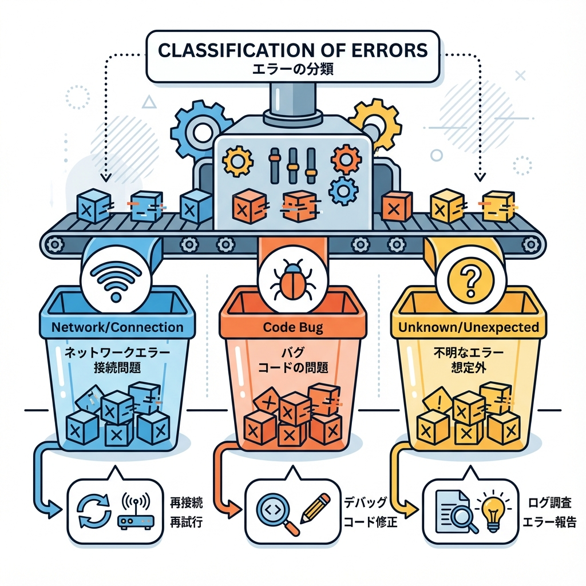
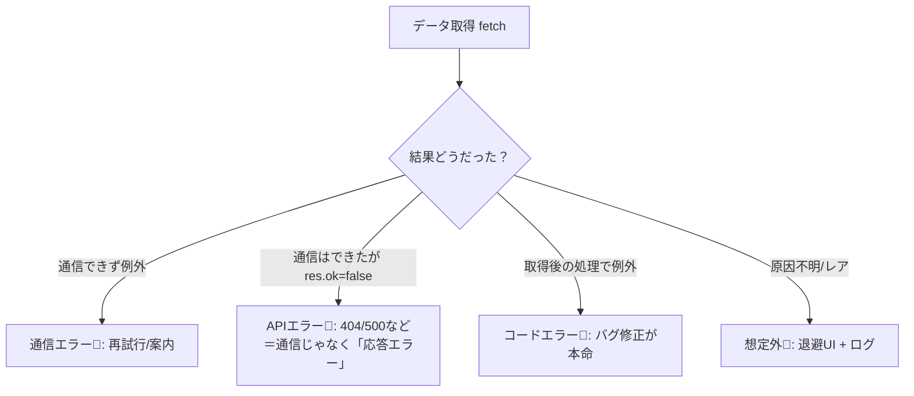

# 第95章：エラーの種類：通信/コード/想定外を分ける🧯

アプリで「エラーが出た！」って時、ぜんぶ同じ扱いにすると…
ユーザーに出すメッセージも、直し方も、ログの残し方もゴチャゴチャになりがち😵‍💫💦

なので今日は **エラーを3種類に分ける** 練習をするよ〜！🧠🫶

---

## この章のゴール🎯

* エラーを **通信（外の都合） / コード（自分のバグ） / 想定外（どっちか分からん）** に分けられる✨
* 「今は何をすべき？」が迷わなくなる（再試行？バグ修正？ログ？）🔁🛠️📝

---

## まずは結論：エラーは3種類で考える🧩

### ① 通信エラー（ネットワーク系）📡⚡

「外とのやり取り」がうまくいかないやつ！

* サーバーに繋がらない（オフライン、DNS、ポート違い）📴
* タイムアウト⏳
* CORSなど（主にブラウザ側）🚧
* `fetch` が **例外（throw）** を出すタイプが多い

✅ 対応の方向性：
**“再試行” と “優しい案内”** が強い💪✨
（「通信が不安定かも。もう一回ためしてね🙏」みたいに）

---

### ② コードエラー（バグ）🐛💥

「自分のコード」が原因で落ちるやつ！

* `undefined` に `.map()` しちゃった😇
* nullチェック忘れた
* 型・ロジックミス
* サーバー/クライアントどっちでも起こる

✅ 対応の方向性：
**直すのが本筋** 🛠️（でもユーザーには“落ちない画面”も用意する）🧯

---

### ③ 想定外エラー（分類できない/レアケース）🎲🌪️

「え、そんなことある？」ってやつ！

* たまにだけ起こる
* 外部APIの返すJSON形が急に変わった📦
* ライブラリ内部の例外
* こちらの想定漏れ

✅ 対応の方向性：
**ユーザーには安全な表示** ＋ **ログを残す** 📝🔒
（原因調査できるようにするのが超大事！）

---

## 図でイメージを固めよう📌（エラーの分岐）





ポイント💡
**「通信エラー」と「HTTPエラー（404/500）」は別物**になりやすいよ！

* 通信エラー：そもそも届いてない📴
* HTTPエラー：届いたけど「結果がエラー」🚦

---

## ありがち落とし穴：`fetch` は 404/500 では投げない🙅‍♀️

Next.js/Nodeの `fetch` は、**404や500でも基本は成功扱い（例外じゃない）** で `Response` が返るよ〜😳
だから **`res.ok` を必ず見る**のが大事✨

---

## 実戦：エラーを3種類に“タグ付け”して扱う🏷️🧠

ここでは「分類して投げ直す」だけやってみよ〜！
（表示の仕上げは、この先で `error.tsx` などに繋がるイメージ🫶）

### 1) エラー種別を作る（超シンプル版）✨

```ts
// lib/errors.ts
export type AppErrorKind = "network" | "http" | "code" | "unknown";

export class AppError extends Error {
  constructor(
    public kind: AppErrorKind,
    message: string,
    public status?: number
  ) {
    super(message);
    this.name = "AppError";
  }
}
```

### 2) `fetch` を包む関数（通信/HTTP を分ける）📦

```ts
// lib/fetchJson.ts
import { AppError } from "./errors";

export async function fetchJson<T>(url: string): Promise<T> {
  let res: Response;

  // ✅ 通信エラー（例外になることが多い）
  try {
    res = await fetch(url, { cache: "no-store" });
  } catch (e) {
    throw new AppError("network", "通信に失敗しました📡 もう一度試してね！");
  }

  // ✅ HTTPエラー（404/500など：res.okで判定）
  if (!res.ok) {
    throw new AppError(
      "http",
      `サーバーがエラーを返しました🚦 (${res.status})`,
      res.status
    );
  }

  // ✅ JSONパース失敗など（想定外寄り）
  try {
    return (await res.json()) as T;
  } catch (e) {
    throw new AppError("unknown", "データの形式が想定と違うみたい📦💦");
  }
}
```

ここでやってることは超重要👏

* **通信できない** → `"network"`
* **通信はできたが失敗ステータス** → `"http"`
* **レスポンスの形が変** → `"unknown"`

---

## ミニ練習：わざと3種類を起こして“分類できた！”を体験🔬✨

### 手順A：テスト用APIを作る🧪

`app/api/demo/route.ts` を作ってね👇

```ts
// app/api/demo/route.ts
import { NextResponse } from "next/server";

export async function GET(req: Request) {
  const { searchParams } = new URL(req.url);
  const mode = searchParams.get("mode");

  if (mode === "500") {
    return NextResponse.json({ message: "わざと500！" }, { status: 500 });
  }

  if (mode === "badjson") {
    // JSONじゃないものを返す（パース失敗用）
    return new Response("not json", {
      status: 200,
      headers: { "content-type": "text/plain" },
    });
  }

  return NextResponse.json({ ok: true, time: Date.now() });
}
```

### 手順B：ページ側で呼ぶ（Server ComponentでOK）📄

`app/demo/page.tsx` を作ってね👇

```tsx
// app/demo/page.tsx
import { fetchJson } from "@/lib/fetchJson";
import { AppError } from "@/lib/errors";

export default async function DemoPage() {
  try {
    // ✅ ここを切り替えて試してね！
    // const data = await fetchJson<any>("http://localhost:3000/api/demo?mode=500");
    // const data = await fetchJson<any>("http://localhost:3000/api/demo?mode=badjson");
    const data = await fetchJson<any>("http://localhost:3000/api/demo");

    return (
      <main>
        <h1>Demo ✅</h1>
        <pre>{JSON.stringify(data, null, 2)}</pre>
      </main>
    );
  } catch (e) {
    const err = e instanceof AppError ? e : new AppError("unknown", "謎エラーだよ〜😵‍💫");

    // ここでは “分類できてるか” を確認するだけ！
    return (
      <main>
        <h1>エラー発生🧯</h1>
        <p>kind: {err.kind}</p>
        <p>{err.message}</p>
        {err.status && <p>status: {err.status}</p>}
      </main>
    );
  }
}
```

### 手順C：通信エラーも試す📡（超かんたん）

これだけは「つながらないURL」にしてみてね👇
（例：ポートを変える）

```ts
// 例：存在しないポートにする
const data = await fetchJson<any>("http://localhost:3999/api/demo");
```

✅ 期待する表示イメージ

* `mode=500` → kind が `"http"`
* `mode=badjson` → kind が `"unknown"`
* `localhost:3999` → kind が `"network"`

---

## まとめ🎀（ここだけ覚えればOK！）

* エラーはまず **「通信」「コード」「想定外」** に分ける🧠✨
* `fetch` は **404/500で投げない** ことが多い → **`res.ok` で分ける**🚦
* 分けられると、やることが決まる👇

  * 通信：再試行🔁＋案内🫶
  * コード：修正🛠️
  * 想定外：退避UI🧯＋ログ📝

---

次はこの“分類”を活かして、**ユーザーに優しいエラー画面**にしていくと一気にアプリっぽくなるよ〜！😊✨
