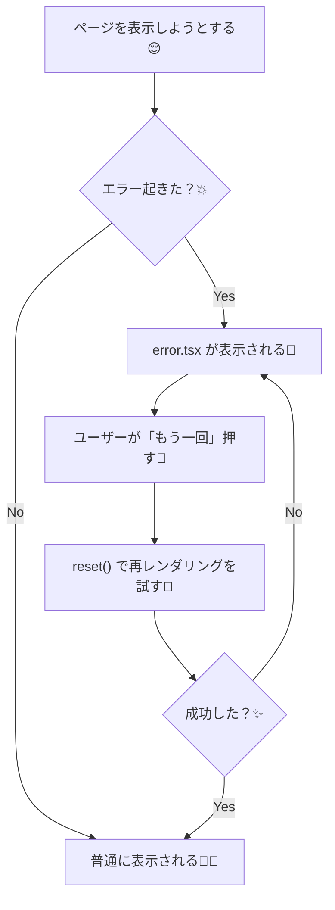

# 第96章：`error.tsx` の `reset()` を使う🔁

この章のゴールはこれ！🎯
**「一時的に起きたエラー（通信失敗とか）を、ユーザーが“もう一回！”で復帰できるUIにする」**だよ〜🫶✨
Next.jsの `error.tsx` では **`reset()`** っていう“やり直しボタン用の関数”がもらえるのがポイント！🔁 ([Next.js][1])

---

## 1) `reset()` ってなに？🤔🔁

`error.tsx` は、そのルートセグメントでエラーが起きたときに表示される“保険画面”だよ🧯
で、そこで受け取れる `reset()` を実行すると…

✅ **エラー境界（その区間）をもう一回レンダリングし直してくれる**
✅ うまくいけば **エラー画面が消えて、元の画面に戻る** 🎉 ([Next.js][1])

---

## 2) まずは「わざと失敗するページ」を作ろう😈💥

例：`app/demo/page.tsx`（たまに失敗する）🎲

```tsx
export default async function Page() {
  // 50%で失敗する（デモ用）
  if (Math.random() < 0.5) {
    throw new Error("デモエラーです💥 もう一回で治る…かも？😵‍💫");
  }

  return (
    <main style={{ padding: 24 }}>
      <h1>Demo Page 🎉</h1>
      <p>成功したよ〜🙂✨（リロードすると失敗する時もあるよ）</p>
    </main>
  );
}
```

---

## 3) 同じ階層に `error.tsx` を置く🧯✨

`app/demo/error.tsx` を作るよ！
ここが大事👇

* **`error.tsx` は Client Component が必須**（だから `"use client"` が必要）🎮 ([Next.js][2])
* props として **`error` と `reset`** を受け取るよ🧩 ([Next.js][2])

```tsx
"use client";

import { useEffect, startTransition } from "react";
import { useRouter } from "next/navigation";

export default function Error({
  error,
  reset,
}: {
  error: Error & { digest?: string };
  reset: () => void;
}) {
  const router = useRouter();

  useEffect(() => {
    // 開発中はここでログを見ると便利👀
    console.error("エラー発生💥", error);
  }, [error]);

  const onRetry = () => {
    // “やり直し”は軽めに：UIが固まりにくい感じで🔁✨
    startTransition(() => {
      reset();          // まず再レンダリングを試す
      router.refresh(); // サーバー側の取得もやり直したい時に効くことが多い🧼
    });
  };

  return (
    <main style={{ padding: 24 }}>
      <h1>あっ…エラー出ちゃった🥲💦</h1>
      <p style={{ marginTop: 8 }}>
        一時的な不具合かも！下のボタンで再チャレンジしてみてね🔁✨
      </p>

      <pre
        style={{
          marginTop: 16,
          padding: 12,
          background: "#f5f5f5",
          borderRadius: 8,
          overflowX: "auto",
        }}
      >
        {error.message}
      </pre>

      <button
        onClick={onRetry}
        style={{
          marginTop: 16,
          padding: "10px 14px",
          borderRadius: 10,
          border: "1px solid #ccc",
          cursor: "pointer",
          background: "white",
        }}
      >
        もう一回やる！🔁💪
      </button>
    </main>
  );
}
```

`reset()` 自体は「その区間を再レンダリングし直す」動きだよ🔁 ([Next.js][1])
ただ、**データ取得まわりだと `router.refresh()` を足すと復帰しやすい**場面があるよ（現場あるある）🧼🔄 ([Qiita][3])

---

## 4) 図でイメージしよ〜🧠📌（Mermaid）




---

## 5) よくあるハマりどころ🙈🪤

### ✅ ハマり①：`error.tsx` に `"use client"` を書き忘れた😵‍💫

→ **必須です！**（`error.tsx` は Client Component）🎮 ([Next.js][2])

### ✅ ハマり②：`reset()` 押しても同じエラーのまま🥲

→ エラー原因が「一時的」じゃなくて「ずっと壊れてる」可能性もあるよ💦
→ それでも通信系なら **`router.refresh()` を一緒に使う**と復帰しやすいことがある！🔁🧼 ([Qiita][3])

### ✅ ハマり③：どこに `error.tsx` 置けばいいの？🗂️

→ **エラーを受け止めたい区間（ルートセグメント）と同じ階層**に置くのが基本だよ🧯 ([Next.js][4])

---

## 6) ミニ練習💪🎀（5分）

1. `/demo` を開く🌐
2. 失敗したら `error.tsx` が出る😵‍💫
3. **「もう一回やる！🔁💪」** を押す
4. 成功したら元画面に戻る🎉（戻らなければもう一回！😆）

---

## まとめ🎁✨

* `error.tsx` では **`reset()` が使える**🔁 ([Next.js][1])
* `reset()` は **その区間の再レンダリングを試して復帰する**動き🧯➡️🙂 ([Next.js][1])
* データ取得が絡むなら、実務だと **`router.refresh()` を添える**と助かる場面もあるよ🧼🔄 ([Qiita][3])

[1]: https://nextjs.org/docs/app/api-reference/file-conventions/error?utm_source=chatgpt.com "File-system conventions: error.js"
[2]: https://nextjs.org/learn/dashboard-app/error-handling?utm_source=chatgpt.com "Handling Errors - App Router"
[3]: https://qiita.com/P-man_Brown/items/9807162c5945fb459014?utm_source=chatgpt.com "【Next.js】error.tsxでデータ取得を再試行する方法"
[4]: https://nextjs.org/docs/app/getting-started/error-handling?utm_source=chatgpt.com "Getting Started: Error Handling"
