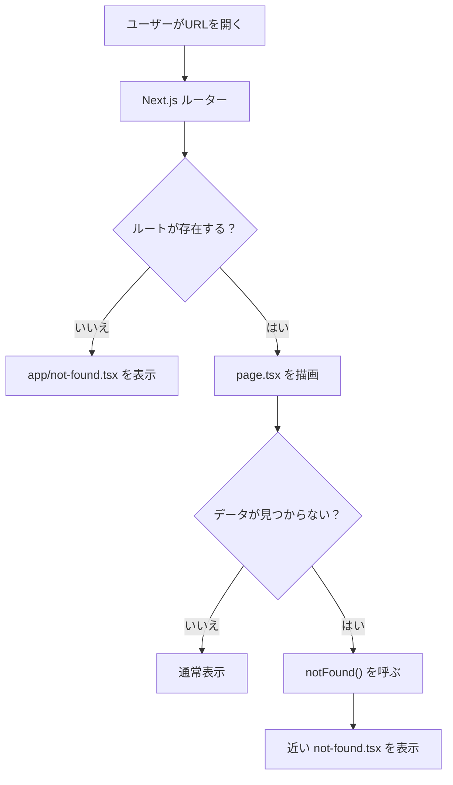
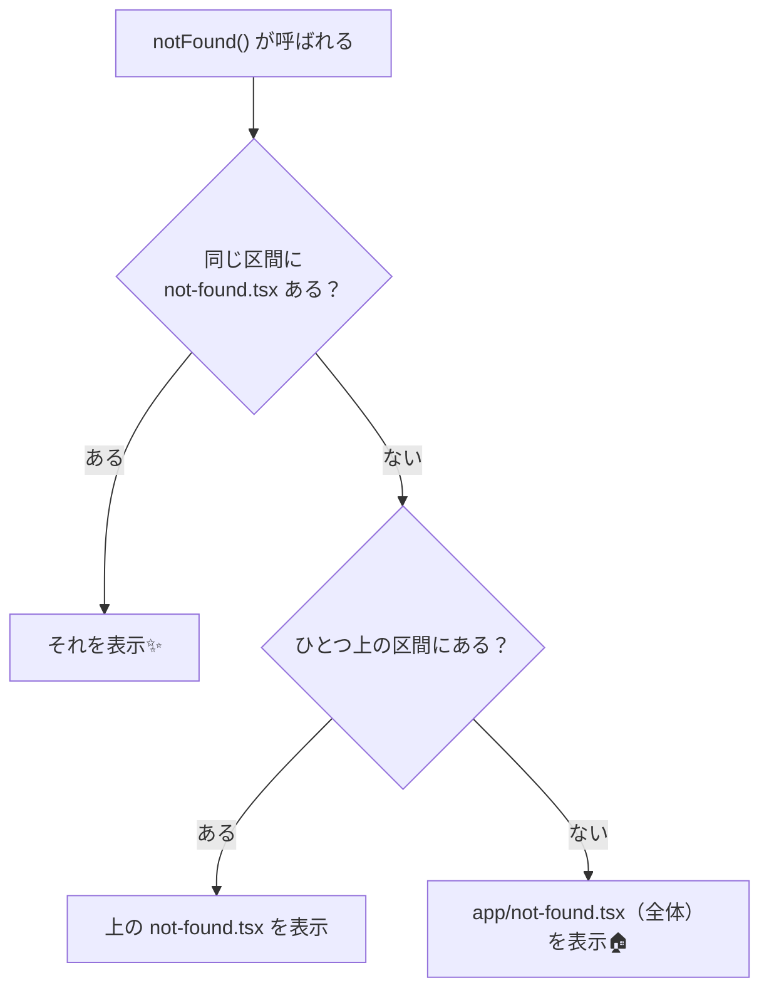
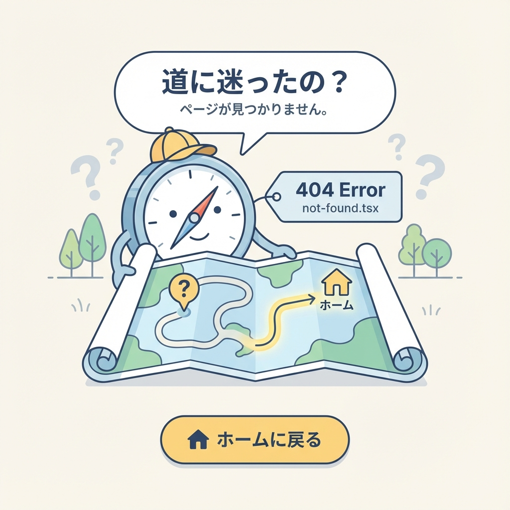

# 第97章：`not-found.tsx` を“丁寧に”作る（案内が命）🧭✨

この章は「**404（見つからない）**」を、ユーザーにやさしく案内できるように整える回だよ〜😊💖
404って、出し方ひとつで「うわ…迷子になった🥲」が「よし戻ろ！😆」に変わるのだ🌸

---

## この章でできるようになること ✅🎯

* `app/not-found.tsx` を作って、**自分の404画面**を出せる🧁
* 動的ルート（`[slug]` とか）で、**データが無い時に `notFound()` で404を出す**🧠
* 「案内が上手い404」って何？を、テンプレで作れる🧭✨

※ `not-found.tsx` は “ファイル名が決まってる特別ルール” だよ〜（Next.jsの公式ルール）([Next.js][1])

---

## 404は2種類あるよ（ここ大事）🧠✨

1. **URLそのものが存在しない**（例：`/hogehoge`）
2. **ページはあるけど中身（データ）が無い**（例：`/posts/存在しないslug`）

②のときに使うのが `notFound()` だよ〜！([Next.js][2])

---

## 図解：404が出るまでの流れ 🗺️✨（Mermaid）



---

## 1) まずは全体共通の 404 を作ろう 🧁🏠

### 作るファイル ✍️

* `app/not-found.tsx`
* `app/not-found.module.css`（見た目用）

### `app/not-found.tsx`（コピペOK）💖

```tsx
// app/not-found.tsx
import Link from "next/link";
import styles from "./not-found.module.css";
import BackButton from "@/components/BackButton";

export default function NotFound() {
  return (
    <main className={styles.wrap}>
      <div className={styles.card}>
        <p className={styles.badge}>404</p>
        <h1 className={styles.title}>ページが見つからなかったみたい…🥲</h1>
        <p className={styles.text}>
          URLが間違っているか、ページがお引っ越しした可能性があるよ〜🚚💨
        </p>

        <div className={styles.actions}>
          <Link className={styles.primary} href="/">
            ホームへ戻る🏠✨
          </Link>
          <BackButton className={styles.secondary} />
        </div>

        <div className={styles.hints}>
          <p className={styles.hintsTitle}>おすすめの戻り先👇😊</p>
          <ul className={styles.list}>
            <li>
              <Link href="/about">サイトについて📘</Link>
            </li>
            <li>
              <Link href="/posts">記事一覧📰</Link>
            </li>
          </ul>
        </div>
      </div>
    </main>
  );
}
```

### `app/not-found.module.css`（かんたん可愛い版）🎀

```css
/* app/not-found.module.css */
.wrap {
  min-height: 100vh;
  display: grid;
  place-items: center;
  padding: 24px;
}

.card {
  width: min(680px, 100%);
  border: 1px solid #e5e7eb;
  border-radius: 16px;
  padding: 24px;
  background: #fff;
}

.badge {
  display: inline-block;
  font-weight: 700;
  letter-spacing: 0.1em;
  padding: 6px 10px;
  border-radius: 999px;
  background: #f3f4f6;
  margin: 0 0 12px;
}

.title {
  font-size: 28px;
  margin: 0 0 8px;
}

.text {
  margin: 0 0 18px;
  color: #374151;
  line-height: 1.7;
}

.actions {
  display: flex;
  gap: 10px;
  flex-wrap: wrap;
  margin-bottom: 18px;
}

.primary,
.secondary {
  display: inline-flex;
  align-items: center;
  justify-content: center;
  padding: 10px 14px;
  border-radius: 12px;
  text-decoration: none;
  border: 1px solid #e5e7eb;
}

.primary {
  background: #111827;
  color: #fff;
  border-color: #111827;
}

.secondary {
  background: #fff;
  color: #111827;
}

.hints {
  border-top: 1px solid #f3f4f6;
  padding-top: 14px;
}

.hintsTitle {
  margin: 0 0 8px;
  font-weight: 600;
}

.list {
  margin: 0;
  padding-left: 18px;
}

.list a {
  text-decoration: underline;
}
```

---

## 2) 「戻るボタン」を作ろう（小さなClient部品）🔙✨

`not-found.tsx` 自体は基本サーバー側のコンポーネントだけど、
「ブラウザの履歴_attach で戻る」はクライアントでやりたいよね😊

### `components/BackButton.tsx` を作成 💡

```tsx
// components/BackButton.tsx
"use client";

import { useRouter } from "next/navigation";

type Props = {
  className?: string;
};

export default function BackButton({ className }: Props) {
  const router = useRouter();

  return (
    <button
      type="button"
      className={className}
      onClick={() => router.back()}
    >
      ひとつ前へ戻る🔙 remember
    </button>
  );
}
```

---

## 3) 動的ページで「データが無い」→ `notFound()` を呼ぼう 🧠📰

たとえば `/posts/[slug]` の詳細ページで、
その `slug` の記事が存在しなかったら **404にしたい**よね🥺

### 例：`app/posts/[slug]/page.tsx`

> Next.js 15+ では `params` が Promise になってるので `await` するのが安心だよ〜🫶（将来の互換性のため）([Next.js][3])

```tsx
// app/posts/[slug]/page.tsx
import { notFound } from "next/navigation";

const POSTS = [
  { slug: "hello", title: "はじめての記事🌸" },
  { slug: "study", title: "勉強メモ📚" },
];

type PageProps = {
  params: Promise<{ slug: string }>;
};

export default async function Page({ params }: PageProps) {
  const { slug } = await params;

  const post = POSTS.find((p) => p.slug === slug);

  if (!post) {
    notFound(); // ← ここ！このセグメントの not-found.tsx があればそれが出るよ✨
  }

  return (
    <main style={{ padding: 24 }}>
      <h1>{post.title}</h1>
      <p>slug: {slug}</p>
    </main>
  );
}
```

`notFound()` は、その区間の描画を止めて、`not-found` のUIを出してくれるよ〜([Next.js][2])

---

## 4) 「記事だけ別デザインの404」にしたい場合 🎨📰

たとえば「記事が無いときは記事っぽい404」にしたいなら、ここ👇

* `app/posts/[slug]/not-found.tsx`

```tsx
// app/posts/[slug]/not-found.tsx
import Link from "next/link";

export default function NotFound() {
  return (
    <main style={{ padding: 24 }}>
      <h2>この記事、見つからなかったよ🥺📰</h2>
      <p>URLが間違ってるか、まだ公開されてないのかも…！</p>
      <Link href="/posts">記事一覧へ戻る🗂️</Link>
    </main>
  );
}
```

---

## 図解：`not-found.tsx` は「近いのが優先」🧭✨



---

## UX的に「丁寧な404」にするコツ 🫶✨（ここが第97章の主役！）

404は “謝る画面” じゃなくて “案内板” 🧭💕



おすすめ要素はこれ👇

* **何が起きたか**：迷子になったよ〜、くらいでOK🥲
* **次に何すればいいか**：ホーム・一覧・検索などの導線🚪✨
* **責めない文章**：「あなたが間違った」じゃなくて「見つからなかったみたい」😊
* **よく行く場所リンク**：記事一覧、カテゴリ、問い合わせなど🗂️📮

---

## 動作チェック ✅🔍

開発サーバー起動して（例：`npm run dev`）🚀

* `http://localhost:3000/aaaaaaaa` → 404が出るか確認🥳
* `http://localhost:3000/posts/unknown` → `notFound()` で記事404になるか確認📰✨

---

## よくあるつまずき 🧯😵‍💫

* **`not-found.tsx` のファイル名が違う**（1文字でも違うと無効💥）([Next.js][1])
* **「URL存在しない」のと「データ無い」がごっちゃ**🌀

  * データが無い時は `notFound()` を呼ぶのが基本だよ([Next.js][2])
* **動的ルートの `params` を await してなくて型エラー**（Next 15+あるある）😵‍💫([Next.js][3])

---

## ミニ練習（5〜10分）⏳✨

1. 404画面に「人気リンク」を3つ追加してみよ〜🔗💖
2. `app/not-found.tsx` に「お問い合わせ」リンクを足してみよ📮😊
3. `/posts/[slug]/not-found.tsx` を “記事っぽいデザイン” に寄せてみよ📰🎨

---

次の章（第98章）では、**「一覧は先に見せて、詳細だけ遅れて出す」**っていう、ちょっと気持ちいい表示（Streaming/Suspense）を触るよ〜🌊✨

[1]: https://nextjs.org/docs/app/api-reference/file-conventions/not-found?utm_source=chatgpt.com "File-system conventions: not-found.js"
[2]: https://nextjs.org/docs/app/api-reference/functions/not-found?utm_source=chatgpt.com "Functions: notFound"
[3]: https://nextjs.org/docs/app/api-reference/file-conventions/page?utm_source=chatgpt.com "File-system conventions: page.js"
