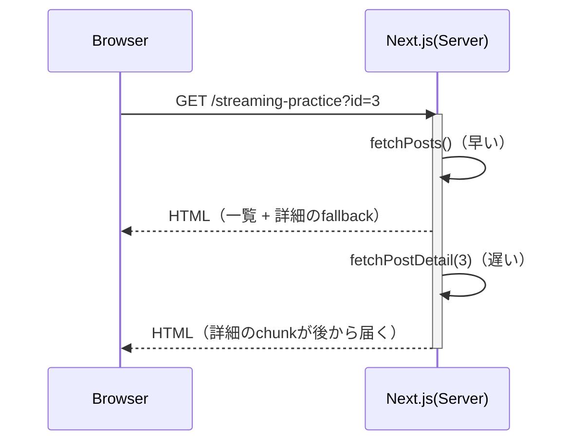
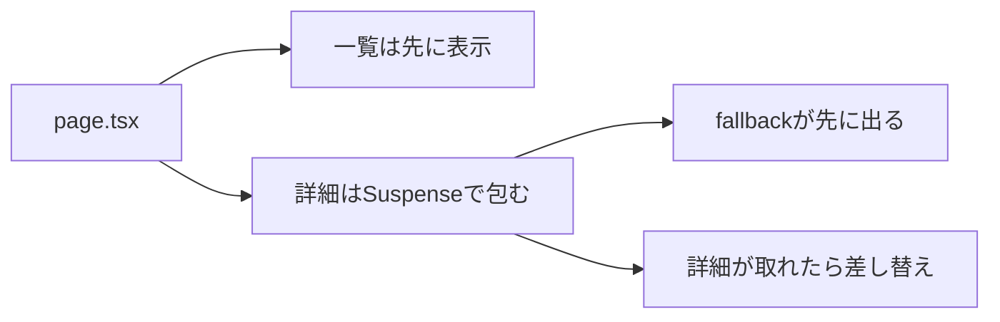

# 第98章：練習：一覧は先に表示、詳細だけ遅れて表示📰

この章では、**「一覧はすぐ見える」けど「詳細だけ少し遅れて出る」**を作ります😊
Next.js（App Router）の **Streaming + Suspense** の気持ちよさを体験しよ〜！🌊🫧

---

## ゴール 🎯

* 画面左に「記事一覧」🗂️（すぐ表示）
* 画面右に「詳細」🔍（ちょっと遅れて表示）
* 詳細は遅れてる間、**かわいい“読み込み中”表示**が出る⏳💛

---

## できあがりイメージ 🖥️💡

* まず一覧がパッ！✨
* 右側は「読み込み中…」⏳
* 数秒後に詳細がスッ…と出る🪄

---

## 図でイメージ（Streamingの流れ）🌊




---

## 作るもの（フォルダ構成）📁✨

こんな感じで追加します👇

```text
app/
  streaming-practice/
    page.tsx
    PostDetail.tsx
    DetailSkeleton.tsx
    page.module.css
lib/
  demoApi.ts
```

---

## 手順①：API用の関数を作る（lib/demoApi.ts）🔧🌐

`lib/demoApi.ts` を作って、一覧と詳細を取る関数を用意します📦
※ デモなので無料の `jsonplaceholder` を使います✨

```ts
export type Post = { id: number; title: string; body: string }

const BASE = "https://jsonplaceholder.typicode.com"

// 一覧（id と title だけ）
export async function fetchPosts(): Promise<Array<Pick<Post, "id" | "title">>> {
  const res = await fetch(`${BASE}/posts?_limit=10`, { cache: "no-store" })
  if (!res.ok) throw new Error("posts fetch failed")
  const data: Post[] = await res.json()
  return data.map(({ id, title }) => ({ id, title }))
}

// 詳細（title + body）
export async function fetchPostDetail(id: number): Promise<Post> {
  const res = await fetch(`${BASE}/posts/${id}`, { cache: "no-store" })
  if (!res.ok) throw new Error("post fetch failed")
  return res.json()
}

// わざと遅くする用（デモ）
export function sleep(ms: number) {
  return new Promise<void>((resolve) => setTimeout(resolve, ms))
}
```

---

## 手順②：詳細コンポーネント（遅れて出す本体）を作る 🐢➡️✨

`app/streaming-practice/PostDetail.tsx` を作ります。
ここで **わざと1.5秒遅らせる**よ〜⏳（体験のため！）

```tsx
import { fetchPostDetail, sleep } from "@/lib/demoApi"

type Props = { id: number }

export default async function PostDetail({ id }: Props) {
  await sleep(1500) // ← デモ用！遅延させてStreamingを体験するよ⏳
  const post = await fetchPostDetail(id)

  return (
    <article>
      <h3>{post.title}</h3>
      <p style={{ whiteSpace: "pre-wrap" }}>{post.body}</p>
      <p style={{ opacity: 0.6 }}>id: {post.id}</p>
    </article>
  )
}
```

---

## 手順③：詳細が遅れてる間に出すUI（fallback）を作る ⛑️🫧

`app/streaming-practice/DetailSkeleton.tsx` を作ります✨

```tsx
import styles from "./page.module.css"

export default function DetailSkeleton() {
  return (
    <div className={styles.skeleton}>
      <div className={styles.skelLine} />
      <div className={styles.skelLine} />
      <div className={styles.skelLineShort} />
      <p className={styles.loadingText}>読み込み中…⏳（詳細だけ後から来るよ🫶）</p>
    </div>
  )
}
```

---

## 手順④：ページ本体（一覧はすぐ、詳細はSuspenseで遅れて）📰🫧

`app/streaming-practice/page.tsx` を作ります。
ポイントはここ👇

* 一覧は `fetchPosts()` で先に表示✨
* 詳細は `<Suspense fallback={...}>` で包む🫧
* `key={selectedId}` を付けて、IDが変わるたびに「読み込み中」に戻るようにする🔁
* デモでは挙動が分かりやすいように `prefetch={false}` にしてます（任意）🚫⚡

```tsx
import Link from "next/link"
import { Suspense } from "react"
import styles from "./page.module.css"
import { fetchPosts } from "@/lib/demoApi"
import PostDetail from "./PostDetail"
import DetailSkeleton from "./DetailSkeleton"

type PageProps = {
  searchParams: Promise<{ id?: string }>
}

export default async function Page({ searchParams }: PageProps) {
  const posts = await fetchPosts()

  const { id } = await searchParams
  const firstId = posts[0]?.id ?? 1
  const selectedId = Number(id ?? firstId)

  return (
    <main className={styles.main}>
      <section className={styles.list}>
        <h1 className={styles.h1}>記事一覧 📰</h1>

        <ul className={styles.ul}>
          {posts.map((p) => {
            const active = p.id === selectedId
            return (
              <li key={p.id} className={active ? styles.active : undefined}>
                <Link href={`/streaming-practice?id=${p.id}`} prefetch={false}>
                  {p.title}
                </Link>
              </li>
            )
          })}
        </ul>

        <p className={styles.tip}>
          どれか押してね👇✨（右の詳細が遅れて出るよ⏳）
        </p>
      </section>

      <section className={styles.detail}>
        <h2 className={styles.h2}>詳細 🔍</h2>

        <Suspense key={selectedId} fallback={<DetailSkeleton />}>
          <PostDetail id={selectedId} />
        </Suspense>
      </section>
    </main>
  )
}
```

---

## 手順⑤：見た目を整える（CSS Modules）💅✨

`app/streaming-practice/page.module.css` を作ります🌸
（超シンプルでOK！）

```css
.main {
  display: flex;
  gap: 16px;
  padding: 24px;
  align-items: flex-start;
}

.list {
  width: 360px;
  border: 1px solid #ddd;
  padding: 16px;
  border-radius: 12px;
  background: #fff;
}

.detail {
  flex: 1;
  border: 1px solid #ddd;
  padding: 16px;
  border-radius: 12px;
  min-height: 260px;
  background: #fff;
}

.h1 {
  margin: 0 0 12px;
  font-size: 18px;
}

.h2 {
  margin: 0 0 12px;
  font-size: 16px;
}

.ul {
  list-style: none;
  padding: 0;
  margin: 0;
  display: flex;
  flex-direction: column;
  gap: 8px;
}

.ul a {
  text-decoration: none;
}

.ul a:hover {
  text-decoration: underline;
}

.active a {
  font-weight: 700;
}

.tip {
  margin-top: 12px;
  font-size: 13px;
  opacity: 0.75;
}

/* fallback用 */
.skeleton {
  display: flex;
  flex-direction: column;
  gap: 10px;
}

.skelLine {
  height: 16px;
  background: #eee;
  border-radius: 8px;
}

.skelLineShort {
  height: 16px;
  background: #eee;
  border-radius: 8px;
  width: 70%;
}

.loadingText {
  margin-top: 8px;
  font-size: 13px;
  opacity: 0.7;
}
```

---

## 動作確認 ✅🎉

ターミナルで👇

```bash
npm run dev
```

ブラウザで👇を開く：

* `http://localhost:3000/streaming-practice`

記事タイトルをクリックすると…

* 左の一覧はそのまま見える📰✨
* 右は「読み込み中…」⏳
* 少し待つと詳細が表示🪄

---

## ここが重要（脳内まとめ）🧠💡



---

## よくあるつまずき 🥺🔧

* **「読み込み中が一瞬しか見えない」**
  → APIが速すぎるかも！`sleep(1500)` を 3000 にしてみてね⏳💤

* **「クリックしても読み込み中に戻らない」**
  → `<Suspense key={selectedId}>` が効いてないかも。`key` を付けると分かりやすいよ🔑✨

* **「Link押したのに変わらない」**
  → URLの `?id=` が変わってるか確認してね🔍
  → 例：`/streaming-practice?id=5`

---

## 追加チャレンジ（できたら強い）💪💖

1. 一覧の「選択中」をもっと分かりやすく（背景色とか）🎨
2. 詳細のfallbackを、カードっぽくオシャレにする💅✨
3. `prefetch={false}` を消して、体験がどう変わるか見る⚡👀

---

## まとめ 🎁

* **Suspenseを使うと「ページ全部」じゃなくて「一部だけ」待てる**🫧
* だから **一覧は先に見せて、詳細だけ後から**ができる🌊✨
* 体験が一気に“アプリっぽく”なるよ〜！😍📱

---

次の第99章では、この流れに **「失敗したときの再試行ボタン」**を足してもっと優しくしていくよ🔁🫶
