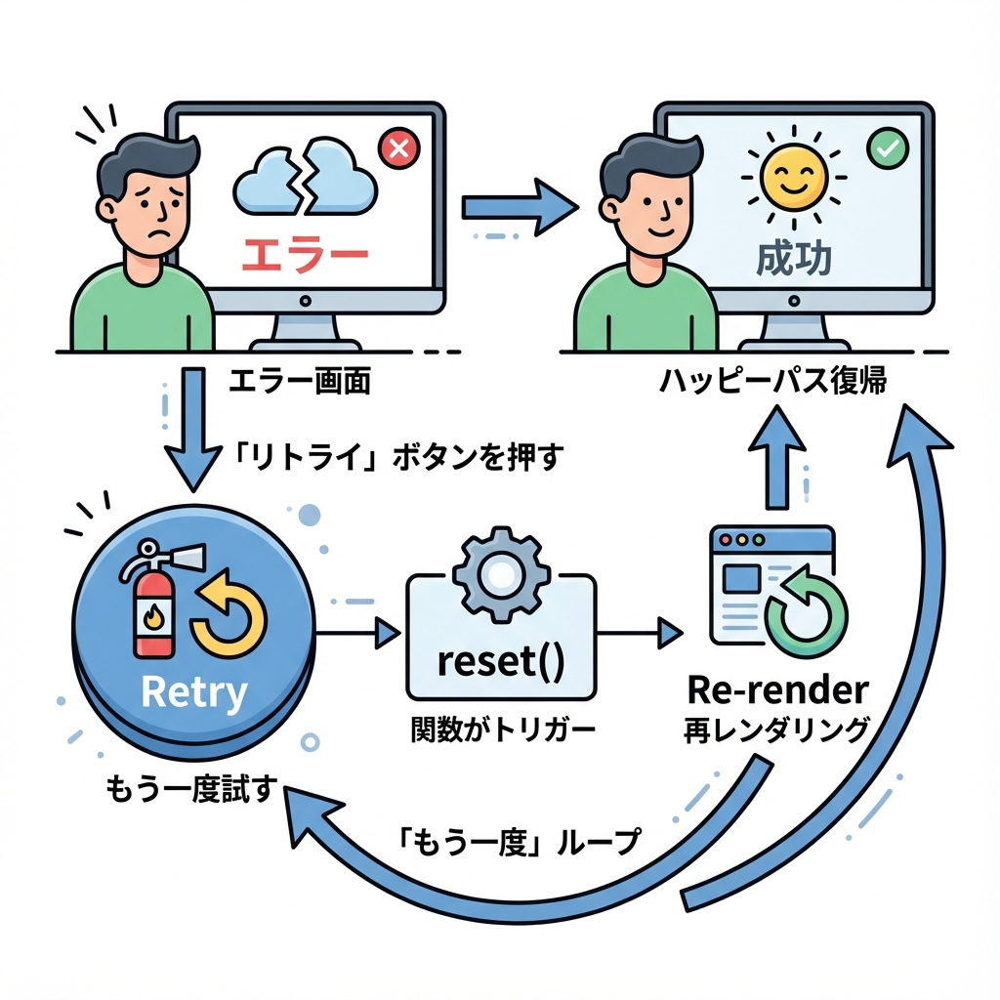
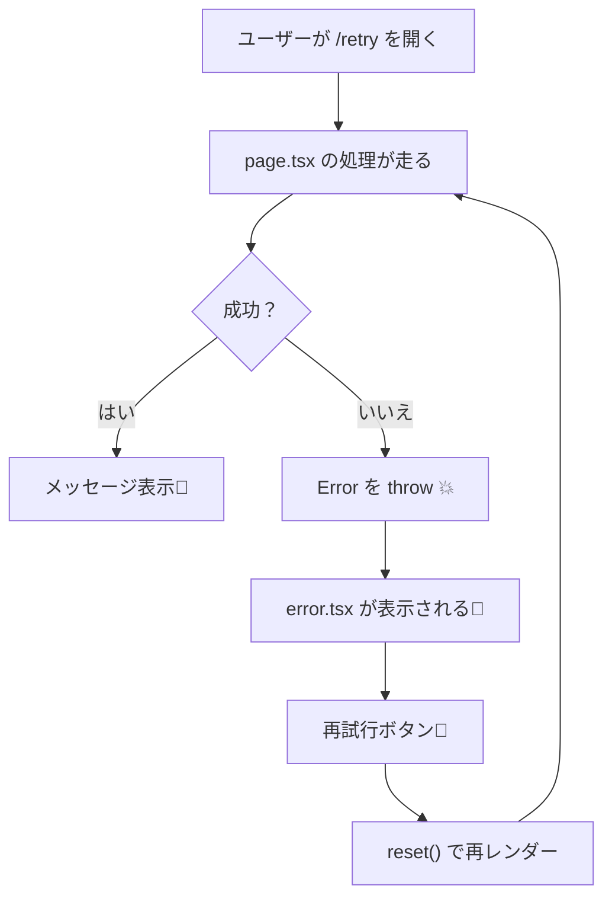

# 第99章：練習：失敗した時に“再試行”ボタンを付ける🔁

今日は「通信や処理が失敗したときに、ユーザーが自分で“もう一回！”できるボタン」を作るよ〜😊✨
Next.js（App Router）だと、**`error.tsx` にある `reset()`** を呼ぶだけで、**その区間を再レンダーして復帰を試せる**んだ〜！🔁
（公式にも「`reset()` はエラーバウンダリの中身を再レンダーして復帰を試す」って書いてあるよ📘） ([Next.js][1])

---

## できあがりイメージ（流れ）🗺️✨





---

## 今回つくるもの🧪✨

* `/retry` にアクセスすると、**たまに失敗する処理**が走る💥（わざと！練習用！）
* 失敗したら `error.tsx` が表示される🧯
* **「もう一回やってみる🔁」ボタン**を押すと `reset()` が動いて再チャレンジ💪✨

---

## 手順（ファイルを3つ作るよ）📁🧸

### 1) `app/retry/page.tsx` を作る🏗️

「成功したらメッセージ表示、失敗したら throw」するページだよ〜😆

```tsx
// app/retry/page.tsx
export const dynamic = "force-dynamic"; // 毎回ちゃんと動かして練習しやすくする🥳

async function getLuckyMessage() {
  // ちょい待つ（通信っぽく）⏳
  await new Promise((r) => setTimeout(r, 800));

  // 60%で失敗（練習用）💥
  if (Math.random() < 0.6) {
    throw new Error("通信に失敗しちゃった（練習用）💦");
  }

  const messages = [
    "成功〜！今日もえらい🥳",
    "やった！リトライ勝利✨",
    "OK！次の章もいける〜🚀",
    "復帰できた！強い💪",
  ];
  return messages[Math.floor(Math.random() * messages.length)];
}

export default async function RetryPage() {
  const message = await getLuckyMessage();

  return (
    <main style={{ padding: 24 }}>
      <h1 style={{ fontSize: 24, fontWeight: 700 }}>リトライ練習ページ🔁</h1>

      <div
        style={{
          marginTop: 16,
          padding: 16,
          border: "1px solid #ddd",
          borderRadius: 12,
        }}
      >
        <p style={{ fontSize: 18 }}>{message}</p>
        <p style={{ marginTop: 8, opacity: 0.7 }}>
          たまに失敗するよ！失敗したら再試行ボタンで復帰してね🧯✨
        </p>
      </div>
    </main>
  );
}
```

---

### 2) `app/retry/loading.tsx` を作る⏳（おまけだけど超おすすめ！）

読み込み中の見た目があると、体験が一気にやさしくなるよ〜☺️💕

```tsx
// app/retry/loading.tsx
export default function Loading() {
  return (
    <main style={{ padding: 24 }}>
      <p style={{ fontSize: 18 }}>読み込み中…⏳✨</p>
    </main>
  );
}
```

---

### 3) `app/retry/error.tsx` を作る🧯🔁（ここが本番！）

`error.tsx` は **Client Component が必須**だから、先頭に `"use client"` を書くよ🧠
ここで `reset()` をボタンから呼ぶと、**その区間を再レンダーして復帰を試せる**よ✨ ([Next.js][1])

```tsx
// app/retry/error.tsx
"use client";

import { useEffect, useTransition } from "react";

export default function Error({
  error,
  reset,
}: {
  error: Error & { digest?: string };
  reset: () => void;
}) {
  const [isPending, startTransition] = useTransition();

  useEffect(() => {
    console.error("エラー発生:", error);
  }, [error]);

  return (
    <main style={{ padding: 24 }}>
      <h2 style={{ fontSize: 22, fontWeight: 700 }}>
        あれれ…失敗しちゃった💦🧯
      </h2>

      <p style={{ marginTop: 8, opacity: 0.8 }}>
        {error.message}
      </p>

      <button
        onClick={() => startTransition(() => reset())}
        disabled={isPending}
        style={{
          marginTop: 16,
          padding: "10px 14px",
          borderRadius: 12,
          border: "1px solid #ddd",
          cursor: isPending ? "not-allowed" : "pointer",
          opacity: isPending ? 0.6 : 1,
        }}
      >
        {isPending ? "再試行中…⏳" : "もう一回やってみる🔁✨"}
      </button>

      <p style={{ marginTop: 12, opacity: 0.7 }}>
        ※ 押すたびにもう一度ページの処理をやり直すよ〜😊
      </p>
    </main>
  );
}
```

---

## 動かし方（確認）✅🚀

1. 開発サーバ起動：`npm run dev` 💨
2. ブラウザで `http://localhost:3000/retry` にアクセス🌈
3. 失敗したら **「もう一回やってみる🔁✨」** を押す👉
   そのうち成功メッセージが出たら勝ち🥳

---

## よくあるハマりどころ🪤（ここだけ見れば助かる）

* **`error.tsx` に `"use client"` が無い** → 動かない💥（エラーバウンダリはクライアント扱いだよ） ([Next.js 16 日本語ドキュメント][2])
* **置き場所が違う** → `app/retry/error.tsx` みたいに、**同じルート区間の中**に置くのが大事📁
* 「押しても内容が変わらない…」→ 今回は `dynamic = "force-dynamic"` 入れてるから基本大丈夫🙆‍♀️✨
  （もし“データ取得”が絡んでキャッシュっぽい挙動が気になったら、`router.refresh()` を併用する流派もあるよ🔁） ([GitHub][3])

---

## ミニ課題（30秒）🎯✨

* 失敗率 `0.6` を `0.8` にして、リトライのありがたみを味わってみて😂🔁
* 成功メッセージを自分の好きな文言に差し替えてみてね🫶💬

---

次の章（第100章）に行く前に、もし「このケースだと error.tsx に入らないんだけど？😵」みたいなのが出たら、その状況（コード or どこで throw してるか）を貼ってくれたら一緒に直すよ〜🧯✨

[1]: https://nextjs.org/docs/app/api-reference/file-conventions/error?utm_source=chatgpt.com "File-system conventions: error.js"
[2]: https://nextjsjp.org/docs/app/getting-started/error-handling?utm_source=chatgpt.com "エラーハンドリング | Next.js 16 日本語ドキュメント"
[3]: https://github.com/vercel/next.js/discussions/49935?utm_source=chatgpt.com "Is error.tsx's reset function pointless if it doesn't retry fetch ..."
