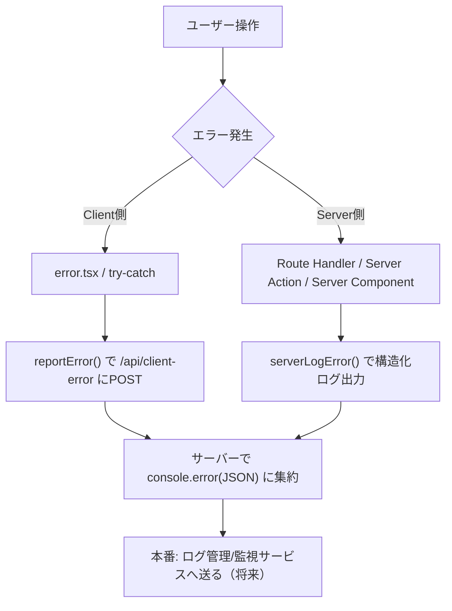
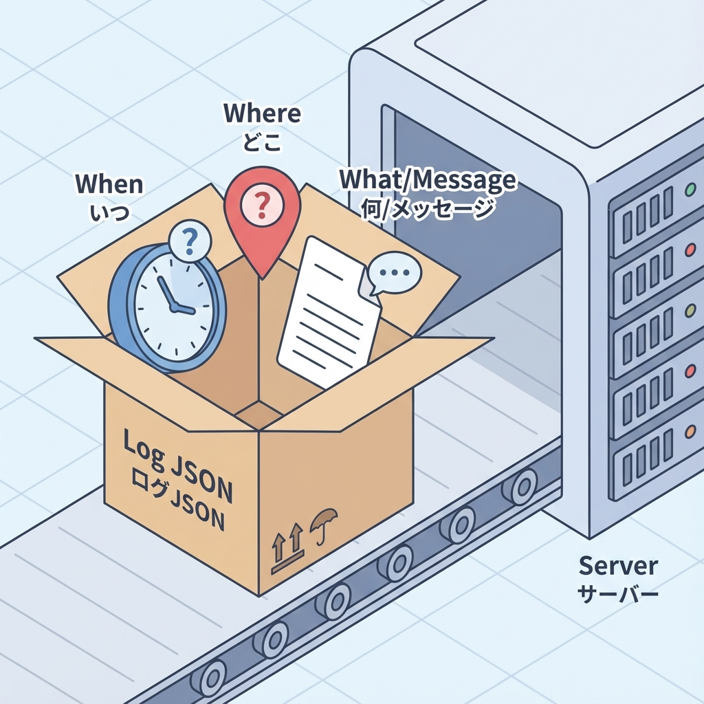

# 第100章：エラーログ方針：consoleだけで終わらせない📌

この章では、「エラーが起きた！」のあとに **ちゃんと追えるログ** を残せるようになるのがゴールだよ〜！🫶
**“とりあえず console.error()” で終わらせない** のがポイントです📌✨

---

## この章のゴール🎯💡

* どんな情報をログに残すと「原因特定が速くなるか」わかる🕵️‍♀️✨
* **Client側のエラー**も **Server側のエラー**も「一箇所に集める」考え方を知る📦
* 最低限の“ログの型”と“送る導線”をNext.jsで作れるようになる🚀

---

## なんで console だけだとツラいの？😵‍💫💦

console は便利！でも **それだけ**だと、こうなりがち👇

* 本番で「ユーザーがどんな操作した時に起きたか」分からない😇
* **ユーザーのブラウザ内の console** は、開発者が見れないことが多い💻❌
* いつ・どのページで・どの端末で起きたか追跡しづらい⏰📱
* “同じエラーが何回出てるか” 集計できない📊💦
* 通知（アラート）も飛ばせない🔔❌

だから方針としてはこう👇
**console は “最後の出口” にして、ログは “集めて残す”** 🧺✨

---

## まず決める！ログ方針の「3点セット」📌📌📌

### ① 何を残す？（ログの中身）📝

最低限これがあると強いよ💪✨

* `when`：いつ？（時刻）⏰
* `where`：どこで？（route / pathname）🗺️
* `what`：何が？（message / error name）💥
* `detail`：スタックトレース（可能なら）🧵
* `extra`：状況（検索条件、ボタン名、状態など）🎛️
* `digest`：Next.jsが付けてくれる識別子（ある時）🏷️

⚠️注意：ログに入れないもの

* パスワード、トークン、クレカ、住所、メールなどの個人情報🙅‍♀️🔒
* 「便利そうだから全部」は危険！最小限でOK👌

### ② どこに残す？（保存場所）📦

* 開発中：consoleでもOK（ただし整形する）🧪
* 本番：**サーバー側に集める** or **監視サービス**へ送る🌍

  * ここではまず「サーバーに集める」を体験するよ✨

### ③ どうやって集める？（導線）🚪

* Clientで起きたエラー → `/api/...` にPOSTしてサーバーに送る📮
* Serverで起きたエラー → その場でサーバーログに残す🖨️

---

## 図解：ログが集まる流れ📨➡️🧠➡️🗃️




---

## 実装してみよう🛠️✨（最小でOK！）

ここからは「Clientのエラーをサーバーへ送る」ミニ実装だよ📮💨
（本格的な監視サービスは、後の章でやると理解しやすい👍）

---

### 1) 受け口を作る：Route Handler（API）🚪📦




`app/api/client-error/route.ts` を作るよ！

```ts
import { NextResponse } from "next/server";

type ClientErrorPayload = {
  message: string;
  name?: string;
  stack?: string;
  digest?: string;
  pathname?: string;
  userAgent?: string;
  occurredAt: string; // ISO文字列
};

export async function POST(req: Request) {
  try {
    const body = (await req.json()) as ClientErrorPayload;

    // 超ゆるい最低限チェック（本格バリデーションは後の章でOK）
    if (!body?.message || !body?.occurredAt) {
      return NextResponse.json({ ok: false, error: "Invalid payload" }, { status: 400 });
    }

    // ✅ サーバー側に「構造化ログ」として集約
    console.error(
      JSON.stringify(
        {
          level: "error",
          source: "client",
          ...body,
        },
        null,
        2
      )
    );

    return NextResponse.json({ ok: true });
  } catch (e) {
    console.error("client-error route failed:", e);
    return NextResponse.json({ ok: false }, { status: 500 });
  }
}
```

ポイント💡

* `console.error(JSON.stringify(...))` にしておくと、あとでログ検索や集計がしやすいよ📚✨
* ここが“集める場所”になる感じ！🧺

---

### 2) 送る側を作る：logger 関数🧩📮

`lib/logger.ts` を作るよ！（`src/`運用なら `src/lib/logger.ts` でもOK✨）

```ts
type ReportErrorInput = {
  message: string;
  name?: string;
  stack?: string;
  digest?: string;
  pathname?: string;
};

export async function reportClientError(input: ReportErrorInput) {
  try {
    const payload = {
      ...input,
      userAgent: typeof navigator !== "undefined" ? navigator.userAgent : undefined,
      occurredAt: new Date().toISOString(),
    };

    // ✅ Client -> Serverへ送る
    await fetch("/api/client-error", {
      method: "POST",
      headers: { "Content-Type": "application/json" },
      body: JSON.stringify(payload),
    });
  } catch {
    // 送れない時もある（オフライン等）ので、ここでは静かに握るのが無難👌
  }
}

// Server側用（必要になったら使う）
export function logServerError(error: unknown, extra?: Record<string, unknown>) {
  const err = error instanceof Error ? error : new Error("Unknown error");
  console.error(
    JSON.stringify(
      {
        level: "error",
        source: "server",
        message: err.message,
        name: err.name,
        stack: err.stack,
        occurredAt: new Date().toISOString(),
        ...extra,
      },
      null,
      2
    )
  );
}
```

---

### 3) error.tsx から送る（ここ大事！）🧯📨

`error.tsx` は **Client Component** なので `"use client"` が必要だよ🎮✨
（Next.jsのエラーバウンダリはここが基本！）

例：`app/error.tsx`

```tsx
"use client";

import { useEffect } from "react";
import { reportClientError } from "@/lib/logger";

export default function Error({
  error,
  reset,
}: {
  error: Error & { digest?: string };
  reset: () => void;
}) {
  useEffect(() => {
    // ✅ 画面には出さない情報も、ログとして送る
    reportClientError({
      message: error.message,
      name: error.name,
      stack: error.stack,
      digest: error.digest,
      pathname: typeof window !== "undefined" ? window.location.pathname : undefined,
    });
  }, [error]);

  return (
    <div style={{ padding: 16 }}>
      <h2>ごめんね、エラーが起きちゃった…🥲</h2>
      <p>もう一回ためしてみてね🙏</p>
      <button onClick={() => reset()} style={{ padding: "8px 12px" }}>
        再試行する🔁
      </button>
    </div>
  );
}
```

ポイント💡

* **ユーザーに見せる文言**と、**開発者が欲しい情報**は分けるのが大人✨
* `digest` があると、同じエラーをまとめて追いやすいよ🏷️

---

## “いいログ”のコツ（初心者でもできる）✨📝

### ✅ 1) ログは「文章」じゃなく「データ」にする📦

* `console.error("xxx")` より
* `console.error(JSON.stringify({ route, message, ... }))` が強い💪

### ✅ 2) まずは3つだけ入れるならこれ🎯

* `pathname`（どこで）🗺️
* `message`（何が）💥
* `occurredAt`（いつ）⏰

### ✅ 3) 1つのエラーを追える「手がかり」を入れる🧵

* `digest`（あれば）
* “どのボタンを押した？”みたいな `action` を extra に入れるのも良いよ🎛️

---

## ミニ練習✍️😆（5〜10分）

1. わざとエラーを起こしてみよう💥
   `app/page.tsx` に一瞬だけこう書く👇（終わったら戻してね！）

```tsx
export default function Page() {
  throw new Error("テストエラーだよ！💥");
}
```

2. 画面にエラーが出たらOK✅
3. ターミナル（dev server）のログに、`source: "client"` のJSONが出てたら成功🎉✨

---

## まとめ🧁✨

* console は便利だけど、本番では「集めて残す」が大事📌
* ログは **データ（JSON）**にすると強い💪
* Clientのエラーは **Route HandlerへPOST** してサーバーに集約できる📮
* ユーザー向けメッセージは優しく🫶、開発者向け情報はログへ🧠
* 個人情報は絶対ログに入れない🙅‍♀️🔒

---

次の章（第101章）は「境界を小さく」＝エラーが起きてもページ全部を巻き込まない話だよ✂️✨
ここまでのログ設計があると、さらに効いてくるよ〜！😆🫶
