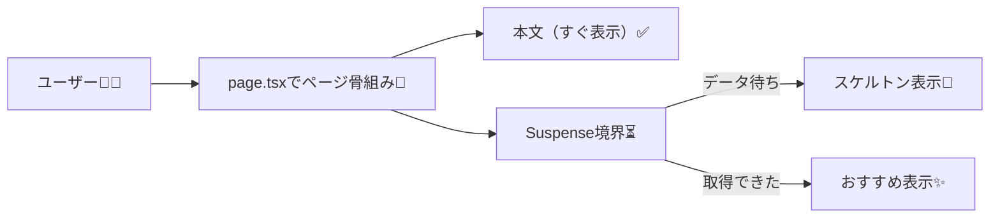
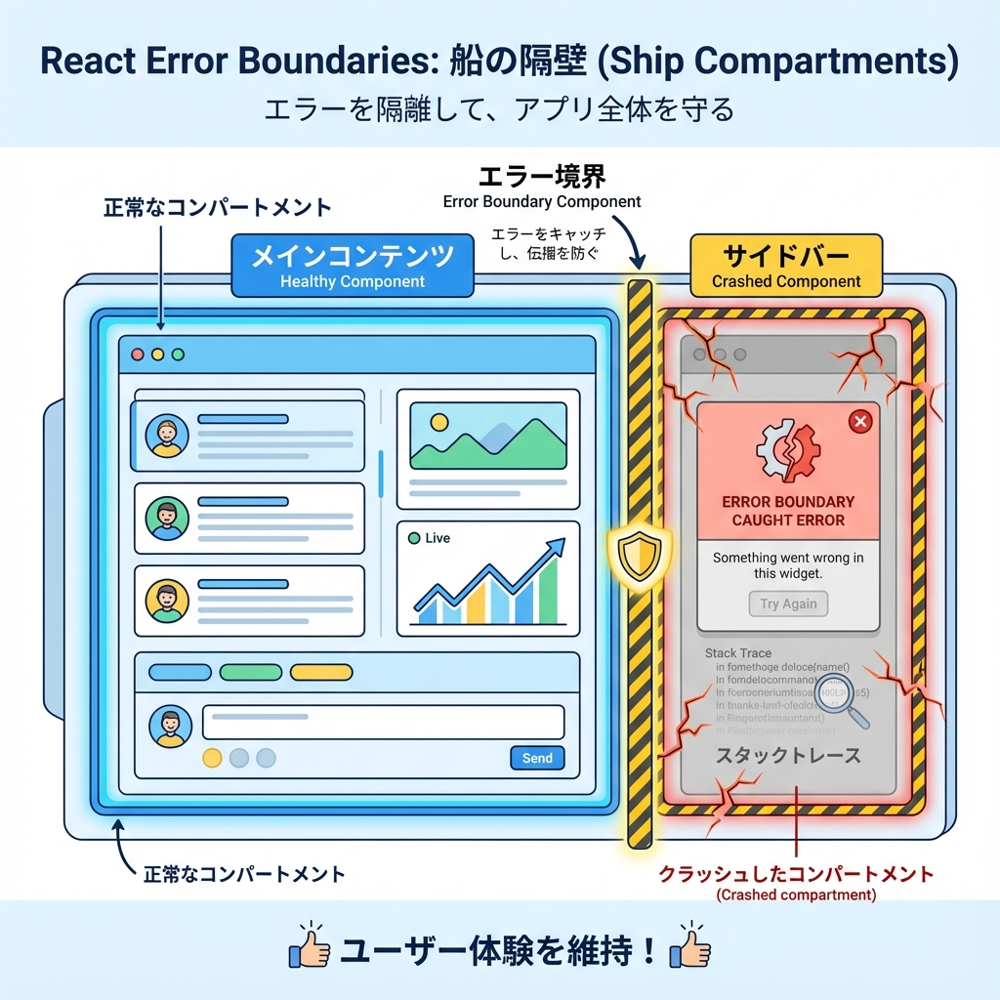
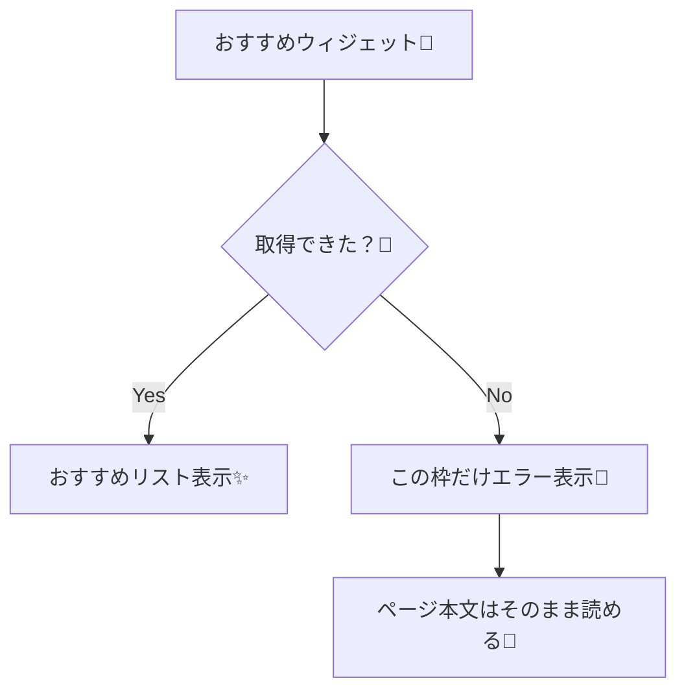

# 第101章：境界を小さく：ページ全体を巻き込まない✂️

この章は「一部が遅い/失敗した」だけで、ページ全体が **真っ白** とか **エラー画面ドーン** にならないようにする回だよ〜！🥹🌸
ポイントは **“境界（= Loading/エラーの影響範囲）を小さくする”** ことっ✨

---

## 今日のゴール🎯

* 遅い処理を **ページ全体の待ち** にしない⏳➡️🙂
* 失敗しても **その枠だけ** をエラー表示にする🙏
* 「本文は先に見える」+「右側だけあとから出る」を作る🌊✨

---

## なんで「境界を小さく」するの？🤔💡

例えばブログ記事ページで…

* 本文：すぐ見せたい📖✨
* サイドバーの「おすすめ記事」：外部APIで遅い or たまに落ちる😵‍💫

このとき、サイドバーが遅いだけなのにページ全体がローディングだと、体験がもったいないよね💦
だから **“遅い/不安定な部分だけ別扱い”** にするのが超大事〜！🫶🌈

---

## 図でイメージつかも〜📌（Loading境界を小さく）



---

# 1) やってみよう：サイドバーだけ後から出す🌊✨（Suspenseで小さく待つ）

## 手順①：ページを作る📄

例として `app/articles/page.tsx` を作るよ〜🛠️

```tsx
// app/articles/page.tsx
import { Suspense } from "react";
import RecommendedPosts from "@/components/RecommendedPosts";
import RecommendedSkeleton from "@/components/RecommendedSkeleton";

export default function ArticlesPage() {
  return (
    <main style={{ padding: 24 }}>
      <h1 style={{ fontSize: 28, marginBottom: 16 }}>学科ブログ📰✨</h1>

      <div
        style={{
          display: "grid",
          gridTemplateColumns: "1fr 320px",
          gap: 24,
          alignItems: "start",
        }}
      >
        {/* ✅ 先に見せたい本文 */}
        <section style={{ border: "1px solid #ddd", borderRadius: 16, padding: 16 }}>
          <h2 style={{ marginTop: 0 }}>本文（ここは先に見せたい！）📖</h2>
          <p>
            右側の「おすすめ」は遅れて出てくるよ〜⏳✨
            でも本文は先に読めるのがポイント💪🌸
          </p>
          <p>
            こうすると「待たされてる感」が減って、気持ちよく読めるんだ〜😊☕
          </p>
        </section>

        {/* ⏳ 遅い部分だけ待つ：境界を小さくする */}
        <aside style={{ border: "1px solid #ddd", borderRadius: 16, padding: 16 }}>
          <h2 style={{ marginTop: 0 }}>おすすめ記事🌟</h2>

          <Suspense fallback={<RecommendedSkeleton />}>
            <RecommendedPosts />
          </Suspense>
        </aside>
      </div>
    </main>
  );
}
```

---

## 手順②：スケルトン（待ってるUI）を用意🧸⏳

```tsx
// components/RecommendedSkeleton.tsx
export default function RecommendedSkeleton() {
  return (
    <div style={{ display: "grid", gap: 10 }}>
      {[1, 2, 3, 4, 5].map((n) => (
        <div
          key={n}
          style={{
            height: 44,
            borderRadius: 12,
            background: "#eee",
          }}
        />
      ))}
      <p style={{ margin: 0, fontSize: 12, opacity: 0.7 }}>読み込み中…⏳</p>
    </div>
  );
}
```

---

# 2) さらに大事：エラーも「その枠だけ」に閉じ込める🙏🧯

Next.js ではエラーが投げっぱなしだと、近くの `error.tsx` が発動して **区間ごと** にエラー画面になりがち💥
でも「おすすめ」みたいに **失敗しても致命傷じゃない部分** は、そこで受け止めて枠内だけにすると優しいよ〜🫶

## 図でイメージ📌（エラー境界を小さく）





---

## 手順③：おすすめ取得（遅い + たまに失敗）を作る🧪

```tsx
// components/RecommendedPosts.tsx
type Post = { id: number; title: string };

async function fetchRecommended(): Promise<Post[]> {
  // ⏳ 遅いAPIの気分を作る（練習用）
  await new Promise((r) => setTimeout(r, 1500));

  // 公開API（練習用）※ネット環境によっては通らないこともあるよ🙏
  const res = await fetch("https://jsonplaceholder.typicode.com/posts?_limit=5", {
    cache: "no-store",
  });

  if (!res.ok) {
    throw new Error("おすすめ取得に失敗🥲");
  }

  return res.json();
}

export default async function RecommendedPosts() {
  try {
    const posts = await fetchRecommended();

    return (
      <ul style={{ listStyle: "none", padding: 0, margin: 0, display: "grid", gap: 10 }}>
        {posts.map((p) => (
          <li key={p.id} style={{ border: "1px solid #eee", borderRadius: 12, padding: 12 }}>
            {p.title}
          </li>
        ))}
      </ul>
    );
  } catch {
    // ✅ ここで受け止める＝ページ全体を巻き込まない✨
    return (
      <div style={{ border: "1px solid #f3c0c0", borderRadius: 12, padding: 12 }}>
        <p style={{ margin: 0 }}>ごめんね🙏 おすすめ記事が読み込めなかったみたい…</p>
        <p style={{ margin: "8px 0 0", fontSize: 12, opacity: 0.8 }}>
          しばらくしてから更新（F5）してみてね🔁✨
        </p>
      </div>
    );
  }
}
```

---

## ✅ チェックポイント（できたら勝ち！）🏁🎉

* ページを開くと **本文が先に表示** される📖✨
* 右側は最初 **スケルトン** が出る🧸⏳
* しばらくすると **おすすめリストに切り替わる** 🌟
* もしおすすめが失敗しても、**本文は読めたまま** 🙏🌸

---

## よくあるハマりどころ🪤😵‍💫

* **「全部 `loading.tsx` にしちゃう」**
  → それだとページ全体が待つことになりやすいよ💦
  → “遅い部品だけ Suspense” が気持ちいい😊🌊

* **「失敗したら throw のまま」**
  → 大事故じゃない枠なら、今回みたいに **try/catchで枠内表示** が優しめ🫶

---

## ミニ練習💪✨（30分でOK）

1. サイドバーに「新着コメント💬」枠をもう1個作る
2. そこも `Suspense` でスケルトンを出す
3. そっちはわざと `throw new Error()` して、**枠だけエラー表示** になるのを確認🔁🧯

---

次の章（第102章）は、エラー表示の「言い方」をもっと優しくして、ユーザーを凹ませない文章づくりをやるよ〜🫶💬✨
