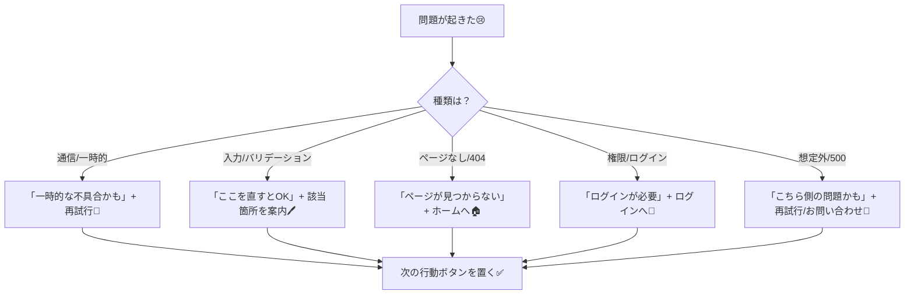

# 第102章：ユーザーに優しい文言（責めないメッセージ）🫶

アプリって、**失敗する瞬間（通信エラー・入力ミス・404など）**が必ず来るんだよね🥺
そのときに表示する文章（＝マイクロコピー）が優しいと、ユーザーは「このアプリ好き…🥹」ってなるし、冷たいと「もう使わない…😢」ってなりがち。

この章では、**“責めない・迷わせない”文章の作り方**を、Next.js（App Router）での画面（`error.tsx` / `not-found.tsx` / `loading.tsx`）に落とし込みながら練習するよ〜！🫶🌷

---

## この章のゴール🎯✨

* エラー文言を「冷たい」「責める」から「優しくて行動できる」に変えられる💗
* ユーザーが次に何をすればいいか、迷わない文章を書ける🧭
* `error.tsx` / `not-found.tsx` に“良い文章テンプレ”を入れられる🧩

---

## まず結論：優しい文言の4点セット🧁✨

エラー文言は、だいたいこれで勝てます🏆

1. **何が起きたか**（短く）📝
2. **あなたのせいじゃない**（空気感でOK）🫶
3. **次の一手**（ボタン・リンクで）👉
4. **必要なら詳細**（折りたたみやログ向け）🔍

---

## 図解：エラーメッセージの設計フロー🗺️✨（Mermaid）




---

## ダメな例→良い例（言い換え集）💬➡️💗

### 1) よくある冷たい文言🥶

* 「エラーが発生しました。」
* 「不正な操作です。」
* 「入力が間違っています。」

### 2) 優しい言い方🫶

* 「うまく読み込めませんでした😢 もう一度試してみてください」
* 「この操作は今はできないみたいです🙏（ログインが必要かも）」
* 「入力を確認してみてね🌷 “メールアドレス”の形式が少し違うかも」

### 3) “責めない”のコツ💡

* ❌「あなたが間違えた」
* ✅「こちらでうまく受け取れなかった」「形式が合わなかった」
* ✅「一時的かも」「環境によるかも」
* ✅「次にどうすればいいか」をセットで出す

---

## 場面別テンプレ集📦💗（コピペして育ててOK）

### ✅ 通信エラー（ネット・API）

* 見出し：`読み込みに失敗しました😢`
* 本文：`通信が不安定か、サーバーが混み合っているかも…`
* 行動：`再読み込み` / `もう一度試す` / `少し待つ`

### ✅ 入力エラー（フォーム）

* 見出し：`入力を確認してみてね🖊️`
* 本文：`いくつかの項目がうまく読み取れませんでした🙏`
* 行動：`エラーのある項目へスクロール`（可能なら）

### ✅ 404（ページがない）

* 見出し：`ページが見つかりませんでした🧭`
* 本文：`URLが変わったか、削除された可能性があります`
* 行動：`ホームへ` / `検索へ`

### ✅ 500（想定外）

* 見出し：`ごめんね、うまく表示できませんでした🧯`
* 本文：`こちら側の問題かもしれません。時間を置いて試してみてください`
* 行動：`再試行` / `お問い合わせ`

---

## Next.jsで“優しい文言”を入れる場所🏠🧩

* `app/error.tsx`：そのルート配下で起きたエラーを受ける（復旧ボタンも置ける）🧯
* `app/not-found.tsx`：存在しないページ（404）用🚪
* `app/loading.tsx`：待ってる間の不安を減らす⏳
* UI内の小さな文言：空状態（0件）・権限・フォームの補助文など🌷

---

## 実装①：`app/error.tsx` を“優しい＋行動できる”にする🧯💗

ポイント：`error.tsx` は **Client Component** なので `"use client"` が必要だよ〜！

```tsx
// app/error.tsx
"use client";

export default function ErrorPage({
  error,
  reset,
}: {
  error: Error & { digest?: string };
  reset: () => void;
}) {
  return (
    <main style={{ padding: 24 }}>
      <h1 style={{ fontSize: 24, marginBottom: 8 }}>
        うまく表示できませんでした😢
      </h1>

      <p style={{ marginBottom: 16 }}>
        いま一時的に調子が悪いかもしれません。<br />
        もう一度試すと直ることがあります🙏✨
      </p>

      <div style={{ display: "flex", gap: 12, flexWrap: "wrap" }}>
        <button
          onClick={() => reset()}
          style={{ padding: "10px 14px", cursor: "pointer" }}
        >
          もう一度ためす🔁
        </button>

        <a href="/" style={{ padding: "10px 14px" }}>
          ホームへ戻る🏠
        </a>
      </div>

      {/* 開発中だけ詳細を見たい時の例（本番で出しすぎ注意！） */}
      <details style={{ marginTop: 18 }}>
        <summary>くわしい情報（開発用）🔍</summary>
        <pre style={{ whiteSpace: "pre-wrap" }}>{String(error?.message)}</pre>
      </details>
    </main>
  );
}
```

💡コツ

* “謝りすぎ”より「復旧導線」優先🧭
* まずは `reset()`（再試行）を用意すると体験が一気に良くなるよ🔁✨

---

## 実装②：`app/not-found.tsx` を“迷子にしない”にする🧭🚪

```tsx
// app/not-found.tsx
import Link from "next/link";

export default function NotFound() {
  return (
    <main style={{ padding: 24 }}>
      <h1 style={{ fontSize: 24, marginBottom: 8 }}>
        ページが見つかりませんでした🧭
      </h1>

      <p style={{ marginBottom: 16 }}>
        URLが変わったか、ページが削除された可能性があります🙏
      </p>

      <div style={{ display: "flex", gap: 12, flexWrap: "wrap" }}>
        <Link href="/">ホームへ戻る🏠</Link>
        <Link href="/articles">記事一覧へ📚</Link>
      </div>
    </main>
  );
}
```

💡ここで大事なのは **「行き先を2つくらい用意する」**こと！
ホームだけだと「え、どこ見れば…」ってなる人がいるの🥺

---

## 実装③：`loading.tsx` は“待ってる不安”を減らす⏳💕

ローディングは、ただクルクルより
**「いま何してるか」**をひとこと添えると安心感が上がるよ🌷

```tsx
// app/loading.tsx
export default function Loading() {
  return (
    <main style={{ padding: 24 }}>
      <p style={{ fontSize: 18, marginBottom: 8 }}>読み込み中です…⏳</p>
      <p style={{ color: "#555" }}>
        データを取りに行っています🚶‍♀️💨 もう少しだけ待ってね🙏
      </p>
    </main>
  );
}
```

---

## ミニ練習🎒✨（10〜15分）

あなたのアプリを想像して、次を入れてみてね💪💗

1. `app/error.tsx` に「再試行🔁」「ホーム🏠」を付ける
2. `app/not-found.tsx` に「戻り先リンクを2つ」付ける
3. `app/loading.tsx` に「何してるか一言」入れる
4. できたら…フォームがあるなら

   * `エラーがある項目だけ優しく説明する文言` を1つ作る🖊️✨

---

## よくあるNG集⚠️（やりがち）

* 「不正な操作です。」← 怖い😨（何が不正なのか分からない）
* 「エラーコード: 0x800…」← 一般ユーザーには意味不明🥺
* 「やり直してください」だけ ← どこを？どうやって？🌀
* ボタンが「OK」だけ ← 何がOK？次どこ？😢

---

## 仕上げのコツ：文言の“統一感”がかわいさ💗✨

同じアプリの中で、

* ある画面は敬語、別画面は命令口調
* ある画面は冷たい、別画面は優しい
  …ってなると、地味に違和感が出るよ〜🥺

おすすめは、文体をこれに寄せる👇

* 「〜できませんでした🙏」
* 「〜かもしれません」
* 「よかったら〜してみてね🌷」

---

## まとめ🫶✨

* エラー文は「説明」じゃなくて **“ユーザーを助ける案内”**🧭
* **責めない＋次の行動** がセットで最強💗
* Next.jsでは `error.tsx` / `not-found.tsx` / `loading.tsx` が主戦場🔥

---

次の章（第103章）は、ロード/エラー/404 を **“3点セットとして固定化”**して、どのページでも迷子にならない作りにしていくよ📦✨
