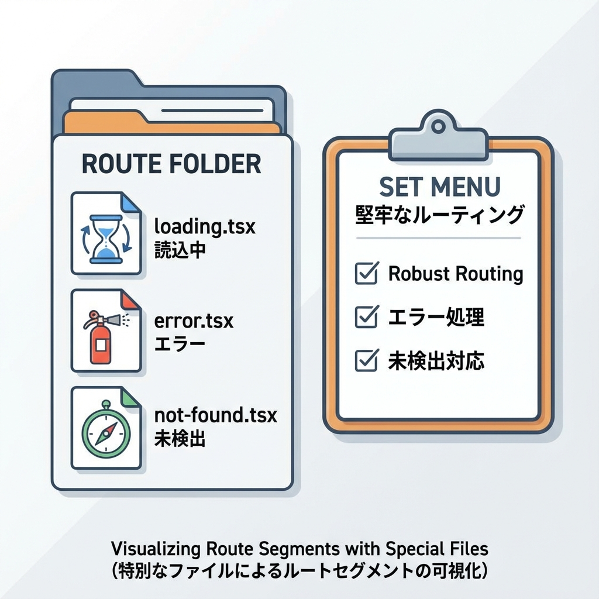
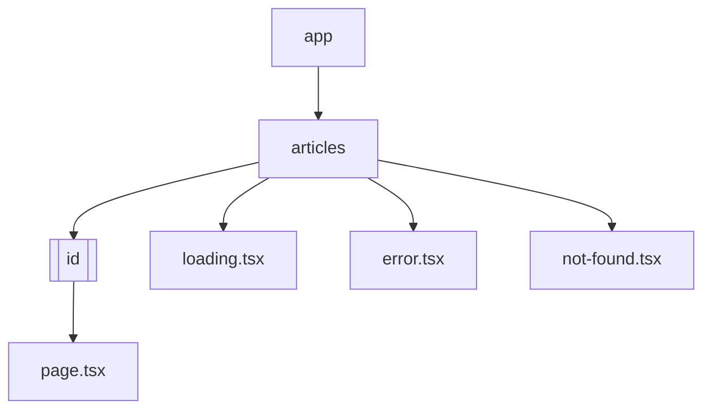

# 第103章：復習：ロード/エラー/404の3点セットを固定化📦

この章は「どのページでも迷わず同じ品質で出せる」ように、
**ロード（loading）・エラー（error）・404（not-found）** を “型” にして固めちゃいます😊🧩

---

## この章のゴール🎯💖

* ルート（ページ）ごとに **3点セット** を置けるようになる📦
* 「どこで何が出るUIなの？」が自分で説明できる🗣️✨
* そのままコピペできる **テンプレ** を持てる📋🎀

---

## 3点セットってなに？🧸📦

* **loading.tsx**：読み込み中に出す（待っててね〜）⏳🫧
* **error.tsx**：クラッシュしたときに出す（ごめんね＆リトライ）🧯🔁
* **not-found.tsx**：見つからないときに出す（案内してあげる）🚪🧭

「毎回これを作るのめんどい…😵」ってなるから、**固定の型**にしちゃうのが勝ちです💪✨

---

## どこに置くの？ “区間（セグメント）” で効くよ🧠🗺️



App Router では、フォルダごとに「区間」があります📁
その区間に loading / error / not-found を置くと、**その区間以下**に効きます✨

たとえば、こんなイメージ👇



* app/articles に 3点セットを置く → **/articles と /articles/〇〇 に効く**（だいたい）🧩
* さらに app/articles/[id] にも置く → **詳細だけ別UI**にできる🪄✨

---

## それぞれの役割を“1行”で覚えるコツ🌟

### 1) loading.tsx ⏳

「**データ待ち中に見せる**かわいい画面」

* fetch の待ち時間、遅い処理、ストリーミング中に出る🫧

### 2) error.tsx 🧯

「**落ちた時の安全ネット**（リトライ付き）」

* これは **クライアントコンポーネント**になる（ボタンを押したりするから）🎮

### 3) not-found.tsx 🚪

「**いないページに来た人を案内する**」

* notFound() を呼ぶとこれが出る🧭✨

---

## “固定化”するためのテンプレ方針📌💡

おすすめはこの3つだけ守ること🥰

1. **文言のトーンを統一**（責めない・短い・次の行動を置く）🫶
2. **必ず戻り先リンクを置く**（トップ/一覧）🔗
3. **error には再試行ボタン**（reset）🔁

---

# 実践：/articles で3点セットを固める📰✨

ここからは小さい例で「型」を作ります😊
（プロジェクトはすでにある前提でOKです）

## フォルダ構成📁

こんな感じに作ります👇

```txt
app/
  articles/
    page.tsx
    loading.tsx
    error.tsx
    not-found.tsx
    [id]/
      page.tsx
```

---

## 1) /articles のページ（一覧）📰

```tsx
// app/articles/page.tsx
import Link from "next/link";

const articles = [
  { id: "1", title: "はじめてのNext.js" },
  { id: "2", title: "Suspenseってなに？" },
  { id: "3", title: "ロード/エラー/404の型" },
];

export default function ArticlesPage() {
  return (
    <main style={{ padding: 24 }}>
      <h1>記事一覧📰✨</h1>
      <ul style={{ lineHeight: 2 }}>
        {articles.map((a) => (
          <li key={a.id}>
            <Link href={`/articles/${a.id}`}>{a.title}</Link>
          </li>
        ))}
      </ul>
    </main>
  );
}
```

---

## 2) loading.tsx（待っててねUI）⏳🫧

```tsx
// app/articles/loading.tsx
export default function Loading() {
  return (
    <main style={{ padding: 24 }}>
      <p>読み込み中だよ〜⏳💭</p>
      <p>ちょっとだけ待ってね🫶✨</p>
    </main>
  );
}
```

---

## 3) error.tsx（落ちたとき＋再試行）🧯🔁

ポイント：先頭に **"use client"** が必要です🎮✨

```tsx
// app/articles/error.tsx
"use client";

import Link from "next/link";
import { useEffect } from "react";

export default function Error({
  error,
  reset,
}: {
  error: Error;
  reset: () => void;
}) {
  useEffect(() => {
    console.error(error);
  }, [error]);

  return (
    <main style={{ padding: 24 }}>
      <h2>ごめんね、エラーが起きちゃった…🥲🧯</h2>
      <p>もう一回やってみよっか？🔁✨</p>

      <div style={{ display: "flex", gap: 12, marginTop: 16 }}>
        <button onClick={() => reset()} style={{ padding: "8px 12px" }}>
          再試行する🔁
        </button>

        <Link href="/" style={{ padding: "8px 12px" }}>
          トップへ戻る🏠
        </Link>
      </div>
    </main>
  );
}
```

---

## 4) not-found.tsx（いない時の案内）🚪🧭

```tsx
// app/articles/not-found.tsx
import Link from "next/link";

export default function NotFound() {
  return (
    <main style={{ padding: 24 }}>
      <h2>その記事、見つからなかったよ…😢📄</h2>
      <p>たぶんURLが違うか、記事が消えちゃったかも🥺</p>

      <div style={{ marginTop: 16 }}>
        <Link href="/articles">記事一覧へ戻る📰</Link>
      </div>
    </main>
  );
}
```

---

## 5) /articles/[id] のページ（詳細）🔎✨

ここで **loading** をわざと出すために、少し待たせます⏳
さらに、存在しないIDの時は **notFound()** を呼びます🚪

```tsx
// app/articles/[id]/page.tsx
import { notFound } from "next/navigation";

const articles = [
  { id: "1", title: "はじめてのNext.js", body: "Next.jsたのしいね✨" },
  { id: "2", title: "Suspenseってなに？", body: "待つUIを部品化するよ🫧" },
  { id: "3", title: "ロード/エラー/404の型", body: "3点セットは正義📦" },
];

function sleep(ms: number) {
  return new Promise((r) => setTimeout(r, ms));
}

export default async function ArticleDetailPage({
  params,
  searchParams,
}: {
  params: Promise<{ id: string }>;
  searchParams: Promise<{ boom?: string }>;
}) {
  // ローディング確認用にちょい待つ
  await sleep(800);

  const { boom } = await searchParams;

  // エラー確認用（/articles/1?boom=1 でわざと落とす）
  if (boom === "1") {
    throw new Error("わざとエラー！🧨");
  }

  const { id } = await params;
  const article = articles.find((a) => a.id === id);

  if (!article) {
    notFound();
  }

  return (
    <main style={{ padding: 24 }}>
      <h1>{article.title} ✨</h1>
      <p style={{ marginTop: 12 }}>{article.body}</p>
    </main>
  );
}
```

---

# 動作チェック✅🧪（楽しいやつ）

開発サーバーで試してね😊✨

1. /articles を開く → 一覧が出る📰
2. どれかクリック → 一瞬 loading が出て詳細へ⏳➡️🔎
3. /articles/999 を開く → not-found が出る🚪😢
4. /articles/1?boom=1 を開く → error が出て再試行できる🧯🔁

---

## まとめ：3点セット固定化チェックリスト📋💖

* [ ] 各ルート区間に loading / error / not-found を置けた📦
* [ ] error に reset（再試行）ボタンがある🔁
* [ ] not-found に戻り先リンクがある🧭
* [ ] 文言がやさしい（責めない）🫶
* [ ] これを“テンプレ”として次のページでも使える✨

---

## 次（第104章）へのつなぎ🌈

次はこの型を使って、**エラーに強い記事ビューア**を完成させるよ🏁📰✨
「ロード・エラー・404が自然に揃ってるアプリ」って、めちゃくちゃ強いです💪💖
