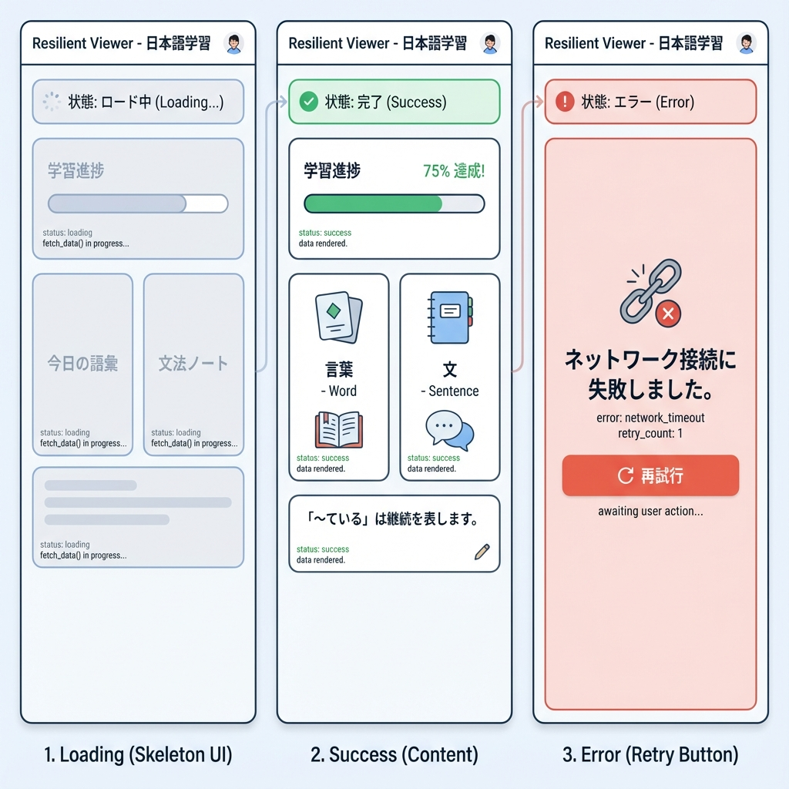
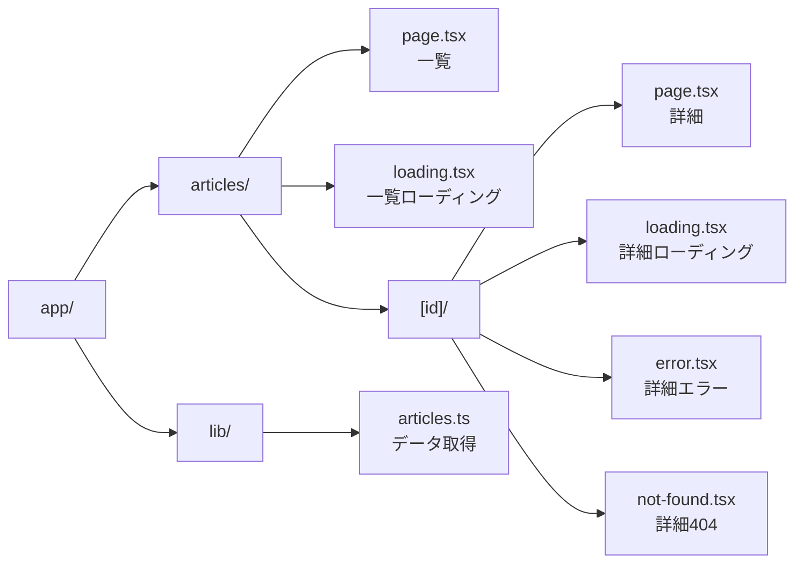
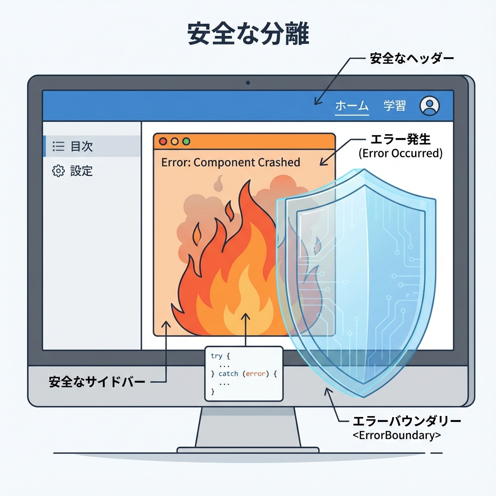
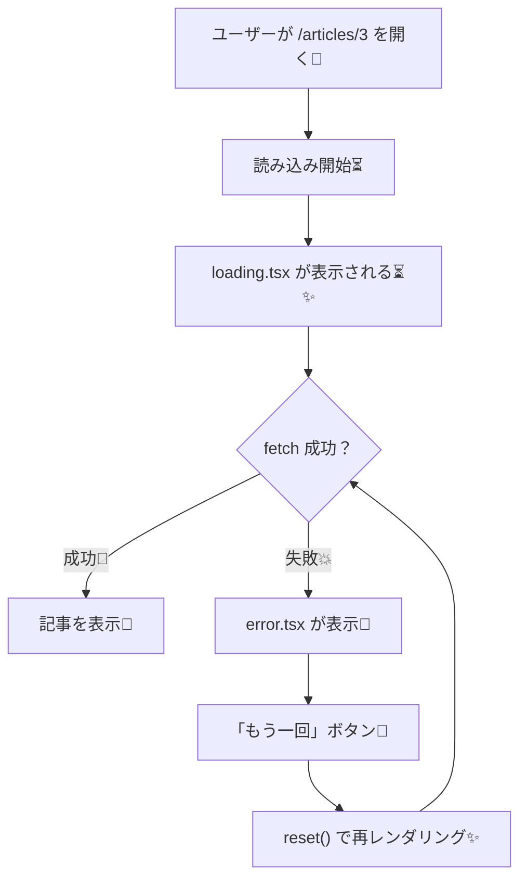

# 第104章：ミニ課題：エラーに強い“記事ビューア”完成🏁

この章は「ローディング⏳」「エラー🧯」「404🚪」をぜんぶ揃えた、“優しい記事ビューア”を作ってゴールする回だよ〜😊💕

---

## 今日のゴール🎯✨

できたら勝ちです🏆

* `/articles` で記事一覧が見れる🗂️
* `/articles/1` みたいに詳細が見れる🔎
* 読み込み中は「それっぽい」表示になる⏳✨
* 失敗したらエラー画面が出て「再試行」できる🔁
* 存在しない記事は 404（not-found）になる🚪

---

## 完成イメージ（フォルダ構成）🗺️📦





---

## 1) まずはデータ取得ユーティリティを作る📡🍵

`app/lib/articles.ts` を作ってね（なければ `app/lib` フォルダも作成）✨
※外部APIは例として JSONPlaceholder を使うよ🧪

```ts
// app/lib/articles.ts
export type Article = {
  id: number
  title: string
  body: string
}

const BASE = 'https://jsonplaceholder.typicode.com'

function sleep(ms: number) {
  return new Promise((resolve) => setTimeout(resolve, ms))
}

export async function fetchArticleList(options?: { delayMs?: number; fail?: boolean }) {
  const delayMs = options?.delayMs ?? 700
  const fail = options?.fail ?? false

  await sleep(delayMs)

  if (fail) {
    throw new Error('わざと失敗させました（一覧）💥')
  }

  // 2025以降のNext.jsでは、fetchは「デフォルトでキャッシュされない」扱いが基本なので
  // 必要なら next.revalidate などを付けて調整できるよ🧊⏱️
  const res = await fetch(`${BASE}/posts?_limit=12`, {
    next: { revalidate: 60 },
  })

  if (!res.ok) {
    throw new Error(`一覧の取得に失敗しました: ${res.status}`)
  }

  const data = (await res.json()) as Article[]
  return data
}

export async function fetchArticleById(
  id: number,
  options?: { delayMs?: number; fail?: boolean },
) {
  const delayMs = options?.delayMs ?? 900
  const fail = options?.fail ?? false

  await sleep(delayMs)

  if (fail) {
    throw new Error('わざと失敗させました（詳細）💥')
  }

  const res = await fetch(`${BASE}/posts/${id}`, {
    next: { revalidate: 60 },
  })

  if (!res.ok) {
    // 404っぽい時もここに来るよ
    return null
  }

  const data = (await res.json()) as Article
  return data
}
```

`fetch` はサーバー側で直接 `await fetch()` してOKだよ〜🙆‍♀️✨ ([Next.js][1])
あと、最近のNext.jsでは `fetch` はデフォルトでキャッシュされない前提で説明されてるので、必要なら `cache` や `next.revalidate` で調整できるよ🧊⏱️ ([Next.js][2])

---

## 2) 一覧ページ `/articles` を作る🗂️💕

`app/articles/page.tsx`

```tsx
// app/articles/page.tsx
import Link from 'next/link'
import { fetchArticleList } from '../lib/articles'

export default async function ArticlesPage({
  searchParams,
}: {
  searchParams: Promise<{ fail?: string }>
}) {
  const { fail: failStr } = await searchParams
  const fail = failStr === '1'

  const articles = await fetchArticleList({ fail })

  return (
    <main style={{ padding: 16, maxWidth: 900, margin: '0 auto' }}>
      <h1 style={{ fontSize: 28, marginBottom: 8 }}>記事一覧📰✨</h1>

      <p style={{ marginBottom: 16 }}>
        失敗テストしたい時は <code>?fail=1</code> を付けてね😈💥
      </p>

      <ul style={{ display: 'grid', gap: 12, padding: 0, listStyle: 'none' }}>
        {articles.map((a) => (
          <li
            key={a.id}
            style={{
              border: '1px solid #ddd',
              borderRadius: 12,
              padding: 12,
            }}
          >
            <Link href={`/articles/${a.id}`} style={{ textDecoration: 'none' }}>
              <div style={{ fontSize: 12, opacity: 0.7 }}>ID: {a.id}</div>
              <div style={{ fontSize: 18, fontWeight: 700, color: '#111' }}>
                {a.title}
              </div>
            </Link>
          </li>
        ))}
      </ul>
    </main>
  )
}
```

### 一覧のローディング⏳（`loading.tsx`）

`app/articles/loading.tsx`

```tsx
// app/articles/loading.tsx
export default function Loading() {
  return (
    <main style={{ padding: 16, maxWidth: 900, margin: '0 auto' }}>
      <h1 style={{ fontSize: 28, marginBottom: 8 }}>記事一覧📰✨</h1>
      <p>読み込み中だよ〜⏳💤</p>

      <ul style={{ display: 'grid', gap: 12, padding: 0, listStyle: 'none', marginTop: 16 }}>
        {Array.from({ length: 8 }).map((_, i) => (
          <li
            key={i}
            style={{
              border: '1px solid #eee',
              borderRadius: 12,
              padding: 12,
              opacity: 0.6,
            }}
          >
            <div style={{ height: 10, width: 60, background: '#eee', borderRadius: 999 }} />
            <div style={{ height: 14, width: '80%', background: '#eee', borderRadius: 999, marginTop: 10 }} />
            <div style={{ height: 14, width: '55%', background: '#eee', borderRadius: 999, marginTop: 8 }} />
          </li>
        ))}
      </ul>
    </main>
  )
}
```

`loading.tsx` や `Suspense` の fallback が出ると、そこからストリーミングが始まるよ〜🌊✨ ([Next.js][3])

---

## 3) 詳細ページ `/articles/[id]` を作る🔎🧡

`app/articles/[id]/page.tsx`

```tsx
// app/articles/[id]/page.tsx
import Link from 'next/link'
import { notFound } from 'next/navigation'
import { fetchArticleById } from '../../lib/articles'

export default async function ArticlePage({
  params,
  searchParams,
}: {
  params: Promise<{ id: string }>
  searchParams: Promise<{ fail?: string }>
}) {
  const { id: rawId } = await params;
  const id = Number(rawId)
  if (!Number.isFinite(id)) notFound()

  const { fail: failStr } = await searchParams;
  const fail = failStr === '1'
  const article = await fetchArticleById(id, { fail })

  if (!article) {
    // notFound() を呼ぶと、このルートセグメントの not-found.tsx が表示されるよ🚪
    notFound()
  }

  return (
    <main style={{ padding: 16, maxWidth: 900, margin: '0 auto' }}>
      <div style={{ display: 'flex', gap: 12, alignItems: 'center', marginBottom: 16 }}>
        <Link href="/articles" style={{ textDecoration: 'none' }}>
          ← 一覧へ戻る🗂️
        </Link>
        <span style={{ opacity: 0.6 }}>／</span>
        <span style={{ opacity: 0.8 }}>ID: {article.id}</span>
      </div>

      <h1 style={{ fontSize: 26, marginBottom: 10 }}>{article.title} 📝</h1>

      <p style={{ lineHeight: 1.8, whiteSpace: 'pre-wrap' }}>{article.body}</p>

      <div style={{ marginTop: 18, opacity: 0.85 }}>
        <p style={{ marginBottom: 8 }}>
          失敗テスト：<code>?fail=1</code> を付けて開くとエラーになるよ😈💥
        </p>
      </div>
    </main>
  )
}
```

`notFound()` は、そのセグメントの `not-found.tsx` を表示するための関数だよ🚪 ([Next.js][4])

---

## 4) 詳細のローディング⏳（`[id]/loading.tsx`）

`app/articles/[id]/loading.tsx`

```tsx
// app/articles/[id]/loading.tsx
export default function Loading() {
  return (
    <main style={{ padding: 16, maxWidth: 900, margin: '0 auto' }}>
      <p style={{ marginBottom: 10 }}>記事を読みに行ってるよ〜⏳📚</p>

      <div style={{ border: '1px solid #eee', borderRadius: 12, padding: 12, opacity: 0.7 }}>
        <div style={{ height: 18, width: '70%', background: '#eee', borderRadius: 999 }} />
        <div style={{ height: 12, width: '95%', background: '#eee', borderRadius: 999, marginTop: 12 }} />
        <div style={{ height: 12, width: '90%', background: '#eee', borderRadius: 999, marginTop: 10 }} />
        <div style={{ height: 12, width: '85%', background: '#eee', borderRadius: 999, marginTop: 10 }} />
      </div>
    </main>
  )
}
```

---

## 5) 詳細のエラー画面🧯（`[id]/error.tsx`）＋再試行🔁



`app/articles/[id]/error.tsx`

```tsx
// app/articles/[id]/error.tsx
'use client'

import { useEffect } from 'react'
import Link from 'next/link'

export default function Error({
  error,
  reset,
}: {
  error: Error & { digest?: string }
  reset: () => void
}) {
  useEffect(() => {
    // 本当は監視サービスに送ったりする（ここでは雰囲気だけ）📝
    console.error('[Article Error]', error)
  }, [error])

  return (
    <main style={{ padding: 16, maxWidth: 900, margin: '0 auto' }}>
      <h1 style={{ fontSize: 26, marginBottom: 8 }}>ごめんね…読み込み失敗しちゃった😢🧯</h1>

      <p style={{ lineHeight: 1.8 }}>
        たぶん一時的な通信エラーかも！<br />
        よかったら「もう一回」押してみてね🔁✨
      </p>

      <div style={{ display: 'flex', gap: 12, marginTop: 16 }}>
        <button
          onClick={() => reset()}
          style={{
            padding: '10px 14px',
            borderRadius: 10,
            border: '1px solid #ddd',
            cursor: 'pointer',
            background: '#fff',
          }}
        >
          もう一回やる🔁
        </button>

        <Link href="/articles" style={{ alignSelf: 'center' }}>
          一覧へ戻る🗂️
        </Link>
      </div>

      <p style={{ marginTop: 16, opacity: 0.65, fontSize: 12 }}>
        （開発用メモ）digest: {error.digest ?? 'なし'}
      </p>
    </main>
  )
}
```

`error.tsx` は **Client Component 必須**で、`reset()` で再レンダリングして復帰を試せるよ🔁 ([Next.js][5])

---

## 6) 詳細の 404 画面🚪（`[id]/not-found.tsx`）

`app/articles/[id]/not-found.tsx`

```tsx
// app/articles/[id]/not-found.tsx
import Link from 'next/link'

export default function NotFound() {
  return (
    <main style={{ padding: 16, maxWidth: 900, margin: '0 auto' }}>
      <h1 style={{ fontSize: 26, marginBottom: 8 }}>その記事、見つからなかったよ〜🚪😢</h1>

      <p style={{ lineHeight: 1.8 }}>
        URLのIDが間違ってるか、記事が消えちゃったのかも…！<br />
        一覧に戻って探してみてね🗂️🔎
      </p>

      <div style={{ marginTop: 14 }}>
        <Link href="/articles">← 一覧へ戻る📰</Link>
      </div>
    </main>
  )
}
```

ちなみに `not-found.tsx` は、`notFound()` が投げられたときに表示される仕組みだよ〜🚪 ([Next.js][6])

---

## 動きの流れ（ローディング→成功/失敗→再試行）🌊🧯🔁



`loading.tsx` や `Suspense` の fallback が出た時点でストリーミング開始…みたいな挙動になるよ🌊 ([Next.js][3])

---

## 動作チェック✅（これ全部できたらクリア！🎉）

PowerShell（またはターミナル）で：

```bash
npm run dev
```

ブラウザで👇を試してね😊

* 一覧（正常）
  `http://localhost:3000/articles`
* 一覧（失敗）😈💥
  `http://localhost:3000/articles?fail=1`
* 詳細（正常）
  `http://localhost:3000/articles/1`
* 詳細（失敗）😈💥
  `http://localhost:3000/articles/1?fail=1`
* 404（存在しない）🚪
  `http://localhost:3000/articles/99999`

---

## 仕上げのコツ（“ユーザーに優しい”はここ💖）

* エラー文は「あなたのせい」っぽくしない🫶
  → 「通信が不安定かも」「もう一回試してね」みたいに✨
* 404は「次の行動」を置く🧭
  → 「一覧へ戻る」リンクは正義🗂️
* エラーは小さく閉じ込める✂️
  → `[id]/error.tsx` に置くと、詳細だけ守れる🛡️ ([Next.js][5])

---

## 発展ミッション（余裕があれば）🌟

1. ローディングのスケルトンをもう少し可愛くする🎀
2. `error.tsx` に「エラー内容をコピー」ボタンを付ける📋
3. `not-found.tsx` に「人気記事（固定で3つ）」リンクを置く⭐

---

ここまでできたら、もう **“壊れても優しいNext.jsアプリ”** の土台は完成だよ〜🥳🧡
次（第105章）からはアプリ内API（Route Handlers）に入っていこうね🚪🧪

[1]: https://nextjs.org/docs/app/api-reference/functions/fetch "Functions: fetch | Next.js"
[2]: https://nextjs.org/docs/app/getting-started/caching-and-revalidating "Getting Started: Caching and Revalidating | Next.js"
[3]: https://nextjs.org/docs/app/api-reference/file-conventions/loading "File-system conventions: loading.js | Next.js"
[4]: https://nextjs.org/docs/app/api-reference/functions/not-found "Functions: notFound | Next.js"
[5]: https://nextjs.org/docs/app/getting-started/error-handling "Getting Started: Error Handling | Next.js"
[6]: https://nextjs.org/docs/app/api-reference/file-conventions/not-found?utm_source=chatgpt.com "File-system conventions: not-found.js"
