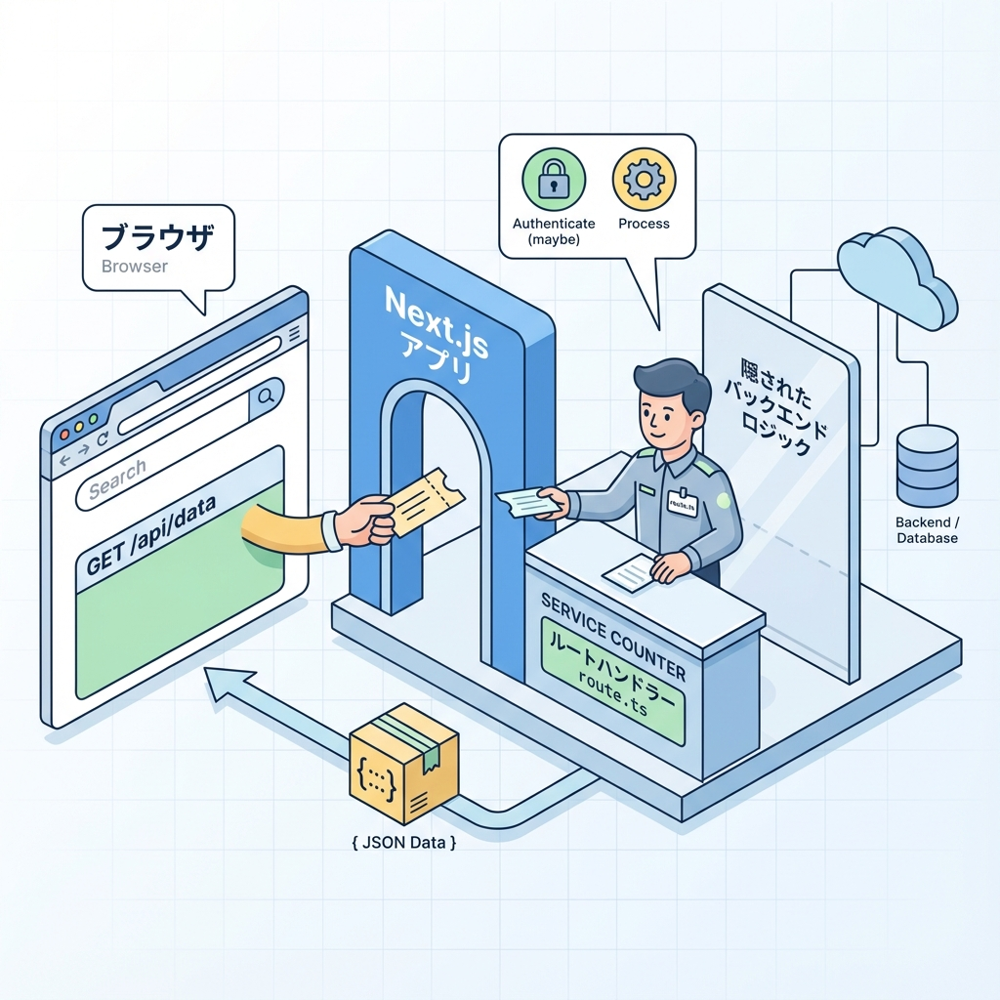
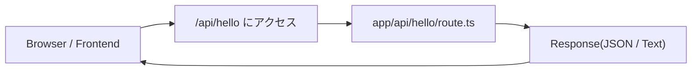

# 第105章：Route Handlerってなに？（アプリ内API）🧪

この章では「Next.jsの中にAPIを作る」＝ **Route Handler** を、超やさしくつかみます☺️✨
（次の章で実際に `app/api/xxx/route.ts` を作るので、今日は“正体”を知る回だよ〜！🎀）

---

## 1) Route Handlerって一言でいうと？🧠💡

**「Next.jsアプリの中に作れる、ミニAPI（エンドポイント）」** です🚪✨
たとえば `/api/hello` にアクセスしたら、JSONを返す…みたいなことができます📦

Next.js公式でも「Route Handlersは `app` ディレクトリの中で使えて、Web標準の Request/Response で書けるよ」と説明されています📘
([Next.js][1])

---

## 2) 何がうれしいの？（使う理由）😍🎁

Route Handlerがあると、こういうのがラクになります👇✨

* **APIキーを隠したい**🔐（ブラウザに見せたくない！）
* **外部APIの結果を整形して返したい**🧹（必要な形にして渡す）
* **認証チェックを挟みたい**🧤（ログインしてる人だけOKなど）
* **フロント（画面）から叩ける“自分のAPI”が欲しい**🎯

つまり、Next.jsが **UIだけじゃなく“ちょいバックエンド役”もできる**感じだよ〜🫶✨
（実務だとBFFって呼ばれたりもします📡）([CLYR][2])

---

## 3) どこに置くの？どんなURLになるの？🗂️➡️🌐

Route Handlerは `app` の中で、**`route.ts`（または `route.js`）** という特別なファイル名で作ります📌
たとえば：

* `app/api/hello/route.ts` → URLは **`/api/hello`**

こういう“ファイルとURLが直結”するのが、Next.jsらしさだね☺️
([Next.js][1])

---

## 4) ざっくり全体の流れ（図）🗺️✨



「ブラウザ（またはアプリ）から /api/xxx を叩く」→「route.tsが返す」って流れです📨



---

## 5) Route Handlerの中身は何を書くの？🧩

ポイントはこれだけ覚えればOKです🙆‍♀️✨

* **HTTPメソッド名の関数**を `export` する（GET/POST/PUT…など）
* **返すのは Response**（または NextResponse）📦
* **Request/Response はWeb標準**の形🧠
  ([Next.js][1])

イメージ（最小）👇

```ts
// app/api/hello/route.ts
export async function GET() {
  return Response.json({ message: "Hello!" });
}
```

（`Response.json()` が使えない環境のときは `NextResponse.json()` を使うことも多いよ〜📌）
([Sogo.dev][3])

---

## 6) いつRoute Handlerを使って、いつ使わない？🤔⚖️

### 使うと気持ちいい場面💖

* 画面（クライアント）から `fetch('/api/...')` で呼びたい🎮
* 外部APIのキーを隠したい🔐
* “ちょいサーバー処理”を挟みたい（認証/整形/ログ）🧤🧼📝

### 使わなくてもいい場面🌿

* **Server Componentsだけで完結**できる（画面を作るだけ）🍵
  → サーバー側で `fetch` して描画しちゃえばOKなことも多いです✨

（次の章以降で「使い分けのコツ」がもっとクリアになります😉）

---

## 7) 実行環境（Runtime）ってなに？🧠⚡

Route Handlerはサーバーで動きます。Next.jsには主に **Node.js Runtime（通常）** と **Edge Runtime（制約ありだけど速い系）** があり、ルートごとに指定できます🧭

```ts
export const runtime = "edge"; // または "nodejs"
```

この指定の考え方は公式にまとまってます📘
([Next.js][4])

Edgeは **Node.jsの機能が全部使えるわけじゃない** ので、慣れるまでは基本 nodejs のままでOKです☺️
([Next.js][5])

---

## 8) よくある「つまずき」あるある🪤😵‍💫

* `route.ts` の名前を間違える（`routes.ts` とか）😇
* `app/api/...` の場所じゃないところに置く🥲
* `export async function GET()` を書き忘れる😵
* 返り値が `Response` じゃない（オブジェクトをそのまま返してしまう）🙅‍♀️
* Edgeにしてるのに Node.js の機能を使って落ちる⚡💥
  ([Next.js][5])

---

## 9) ミニゴール（今日の達成ライン）🏁✨

今日はこれが言えたら勝ちです😆💕

* Route Handlerは **Next.js内で作れるAPI**🧪
* 置き場所は **`app/api/**/route.ts`**🗂️
* **HTTPメソッド関数（GET/POST…）をexport**する📤
* **Response（Web標準）を返す**📦
  ([Next.js][1])

---

## 10) 次の章の予告🎬✨

次は実際に作ります！🎉
`app/api/xxx/route.ts` を作って、ブラウザで `http://localhost:3000/api/xxx` を開いて **JSONが返ってくる感動**をやろうね😆📦✨

準備できたら、第106章いこ〜！🚀💕

[1]: https://nextjs.org/docs/app/getting-started/route-handlers?utm_source=chatgpt.com "Getting Started: Route Handlers"
[2]: https://www.clyr.co.jp/posts/build-bff-with-nextjs-route-handlers-2828?utm_source=chatgpt.com "Next.js Route Handlers実装でBFFパターンを構築する方法"
[3]: https://sogo.dev/posts/2025/03/nextjs-dont-use-singleton-response?utm_source=chatgpt.com "Next.jsでNextResponseをシングルトンインスタンスにしては ..."
[4]: https://nextjs.org/docs/14/app/building-your-application/rendering/edge-and-nodejs-runtimes?utm_source=chatgpt.com "Rendering: Edge and Node.js Runtimes"
[5]: https://nextjs.org/docs/messages/node-module-in-edge-runtime?utm_source=chatgpt.com "Using Node.js Modules in Edge Runtime"
