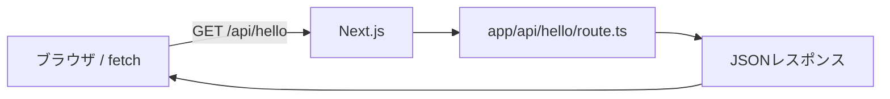

# 第107章：GETで返す（JSON）📤

この章では、Next.js の **Route Handler** で「GET リクエストに JSON を返す」API を作ります〜！🥳
Webアプリの裏側に「データを返す係」を作る感じだよ🧑‍🍳🍱

---

## この章でできるようになること ✅🎯

* **/api/xxx** というURLで、JSONを返せるようになる📦✨
* GET で返すときの **基本の型**（書き方）を覚える🧠💡
* ブラウザでアクセスして **動作チェック**できるようになる👀🌈

---

## まず全体イメージを掴もう 🗺️💭（図解）




---

## 作るもの：/api/hello が JSON を返すAPI 🥰📤

アクセスするとこんなのが返ってくるよ👇

* URL例：**[http://localhost:3000/api/hello](http://localhost:3000/api/hello)**
* 返したいJSON例：

  * message: "Hello!"
  * time: "現在時刻"
  * name: クエリがあれば反映（例：?name=Yui）

---

## 手順①：ファイルを作る 🗂️✨

プロジェクトの中に、次の場所にファイルを作ってね👇

* **app/api/hello/route.ts**
  （Windowsだとフォルダ表示は **app\api\hello\route.ts** になることが多いよ🪟）

---

## 手順②：GET を実装する（JSONを返す）🧪📤

**app/api/hello/route.ts** にこれを書いてね👇

```ts
export async function GET(request: Request) {
  const url = new URL(request.url);
  const name = url.searchParams.get("name") ?? "friend";

  return Response.json({
    message: `Hello, ${name}! 🌸`,
    time: new Date().toISOString(),
  });
}
```

ポイントだよ👇🥺✨

* **GET関数をexport**する（これが「GET来たらこの処理ね！」の合図）📣
* **Response.json(...)** で JSON を返せる📦
* クエリ（?name=...）は `new URL(request.url)` で読めるよ🔎

---

## 手順③：動作チェックする 👀✅

### 1) 開発サーバー起動（もう起動してたらOK）🚀

```bash
npm run dev
```

### 2) ブラウザでアクセス🌐✨

* **[http://localhost:3000/api/hello](http://localhost:3000/api/hello)**
* **[http://localhost:3000/api/hello?name=Yui](http://localhost:3000/api/hello?name=Yui)**

JSONが表示されたら成功〜！🎉🎉🎉

---

## ちょい理解：Route Handler ってどこで動いてるの？🧠🏠

Route Handler は基本「サーバー側」で動くよ🍵
だから、APIキーとかDBとか「表に出したくない処理」を置く場所としても便利✨
（今はまず “JSON返せた！” が最強の一歩👏💓）

---

## ミニ練習：/api/fortune を作ってみよう 🎴✨（おみくじ）

次は自分で増やしてみよ〜！😆
**app/api/fortune/route.ts** を作って👇

```ts
const fortunes = ["大吉 😆✨", "中吉 😊", "小吉 🙂", "吉 😌", "凶 😭"];

export async function GET() {
  const fortune = fortunes[Math.floor(Math.random() * fortunes.length)];

  return Response.json({
    fortune,
    at: new Date().toISOString(),
  });
}
```

ブラウザで👇を開いて、おみくじが変わったらOK🎉

* **[http://localhost:3000/api/fortune](http://localhost:3000/api/fortune)**

---

## よくあるミス集（ここだけ見れば助かる）🆘💡

* **404になる**😵
  → フォルダ名・ファイル名が違うかも！
  **app/api/hello/route.ts** になってる？（route.ts が超大事！）📌

* **JSONを return したのに怒られる**😢
  → `return { ... }` じゃなくて、**Response.json(\{ ... \})** にする必要があるよ📦

* **GET の関数名が違う**🙈
  → **export async function GET(...)** になってるか確認しよ〜！

---

## まとめ 🎀✨

* Route Handler は **app/api/xxx/route.ts** に作る📁
* GET は **export function GET** で受ける📥
* JSON は **Response.json(...)** で返す📤
* ブラウザで **/api/hello** を開けばテストできる🌈👀

ここまでできたら、もう「自分のAPI持ってる」ってことだよ〜！🥳💖
